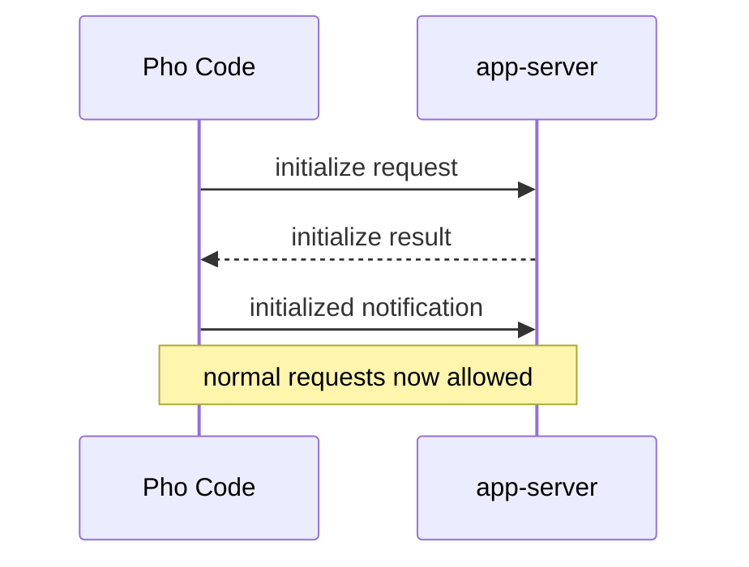
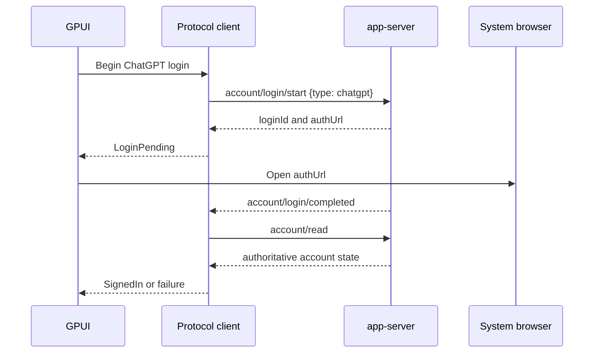
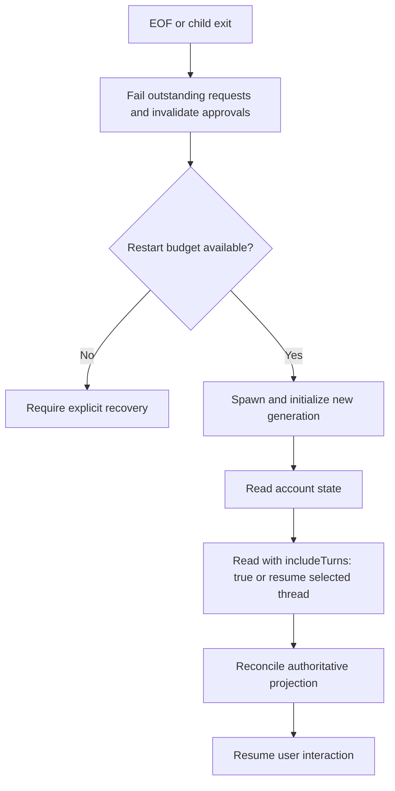

# App-server client protocol

- Status: Historical design; superseded as a Pho Code V1 contract
- Last updated: 2026-07-14
- Runtime boundary: [ADR 0001](../decisions/0001-codex-app-server-sidecar.md)
- Superseded by: [ChatGPT Codex backend](chatgpt-codex-backend.md) under [ADR 0002](../decisions/0002-native-agent-harness.md)
- System context: [System architecture](system.md)
- Source evidence: [Codex source study](../research/codex-source-study.md)

> This protocol profile is retained as historical evidence for a possible future app-server compatibility mode. Current V1 does not launch or speak to `codex app-server`.

## Purpose

This document specifies how Pho Code communicates with `codex app-server`: transport, lifecycle, supported methods, event routing, approvals, compatibility, failure handling, and the minimal Rust boundary. It is intentionally narrower than the full app-server API.

The app-server schema generated by a supported binary remains authoritative for field-level serialization. This document defines which parts Pho Code relies on and how it interprets them.

## Protocol profile

Pho Code V1 supports this profile:

- local child process;
- stdio JSONL transport;
- one initialized protocol connection per child process;
- managed ChatGPT browser or device-code authentication;
- app-server protocol V2 thread, turn, item, account, and approval methods;
- stable multi-agent V1 behavior;
- no experimental opt-in unless separately approved and documented;
- no WebSocket, remote listener, internal token injection, dynamic client tools, or multi-agent V2 product dependency.

Protocol V2 is the client API generation. It must not be confused with the `multi_agent_v2` feature flag.

## Transport

### Process launch

The supervisor launches a selected `codex` executable in app-server stdio mode. The exact argument accepted by the pinned binary should be verified during the foundation spike; the audited documentation supports the default stdio listener and `--listen stdio://`.

The child receives only the environment and working context explicitly needed by Codex. Secrets are never placed in command-line arguments. Pho Code records the selected executable path and version in redacted diagnostics.

### Stream ownership

- Child stdout is protocol-only.
- Child stdin is protocol-only.
- Child stderr is diagnostic-only.
- The reader consumes stdout continuously until EOF or cancellation.
- The writer is the only task that writes stdin and preserves envelope order.
- The stderr collector cannot block the protocol reader and retains bounded output.

If non-JSON text appears on stdout, the connection enters a malformed-transport failure. Pho Code must not guess that a line is harmless logging and skip it silently.

### Framing

Each protocol envelope is one UTF-8 JSON object terminated by a newline. The decoder must:

1. enforce a maximum line size before allocating without bound;
2. reject invalid UTF-8 or JSON as a transport error;
3. preserve integer precision and string content required by the schema;
4. classify the envelope before deserializing method-specific parameters;
5. avoid logging the raw line by default;
6. continue after an unknown well-formed notification;
7. stop or fail the affected request when a required response is incompatible.

The writer serializes compact one-line JSON followed by exactly one newline and flushes according to the process library's guarantees.

## Envelope model

App-server uses JSON-RPC-like envelopes with the `jsonrpc` field omitted.

### Client request

```json
{
  "id": 1,
  "method": "account/read",
  "params": {}
}
```

### Successful response

```json
{
  "id": 1,
  "result": {}
}
```

### Error response

```json
{
  "id": 1,
  "error": {
    "code": -32001,
    "message": "Server overloaded; retry later."
  }
}
```

### Notification

```json
{
  "method": "turn/started",
  "params": {}
}
```

### Server request

```json
{
  "id": 42,
  "method": "item/commandExecution/requestApproval",
  "params": {}
}
```

The examples show envelope shape only. Tests must use actual generated fixtures for parameter and result fields.

### Classification order

The decoder classifies an object using this order:

1. `method` plus `id`: request from server.
2. `method` without `id`: notification from server.
3. `id` plus `result`: successful response to client request.
4. `id` plus `error`: failed response to client request.
5. anything else: malformed envelope.

Do not classify solely by a generated exhaustive enum because a new notification method should not make the entire reader fail.

## Connection generation

Every spawned process receives a monotonically increasing local connection generation. Outstanding client requests, pending server requests, thread subscriptions, and transient deltas are tagged with that generation.

An envelope from one generation can never resolve state belonging to another. On EOF or process exit:

- fail every outstanding client request exactly once;
- invalidate every pending server request;
- stop accepting writer messages for that process;
- preserve thread identifiers for reconstruction;
- transition the runtime state before attempting restart.

Request identifiers only need to be unique within a connection, but monotonically increasing unsigned integers simplify diagnostics and tests.

## Initialization

Initialization is mandatory and occurs exactly once.



Before the initialize result and `initialized` notification are complete, the client sends no account, thread, or turn request. Concurrent UI intents remain disabled or queued at the application layer with a bounded policy.

Initialization failure is fatal for that process generation. Repeating `initialize` on the same connection is not a recovery path.

### Client metadata

The client identifies itself as Pho Code with a version and supported capabilities accepted by the pinned schema. Do not copy another product's client metadata. Do not opt into experimental API fields during the baseline handshake.

### Initialize result

The result is decoded for fields Pho Code uses, including runtime identity and platform information. Unknown fields are ignored. Missing required fields cause an incompatibility error with the observed runtime version.

## Required method surface

### Baseline methods

| Method | Direction | V1 purpose | Retry posture |
| --- | --- | --- | --- |
| `initialize` | Client request | Establish connection and capabilities. | Never repeat on same connection. |
| `initialized` | Client notification | Acknowledge initialization. | Exactly once. |
| `account/read` | Client request | Determine managed account state. | Safe with bounded retry. |
| `account/login/start` | Client request | Start browser or device login. | User-driven; do not duplicate blindly. |
| `account/login/cancel` | Client request | Cancel a known login ID. | Safe only for the same login operation. |
| `account/logout` | Client request | Sign out deliberately. | User-confirmed mutation. |
| `thread/list` | Client request | Populate recent persisted threads. | Safe with bounded retry and cursor discipline. |
| `thread/read` | Client request | Reconstruct authoritative thread state; request `includeTurns: true` when rebuilding a transcript. | Safe with bounded retry. |
| `thread/start` | Client request | Create a new conversation. | Not automatically retried after ambiguous failure. |
| `thread/resume` | Client request | Attach runtime to persisted conversation. | Recover state before repeating after ambiguity. |
| `thread/fork` | Client request | Create a new thread from history. | Not automatically retried after ambiguity. |
| `thread/compact/start` | Client request | Request manual compaction. | Not automatically retried after ambiguity. |
| `turn/start` | Client request | Submit user input and begin execution. | Never blindly replay after transport failure. |
| `turn/steer` | Client request | Add supported input to an active turn. | User-driven and state-checked. |
| `turn/interrupt` | Client request | Request turn cancellation. | May be repeated only after authoritative state check. |

Method names are mapped in [`protocol/common.rs`](../../refs/codex/codex-rs/app-server-protocol/src/protocol/common.rs#L482). The implementation should not add wrappers for the rest of app-server until a V1 workflow requires them.

### Deferred methods

Archive, unarchive, rollback, thread naming, feedback, skills, apps, MCP management, configuration writes, review, command-exec utilities, and other protocol functions are deferred. Decoding their notifications defensively is different from exposing them as product actions.

### Excluded methods and variants

- `chatgptAuthTokens` login and refresh host requests;
- experimental dynamic client tools;
- remote-control operations;
- experimental realtime or process methods;
- experimental multi-agent-mode request fields;
- thread deletion until deletion and recovery semantics receive a dedicated product decision.

Thread deletion is intentionally excluded because the machine policy requires recoverable removal and the runtime's deletion semantics must be verified before the UI exposes an irreversible-looking action.

## Authentication flow

### Account read

Immediately after initialization, send `account/read`. Decode signed-out versus signed-in state and nonsecret account details. An account update notification may prompt a reread if the notification does not contain the complete state required by the UI.

### Browser login



The system browser is an external side effect. Failure to open it leaves the login operation cancellable and allows device-code fallback.

### Device-code login

Use the schema's `chatgptDeviceCode` login variant. Present the login ID, verification URL, user code, and cancellation state returned by the runtime. The current response fields are defined in [`account.rs`](../../refs/codex/codex-rs/app-server-protocol/src/protocol/v2/account.rs#L140) and do not include an expiry; any local UX timeout must be labeled as local rather than runtime authority. Pho Code does not poll the service directly; it observes app-server completion.

### Login cancellation

Cancellation carries the known login identifier. The UI remains pending until the response or an authoritative completion/update proves the flow ended. Process exit invalidates the operation locally.

### Logout

Logout requires explicit user intent and clears the projected account state after authoritative response or account update. It does not delete Pho Code preferences or Codex thread history.

## Thread lifecycle

### List

Use cursor-based pagination from the generated schema. Load a bounded first page for startup and additional pages on demand. Preserve thread identifiers and timestamps; do not deserialize every item for the sidebar.

### Start

Thread start supplies the selected working directory and only supported stable fields. V1 avoids experimental permission profiles, dynamic tools, history modes, multi-agent mode fields, and raw-event options unless a later decision adopts them.

The returned thread object is inserted immediately, and a duplicate `thread/started` notification is reconciled idempotently.

### Read

Thread read rebuilds or refreshes the projection without launching a new turn. Turns are omitted unless the request sets `includeTurns: true`, as documented in [`app-server/README.md`](../../refs/codex/codex-rs/app-server/README.md#L483); transcript reconstruction must set that field. It is the preferred recovery operation when the application needs authoritative persisted content and no active runtime session is required.

### Resume

Resume rehydrates the runtime session. Use it before continuing a persisted thread. The response may include reconstructed turns; the reducer reconciles them by identifier rather than appending blindly.

### Fork

Fork creates a new thread and history relationship. The UI treats the returned identifier as distinct even if its visible transcript initially matches the source. Retry only after checking whether the fork was created.

### Child threads

Stable child identity is established by the completed collaboration item's `receiverThreadIds`, defined on [`CollabAgentToolCall`](../../refs/codex/codex-rs/app-server-protocol/src/protocol/v2/item.rs#L335). Child metadata or lifecycle notifications may also arrive while the parent is active, but `thread/started` is not a required stable-spawn event. Insert observed children into the normalized thread map and derive relationships without switching the user's active transcript automatically.

## Turn lifecycle

### Start

Turn start carries the target thread and user input. Workspace path, model, effort, sandbox, and approval settings are supplied only through fields validated against the supported schema.

The request result and `turn/started` notification may both describe the same turn. Reconciliation is idempotent.

### Stream

The reader accepts item starts, deltas, item completions, token-usage updates, plan or diff updates when supported, warnings, and final turn completion. Projection actions are scheduled independently from JSON reading so a busy view cannot block stdout.

### Steer

Steering is enabled only when the projected thread has a compatible active turn and the supported runtime accepts the method. A failed steer remains a failed control action; it is not inserted as an ordinary user message unless the runtime records it that way.

### Interrupt

Interrupt requests cancellation. The UI changes to an interrupting state but waits for authoritative turn completion or transport failure before declaring the turn interrupted.

### Completion

Turn completion finalizes status and usage. Pending deltas for completed items are discarded, unresolved approvals for that turn are invalidated, and the composer becomes available according to thread status.

## Notification profile

### Required lifecycle notifications

| Notification | Projection behavior |
| --- | --- |
| `thread/started` | Insert or reconcile thread. |
| `thread/status/changed` | Update thread status without replacing turns. |
| `thread/tokenUsage/updated` | Update usage display if supported. |
| `turn/started` | Insert or reconcile running turn. |
| `turn/completed` | Finalize turn and invalidate related pending controls. |
| `item/started` | Insert item shell and lifecycle state. |
| `item/completed` | Replace transient item with authoritative final item. |
| `item/agentMessage/delta` | Append or coalesce visible agent text for an incomplete item. |
| `item/commandExecution/outputDelta` | Append bounded command output to the correct item. |
| `item/fileChange/patchUpdated` | Update structured patch display for the correct item. |
| `account/updated` | Reconcile or trigger account reread. |
| `account/login/completed` | Complete the matching login flow, then reread account. |
| `serverRequest/resolved` | Close a server request resolved elsewhere. |
| `warning` | Attach bounded warning to affected scope. |
| `error` | Record structured runtime error and affected scope. |

Notification mappings are defined in [`protocol/common.rs`](../../refs/codex/codex-rs/app-server-protocol/src/protocol/common.rs#L1620).

### Optional known notifications

Reasoning summary deltas, turn plan updates, turn diff updates, model reroutes, rate-limit updates, MCP status, and other documented notifications may be decoded when the corresponding view exists. Until then they follow the unknown-notification policy or a bounded diagnostic handler.

### Deprecated notifications

`thread/compacted` is deprecated in favor of the `ContextCompaction` item lifecycle. Pho Code does not rely on it for compaction state, though receiving it can be noted for compatibility diagnostics.

## Item handling

### Minimal item categories

The projection must understand at least:

- user message;
- agent message;
- reasoning summary as allowed by product policy;
- command execution;
- file change;
- tool or MCP call represented by the supported runtime;
- context compaction;
- collaboration agent tool call;
- generic unknown item.

`SubAgentActivity` is a known optional item associated with multi-agent V2. It may enrich status but is not required for V1 correctness.

### Start and completion reconciliation

Item start creates a shell from the supplied item. Deltas reference that identity. Item completion replaces fields with the authoritative final item while preserving UI-only expansion state.

Completion without start inserts a completed item. Start after completion is ignored and diagnosed. Duplicate completion is idempotent if compatible.

### Delta bounds

Agent text may be coalesced before rendering. Command output must have a byte limit and truncation metadata. Reasoning and patch updates follow separate bounds because their sensitivity and display differ.

The final completed item can replace a truncated delta preview without requiring the client to reconstruct exact content from every delta.

## Server-initiated requests

### Required approval methods

| Method | Required V1 behavior |
| --- | --- |
| `item/commandExecution/requestApproval` | Present command, scope, risk context, and the effective decision set. |
| `item/fileChange/requestApproval` | Present affected change and the effective decision set. |
| `item/permissions/requestApproval` | Present requested additional permissions, duration/scope when supplied, and the effective decision set. |

The protocol definitions are in [`protocol/common.rs`](../../refs/codex/codex-rs/app-server-protocol/src/protocol/common.rs#L1465). When optional `availableDecisions` is present, expose exactly those values. When it is absent on a compatible older shape, derive the conservative method-specific set described in [`app-server/README.md`](../../refs/codex/codex-rs/app-server/README.md#L1456) and tested for the pinned runtime. The fallback must never invent a broader permission or default to approval.

### Request registry

Server requests use a registry separate from outstanding client requests because their completion direction is reversed. Each entry includes request ID, connection generation, method, decoded parameters, received time, related thread/turn/item, and response state.

### User decision

Views dispatch a domain intent containing the pending approval identity and selected schema-defined decision. The protocol client validates generation and availability, serializes the response, and marks the request locally answered.

### Cancellation and external resolution

If `serverRequest/resolved` arrives, close the prompt and explain that it was handled or invalidated elsewhere. If the turn completes, is interrupted, or the process exits first, invalidate the request. Never keep an orphaned modal capable of writing to a later connection.

### Unsupported server requests

For a well-formed but unsupported server request, respond with a protocol error if the wire contract permits and surface a compatibility failure. Ignoring a request can leave the runtime blocked. Internal token-refresh requests should never occur because V1 excludes token injection; receiving one is a configuration incompatibility.

## Request correlation and timeouts

The client request registry maps request ID to method, connection generation, start time, deadline class, response decoder, and completion sender.

Timeouts do not prove the server failed to apply a mutation. On timeout:

- remove or mark the local waiter exactly once;
- preserve method and identifiers in diagnostics;
- classify whether authoritative state can be reread;
- never retry a mutating request until ambiguity is resolved;
- keep the connection alive unless transport health also failed.

Different operations need different deadlines. Login may remain user-bound for minutes; account reads should be short; an active turn is completed by notifications rather than a long request timeout.

## Backpressure and queues

### Inbound

The reader should decode and route without waiting for a render. If the projection queue is saturated, coalesce safe deltas by item ID, retain terminal events, and report overload. Never discard item or turn completion to preserve intermediate text.

### Outbound

User intents enter a bounded outbound queue. Control actions should fail visibly when the runtime is unavailable instead of waiting indefinitely. Approval responses receive priority over ordinary reads so the agent is not blocked behind pagination traffic.

### Server overload

Error `-32001` is retryable in principle, but only idempotent requests are automatically retried. Use capped exponential backoff with jitter and a total attempt budget. Mutating operations enter ambiguity recovery.

## Unknown and experimental data

### Unknown notification

Retain method name, connection generation, timestamp, and a size-limited redacted payload summary. Increment a diagnostic counter and continue.

### Unknown item

Retain identity and lifecycle state plus a generic kind label. Render a compact “unsupported item” row so activity does not disappear. Do not expose the raw payload by default.

### Unknown required response

If a required response cannot be decoded, fail that operation as `RuntimeIncompatible`. Do not substitute defaults for identifiers, status, or security-sensitive fields.

### Experimental fields

Do not send experimental fields simply because generated DTOs contain them. Experimental opt-in is a product compatibility decision and must be recorded separately.

## Restart and reconstruction



Restart never replays:

- a turn start whose result is unknown;
- a steer whose acceptance is unknown;
- an approval response;
- a compact request;
- a fork request.

Instead, read the affected thread with `includeTurns: true` or resume it and determine the authoritative outcome.

## Minimal Rust protocol boundary

The protocol implementation should prefer small hand-maintained required types plus raw envelopes over importing the Codex Rust workspace or compiling every generated schema type.

### Suggested layers

```text
RawEnvelope
  -> envelope classifier
  -> response registry or method router
  -> minimal typed DTO decoder
  -> ProtocolEvent / ProtocolServerRequest
  -> projection mapper
  -> DomainAction
```

### Serialization traits

Use `serde` for the minimal DTOs and preserve unknown fields by default. Required enums that can grow should include an unknown representation where safe, or deserialize through strings and validate in the operation layer.

Security-sensitive decision enums must not map an unknown value to approval. Unknown approval decisions are incompatible and remain unavailable in the UI.

### Error context

Every protocol error includes method, request ID when available, connection generation, expected operation, and a redacted source error. Avoid error strings that contain the entire payload.

## Compatibility policy

Before release, define:

- minimum and maximum supported Codex versions or an exact pinned version;
- discovery precedence when multiple binaries exist;
- schema-fixture source version;
- behavior for newer unknown versions;
- upgrade and rollback procedure;
- user-facing mismatch diagnostics.

Development may begin with the audited `0.144.1` binary, but the checked-out Codex source revision and installed binary must not be assumed identical without verification.

### Startup compatibility checks

1. Execute a bounded version query or obtain version metadata through the supported process interface.
2. Compare with the supported policy.
3. Initialize and validate required methods through fixtures or a capability check where available.
4. Refuse user work when a security-critical or required response contract is missing.
5. Allow unknown additive notifications under the tolerant-routing policy.

## Test strategy

### Framing tests

- partial reads across line boundaries;
- multiple lines in one read;
- maximum-size line and one-byte overflow;
- invalid UTF-8;
- invalid JSON;
- stdout logging contamination;
- EOF with and without a trailing newline;
- independent bounded stderr.

### Envelope tests

- request, response, error, notification, and server-request classification;
- numeric and supported string request IDs if the schema permits both;
- unknown notification survival;
- malformed envelope rejection;
- response for unknown or already-completed request ID;
- duplicate response and connection-generation mismatch.

### Lifecycle fixtures

- initialize success and repeated-initialize prevention;
- signed-in and signed-out account reads;
- browser and device login completion and cancellation;
- thread start, `thread/read` with `includeTurns: true`, resume, and fork;
- turn start, deltas, items, and completion;
- command, file, and permission approval;
- interruption;
- context compaction item;
- stable collaboration item and child thread;
- unknown additive notification;
- server overload and retry classification.

### Reconstruction tests

Drive one projection with a live-like stream, simulate connection exit, then feed an authoritative `thread/read` response requested with `includeTurns: true` from a new generation. Assert no duplicate items, no stale approvals, correct final statuses, and preserved UI-only expansion state.

### Live smoke tests

Run against the pinned binary for initialization, login reuse, one text turn, one approved and one denied command, interrupt, restart/resume, manual compaction, automatic compaction when controllable, fork, and stable V1 subagent activity.

Report fixture and live results separately. A mocked approval sequence does not prove the runtime pauses, and a live text response does not prove compaction or child restoration.

## Protocol acceptance criteria

The V1 protocol layer is complete when:

1. stdout/stderr separation and JSONL bounds are tested;
2. initialization gates every other request;
3. request and server-request correlation survive concurrency;
4. managed ChatGPT login works without token access;
5. required thread and turn operations have typed wrappers and ambiguity policy;
6. item deltas and completion reduce deterministically;
7. all three required approval classes are handled safely;
8. unknown notifications remain nonfatal and bounded;
9. overload, timeout, EOF, and restart behavior is observable;
10. a new connection can reconstruct the selected persisted thread;
11. context-compaction and stable collaboration items reach domain state;
12. fixtures record their binary/schema source version.

## Open protocol decisions

- Exact request-ID representation and rollover behavior.
- Concrete maximum line, queue, delta, and diagnostic sizes.
- Supported Codex version policy.
- Whether `thread/read` with `includeTurns: true` or resume is preferred for initial transcript loading.
- Whether Unix-socket attachment will ever supplement local stdio spawn.
- Which optional reasoning and diff notifications V1 renders.
- How runtime version is discovered without introducing a second incompatible invocation path.
- Whether app-server offers sufficient capability discovery to supplement version checks.

These should be settled in the foundation spike and captured in tests or a follow-up decision record.
