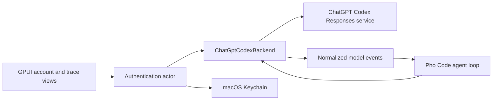
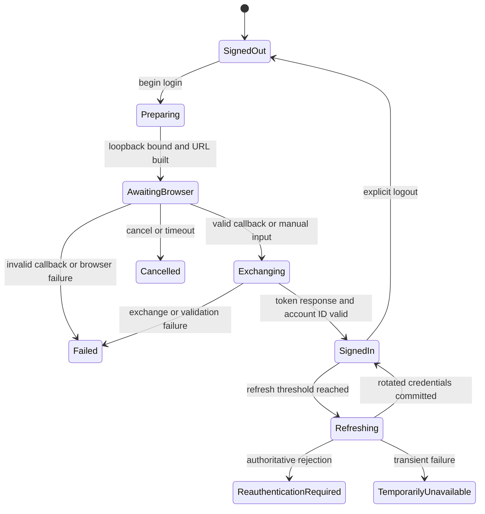

# ChatGPT Codex backend architecture

- Status: Frozen historical/developer-only contract; never live-qualified
- Last updated: 2026-07-14
- Decision at time of work: [ADR 0002](../decisions/0002-native-agent-harness.md)
- Superseded by: [ADR 0003](../decisions/0003-deepseek-api-first-backend.md) and the [DeepSeek backend](deepseek-api-backend.md)
- System context: [Native harness system architecture](native-harness-system.md)
- Implementation phase: [Phase 1](../implementation/v1/phase-1-chatgpt-codex-qualification.md)
- Source evidence: [Pi source study](../research/pi-source-study.md)
- Audited Pi revision: `0e6909f050eeb15e8f6c05185511f3788357ddb3`
- Platform: macOS only

## Historical status

This document records the contract implemented while Pho Code attempted ChatGPT subscription authentication followed by direct streamed requests to the Codex Responses service. The deterministic implementation completed, but Pho Code never established an authorized public OAuth client identity and never ran the live gate. [ADR 0003](../decisions/0003-deepseek-api-first-backend.md) froze this path and made the concrete DeepSeek API backend the current V1 contract.

The remaining body preserves the acceptance-time design and evidence links. Its requirements are historical, not current architecture, and must not be used to select ChatGPT as a runtime fallback or to reintroduce Pi/Codex identity. Frozen source and tests may remain developer-only until a separate cleanup or revival decision.

The backend is one component of Pho Code's independently owned harness. It supplies model events and accepts model-visible input; it does not own the agent loop, tool execution, approvals, session history, or GPUI state.

## Support and uncertainty posture

Official OpenAI documentation establishes [ChatGPT sign-in for Codex product surfaces](https://learn.chatgpt.com/docs/auth) and [API-key or workload-identity authentication for the general API](https://developers.openai.com/api/reference/overview#authentication). It does not establish Pi's OAuth client identity, originator, backend URL, headers, or model catalog as a supported third-party contract for Pho Code.

The checked-out Pi source is nevertheless direct evidence that Pi performed this integration at its audited revision. Pi declares a ChatGPT OAuth provider in [`providers/openai-codex.ts`](../../refs/pi/packages/ai/src/providers/openai-codex.ts#L7), implements browser and device login in [`utils/oauth/openai-codex.ts`](../../refs/pi/packages/ai/src/utils/oauth/openai-codex.ts#L33), and sends Responses requests directly in [`openai-codex-responses.ts`](../../refs/pi/packages/ai/src/api/openai-codex-responses.ts#L223).

Pho Code accepts that compatibility risk because ChatGPT subscription access is the practical V1 requirement. The implementation and user-facing language must say "experimental ChatGPT Codex compatibility" until the Phase 1 live gate passes, and even a passing gate proves only the observed account, model, date, and application revision.

### Evidence policy handoff

Use the shared labels and proof limits from [the documentation evidence policy](../README.md#evidence-policy). An observation linked to Pi is verified source behavior, a normative statement here is a Pho Code decision, and only a dated qualification record can establish live compatibility for the observed account and model.

Source behavior is not permission to impersonate Pi. Pho Code must not send `originator: pi`, a Pi user agent, or other false product metadata. A service rejection of honest Pho Code identity is a compatibility failure, not justification for silently copying another product's identity.

## Component boundary



The application shell acquires the process-wide single-instance guard before constructing the authentication actor. The actor owns login state, callback lifetime, Keychain access, refresh serialization, logout, and the current credential snapshot; it does not own the process guard. The backend owns request DTOs, headers, HTTP/SSE transport, response decoding, wire-to-domain normalization, and backend-specific replay state. The tool runtime owns schema definitions and validation. The agent loop selects the enabled fixed schemas supplied by that runtime, carries them into the request, owns complete model-visible history and turn limits, propagates cancellation, and decides whether a completed tool request may enter dispatch.

No GPUI view waits on OAuth, Keychain, network I/O, or stream parsing. Views dispatch intents and render projected states delivered through bounded application channels.

## Authentication profile

### Observed OAuth surface

Pi defines an OAuth public-client-style flow using an authorization endpoint, token endpoint, fixed loopback redirect, PKCE S256, a random state value, and the `openid profile email offline_access` scope in [`openai-codex.ts`](../../refs/pi/packages/ai/src/utils/oauth/openai-codex.ts#L33). Its authorization URL includes Codex-specific query parameters and an originator in [`createAuthorizationFlow`](../../refs/pi/packages/ai/src/utils/oauth/openai-codex.ts#L298).

Pi also implements a device flow. It requests a device authorization, displays a user code and verification URL, polls pending and slow-down responses, receives an authorization code plus verifier, and exchanges them using a device redirect in [`startOpenAICodexDeviceAuth`](../../refs/pi/packages/ai/src/utils/oauth/openai-codex.ts#L197) and [`loginOpenAICodexDeviceCode`](../../refs/pi/packages/ai/src/utils/oauth/openai-codex.ts#L433).

These are observations, not frozen Pho Code constants. Phase 1 must record which client metadata, redirect URI, scopes, Codex-specific parameters, and device endpoints actually accept an honest Pho Code flow. Literal client identifiers and tokens must not appear in architecture examples, fixtures, diagnostics, or committed test data.

### Browser PKCE state machine

Browser PKCE is the preferred V1 login path because Pho Code is a native macOS GUI and can open the system browser.



For each attempt Pho Code generates a cryptographically random PKCE verifier, S256 challenge, and independent high-entropy state. Login binds a listener to a loopback address only, installs the listener before opening the authorization URL, accepts only the configured callback path, requires an exact state match, rejects a missing or repeated authorization code, and closes the listener after success, cancellation, timeout, or failure.

The callback server returns a small static success or failure page without account information, codes, tokens, stack traces, or links controlled by callback input. It accepts no request body and no non-loopback bind configuration in V1.

Pi's audited callback listens on a fixed port and resolves listener errors into the manual fallback path in [`startLocalOAuthServer`](../../refs/pi/packages/ai/src/utils/oauth/openai-codex.ts#L326). Pho Code may need the same registered redirect and therefore cannot assume an ephemeral port is valid. Phase 1 must test port conflict behavior before freezing the redirect; if the required port is occupied, Pho Code reports the conflict and offers manual input or device login rather than terminating the occupying process.

### Manual redirect and code fallback

Pi races its loopback callback with manual input and accepts a full redirect URL, a `code#state` form, URL-encoded parameters, or a bare code in [`parseAuthorizationInput`](../../refs/pi/packages/ai/src/utils/oauth/openai-codex.ts#L82) and [`loginOpenAICodex`](../../refs/pi/packages/ai/src/utils/oauth/openai-codex.ts#L456).

Pho Code's fallback accepts a full redirect URL or an authorization code. If state is present it must match. A bare code necessarily lacks state evidence, so it is allowed only inside the still-active login attempt whose PKCE verifier remains in memory, after an explicit warning that Pho Code cannot validate the copied state. Manual input is single-use, bounded in size, cleared from UI state after exchange, never journaled, and redacted from errors.

The browser callback and manual input race through one completion primitive so exactly one code reaches exchange. Losing inputs are discarded. Cancellation closes the listener, dismisses manual input, aborts exchange when possible, and destroys the in-memory verifier and state.

### Device authorization

Device login is a studied V1 compatibility fallback, not a required implementation or the default. Phase 1 must fixture-test the observed Pi state distinctions and live-check whether the same accepted Pho Code identity can use the endpoints, but it implements and exposes device login only when browser PKCE plus manual fallback proves insufficient on supported macOS use cases.

Pho Code follows the server-provided polling interval, increases delay on a slow-down response, enforces the advertised expiry or a stricter local cap, and stops immediately on user cancellation or terminal rejection. It never logs the device code or authorization code. Successful device authorization still passes through the same token validation, account extraction, and Keychain commit used by browser login.

### Honest client identity

Pi defaults the authorization originator to `pi` and sends `originator: pi` plus a Pi user agent in [`createAuthorizationFlow`](../../refs/pi/packages/ai/src/utils/oauth/openai-codex.ts#L298) and [`buildBaseCodexHeaders`](../../refs/pi/packages/ai/src/api/openai-codex-responses.ts#L1516).

Pho Code sends an honest stable identity such as `pho-code` where the service accepts an originator, and a user agent containing the Pho Code version, macOS version, and architecture. It does not claim to be Codex CLI, Codex desktop, or Pi. Client metadata whose allowed values are controlled by the service remains an unverified Phase 1 question; rejection triggers [ADR 0002's stop conditions](../decisions/0002-native-agent-harness.md#phase-1-stop-conditions).

## Credential custody and refresh

### Keychain record

Pho Code stores credentials only in macOS Keychain under a Pho Code service namespace. The logical record contains the access token, refresh token, absolute expiry, account identifier, OAuth compatibility profile version, and the minimum nonsecret metadata needed to diagnose which flow created it. Session JSONL, preferences, crash reports, fixtures, and ordinary logs never contain credential values.

The account identifier may be included in the Keychain record because it is required to select the ChatGPT account for requests, but diagnostics display only a one-way short fingerprint. Email, display name, and token claims are not required backend state.

An update that rotates a refresh token is committed as one logical Keychain replacement before the new access token is leased. If replacement fails after the service has rotated the token, the actor reports reauthentication-required or a specifically qualified recovery state; it must not lease the uncommitted credentials, claim refresh succeeded across restart, or assume that the prior refresh token remains valid.

### Serialized refresh

Pi serializes refresh through a storage lock, rereads credentials after acquiring it, skips duplicate refresh when another actor already updated expiry, and writes the merged credential set only after success in [`refreshOAuthTokenWithLock`](../../refs/pi/packages/coding-agent/src/core/auth-storage.ts#L415).

Pho Code uses one in-process authentication actor as the only Keychain reader and writer. Before that actor reads Keychain, the application acquires an operating-system-released advisory lock for the Pho Code application-support namespace. A second process reports that Pho Code is already running and does not access the credential record. Concurrent backend requests inside the owner process request a lease from the actor; when refresh is needed, one refresh runs and waiters receive the same resulting snapshot.

Refresh begins before expiry using a configurable skew that accounts for clock error and request duration. A transient network or server failure preserves the existing Keychain record, stops leasing an expired access token, and returns `TemporarilyUnavailable`. An authoritative invalid grant, revoked credential, or missing refresh token removes the bundle from active use, attempts to delete the Keychain record, and returns `ReauthenticationRequired`; a deletion failure quarantines the record from leasing and remains visible. Backend account-entitlement or client-compatibility rejection is a request error while the credential remains `SignedIn` unless the authentication service also proves the credential invalid. Pho Code never loops refresh indefinitely.

One terminal HTTP authentication rejection may trigger refresh and one replay only when the service has not accepted an SSE response, emitted an event, or produced a tool or other side effect. Once an SSE response or event has begun, authentication recovery applies to the next explicit user retry rather than silently replaying the turn.

### Account identifier extraction

Pi decodes the access token and reads `chatgpt_account_id` from a namespaced claim in [`getAccountId`](../../refs/pi/packages/ai/src/utils/oauth/openai-codex.ts#L400). Its transport repeats extraction when building request headers in [`extractAccountId`](../../refs/pi/packages/ai/src/api/openai-codex-responses.ts#L1493).

Pho Code performs bounded base64url and JSON decoding without treating the token claims as verified authorization. The identifier must be a nonempty string within a configured length limit. Missing or malformed claims fail credential activation; they do not fall back to an empty header or a guessed account. Service acceptance of the bearer token remains the authentication authority.

## Direct Responses transport

### Endpoint and profile

Pi's provider base URL is `https://chatgpt.com/backend-api`, and its resolver appends `/codex/responses` in [`providers/openai-codex.ts`](../../refs/pi/packages/ai/src/providers/openai-codex.ts#L7) and [`resolveCodexUrl`](../../refs/pi/packages/ai/src/api/openai-codex-responses.ts#L572).

Pho Code V1 uses HTTPS POST and requires a `text/event-stream` response. The exact production base URL is a backend compatibility constant, not a user-editable arbitrary endpoint in V1. Redirects to another origin are rejected so an authorization header cannot be forwarded accidentally.

V1 sends uncompressed JSON and supports SSE only. Pi's request-compression and WebSocket paths demonstrate possible later optimizations, but they add content-encoding, connection reuse, continuation, and fallback ambiguity that are unnecessary for the first correctness slice. See Pi's SSE request loop in [`openai-codex-responses.ts`](../../refs/pi/packages/ai/src/api/openai-codex-responses.ts#L340) and WebSocket continuation in the same file at [`processWebSocketStream`](../../refs/pi/packages/ai/src/api/openai-codex-responses.ts#L1389).

### Headers

Each request includes only the headers established by the live compatibility profile:

- bearer authorization from the current credential lease;
- the validated ChatGPT account identifier;
- honest Pho Code originator and user agent metadata;
- `Accept: text/event-stream` and `Content-Type: application/json`;
- the exact Responses beta header if Phase 1 shows it remains required;
- a random request correlation identifier and a stable nonsecret session identifier if accepted by the service.

Pi's observed SSE headers are constructed in [`buildSSEHeaders`](../../refs/pi/packages/ai/src/api/openai-codex-responses.ts#L1536). Pho Code must validate each corresponding field independently and must not send arbitrary user-configured headers, copy Pi's identity, or log the final header map.

### Request body

Pi builds a request with `model`, `store: false`, `stream: true`, instructions, full converted input, text verbosity, encrypted-reasoning inclusion, prompt-cache key, tool choice, parallel tool-call permission, tool schemas, and optional reasoning controls in [`buildRequestBody`](../../refs/pi/packages/ai/src/api/openai-codex-responses.ts#L481).

Pho Code V1 sends the smallest validated subset:

```json
{
  "model": "<allowlisted-model>",
  "store": false,
  "stream": true,
  "instructions": "<constructed system instructions>",
  "input": [],
  "include": ["reasoning.encrypted_content"],
  "reasoning": { "effort": "<validated-level>", "summary": "auto" },
  "tool_choice": "auto",
  "parallel_tool_calls": false,
  "tools": []
}
```

The example shows shape only and contains no live identifiers or content. `parallel_tool_calls` is false because the V1 harness executes sequentially and should not advertise concurrency it does not support. Text verbosity, prompt-cache metadata, and other optional controls join the profile only after fixtures and one live request show they are accepted and useful.

Tool definitions are direct function tools with a bounded name, description, and JSON Schema object. V1 does not enable deferred tool search, built-in web search, image input, remote MCP tools, or provider-hosted execution.

### Full-history continuation

SSE V1 reconstructs and sends the complete current session history on every model request. It does not rely on `previous_response_id`, server storage, a live connection cache, or an undocumented server-side thread. `store` remains false.

The input projection preserves user messages, completed assistant text items, completed reasoning replay items, function calls, and function-call outputs in their original order. A function result retains the exact call identifier of the provider request. Pi performs the equivalent conversion in [`convertResponsesMessages`](../../refs/pi/packages/ai/src/api/openai-responses-shared.ts#L96).

Full history means full durable V1 history subject only to documented tool-output bounds; it does not mean raw transient deltas or UI-only approval rows. Because compaction is V2, Pho Code must fail visibly with `ContextLimitReached` when history no longer fits rather than omit older content silently.

### Opaque replay state

The request asks the provider to return encrypted reasoning content. On completion, Pho Code stores the complete provider reasoning item needed for later stateless replay as opaque backend metadata alongside the durable reasoning display text. It replays that item without interpreting, editing, concatenating, or regenerating its encrypted fields.

Pi stores the completed reasoning item as a signature, backfills encrypted content from the terminal response when necessary, and re-emits that item in later input in [`openai-responses-shared.ts`](../../refs/pi/packages/ai/src/api/openai-responses-shared.ts#L181) and [`backfillReasoningSignatures`](../../refs/pi/packages/ai/src/api/openai-responses-shared.ts#L395).

Opaque replay metadata is not chain-of-thought and is never displayed as readable reasoning. It is sensitive session material because it can encode provider state, so journals must not log it diagnostically. If a completed reasoning item lacks replay data required by the next request, Pho Code fails that continuation explicitly rather than dropping the item and hoping the service accepts a changed history.

Assistant output item IDs and function call/item IDs are also backend continuation data. Pho Code validates their size and shape, persists them with completed records, and never invents replacements for same-backend replay. Synthetic identifiers are allowed only in deterministic scripted fixtures where no live backend contract is implied.

## SSE decoding and normalized events

### Framing

The decoder consumes bytes incrementally, enforces cumulative-response, line, and frame limits before unbounded allocation, performs streaming UTF-8 decoding, accepts CRLF or LF framing, joins multiple `data:` lines as required by SSE, ignores comments and unknown non-data fields, and parses each nonempty data payload as one JSON value. A `[DONE]` marker may end framing but does not replace the required terminal response event.

Every request also bounds total event count, simultaneously open assembly slots, bytes retained per item, aggregate retained response bytes, total stream duration, and the idle interval between accepted bytes/events. Valid small deltas cannot bypass these limits. Exceeding a byte/count bound or deadline aborts the transport, emits one classified terminal failure, discards incomplete tool arguments, and releases retained assembly state.

Pi's parser demonstrates incremental data-line framing and JSON decoding in [`parseSSE`](../../refs/pi/packages/ai/src/api/openai-codex-responses.ts#L692). Pho Code tightens the contract by treating EOF without a recognized terminal response as incomplete, matching Pi's shared stream processor check in [`processResponsesStream`](../../refs/pi/packages/ai/src/api/openai-responses-shared.ts#L336).

Malformed UTF-8, oversized frames, invalid JSON, a missing event type, incompatible required fields, duplicate terminal events, or EOF before terminal completion ends the request with a protocol error. Unknown well-formed event types are retained only as bounded redacted diagnostics and otherwise ignored unless their omission makes a known item impossible to complete.

### Normalized event contract

The backend emits ordered domain events independent of the provider's JSON structs:

| Normalized event | Required information | Durability |
| --- | --- | --- |
| `ResponseStarted` | local request ID and optional provider response ID | Transient until completion |
| `ItemStarted` | output index, provider item ID, item kind | Transient |
| `ReasoningDelta` | output index, delta, `summary` or `provider_content` kind | Transient |
| `ReasoningCompleted` | completed display text, kind, opaque replay reference | Durable |
| `TextDelta` | output index and delta | Transient |
| `TextCompleted` | completed text and provider item metadata | Durable |
| `ToolCallArgumentsDelta` | output index, call ID, tool name, argument bytes | Transient and non-executable |
| `ToolCallCompleted` | call ID, item ID, tool name, exact argument text | Durable after validation |
| `UsageUpdated` | input, cached, output, reasoning, and total tokens when supplied | Durable at terminal event |
| `ResponseCompleted` | status, stop reason, response ID, replay metadata | Durable terminal |
| `ResponseIncomplete` | provider reason and partial item state | Durable terminal failure |
| `ResponseFailed` | classified redacted provider error | Durable terminal failure |
| `ResponseCancelled` | local cancellation stage and transport-termination status | Durable local terminal |

Pi maps reasoning-summary, reasoning-text, output-text, function-argument, output-item, usage, and terminal events in [`processResponsesStream`](../../refs/pi/packages/ai/src/api/openai-responses-shared.ts#L336). Pho Code preserves the distinction between reasoning summary and provider-returned reasoning content instead of flattening both into a generic `thinking` label.

An output index identifies one active assembly slot. Item start allocates that slot, deltas may update only the matching kind, and item completion replaces transient content with the authoritative completed item. Completion for an unknown slot may be accepted only when the completion carries the entire valid item; a kind mismatch is a protocol error.

The terminal response is authoritative for usage, final status, response ID, and any replay fields absent from earlier item completion. UI coalescing may reduce delta frequency, but it cannot drop item completion, tool completion, failure, or terminal response events.

### Tool argument safety

Argument deltas are display-only bytes accumulated under a strict per-call size limit. Partial JSON may be parsed for a preview, but no preview object reaches tool dispatch. Pi similarly keeps a partial JSON scratch buffer and removes it only when the provider item completes in [`openai-responses-shared.ts`](../../refs/pi/packages/ai/src/api/openai-responses-shared.ts#L478).

A tool becomes executable only after all of these checks pass:

1. The provider emits a completed function-call item with a nonempty call ID and allowlisted tool name.
2. The final argument string is valid UTF-8 JSON with exactly one top-level object and no trailing data.
3. The object validates against Pho Code's local schema; provider-supplied schemas or transformed names are never authoritative.
4. Unknown properties, duplicate keys where detectable, invalid numbers, excessive nesting, and size-limit violations are rejected conservatively.
5. The call ID has not completed or executed earlier in the session.
6. The agent loop has accepted the call within its turn and tool limits.
7. The tool policy obtains any required user approval immediately before the side effect.

Validation failure produces a bounded tool error result only when the agent loop can preserve protocol pairing safely; otherwise it fails the turn. A malformed call is never repaired silently, and a cancelled or incomplete response never yields an executable call.

## Cancellation, retry, and ambiguity

### Cancellation

User cancellation aborts the HTTP request and stops reading the body. After the transport task acknowledges termination, the backend emits exactly one `ResponseCancelled` event. Cancellation does not prove that the service failed to receive or process the request, so the event and diagnostics distinguish `cancelled_before_headers`, `cancelled_before_first_event`, and `cancelled_after_stream_started`. Failure to establish local transport termination becomes `ResponseFailed(InterruptedAmbiguous)` rather than a false cancellation acknowledgement.

No tool call from a cancelled response executes unless its completed provider item had already crossed the validation boundary and the agent loop had begun that separately approved tool operation. Cancelling the provider stream does not automatically cancel a tool already owned by the harness; the root turn cancellation token must propagate to both owners and record each acknowledgement.

### Retry classes

Pi retries selected rate-limit and transient HTTP statuses before stream processing and honors retry delay headers in [`isRetryableError`](../../refs/pi/packages/ai/src/api/openai-codex-responses.ts#L118) and its SSE request loop at [`openai-codex-responses.ts`](../../refs/pi/packages/ai/src/api/openai-codex-responses.ts#L349).

Pho Code V1 does not automatically retry model requests. A connection failure, header timeout, or retryable HTTP status before response events may be classified as safe enough to offer an explicit user retry, with bounded server retry guidance displayed when useful, but the backend returns a terminal result to the harness first.

After any response event, even an offered same-turn retry is forbidden. The provider may have emitted content or a tool request even if Pho Code did not receive a terminal event, and replaying full history could create a duplicate assistant turn. The turn becomes `InterruptedAmbiguous`; the UI retains partial output and lets the user start an explicit recovery turn or abandon it.

POST failure after request bytes were sent but before response headers is inherently ambiguous. A Phase 1 probe with no local effects may repeat a request only as an explicitly invoked compatibility experiment, never as production retry policy. Production behavior reports `DeliveryUnknown` and requires user action unless a later decision adopts a live-validated idempotency mechanism.

Authentication refresh-and-retry follows the stricter rule in the credential section. Usage-limit exhaustion, invalid requests, model unavailability, account rejection, protocol errors, and terminal provider failures are never automatically retried.

## Model compatibility and allowlist

Pi carries a generated model catalog with model names, context windows, reasoning levels, inputs, and compatibility flags in [`openai-codex.models.ts`](../../refs/pi/packages/ai/src/providers/openai-codex.models.ts#L1). That catalog is evidence of Pi's observed configuration, not a reliable Pho Code discovery service.

Pho Code V1 ships a small explicit allowlist populated only by successful live fixtures. Each entry records model slug, first and last validated dates, reasoning efforts exercised, tool-call support, observed context limit if known, and the exact backend profile revision. A model appearing in Pi or Codex source is insufficient to add it.

The UI offers only allowlisted models and identifies one default. A hidden developer override may test another slug, but sessions created with it are marked unvalidated and failures do not silently fall back to another model because model substitution can change reasoning, tool schemas, replay compatibility, and cost or quota behavior.

Model removal or account ineligibility produces `ModelUnavailable` with the selected slug and nonsecret account fingerprint. A backend response naming models does not automatically expand the allowlist without a follow-up compatibility test.

## Errors and diagnostics

### Error taxonomy

The backend maps failures into stable domain categories while preserving a redacted source and operation:

- `LoginCancelled`, `CallbackUnavailable`, `OAuthStateMismatch`, `CodeExchangeRejected`, and `DeviceAuthorizationExpired`;
- `CredentialsMissing`, `CredentialsMalformed`, `RefreshTransient`, `ReauthenticationRequired`, and `AccountIdMissing`;
- `NetworkUnavailable`, `HeaderTimeout`, `DeliveryUnknown`, `RateLimited`, `UsageLimitReached`, and `ServiceUnavailable`;
- `AuthorizationRejected`, `ClientIdentityRejected`, `ModelUnavailable`, and `RequestRejected`;
- `SseMalformed`, `SseOversized`, `StreamLimitExceeded`, `StreamTimedOut`, `StreamEndedEarly`, `EventIncompatible`, and `ReplayStateMissing`;
- `Cancelled`, `InterruptedAmbiguous`, and `InternalInvariantViolation`.

Provider HTTP status, a safe provider error code, request phase, attempt number, local correlation ID, model slug, and backend profile version may appear in diagnostics. Error bodies are parsed into bounded structures and redacted before storage. Pi's friendly usage-limit parsing is useful behavior evidence in [`parseErrorResponse`](../../refs/pi/packages/ai/src/api/openai-codex-responses.ts#L1455), but Pho Code does not persist arbitrary raw bodies.

### Diagnostic record

A compatibility diagnostic may contain:

- Pho Code version and source revision;
- macOS version and architecture;
- backend profile revision and selected model;
- nonsecret request correlation ID and account fingerprint;
- authentication flow kind without codes or URLs containing query parameters;
- HTTP status, safe response headers, event type sequence, byte counts, timing, retry decisions, and terminal classification;
- redacted schema mismatch paths and whether any response event was observed.

It must not contain authorization or cookie headers, access or refresh tokens, PKCE verifier or challenge, OAuth state, callback or device codes, account ID, email, unredacted authorization URLs, request instructions, conversation input, tool arguments, file content, opaque reasoning replay state, command output, or raw provider bodies by default.

An explicit developer capture mode may record sanitized protocol fixtures to a user-selected local path. It must present the fields to be captured, replace secrets before writing, impose a hard size limit, and never be enabled automatically after a failure.

## Security and privacy requirements

- Bind OAuth callbacks only to loopback and validate callback path and state before exchange.
- Open only an authorization URL with an allowlisted HTTPS origin; never render it in an embedded web view with access to application state.
- Store credentials only in Keychain and clear transient verifier, state, codes, token responses, and header values promptly after use.
- Do not import credentials from Pi, Codex, environment variables, shell history, browser storage, or project files.
- Reject cross-origin redirects for token exchange and model requests.
- Limit authorization input, token response, header, SSE frame, event, tool-argument, replay-metadata, and diagnostic sizes.
- Treat decoded JWT claims as untrusted metadata and the service response as the authority.
- Keep opaque replay state and full session history local; document that session journals contain sensitive prompts and tool results even though they contain no credentials.
- Never expose backend request mutation hooks to the model, tools, extensions, or GPUI in V1.
- Redact before formatting errors so secrets cannot enter panic messages, tracing fields, or crash reports.
- Prevent concurrent refresh and logout from leaving a credential snapshot usable after logout.
- Never execute a tool from a delta, incomplete response, unknown event, or failed schema validation.

## Qualification handoff

This document defines backend behavior. [Phase 1](../implementation/v1/phase-1-chatgpt-codex-qualification.md) owns implementation order, deterministic fixtures, live evidence, and its hard gate. [ADR 0002](../decisions/0002-native-agent-harness.md#phase-1-stop-conditions) owns the decision-level conditions that reverse or pause the selected boundary. Dated live results belong under [qualification records](../qualification/README.md).

## Qualification questions

[Phase 1's evidence matrix](../implementation/v1/phase-1-chatgpt-codex-qualification.md#1-freeze-an-evidence-matrix) owns the unresolved client identity, callback/device, Keychain, header, request, event/replay, limit, idempotency, and model-profile questions. A choice becomes architecture only after deterministic evidence and, where required, a dated live qualification record support it.

## V2 exclusions

This document does not design API-key authentication, another provider, model discovery, WebSocket sessions, compressed requests, server-stored continuation, local compaction, child agents, provider plugins, remote tools, images, parallel tool execution, or distribution-grade multi-process credential coordination. Those candidates remain in the intentionally brief [V2 roadmap](../implementation/v2/README.md); V1 types must not contain speculative branches for them.

## Validation status

The behavioral descriptions linked to Pi are directly verified against the audited local source. The Pho Code requirements are accepted architecture under ADR 0002. No Pho Code OAuth login, Keychain credential lifecycle, direct `/codex/responses` request, full-history continuation, or live tool call had been executed when this document was written; [qualification status](../qualification/README.md) remains pending Phase 1 evidence.
