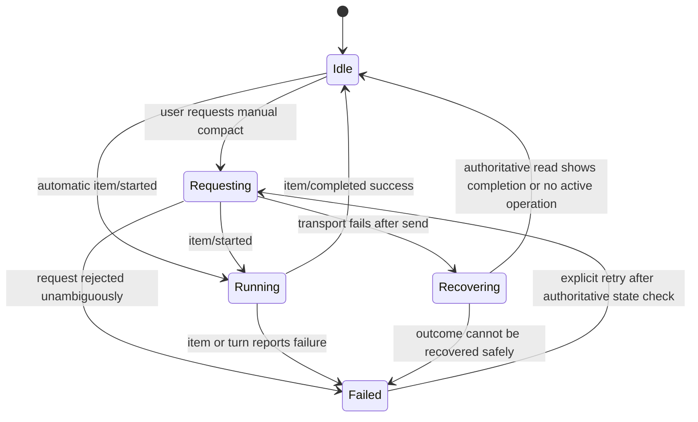

# Compaction architecture

- Status: Historical app-server design; native compaction deferred to V2
- Last updated: 2026-07-14
- Runtime owner: `codex app-server`
- Current boundary: [ADR 0002](../decisions/0002-native-agent-harness.md) and [V2 Phase 7](../implementation/v2/README.md#phase-7-native-compaction)
- Supporting research: [Codex source study](../research/codex-source-study.md) and [Pi source study](../research/pi-source-study.md)
- Protocol contract: [App-server client protocol](app-server-protocol.md)

> This document records the former app-server projection design and useful requirements evidence. Pho Code V1 performs no native compaction; it exposes context exhaustion and offers a new session instead.

## Purpose

This document defines how Pho Code presents, requests, recovers, and verifies context compaction while leaving compaction semantics and persistence inside Codex. It also records the minimum semantics a future native harness would have to reproduce.

Compaction is a required product capability because long coding sessions must continue without the user manually starting over. It is a context-management operation, not transcript deletion.

## User outcome

When a thread approaches its model context limit, Codex should compact the model-visible history and continue the task. The user should understand that compaction occurred, retain access to the visible conversation, and be able to resume or fork the thread later without unexplained loss of working state.

The user may also request manual compaction when a thread has accumulated irrelevant context. Manual and automatic compaction share one runtime lifecycle and one UI representation.

## Terminology

### Visible transcript

The human-readable history Pho Code projects from persisted thread items. It remains available after compaction unless the user explicitly performs a separate destructive history action.

### Model-visible history

The input context Codex constructs for the next model request. Compaction replaces part or all of this representation with a smaller continuation context.

### Replacement history

The exact model-visible items installed by Codex after compaction. This can include structured or encrypted provider items and canonical context, not merely a prose summary.

### Compaction checkpoint

The persisted rollout record that identifies the replacement history and the state from which later entries are reconstructed.

### Compaction window

Codex's identity and accounting boundary for the current compacted context. The GUI does not generate or mutate window identifiers.

## Governing invariants

1. Codex is the only authority for token accounting, trigger decisions, mechanism selection, replacement content, persistence, and reconstruction.
2. Pho Code never generates a replacement summary for a Codex thread.
3. Visible transcript history is not removed merely because model-visible history changes.
4. Manual and automatic compaction use the same projected item lifecycle.
5. A compact request response is not proof of completion; the context-compaction item lifecycle is authoritative.
6. Failure preserves the pre-compaction thread authority. Pho Code does not install a local fallback summary.
7. Restart, resume, and fork after compaction are required behavioral checks, not separate optional features.
8. Deprecated `thread/compacted` notifications are not the source of truth.
9. Only one manual compaction request is active per thread from Pho Code at a time.
10. A sidecar restart never blindly resends a compaction request whose outcome is unknown.

## Upstream behavior Pho Code relies on

### Trigger accounting

Codex calculates active context use and the automatic compaction limit in [`session/context_window.rs`](../../refs/codex/codex-rs/core/src/session/context_window.rs#L1). It can use provider usage and local estimates to decide whether the current context can continue.

### Automatic trigger locations

Codex can compact before a turn, after model changes that reduce compatible context, and during a continuing tool loop. Pre-turn and model-change paths are implemented in [`session/turn.rs`](../../refs/codex/codex-rs/core/src/session/turn.rs#L798); mid-turn continuation appears in [the same file](../../refs/codex/codex-rs/core/src/session/turn.rs#L280).

Mid-turn compaction matters to the UI because compaction can occur while a user still considers one turn active. The transcript must allow a compaction item among other turn items without ending or duplicating the turn.

### Mechanism selection

Depending on feature and provider capability, Codex selects token-budget compaction, remote V2, legacy remote, or local summarization in [`tasks/compact.rs`](../../refs/codex/codex-rs/core/src/tasks/compact.rs#L27). The mechanism is internal runtime state and is not a V1 user setting.

### Durable installation

After successful generation, Codex replaces live history and persists an exact replacement checkpoint through [`replace_compacted_history`](../../refs/codex/codex-rs/core/src/session/mod.rs#L3022). It records the full state baseline and updates context-window accounting.

### Reconstruction

On resume, Codex identifies the newest checkpoint and applies its replacement before replaying the later suffix in [`rollout_reconstruction.rs`](../../refs/codex/codex-rs/core/src/session/rollout_reconstruction.rs#L112).

These behaviors justify the V1 boundary. A GUI-generated summary would not preserve provider items or reconstruction state.

## Protocol behavior

### Manual request

Pho Code invokes `thread/compact/start` with the selected thread ID. The app-server documentation states that the request returns promptly and emits a `ContextCompaction` item through `item/started` and `item/completed` in [`app-server/README.md`](../../refs/codex/codex-rs/app-server/README.md#L673).

The request result means the operation was accepted, not completed. The item lifecycle drives final UI state.

### Automatic event

Automatic compaction produces the same context-compaction item type. Pho Code may not have a preceding local request, so the reducer must create compaction state from an item start or completion alone.

### Deprecated event

`thread/compacted` is deprecated in favor of the item type. It may be counted in diagnostics for older compatible runtimes but must not be required or used to finalize state.

### Item data

The current public `ContextCompaction` item contains an item identifier and receives lifecycle from the surrounding notification. Pho Code must not assume the protocol exposes the summary text, implementation choice, or replacement history.

## Domain state

Each thread derives compaction activity from its items and local control requests.

```text
CompactionState
  Idle
  Requesting(local_request_id)
  Running(item_id, origin)
  Recovering(ambiguous_request)
  Failed(error, last_item_id?)
```

Completed compaction remains represented by its completed transcript item rather than a permanent global state. The thread may additionally store the timestamp or item ID of the last successful compaction for status summaries.

`origin` is `Manual` when confidently correlated to Pho Code's request and `Automatic` otherwise. If correlation is ambiguous, display neutral “Context compacted” wording rather than claiming a trigger.

## State transitions



The reducer stores the completed item even when the derived control state returns to idle.

## Manual-compaction interaction

### Availability

Enable the action only when:

- the runtime is ready;
- the account is signed in;
- the thread is persisted and known to the current runtime;
- no manual compaction request is outstanding for the thread;
- no incompatible thread operation blocks compaction according to runtime state.

The UI may warn that compaction is lossy for model context while preserving visible history. It should not imply that manual compaction always improves output.

### Invocation

1. User chooses “Compact context.”
2. Pho Code records a local requesting state and sends `thread/compact/start`.
3. The request result keeps the control disabled while the item runs.
4. `item/started` inserts a compaction row in the correct turn or thread scope.
5. `item/completed` finalizes the row and returns controls to idle.
6. Failure displays an attached recovery action after authoritative thread state is known.

### Duplicate prevention

A double click or repeated keyboard action must not emit two requests. Disable the control synchronously when the local intent is accepted by the application reducer, before asynchronous serialization.

This prevents duplicates from Pho Code but does not assume another client cannot compact the same thread. External events are still reconciled by item identity.

## Automatic-compaction interaction

Automatic compaction should be visible but unobtrusive:

- insert a compact lifecycle row at the authoritative item position;
- show active state while running;
- announce completion without replacing or scrolling away prior messages;
- attach failure to the active turn and preserve the runtime's error;
- continue streaming later items in the same turn normally.

Do not show an approval dialog merely because context changes. Compaction is an internal agent operation, not permission to execute a new local side effect.

## Transcript presentation

### Completed row

A completed row should communicate:

- that Codex compacted model context;
- whether it was manually requested when known;
- when it occurred;
- that visible history remains available;
- optional token-usage change if the runtime supplies reliable before/after data.

It should not display invented summary text, guessed token savings, or internal provider mode.

### Running row

The running row is a normal item with progress state. Avoid an indefinite animation without associated turn or runtime status. If the process disconnects, transition to recovering or failed rather than leaving it active.

### Accessibility

Announce start and completion as semantic status changes, not token-level updates. Manual controls need explicit accessible labels and disabled-state explanation.

## Token usage

Thread token-usage notifications can support a context indicator, but they are not a local compaction trigger. Pho Code may display usage or proximity when the runtime supplies comparable values; it must not calculate a competing threshold and request compaction automatically.

Different models and providers can use different windows, server-prefill accounting, and compatibility rules. A simple percentage should be labeled carefully and omitted when the denominator is unknown.

## Failure semantics

### Request rejected before acceptance

Return to idle or failed with the server error. The user may retry after addressing authentication, thread status, or compatibility.

### Transport failure after send

The outcome is ambiguous. Do not resend. Restart, initialize, request `thread/read` with `includeTurns: true` or resume the thread, and inspect authoritative items. If a completed compaction item exists, reconcile it; if none exists and the runtime is idle, allow a fresh explicit request.

### Generation failure

Keep prior transcript and runtime authority. Display the compaction item or turn failure. Do not remove messages or generate a local fallback.

### Turn interruption

If compaction was part of an interrupted turn, final status follows runtime events. Manual control remains unavailable until the thread is authoritative again.

### Application exit

Do not persist “compaction running” as a durable Pho Code fact. On next launch, reconstruct from the thread. Local transient control state is discarded with its connection generation.

## Resume and fork behavior

Compaction is accepted only if later operations work:

### Resume acceptance

1. Complete at least one compaction.
2. Finish additional work after the checkpoint.
3. terminate and restart app-server;
4. resume the thread;
5. ask a question requiring pre- and post-compaction task context;
6. verify the runtime continues coherently and the transcript has no duplicates.

### Fork acceptance

1. Compact a source thread.
2. add a later turn;
3. fork the thread;
4. continue source and fork differently;
5. restart and resume both;
6. verify independent identifiers and correct inherited context.

These are behavioral checks. Merely observing a compaction item is insufficient.

## Test plan

### Reducer tests

- automatic start and completion with no local request;
- manual request followed by item lifecycle;
- completion without observed start;
- duplicate start or completion;
- two different compaction items in one thread;
- compaction during a turn followed by additional tool and message items;
- child-thread compaction attributed only to the child;
- deprecated notification does not finalize the new item path;
- runtime exit invalidates requesting and running transient state;
- completed transcript row survives projection reconciliation.

### Protocol-fixture tests

- compact request success and rejection;
- `ContextCompaction` item started and completed;
- automatic item with no request;
- malformed or unknown compaction item remains nonfatal;
- ambiguous transport close after request serialization;
- `thread/read` with `includeTurns: true` containing prior compaction items.

### Live tests

- manual compaction on a signed-in persisted thread;
- automatic compaction using a controlled low threshold when the supported test configuration permits it;
- continued tool execution after mid-turn compaction;
- repeated compaction;
- failure or interruption without transcript loss;
- sidecar restart and resume after compaction;
- fork after compaction;
- compaction inside a child thread.

If automatic triggering cannot be controlled safely, use fixture coverage plus a deliberately long live session and label the resulting evidence accurately.

## Observability

Record redacted events for compact request, item start, completion, failure, duration, thread identifier, origin classification, and recovery outcome. Token counts may be recorded only when already nonsecret structured usage supplied by the runtime.

Do not log summary text, replacement items, prompt content, or entire thread history. The GUI does not need them to diagnose lifecycle failure.

## Future native-harness requirements

If Pho Code later replaces app-server, native compaction must provide more than a summary call.

### Trigger and accounting

- authoritative or conservative token accounting;
- configurable reserve for the next response;
- pre-turn and mid-turn triggers;
- model-window and model-change handling;
- prevention of immediate repeated compaction loops.

### Safe cut

- preserve tool-call and tool-result relationships;
- choose valid turn boundaries;
- handle a single oversized turn through a defined split policy;
- retain recent user and working context under a hard budget;
- preserve canonical system, developer, workspace, and tool context.

### Replacement generation

- structured continuation state;
- prior-summary chaining;
- explicit file and task state where needed;
- provider-specific compacted or encrypted items when supported;
- cancellation and overflow retry without corrupting history.

### Persistence

- append-only checkpoint containing exact replacement history;
- compaction-window identity;
- full state baseline required for later replay;
- atomic installation after successful generation;
- original history retained for audit and branch reconstruction;
- versioned migration.

### Reconstruction

- locate newest valid checkpoint;
- install replacement exactly;
- replay later suffix once;
- restore tool and world state;
- support resume and fork deterministically;
- detect and recover from incomplete checkpoint writes.

Pi's compaction is a useful smaller reference for token thresholds, safe cut points, split turns, summaries, and append-only entries. Codex's checkpoint and reconstruction behavior defines the higher V1 outcome that any replacement must match.

## Acceptance criteria

Compaction support is complete when:

1. manual compact can be requested exactly once per local interaction;
2. automatic and manual operations use the same item projection;
3. mid-turn compaction does not end or duplicate the turn;
4. visible history remains available;
5. failure preserves runtime authority and clear recovery state;
6. transport ambiguity causes reconstruction rather than blind retry;
7. repeated compaction survives runtime restart and thread resume;
8. a fork after compaction inherits correct context and diverges independently;
9. child-thread compaction remains attributed to the child;
10. tests distinguish reducer fixtures from live durable behavior.

## Open decisions

- Exact visual treatment and wording for compact rows.
- Whether to show a context-usage indicator and how to label uncertain totals.
- Whether manual compaction requires confirmation.
- Whether the product exposes optional focus instructions if a future stable protocol supports them.
- How live CI can exercise automatic compaction without excessive service cost.

None of these changes the runtime ownership boundary.
