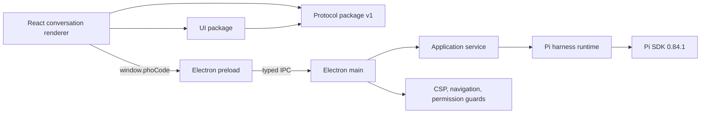
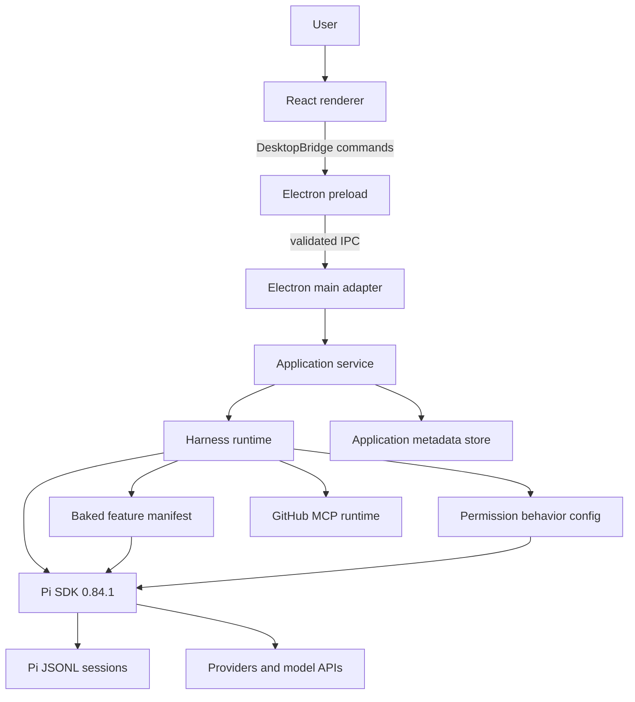

# Architecture overview

## Status

Accepted architecture for the completed personal v1 and v2 Milestones 0–3. Milestones 0 through 5 of personal v1 are accepted, including typed application settings, immutable baked-feature composition, packaged resource lookup, in-app API-key import, and an unsigned local macOS bundle. See the archived [Milestone 5 review](../archive/v1/reviews/milestone-5-code-review.md). v2 Milestone 0 adds owner-facing permission modes and recoverable Trash; Milestone 1 adds bounded local/web retrieval, steering/follow-up, and image input; Milestone 2 adds provider-owned OAuth login, logout, and redacted flow projection through Pi `ModelRuntime`, with owner-verified live `openai-codex` login. v2 Milestone 3 adds a bounded multi-session registry, archive/restore metadata, recoverable OS-Trash chat removal, a keyed conversation cache, a per-chat live-run store, session actions, and a Settings archived list, with owner-verified real-provider background switching. v2 Milestone 4 slice 1 adds typed skill-source Settings, `/` insert from enabled sources, and three Pho Code-authored skills. Slice 2 adds one Settings-controlled read-only GitHub MCP adapter (`github/github-mcp-server` `v1.9.0`) with PAT login in the OS secret store.

## Context

Pho Code is a graphical host for Pi, not a second agent implementation or a customizable Pi distribution. Pi owns the model loop, tools, sessions, resource loading, extension/skill formats, context, and provider integration. The harness owns the fixed feature manifest, typed settings adapters for supported feature behavior, desktop interaction, application metadata, state projection, and the boundary between privileged runtime behavior and the renderer.

Distribution ownership is one-way: the harness embeds the pinned Pi SDK and all selected feature code/resources. Its default operational state is app-owned under Electron `userData/pi-agent`; an explicit external agent-directory override is an interoperability mode, not a capability source. An installed harness must therefore work with its baked features even when no Pi CLI or user-global Pi packages are installed.

The architecture optimizes for:

- a short path to one reliable local conversation;
- direct use of the Node/TypeScript Pi SDK;
- a renderer with no ambient desktop privileges;
- compatibility with Pi's normal auth, model, session, context, extension, and skill formats without inheriting arbitrary feature configuration;
- later extraction of the runtime into another process or shell;
- components that can be tested without launching the entire desktop app.

It does not optimize v1 for smallest binary size, hostile third-party plugins, remote multi-user service, or unattended sandboxed execution.

## Implemented Milestone 1 view



The implemented command surface is workspace/session/prompt, `searchWorkspaceReferences` for composer inline `@` mentions, `steerRun` / `queueFollowUp` for Pi-native queues, `pickImages` / `pasteImages` / `removePreparedImage` for prepared attachments, `rewriteAssistantOutput` for owner-edited assistant markdown (display overlay persisted as Pi custom session entries; JSONL messages stay unchanged), `resolveHostDialog` for confirm/select/input settlement, explicit `getSettings` / `updateAppearanceSettings` / `updatePermissionSettings` / `updateSkillSourceSettings` / `refreshSkills` / `updateGitHubMcpSettings` / `importGitHubPat` / `logoutGitHubMcp`, `listCredentialProviders` / `importProviderApiKey`, and additive provider-account commands `listProviderAccounts` / `startProviderLogin` / `respondProviderAuthPrompt` / `openProviderAuthLink` / `cancelProviderLogin` / `logoutProvider`. `subscribe` publishes JSON-safe runtime/host-UI events, including `providerAuthFlow`. Personal runs use Pho Code's app-owned Pi data directory for auth, models, permission operational data, and sessions; executable feature composition comes only from the harness manifest. Packaged builds resolve baked features through `createPackagedResourceLocator(process.resourcesPath)`; development and tests keep the workspace `node_modules` locator. GitHub MCP tokens stay in the OS secret store and never appear in settings snapshots.

Current source ownership:

| Layer | Location | Implemented behavior |
| --- | --- | --- |
| Protocol | `packages/protocol/src` | Version 1 commands, events, session/workspace/run projections, composite session keys, catalog/activity/archive commands, settings snapshots including skill provenance and GitHub MCP status, credential-import and provider-account commands, redacted OAuth flow snapshots, queue state, prepared image summaries, JSON safety |
| Runtime | `packages/runtime/src` | `AgentSessionRuntime` host with a bounded session-controller registry, per-controller activity, feature manifest composition, packaged/dev `ResourceLocator`s, permission host UI, stable `guarded`/`balanced`/`developer` policy adapter, recoverable Trash tool and chat removal, per-workspace FFF local retrieval, pho-web search/fetch, Pi steer/follow-up, prepared image store, API-key import, `SkillSourceRegistry`, application-owned GitHub MCP runtime with allowlisted `github_` tools, transcript projection |
| Application | `packages/application/src` | Workspace/session/prompt/settings/credential use cases, session catalog, archive/restore/remove metadata, recent-workspace, appearance, enabled skill-source, and GitHub MCP enabled metadata |
| UI | `packages/ui/src` | Shell, conversation, composer, tool cards, host dialogs, floating Settings dialog (Appearance, Accounts, GitHub, Skills, Archived, Permissions) with deferred API-key fields, GitHub PAT, and provider OAuth, sanitized markdown (KaTeX, Shiki, Mermaid) |
| Electron adapter | `apps/desktop/electron` | Native folder and image pickers, IPC result envelope, event fan-out, `nativeTheme` appearance, packaged resource/NODE_PATH wiring, bounded quit |
| Renderer | `apps/desktop/src` | Viewport-owning React shell |
| Desktop tests | `apps/desktop/tests` | Smoke, security, shutdown, chat, session-lifecycle, host-UI, permission, settings, credentials, OAuth, developer, and packaged Electron specs |

## Target v1 system view



## Layer ownership

### Renderer

The renderer owns presentation and transient interaction state:

- workspace/session navigation;
- transcript virtualization and display;
- composer draft and attachment previews;
- streaming indicators and a per-chat live-run projection;
- tool cards;
- dialogs and settings views;
- light/dark theme and accessible interaction.

The renderer receives snapshots and events. It sends intents. It does not decide filesystem truth, session lifecycle, resource precedence, tool authorization, or model availability.

Forbidden renderer dependencies:

- `electron` and raw IPC;
- `node:*` modules;
- Pi SDK packages;
- MCP clients or GitHub tokens;
- filesystem paths derived from renderer-controlled concatenation;
- child processes, terminals, and credentials.

### Protocol

The protocol package is the portability boundary. It contains:

- protocol version;
- command names and payloads;
- response/result types;
- event envelopes;
- normalized errors;
- serializable session, message, tool, resource, model, and workspace projections;
- runtime capability flags.

Protocol values must survive JSON serialization even when Electron uses Structured Clone internally. This deliberately keeps a future Tauri or RPC adapter possible.

`isJsonSafeValue()` now rejects sparse arrays, cycles, custom prototypes/serialization, symbol-keyed objects, non-finite numbers, functions, and `undefined`. The application validates command inputs (non-empty strings, prompt length) and JSON-safe outputs for every Milestone 1 operation. Runtime events are asserted JSON-safe before publish. TypeScript types alone do not validate IPC data.

An envelope should have stable correlation and ordering data:

```ts
interface RuntimeEventEnvelope<T = unknown> {
  protocolVersion: 1;
  sequence: number;
  sessionId?: string;
  runId?: string;
  type: string;
  payload: T;
  occurredAt: string;
}
```

Commands that start long operations return admission or identity information promptly; completion arrives through events. Every active run has an application run ID independent of Pi entry IDs. Late events from an older run must not overwrite the current run.

Run supersession must be explicit. A full authoritative session snapshot and a valid admission may establish a new run after the prior run reaches `settled`, `failed`, or `cancelled`. Once the new run is established, incremental text/thinking/tool/failure/settlement events with a different run ID are stale. Do not apply one global run-ID mismatch check before distinguishing authoritative replacement events from incremental events; that pattern is the M1-001 defect recorded in the Milestone 1 review.

### Electron preload and main adapter

Preload owns the narrow renderer facade. Main owns:

- application/window lifecycle;
- native directory selection;
- external-link opening after URL validation;
- mapping typed IPC to application use cases;
- publishing runtime events to the correct window;
- locating app data and packaged resources;
- flushing and disposing the runtime before quit.

The implemented Milestone 1 facade is:

```ts
interface DesktopBridge {
  getBootstrapState(): Promise<BootstrapState>;
  pickWorkspace(): Promise<WorkspaceSnapshot | null>;
  openRecentWorkspace(input: OpenRecentWorkspaceInput): Promise<WorkspaceSnapshot>;
  listWorkspaceSessions(input: ListWorkspaceSessionsInput): Promise<SessionSummary[]>;
  createSession(input?: CreateSessionInput): Promise<SessionSnapshot>;
  openSession(input: OpenSessionInput): Promise<SessionSnapshot>;
  sendPrompt(input: SendPromptInput): Promise<PromptAdmission>;
  steerRun(input: SteerRunInput): Promise<QueueAdmission>;
  queueFollowUp(input: QueueFollowUpInput): Promise<QueueAdmission>;
  pickImages(): Promise<PickImagesResult>;
  pasteImages(input?: PasteImagesInput): Promise<PickImagesResult>;
  removePreparedImage(input: RemovePreparedImageInput): Promise<void>;
  abortRun(input: AbortRunInput): Promise<void>;
  setSessionModel(input: SetSessionModelInput): Promise<SessionSnapshot>;
  setThinkingLevel(input: SetThinkingLevelInput): Promise<SessionSnapshot>;
  rewriteAssistantOutput(input: RewriteAssistantOutputInput): Promise<SessionSnapshot>;
  resolveHostDialog(input: ResolveHostDialogInput): Promise<void>;
  getSettings(): Promise<HarnessSettingsSnapshot>;
  updateAppearanceSettings(input: UpdateAppearanceSettingsInput): Promise<HarnessSettingsSnapshot>;
  updatePermissionSettings(input: UpdatePermissionSettingsInput): Promise<HarnessSettingsSnapshot>;
  trustProjectPermissionRules(): Promise<HarnessSettingsSnapshot>;
  updateSkillSourceSettings(input: UpdateSkillSourceSettingsInput): Promise<HarnessSettingsSnapshot>;
  refreshSkills(): Promise<SkillSettingsSnapshot>;
  updateGitHubMcpSettings(input: UpdateGitHubMcpSettingsInput): Promise<HarnessSettingsSnapshot>;
  importGitHubPat(input: ImportGitHubPatInput): Promise<ImportGitHubPatResult>;
  logoutGitHubMcp(): Promise<GitHubMcpSettingsSnapshot>;
  listCredentialProviders(): Promise<CredentialProviderSummary[]>;
  importProviderApiKey(input: ImportProviderApiKeyInput): Promise<ImportProviderApiKeyResult>;
  listProviderAccounts(): Promise<ProviderAccountsResult>;
  startProviderLogin(input: StartProviderLoginInput): Promise<ProviderAuthFlowSnapshot>;
  respondProviderAuthPrompt(input: RespondProviderAuthPromptInput): Promise<ProviderAuthFlowSnapshot>;
  openProviderAuthLink(input: OpenProviderAuthLinkInput): Promise<void>;
  cancelProviderLogin(input: CancelProviderLoginInput): Promise<ProviderAuthFlowSnapshot>;
  logoutProvider(input: LogoutProviderInput): Promise<ProviderAccountsResult>;
  searchWorkspaceReferences(input: SearchWorkspaceReferencesInput): Promise<SearchWorkspaceReferencesResult>;
  subscribe(listener: (event: RuntimeEventEnvelope) => void): () => void;
}
```

This facade is implemented. Do not collapse the explicit settings methods into a generic channel or key/value mutation API. Do not return stored credential values, authorization URLs, OAuth tokens, or GitHub PATs from list, import, login, or flow results. The renderer opens provider pages only through opaque link handles.

Do not expose `invoke(channel, payload)` to the renderer. Each method must have a fixed privileged operation and validate untrusted arguments again in main/application code.

Expected command failures cross Electron as a JSON-safe `{ ok, value | error }` result and are reconstructed in preload. The sandboxed preload bundles `@pho-code/protocol` helpers rather than requiring them at runtime. Unexpected exceptions stay generic and do not send stacks. Renderer-origin checks remain exact and the composition root disposes the runtime during normal or timed-out quit.

### Application service

The application layer owns use-case coordination:

- bootstrap state;
- active workspace/session selection;
- baked feature health projections;
- request validation beyond schema shape;
- mapping runtime failures into stable protocol errors;
- joining Pi session data with application metadata;
- coordinating typed appearance/permission settings and idle-only apply behavior;
- validating provider-account commands and refusing snapshots that echo submitted secrets;
- shutdown ordering;
- capability reporting.

It depends on interfaces, not Electron APIs. A test can instantiate it with in-memory metadata and a fake or real runtime.

### Harness runtime

The runtime is the only product layer that imports the Pi SDK. It owns:

- one shared `ModelRuntime` and compatible credential/settings services where appropriate;
- the one-flow provider OAuth coordinator, opaque URL registry, and Pi `AuthInteraction` adapter;
- feature-manifest composition into Pi loader options per effective workspace;
- `AgentSessionRuntime` lifecycle;
- session-to-event subscriptions;
- model and thinking changes;
- prompt admission, steering/follow-up, abort, and disposal;
- mapping Pi events/messages into protocol projections;
- extension binding and host UI adapter;
- baked feature diagnostics;
- feature-specific settings adapters and permission-config reload/rebind;
- application-owned GitHub MCP lifecycle (one packaged stdio server, PAT in the OS secret store, allowlisted `github_` Pi tools).

The v1 may instantiate the runtime inside Electron main. It must still be coded behind a `HarnessRuntime` interface and must never import Electron. Extraction into `utilityProcess`, a normal Node child, or Tauri sidecar should be an adapter change rather than a rewrite.

### Pi SDK and persistent data

Pi owns:

- `AgentSession` and `AgentSessionRuntime` behavior;
- JSONL session files and tree structure;
- context construction and compaction;
- built-in tools;
- model/provider behavior and credentials;
- settings merge behavior;
- loading the explicit factories/paths supplied by the harness;
- extension execution.

Use Pi APIs instead of reaching into internal fields unless the pinned SDK exposes no supported route. Any internal compatibility adapter must be isolated, tested, and documented with the supported Pi version.

## Runtime lifecycle

The lifecycle below is implemented in the accepted v1. Main constructs `createPhoCodeRuntime` after `app.whenReady()`, stores application metadata at `userData/app-metadata.json`, and uses `userData/pi-agent` unless `PHO_CODE_AGENT_DIR` is set.

### Bootstrap

1. Electron becomes ready and establishes application data/resource paths.
2. Main constructs the metadata store and `HarnessRuntime`. The default runtime agent directory is `userData/pi-agent`; `PHO_CODE_AGENT_DIR` is an explicit external/shared override.
3. Runtime constructs the pinned Pi model/runtime services.
4. Application loads recent workspace metadata without opening every Pi session.
5. Renderer requests a bootstrap snapshot.
6. Runtime refreshes remote model catalogs only when explicitly requested or when the chosen SDK policy says it is safe; startup must work from cached catalogs.

### Open workspace

1. Renderer invokes the native picker through the bridge.
2. Main receives an OS-selected absolute path.
3. Application canonicalizes and validates directory access.
4. The selected canonical directory becomes the active tool/context workspace.
5. Metadata records the recent workspace; this never grants permission to load executable project extensions, skills, prompts, or packages.
6. Runtime creates or reuses a workspace context using the fixed feature manifest plus Pi context files.
7. Application publishes models, recent sessions, and baked feature health when diagnostics need it.

The renderer must never authorize a path merely because it supplied the string.

### Create or open session

For a new session, use `SessionManager.create(cwd)`. For an existing session, open through supported Pi session/runtime APIs. Construct cwd-bound services for the effective workspace.

After any operation that replaces `runtime.session`:

1. unsubscribe from the old session;
2. clear transient run and extension UI state;
3. bind and subscribe to the new session;
4. publish a full authoritative snapshot;
5. dispose old resources when ownership permits.

This replacement rule applies to new, switch/resume, fork/clone, and import flows when those features arrive.

### Prompt and events

1. Application validates session identity and current state.
2. Runtime allocates a run ID and subscribes before invoking the prompt.
3. Runtime calls `session.prompt` with a preflight/admission callback when supported by the pinned SDK.
4. Renderer receives an admission result.
5. Pi events are normalized into sequenced protocol events.
6. Streaming deltas update the visible in-progress message.
7. Final message and agent lifecycle events reconcile authoritative state.
8. Runtime publishes a settled, failed, or cancelled run state.

Do not equate the first `agent_end` event with durable application completion without checking the pinned SDK's retry, compaction, queued-message, and settled semantics.

### Shutdown

1. Stop accepting new prompts.
2. Ask active sessions to abort or finish according to the personal-v1 policy.
3. Wait for bounded runtime cleanup.
4. Dispose sessions and extension resources.
5. Flush Pi settings and application metadata.
6. Close event channels and allow Electron to quit.

The app must not hang indefinitely on shutdown. A bounded fallback may terminate the local process after logging which cleanup did not finish, but it must never rewrite or delete session files as recovery.

## State model

Use three state categories:

### Authoritative runtime state

Owned by Pi or derived directly from Pi:

- session ID/file and messages;
- model/thinking level;
- streaming/compaction state;
- tool activity;
- baked feature lifecycle/diagnostics and Pi context files;
- provider availability.

### Application metadata

Owned by the harness:

- recent workspaces;
- selected workspace/session;
- UI display names that do not belong in Pi session info;
- view preferences and theme;
- protocol migration version.

### Baked-feature behavior configuration

Owned by the named runtime adapter and stored where the baked feature expects it:

- permission policy/profile and runtime knobs in the permission package's global config under Pho Code's active agent directory;
- presence (not mutation) of a project-scoped permission override;
- adapter/config format version needed for safe managed presets.

This state is not renderer metadata and is not part of `HarnessFeatureManifest`. Default runs keep it private to Pho Code. Other Pi processes may observe it only when explicitly pointed at the same directory; Settings discloses whether the active root is private or externally shared.

### Renderer transient state

Never treated as durable truth:

- drafts before persistence is added;
- expansion state;
- hover/focus state;
- optimistic submission state;
- scroll position.

When reconnecting or recovering from missed events, request a full snapshot and replace projected runtime state. Do not replay guesses from the renderer.

## Errors

Normalize errors at the privileged boundary:

```ts
interface HarnessError {
  code: string;
  message: string;
  recoverable: boolean;
  operation?: string;
  details?: Record<string, string | number | boolean | null>;
}
```

Never serialize arbitrary `Error` objects, stack traces, credentials, environment variables, request headers, or complete tool payloads into general UI errors. Development logs may retain stack traces locally with secret filtering.

Important distinct error classes:

- invalid command/protocol version;
- inaccessible or missing workspace;
- no authenticated model;
- model request failure;
- prompt rejected before admission;
- run failure after admission;
- session busy or owned elsewhere;
- session/feature schema incompatibility;
- baked feature diagnostic;
- unsupported terminal-only extension UI;
- shutdown timeout.

## Extension host UI

Pi extensions can request many UI shapes, but this harness implements only the structured requests required by baked features.

For the pinned SDK, the runtime must bind loaded extensions to an `ExtensionUIContext` and the SDK's RPC-compatible host mode/command-context actions (or the equivalent public API exposed by that version). Loading an extension without binding its UI context is incomplete. After `AgentSessionRuntime` replaces `runtime.session`, clear stale host UI requests, bind the new session, and then resubscribe/publish its commands. Verify the exact call shape against installed typings; do not copy an internal signature from a newer reference version.

Personal-v1 Milestone 3 implemented the baked permission transport. Personal-v1 Milestone 4 projects the named permission status used by YOLO:

- `select`, `confirm`, and `input` as typed dialog requests with one shared lifecycle;
- `notify` as an application notification/toast;
- `setStatus("pi-permission-system", "yolo")` as a `permissionStatus` event and settings `yoloMode` flag;

Editor/custom components, widgets, terminal input handlers, headers, footers, and TUI renderers are unsupported until a named baked feature requires a specific structured adapter. Record a clear compatibility diagnostic and throw a useful `Error`; do not emulate a terminal inside React or throw a plain record that becomes `[object Object]`.

## Security posture for v1

Required now:

- local packaged renderer content only;
- `nodeIntegration: false`;
- `contextIsolation: true`;
- renderer `sandbox: true`;
- restrictive Content Security Policy;
- validated IPC senders and payloads;
- no raw IPC exposure;
- validate external URL schemes;
- do not display raw credentials;
- render model/tool output as untrusted content;
- isolate tests from real Pi data.

Explicitly deferred:

- containment of the Pi runtime or extension code;
- tool policy sandbox;
- broad package audits and signatures beyond pinning/reviewing the baked feature set;
- containerized execution;
- public-distribution threat model.

Electron's renderer sandbox protects the web UI process. It does not restrict the main-process Pi SDK or extensions.

## Platform portability

- Use `node:path` and canonical path helpers; do not hardcode `/Applications` or Linux home layouts in core logic.
- Treat filesystem paths as opaque data in the renderer.
- Resolve the application resources directory through a `ResourceLocator`.
- Construct an explicit child-process environment; GUI launches may not inherit interactive shell startup files.
- Put native PTY integration behind `ProcessLauncher`/`TerminalService` when it is added.
- Keep mutable Pi sessions, auth/model settings, permission operational data, and application metadata outside ASAR. Keep baked feature code/assets immutable in application resources and resolve them through `ResourceLocator`.
- Test macOS first. Add Linux CI for pure packages early, then real Linux desktop validation before claiming Linux support.

## Testing boundaries

- Protocol: schema/type compatibility, JSON round trips, error normalization, version rejection.
- Runtime unit/integration: temporary agent directory and workspace, session creation/resume, event normalization, baked feature composition/dialog lifecycle, abort/dispose.
- Application: use-case state transitions and stale-event rejection.
- Renderer: component states, accessibility, reducer/projection behavior.
- Electron: preload surface, security preferences, native picker boundary, one real chat smoke path.
- Packaged build: `bun run package:mac` plus `bun run test:packaged` validate app-owned resource location, native/executable-sensitive dependencies, no-global-Pi fallback, and artifact launch. Signing/notarization and Linux artifacts remain later.

## Primary references

- [Pi SDK](https://pi.dev/docs/latest/sdk)
- [Pi extensions](https://pi.dev/docs/latest/extensions)
- [Pi packages](https://pi.dev/docs/latest/packages)
- [Pi sessions](https://pi.dev/docs/latest/sessions)
- [Pi security](https://pi.dev/docs/latest/security)
- [Electron process model](https://www.electronjs.org/docs/latest/tutorial/process-model)
- [Electron IPC](https://www.electronjs.org/docs/latest/tutorial/ipc)
- [Electron security](https://www.electronjs.org/docs/latest/tutorial/security)
