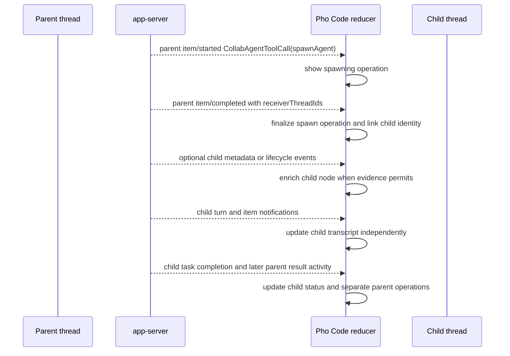
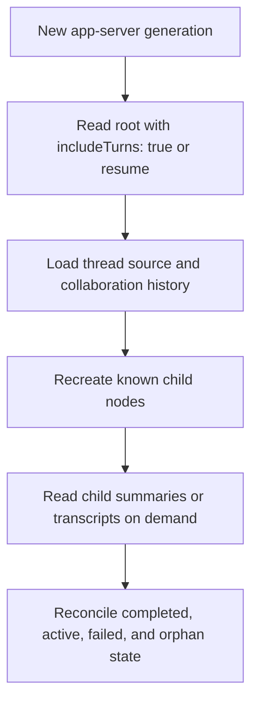

# Subagent architecture

- Status: Historical app-server design; native subagents deferred to V2
- Last updated: 2026-07-14
- Priority: Reserved for [V2 Phase 8](../implementation/v2/README.md#phase-8-native-subagents)
- Runtime owner: Codex stable multi-agent V1
- Current boundary: [ADR 0002](../decisions/0002-native-agent-harness.md)
- Supporting research: [Codex source study](../research/codex-source-study.md) and [Pi source study](../research/pi-source-study.md)
- Protocol contract: [App-server client protocol](app-server-protocol.md)

> This document records the former Codex-owned projection design and requirements evidence. Pho Code V1 is single-agent and does not decode, schedule, or present subagents.

## Purpose

This document defines how Pho Code models and presents Codex subagents without becoming their scheduler. It separates the stable V1 contract from under-development multi-agent V2, establishes parent-child projection rules, and records the behavior a future native harness would need to implement.

Subagents are a required product feature, but their first UI should remain small: visible delegation, independent child timelines, status, navigation, and failure attribution. Rich manual orchestration is deferred until the stable runtime surface proves it can support it coherently.

## User outcome

When the primary agent delegates work, the user should be able to see that a child exists, understand its task and current state, inspect its activity, and see how its result returns to the parent. Concurrent work should remain legible without flattening every event into one transcript.

The user should not need to manage worker processes, message queues, context copies, or capacity reservations. Those remain runtime responsibilities.

## Definitions

### Root agent

The agent session for the top-level thread selected by the user.

### Subagent

A child Codex agent session created from another agent. It has its own thread, turns, items, runtime status, and persisted relationship.

### Parent

The direct agent that spawned or owns the communication relationship with a child. Completion is routed to the direct parent, not automatically to every ancestor.

### Agent tree

The thread relationship graph projected as a rooted tree for one top-level session. Nodes are thread identities, not UI tasks.

### Collaboration item

The app-server `CollabAgentToolCall` item produced by stable multi-agent V1 for spawn, send input, resume, wait, or close operations.

### Subagent activity item

The app-server `SubAgentActivity` item associated with multi-agent V2 started, interacted, or interrupted activity. It is optional enrichment in V1.

### Active turn capacity

The runtime limit on agents executing turns simultaneously. It differs from the number of known or persisted agent identities.

## Governing invariants

1. Every subagent is represented by a distinct Codex thread.
2. Child turns and items remain in the child thread projection.
3. Parent collaboration items link to children but do not embed child transcripts.
4. Codex owns spawn, context inheritance, scheduling, limits, mailbox behavior, interruption, completion routing, and persisted edges.
5. Pho Code targets stable multi-agent V1 and does not enable V2 to obtain richer controls.
6. `SubAgentActivity` can enrich state but is never required to discover or render stable V1 delegation.
7. Agent state is derived from authoritative thread and collaboration events, not from elapsed time or animation.
8. Concurrent child filesystem activity is visible but not assumed conflict-free.
9. Process restart causes tree reconstruction, not creation of replacement agents.
10. Child failure remains attached to the child and related collaboration item; it is not converted into a successful parent result.
11. UI navigation never changes runtime parentage.
12. Capacity and depth limits are runtime facts and must not be guessed from the number of visible nodes.

## Upstream feature boundary

### Stable multi-agent V1

Codex marks `multi_agent` stable and enabled by default in [`features/src/lib.rs`](../../refs/codex/codex-rs/features/src/lib.rs#L1033). Stable V1 supplies model-facing tools for:

- `spawn_agent`;
- `send_input`;
- `resume_agent`;
- `wait_agent`;
- `close_agent`.

The app-server protocol represents those operations through the camel-cased `CollabAgentTool` enum values `spawnAgent`, `sendInput`, `resumeAgent`, `wait`, and `closeAgent`, plus the `CollabAgentToolCall` item in [`protocol/v2/item.rs`](../../refs/codex/codex-rs/app-server-protocol/src/protocol/v2/item.rs#L1038). The item includes sender thread, receiver thread IDs, prompt and model metadata when present, status, and last-known agent states.

Stable V1 uses a configured maximum spawn depth. The audited default depth is one and the default maximum thread count is six in [`core/src/config/mod.rs`](../../refs/codex/codex-rs/core/src/config/mod.rs#L207). Pho Code treats these as revision-specific runtime defaults, not hard-coded product limits.

### Multi-agent V2

Codex marks `multi_agent_v2` under development and disabled by default. V2 adds a different model tool surface: spawn, queue-only message, follow-up that wakes an idle child, wait, interrupt, and list.

V2 spawn can fork no context, all context, or the last N turns in [`multi_agents_v2/spawn.rs`](../../refs/codex/codex-rs/core/src/tools/handlers/multi_agents_v2/spawn.rs#L178). V2 also emits `SubAgentActivity` for started, interacted, and interrupted operations.

Pho Code decodes these known items when a supported runtime emits them, but V1 UI and acceptance tests do not depend on V2 tool availability, recursive behavior, path metadata, or manual messaging controls.

### Protocol V2 is different

The `protocol/v2` Rust types are the app-server API generation used for ordinary threads and stable collaboration as well. Their namespace does not imply that multi-agent V2 is enabled.

## Why a subagent is not a background prompt

Codex child agents have runtime identity, thread history, tool access, sandbox context, capacity state, and a parent relationship. V2 additionally has mailboxes and persistent paths. The registry and control plane coordinate spawn and status in [`agent/registry.rs`](../../refs/codex/codex-rs/core/src/agent/registry.rs#L16) and [`agent/control.rs`](../../refs/codex/codex-rs/core/src/agent/control.rs#L88).

A background model request lacks several required properties:

- no resumable thread;
- no durable spawn edge;
- no independent tool and approval lifecycle;
- no ordered follow-up channel;
- no shared capacity reservation;
- no direct-parent completion routing;
- no recovery after application restart.

Pi's example subagent extension launches independent Pi subprocesses and aggregates results. It is useful as an example of optional delegation, but it does not satisfy Pho Code's agent-tree contract.

## Domain model

### Agent node

```text
AgentNode
  thread_id
  parent_thread_id?
  children: ordered thread ids
  display_path?
  task_summary?
  requested_model?
  status
  active_turn_id?
  last_collaboration_item_id?
  last_activity_at?
  result_summary?
  failure?
```

Thread ID is the stable identity. Display path and task name are labels that may change or be absent.

### Status

Pho Code normalizes runtime evidence into:

```text
Discovered
Starting
Running
Waiting
Completed
Interrupted
Failed
Closed
Unknown
```

Stable `CollabAgentState` values include pending initialization, running, interrupted, completed, errored, shutdown, and not found in [`protocol/v2/item.rs`](../../refs/codex/codex-rs/app-server-protocol/src/protocol/v2/item.rs#L1195). Mapping must preserve the original runtime value in diagnostics when normalization loses detail.

`Waiting` is shown only when authoritative collaboration state establishes it. Silence or lack of deltas is not evidence of waiting.

### Agent tree projection

```text
AgentTree
  root_thread_id
  nodes_by_thread_id
  orphan_thread_ids
  last_reconciled_generation
```

Orphans are allowed transiently because a child thread notification can arrive before the parent collaboration item or reconstructed edge. The reducer attaches an orphan when evidence appears and diagnoses conflicting parents.

### Collaboration operation

The parent thread owns each collaboration item:

```text
CollaborationOperation
  item_id
  tool
  sender_thread_id
  receiver_thread_ids
  prompt?
  requested_model?
  status
  agent_states
```

Receiver IDs can be plural. The UI must not assume every collaboration item targets exactly one child even if initial spawn normally does.

## Discovery and relationship evidence

Use relationship evidence in this priority:

1. Authoritative thread source or parent metadata returned by app-server.
2. Completed or in-progress stable collaboration item with sender and receiver IDs.
3. Known optional V2 activity containing child thread and path.
4. Reconstructed persisted tree information supplied by a supported thread API.

Never infer parentage from similar timestamps, prompt text, model, or thread ordering.

When sources conflict, keep the existing authoritative relationship, mark the node inconsistent, and record a compatibility diagnostic instead of silently moving it.

## Stable spawn projection



Spawn-item completion confirms that the spawn operation produced the receiver identity; it does not mean the child's delegated task completed. Child-task completion and delivery to the parent arrive through later child lifecycle and parent communication or message activity.

The exact order can differ. The reducer accepts optional child metadata before the spawn item, completion without observed start, or child activity before the spawn row has rendered. `receiverThreadIds` on the completed collaboration item is the stable discovery path; a child `thread/started` notification is optional.

## Parent transcript

The parent transcript contains a compact collaboration row that shows:

- operation type;
- child label or receiver identifiers;
- delegated task summary when available;
- requested model or effort when supplied;
- current or final status;
- a link to each child thread;
- failure or result summary supplied by the runtime.

It does not inline the child's entire message and tool stream. This keeps parent reasoning legible and avoids duplicate state.

## Child transcript

Selecting a child opens the same transcript component used for a top-level thread, with contextual navigation back to its parent. It supports:

- child turns and messages;
- command, file, and tool items;
- approvals attributable to the child;
- child compaction;
- failure and interruption;
- nested children if a supported runtime creates them.

The UI may display a breadcrumb such as root → child, but breadcrumb labels never replace thread IDs in domain state.

## Agent-tree UI

The first tree should show only information needed to understand active work:

```text
Root thread                         Running
├─ inspect authentication          Completed
├─ trace compaction                Running
└─ review tests                    Failed
```

Each node exposes status, short task label, and unread or active indication. Expansion reveals children. Selecting a node changes the transcript view, not the runtime's active agent.

### Ordering

Order children by authoritative spawn sequence when available, otherwise first observation. Status changes do not reorder nodes automatically because movement makes concurrent work harder to follow.

### Labels

Prefer runtime path or task name when supplied. Otherwise derive a short display-only label from the collaboration prompt without persisting it as identity. Sensitive prompts must not appear in window titles or external diagnostics.

### Completed agents

Completed and failed nodes remain visible for the thread session. The UI may collapse them, but it must not remove them from projection while parent collaboration history refers to them.

## Manual controls

Stable V1 is primarily model-driven. Pho Code V1 guarantees observation and navigation; manual child-control actions are included only when a documented stable app-server method exists and their semantics can be tested.

### Required

- Navigate to child transcript.
- Navigate back to parent.
- Interrupt the active top-level turn through the normal thread control when supported.
- Answer approvals originating from child turns.

### Conditional or deferred

- Send a new message directly to an idle child.
- Wake or resume a child from the GUI.
- Interrupt one child independently while the parent continues.
- Close or archive an individual child.
- Spawn a child directly from a UI button.

Do not expose V2-only `send_message`, `followup_task`, `interrupt_agent`, or `list_agents` controls under a stable V1 runtime. Rich manual orchestration requires a later compatibility decision.

## Concurrency and capacity

Codex owns active-turn and identity limits. Pho Code observes failure or status and presents it clearly.

### UI behavior under concurrency

- Keep protocol intake independent from transcript rendering.
- Coalesce child deltas by thread and item.
- Preserve every item and turn completion.
- Load child transcript details on demand.
- Avoid rendering all command output for all children simultaneously.
- Indicate active child count without presenting it as the configured maximum unless the runtime supplies that value.

### Capacity failure

If spawn fails because capacity is exhausted, finalize the parent collaboration item as failed and retain the requested task context. Do not create a placeholder child thread unless the runtime supplied an identity.

### Depth

Stable V1 can disable collaboration tools when the next spawn would exceed its configured depth. The GUI treats missing nested children as runtime behavior, not a reason to enable V2 or simulate delegation locally.

## Shared workspace and edit conflicts

Parent and child agents may operate in the same workspace. Concurrent edits can overlap even when each agent follows its task.

Pho Code should:

- show which agent owns an active command or file-change item;
- route approvals with child and workspace context;
- preserve runtime ordering and final status;
- avoid claiming edits are conflict-free;
- make concurrent active writers visible in the agent tree or status area;
- leave actual filesystem locking, patch application, and sandbox enforcement to Codex.

The project `AGENTS.md` should instruct delegated agents to respect concurrent work and avoid reverting others. UI warnings supplement that discipline but cannot enforce semantic ownership.

## Approvals from child agents

A child command or file request arrives as a server-initiated approval associated with the child thread or turn. The approval view must show:

- child label and thread context;
- affected workspace;
- requested command, change, or permission;
- effective decisions, using exact `availableDecisions` when present and the pinned conservative fallback otherwise;
- whether parent and other children remain active.

Approval response and completion semantics are identical to root operations. Never approve a child action based solely on the parent's earlier approval.

## Completion and result delivery

Codex delivers child results to the direct parent. Pho Code may observe:

- child turn completion;
- child agent state becoming completed or errored;
- parent collaboration item completion;
- a later parent message incorporating the result.

These are related but distinct events. The reducer does not synthesize parent completion from child completion or vice versa.

The UI can mark a child completed when authoritative agent state says so. Each parent collaboration row completes according to its own operation: the spawn row can complete while the child is still pending or running, while a later wait, input, resume, or close row has separate lifecycle. If operation and agent state appear inconsistent, display the discrepancy and retain diagnostics.

## Interruption and closure

### Turn interruption

Interrupting a root turn may affect collaboration execution according to Codex behavior. Pho Code waits for child and parent status events instead of assuming recursive cancellation.

### Child interruption

Multi-agent V2 has an explicit child interrupt tool, but it is not a V1 UI dependency. If stable runtime thread controls allow safe child-turn interruption, that can be evaluated separately with live tests.

### Runtime exit

On app-server exit, active nodes become reconnecting or unknown. Do not mark them failed or completed without persisted evidence. Pending child approvals are invalidated for that connection.

### Closed or shutdown state

Retain closed or shutdown nodes in historical tree projection when referenced by parent items. Navigation may be read-only.

## Restart and reconstruction



Reconstruction rules:

1. Thread identity survives UI process lifetime.
2. Persisted parent-child edges outrank stale local navigation state.
3. Do not respawn a missing child automatically.
4. Do not resend a delegated prompt.
5. Preserve local expansion and selection only when corresponding nodes still exist.
6. Mark uncertain prior active state as unknown until thread status is read.
7. Reattach app-server listeners through supported resume behavior, not separate ad hoc child connections.

## Failure model

### Spawn failure before child identity

Finalize the parent operation as failed. No child node is created.

### Spawn failure after child identity

Create or retain the child node with failed or unknown status according to runtime evidence. Link the parent operation and allow transcript inspection if persisted.

### Child turn failure

Attach error to child turn and node. Parent state changes only through its own runtime events.

### Lost relationship evidence

Keep the thread as an orphan under an “Unlinked agents” group and record diagnostics. Do not invent a parent.

### Capacity or depth rejection

Show the runtime's reason and do not retry automatically. Repeated model attempts remain visible collaboration items.

### Unknown V2 event

Unknown additive activity is logged and ignored safely. Required stable V1 projection continues from collaboration items and thread metadata.

## Notifications and reducer actions

Representative domain actions include:

```text
ThreadObserved(thread)
ThreadStatusChanged(thread_id, status)
CollaborationStarted(parent_thread_id, item)
CollaborationCompleted(parent_thread_id, item)
SubagentActivityObserved(item)
ChildRelationshipObserved(parent_id, child_id, source)
ChildTurnChanged(child_id, turn_action)
ConnectionLost(generation)
TreeReconstructed(root_id, authoritative_edges)
```

Protocol DTOs do not enter views directly. The projection mapper validates identities and emits these actions.

## Test plan

### Reducer tests

- spawn item before optional child metadata or activity;
- optional child metadata or activity before spawn item;
- completion without observed start;
- plural receiver IDs;
- child item never enters parent transcript;
- nested child relationship;
- orphan attachment after later evidence;
- conflicting parent evidence;
- spawn operation completion before child-task completion;
- parent failure with existing child;
- unknown optional subagent activity;
- connection loss and authoritative reconstruction;
- compaction within child thread;
- duplicate events across resume.

### Protocol-fixture tests

- stable `spawnAgent`, `sendInput`, `resumeAgent`, `wait`, and `closeAgent` collaboration items;
- each stable agent status value;
- collaboration completion with `receiverThreadIds`, plus optional child metadata and status events;
- child command approval;
- V2 `SubAgentActivity` as optional enrichment;
- unknown future collaboration tool or status;
- capacity/depth failure payload;
- child event concurrency with parent deltas.

### Live stable-V1 tests

1. Prompt root to delegate a bounded independent research task.
2. Observe spawn collaboration item and child thread.
3. Navigate to child while parent remains active.
4. Exercise a child tool request requiring approval.
5. Observe child result and direct-parent continuation.
6. Create enough activity to exercise wait or resume when model behavior permits.
7. Interrupt the root turn and record actual child behavior.
8. Restart app-server and reconstruct root and child threads.
9. Compact a child thread or observe child compaction if naturally triggered.
10. Exercise capacity or depth limit with a controlled prompt and verify graceful failure.

Model behavior is nondeterministic. Tests should combine protocol fixtures with controlled prompts and assert structural invariants rather than exact prose.

### Conflict scenario

Run two children assigned explicitly non-overlapping files, then a controlled scenario where both inspect or edit a shared file. Verify attribution, approvals, status, and final filesystem evidence without claiming the runtime prevents conflicts.

## Observability

Record redacted structured events for agent thread ID, parent ID, operation type, lifecycle status, duration, capacity rejection, failure category, and reconstruction outcome. Prompt or result text is not logged by default.

Diagnostics should reveal orphan or conflicting relationships and unknown statuses because those indicate protocol drift or reducer bugs.

## Future native-harness requirements

A native replacement must implement a real agent control plane.

### Registry

- canonical tree-scoped identities and paths;
- direct-parent metadata;
- atomic capacity reservations with rollback;
- total identity and active-turn limits;
- explicit maximum depth;
- status transitions safe under concurrency;
- lazy restoration of persisted agents.

### Session spawn

- independent persisted child session;
- context fork modes such as none, all, or bounded recent turns;
- inherited workspace, sandbox, model, and tool policy under explicit rules;
- cancellation-safe creation;
- durable spawn edge before result delivery;
- no duplicate child after retry ambiguity.

### Communication

- bounded FIFO mailbox per agent;
- distinction between queue-only message and follow-up that starts execution;
- delivery to idle and active agents without corrupting a provider request;
- sender identity and authorization;
- backpressure and mailbox overflow behavior.

### Scheduling

- bounded active turns separate from resident identities;
- fairness or documented priority;
- cancellation and interruption;
- wait semantics without blocking all progress;
- shutdown and restart behavior;
- shared-workspace awareness.

### Completion

- exactly-once final result delivery to direct parent;
- child failure and interruption delivery;
- parent unavailable handling;
- persisted completion for recovery;
- no accidental delivery to siblings or root when a direct parent exists.

### Reconstruction

- restore tree and statuses from persisted edges;
- load child sessions lazily;
- reconcile operations interrupted by crash;
- preserve mailbox and result-delivery invariants;
- version migrations.

A vector of asynchronous model futures is not an acceptable native implementation.

## Acceptance criteria

Subagent support is complete when:

1. a stable V1 spawn is visible as a parent collaboration item;
2. each child has a distinct navigable thread and transcript;
3. event order variations do not create duplicates or lose relationships;
4. child commands and approvals show child and workspace context;
5. child-task completion and each parent collaboration-operation completion remain distinct but linked; spawn completion is never treated as task completion;
6. failed, interrupted, closed, and orphan states remain visible and recoverable;
7. concurrent child deltas do not block or corrupt parent rendering;
8. runtime restart reconstructs the tree without respawning or resending work;
9. capacity and depth rejection fail clearly without fabricated nodes;
10. the V1 feature works without enabling multi-agent V2;
11. optional V2 activity is tolerated without becoming a product dependency;
12. tests cover shared-workspace conflict visibility and child compaction.

## Open decisions

- Whether stable app-server APIs support safe manual child interruption or resume from the GUI.
- How agent paths and task labels should be truncated and disambiguated.
- Whether completed agents remain expanded across application restart.
- How many child transcripts can be prefetched without memory pressure.
- Whether the product warns when multiple active agents touch the same file and what evidence would drive that warning.
- When multi-agent V2 becomes stable enough for a separate adoption ADR.

The required V1 outcome remains observation, navigation, attribution, approvals, completion, and recovery through stable collaboration.
