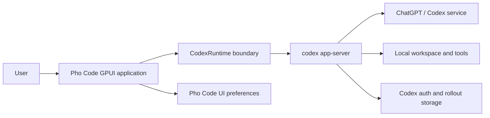
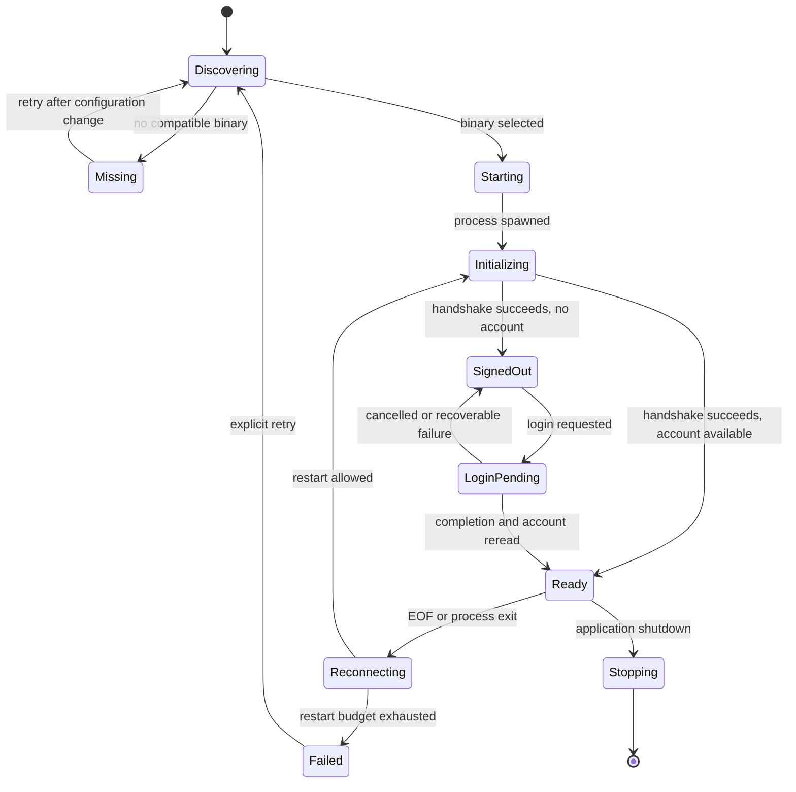

# Pho Code system architecture

- Status: Historical app-server design; superseded as a Pho Code V1 contract
- Last updated: 2026-07-14
- Governing decision: [ADR 0001](../decisions/0001-codex-app-server-sidecar.md)
- Superseded by: [Native harness system architecture](native-harness-system.md) under [ADR 0002](../decisions/0002-native-agent-harness.md)
- Evidence: [Pi source study](../research/pi-source-study.md) and [Codex source study](../research/codex-source-study.md)

> This document is retained as the complete design produced for the former app-server boundary. It is not an implementation contract for current V1 work. Use the linked native-harness architecture instead.

## Purpose

This document defines the whole-system structure for Pho Code V1. It turns the accepted sidecar decision into component boundaries, state ownership, dependency rules, lifecycle behavior, and quality constraints that implementation work can follow.

It does not freeze individual GPUI widgets, select every Rust crate, or reproduce the app-server schema. Those details should be chosen in the smallest implementation slice that satisfies this architecture.

## Product goal

Pho Code is a small native desktop application for running the Codex agent against a local workspace through a ChatGPT subscription. It should feel focused and inspectable: one workspace, clear agent activity, explicit approvals, durable conversations, reliable compaction, and visible subagents without a framework-heavy shell.

The application is not a terminal UI. It uses GPUI for native presentation and interaction while delegating agent-runtime behavior to `codex app-server`.

## V1 capabilities

V1 must support:

- discovering and supervising a compatible Codex runtime;
- managed ChatGPT browser login with device-code fallback;
- starting, listing, resuming, and forking threads;
- sending, steering, and interrupting turns;
- streamed agent messages and structured tool activity;
- explicit command, file-change, and permission approvals;
- automatic compaction visibility and manual compaction;
- stable Codex multi-agent behavior and child-thread navigation;
- recovery after application or sidecar restart;
- actionable diagnostics for missing runtime, protocol mismatch, authentication failure, overload, and turn failure.

## V1 non-goals

V1 does not include:

- providers other than Codex;
- direct Responses API calls;
- API-key login as an automatic substitute for subscription login;
- a native agent loop or tool runner;
- a duplicate conversation database;
- multi-agent V2 as a required feature;
- remote app-server transport;
- plugins, themes, prompt-template marketplaces, or a public extension SDK;
- cloud thread synchronization implemented by Pho Code;
- a full IDE, source-control client, terminal emulator, or file explorer;
- silent or blanket approval of agent actions;
- automatic installation or updating of the Codex runtime until packaging policy is decided.

## Architectural principles

### One authority per concern

Codex owns authentication secrets, model execution, tools, sandboxing, thread history, compaction, and child sessions. Pho Code owns process supervision, protocol projection, user decisions, local UI preferences, and presentation. A feature must not create a second authority because doing so appears convenient for one screen.

### Smallest correct design

Minimality means few concepts, narrow modules, and no speculative abstractions. It does not mean omitting error handling, approval safety, bounded queues, restart recovery, or state invariants.

### Concrete before generic

The runtime module is named and typed for Codex. Do not introduce provider registries, generic model traits, plugin protocols, or dependency-injection frameworks without a second real implementation and a demonstrated shared contract.

### State before views

GPUI views render projected domain state and dispatch user intents. They do not parse protocol payloads, own child processes, perform blocking I/O, or decide how partial and completed events merge.

### Completion is authoritative

Deltas create responsive transient state. Item and turn completion establish final state. A locally displayed action, an approval response, or a browser opening is not proof that the corresponding runtime operation completed.

### Failure is visible

Missing binaries, incompatible protocols, expired login, denied approvals, overload, malformed events, crashes, compaction failure, and child-agent failure all produce explicit domain state. The UI does not convert them into an empty transcript or indefinite spinner.

### Safe by default

The application never reads Codex tokens, never enables internal token injection, never auto-approves tool actions, never puts secrets in process arguments or logs, and never treats a child process as trusted merely because it is local.

## System context



The Codex service and authentication environment are external dependencies. The local workspace and Codex home are controlled by app-server according to its configuration and permission profile. Pho Code does not proxy filesystem operations between them.

## Responsibility boundary

| Responsibility | Pho Code | Codex app-server |
| --- | --- | --- |
| Process discovery and supervision | Owns | N/A |
| Protocol framing and correlation | Owns client half | Owns server half |
| ChatGPT credential lifecycle | Observes nonsecret state | Owns |
| Thread, turn, and item log | Projects | Owns |
| Model transport and continuation | Observes | Owns |
| Command and file execution | Presents approval and result | Owns |
| Sandbox and permission enforcement | Selects supported policy; never bypasses | Owns execution enforcement |
| Compaction | Presents and requests manual action | Owns trigger, mechanism, persistence, reconstruction |
| Subagent scheduling and communication | Presents | Owns |
| Desktop navigation and interaction | Owns | N/A |
| UI preferences | Owns | N/A |
| Runtime compatibility | Detects and reports | Defines versioned surface |

## Proposed source structure

The current repository is only a scaffold. The following is the intended module shape, not a requirement to create every file before its behavior exists:

```text
src/
  main.rs                 process entry and GPUI startup
  app.rs                  application composition and top-level actions
  domain/
    mod.rs
    model.rs              account, thread, turn, item, approval, agent-tree state
    action.rs             internal actions consumed by the reducer
    reducer.rs            deterministic state transitions
  codex/
    mod.rs                concrete CodexRuntime public boundary
    process.rs            discovery, spawn, exit, restart, stderr capture
    transport.rs          JSONL reader/writer and bounded channels
    protocol.rs           envelopes and minimal required DTOs
    client.rs             request correlation and method operations
    projection.rs         protocol message to domain action mapping
  ui/
    mod.rs
    workspace.rs          top-level window composition
    transcript.rs         thread and turn presentation
    composer.rs           prompt, steer, and interrupt interaction
    approvals.rs          modal or inline approval presentation
    agents.rs             parent-child thread navigation and status
    status.rs             runtime, account, usage, and failure state
  settings.rs             nonsecret Pho Code preferences
  diagnostics.rs          bounded structured diagnostics and export policy
```

Files should be created when they have a coherent responsibility. If an initial vertical slice is clearer with fewer files, begin smaller and split only when ownership becomes distinct.

## Dependency rules

1. `ui` may depend on domain state and application actions, not on raw protocol DTOs or process handles.
2. `domain` must not depend on GPUI, subprocess APIs, filesystem I/O, or Codex protocol serialization.
3. `codex::projection` translates protocol messages into domain actions; it does not mutate GPUI entities directly.
4. `codex::transport` knows framing and I/O, not account, thread, or item semantics.
5. `codex::client` owns request identifiers and outstanding requests, not transcript state.
6. `settings` stores only Pho Code preferences and identifiers. It does not mirror messages, tokens, approvals, or sandbox decisions unless a later ADR explicitly permits a safe persisted setting.
7. Diagnostics accept redacted structured events; they do not receive unrestricted protocol values by default.
8. Tests can construct domain actions and protocol fixtures without launching GPUI or a live Codex runtime.

These rules should be enforced through Rust visibility and module APIs rather than a service-locator convention.

## Core domain model

The exact Rust type names may evolve, but the following state distinctions are required.

### Application state

```text
AppState
  runtime: RuntimeState
  account: AccountState
  workspaces: ordered workspace/window state
  active_workspace: optional workspace id
  approvals: pending approval requests by server request id
  diagnostics: bounded summary
  preferences: nonsecret UI preferences
```

One application can later support multiple windows, but the first slice may use one window and one workspace. Do not encode single-window assumptions into the protocol client.

### Runtime state

```text
Unavailable(reason)
Starting(binary, attempt)
Initializing(process_id)
Unauthenticated(connection)
Ready(connection, runtime_info)
Reconnecting(previous_connection, attempt)
Failed(error, recovery)
Stopping
Stopped
```

Runtime state is independent of turn state. A runtime failure transitions active operations to interrupted or unknown according to authoritative evidence, invalidates pending requests, and preserves enough thread identity for recovery.

### Account state

```text
Unknown
Reading
SignedOut
LoginPending(login_id, method, user_action)
SignedIn(nonsecret account summary)
Failed(error, retry)
```

No variant contains access or refresh tokens. A login-completed notification triggers an account reread instead of directly constructing a signed-in account from notification assumptions.

### Workspace state

A workspace has a canonical local path, selected thread, ordered thread summaries, agent-tree projection, composer state, and window-specific navigation. The canonical path supplied to Codex must be validated as an absolute path and kept distinct from display labels.

### Thread projection

```text
ThreadProjection
  id
  source and optional parent relationship
  status
  ordered turn ids
  turns by id
  compaction activity
  last authoritative update
```

Top-level threads and subagent threads share the same projection type. Their navigation role differs, but their turn and item semantics do not.

### Turn projection

A turn records input, status, ordered item identifiers, item map, token usage when available, and failure or interruption information. Required status distinctions include pending, running, awaiting approval, completed, failed, and interrupted.

An approval may coexist with other runtime activity. `AwaitingApproval` can be derived for display rather than replacing all underlying turn state.

### Item projection

Each item retains its protocol item identifier, kind, lifecycle status, stable content, transient delta buffer when applicable, and structured metadata needed by its view. Unknown item types are preserved as diagnostic-safe opaque metadata and a generic display row when possible.

Do not collapse command, file change, compaction, and collaboration items into strings. Structured status is required for approval, recovery, and subagent attribution.

### Approval projection

An approval records server request ID, connection generation, thread and turn identity when supplied, kind, requested action, optional protocol-provided decisions, the conservative effective decision set, creation time, and UI state. When decisions are absent, the protocol layer derives a method-specific fallback tested against the pinned runtime; no fallback may default to approval. Sending a response marks it as answered locally, while the related item remains active until its completion arrives.

Connection generation prevents a stale dialog from answering a request on a restarted process that reused an identifier.

### Agent-tree projection

The tree maps thread identifiers to parent, children, display path when available, last known state, active turn, and related collaboration item. Stable V1 can derive relationships from thread metadata and `CollabAgentToolCall`; V2 activity may enrich but never become required for the basic tree.

## Reducer invariants

The reducer is a deterministic function of prior state and a domain action. It must preserve these invariants:

1. Thread, turn, and item identities are never inferred from display order.
2. An item belongs to exactly one turn and thread in the projection.
3. A completion event can finalize an item even if its start or deltas were not observed.
4. Deltas received after authoritative completion are ignored and diagnosed.
5. Duplicate completion is idempotent when content agrees and diagnosed when it conflicts.
6. Unknown notifications do not alter unrelated state.
7. A child item never appears in the parent's item map.
8. Parent collaboration rows may link to child threads without embedding their transcripts.
9. Runtime disconnect invalidates outstanding requests and approvals from that connection generation.
10. Local UI actions cannot fabricate runtime success.
11. Reconstructed authoritative state can replace or reconcile transient projection without duplicating items.
12. Diagnostic collections and retained delta buffers are bounded.

Reducer tests should exercise these invariants before views depend on them.

## Concurrency model

GPUI rendering and entity mutation occur on the application context expected by GPUI. Blocking subprocess I/O, line decoding, schema checks, and filesystem discovery occur outside render paths.

The implementation should use the smallest async arrangement compatible with GPUI and the selected process library. Do not add a second general-purpose runtime merely by habit. If Tokio becomes necessary for a required dependency, define its ownership and shutdown explicitly rather than starting hidden runtimes in modules.

### Logical tasks

- **Supervisor:** discovers and launches the process, observes exit, and coordinates restart.
- **Reader:** continuously reads stdout, enforces line and message limits, decodes envelopes, and routes them.
- **Writer:** serializes outbound envelopes in order and reports write failure.
- **Request registry:** correlates client request IDs to bounded completion channels and deadlines.
- **Stderr collector:** reads diagnostic output into a bounded redacted buffer.
- **Projection dispatcher:** maps protocol events to domain actions and schedules reducer updates on the application context.

These may be implemented with fewer physical tasks initially, but their cancellation and ownership must remain distinct.

### Bounded resources

The implementation must set explicit bounds for:

- maximum protocol line size;
- inbound decoded-message queue;
- outbound request queue;
- outstanding client requests;
- pending server requests;
- stderr bytes and diagnostic entries;
- transient item delta bytes;
- restart attempts within a time window;
- thread summaries loaded at once;
- simultaneously expanded child transcripts.

Exact values should be selected from behavioral tests and remain configurable in code, not exposed as premature user settings.

## Application lifecycle



Runtime readiness does not automatically select a thread. The workspace can show recent persisted threads, start a new thread, or resume a prior one after account readiness.

## Primary user workflows

### First launch and login

1. Discover a supported Codex binary.
2. Spawn and initialize app-server.
3. Read account state.
4. If signed out, explain that ChatGPT subscription login is required.
5. Start browser login; show device-code fallback and cancellation.
6. Wait for completion and reread account state.
7. Enter the workspace only after authoritative signed-in state.

### Start a conversation

1. Validate selected workspace path.
2. Start a thread with supported V1 defaults.
3. Insert returned thread state into the projection.
4. Submit user input through `turn/start`.
5. Render turn and item lifecycle.
6. Keep composer behavior consistent with active-turn steering and interrupt policy.

### Resume after restart

1. Restart and initialize the runtime.
2. Reestablish account state.
3. List or read recent thread summaries.
4. Resume the selected thread.
5. Request `thread/read` with `includeTurns: true` or resume the thread, then replace transient projection with authoritative reconstructed state.
6. Mark any operation whose completion cannot be proven as interrupted or unknown, not successful.

### Handle approval

1. Receive a server request and insert a pending approval tied to connection generation.
2. Present requested action, scope, effective decisions, and related thread; use exact `availableDecisions` when supplied and the pinned conservative fallback otherwise.
3. Keep protocol reader active while waiting.
4. Send exactly one explicit decision.
5. Close or mark the prompt answered locally.
6. Update final operation status only from subsequent runtime events.

### Compact context

1. Disable duplicate manual compact action while one is active for the thread.
2. Send `thread/compact/start`.
3. Render context-compaction item lifecycle.
4. Preserve visible historical transcript.
5. Show failure without replacing history locally.

### Follow subagents

1. Observe a collaboration spawn item or child-thread metadata.
2. Add or update the child node under its parent.
3. Keep parent and child timelines independent.
4. Display compact status in the agent tree.
5. Navigate to the child's transcript without changing runtime ownership.
6. Reflect completion in both child status and the parent collaboration row when authoritative events arrive.

## UI information architecture

The first desktop layout should remain intentionally small:

```text
┌─────────────────────────────────────────────────────────────────┐
│ Workspace / thread title                         Runtime status │
├────────────────────┬────────────────────────────────────────────┤
│ Threads            │ Transcript                                 │
│ Agent tree         │ user / agent / tool / compaction items     │
│                    │                                            │
│                    │ contextual approval panel when required    │
├────────────────────┴────────────────────────────────────────────┤
│ Composer                          Send / Steer / Interrupt       │
└─────────────────────────────────────────────────────────────────┘
```

The sidebar can begin as one combined thread and agent outline. Do not add file trees, terminals, diff editors, model marketplaces, or extensible panels until the core workflows prove they are needed.

### Transcript rules

- Preserve chronological item order within each turn.
- Render structured item types consistently.
- Keep partial agent output visually distinct from completed output only when that helps comprehension.
- Do not expose raw reasoning by default without a product decision about content and retention.
- Collapse verbose command output with clear status and an intentional expansion action.
- Show compaction as a lifecycle marker, not deletion of prior visible messages.
- Link collaboration rows to child threads.
- Keep failure and interruption attached to the operation that failed.

### Composer rules

The composer derives its action from thread and turn state. With no active turn, submit starts a turn. During a steerable turn, the product may expose steering. Interrupt is always explicit. Queued-input semantics must match supported app-server behavior rather than imitate another agent's UI.

## Persistence

### Codex-owned persistence

Codex owns account credentials, thread rollouts, turn and item history, compaction replacements, forks, and child-thread edges. Pho Code uses thread operations to recover them.

### Pho Code-owned persistence

Pho Code may store:

- last selected workspace paths;
- recent thread identifiers by workspace;
- window size and placement;
- sidebar and item expansion state;
- nonsecret appearance and interaction preferences;
- last known compatible Codex binary path if user-selected;
- diagnostic consent and redaction preferences.

It must not store:

- access or refresh tokens;
- full authoritative transcripts as a recovery source;
- approval responses for automatic reuse;
- command output without an explicit cache policy;
- internal reasoning by default;
- synthetic compaction summaries;
- a second subagent registry.

Settings writes should be atomic and schema-versioned once persistence exists. A corrupt preferences file must not prevent access to Codex's persisted threads.

## Error model and recovery

Errors should carry a stable category, user-facing summary, source chain for diagnostics, affected connection/thread/turn/item identifiers, retry safety, and recommended recovery action.

### Categories

- `RuntimeMissing`
- `RuntimeIncompatible`
- `SpawnFailed`
- `InitializationFailed`
- `TransportMalformed`
- `TransportClosed`
- `RequestTimeout`
- `ServerOverloaded`
- `AuthenticationRequired`
- `AuthenticationFailed`
- `ApprovalInvalidated`
- `ThreadUnavailable`
- `TurnFailed`
- `CompactionFailed`
- `SubagentFailed`
- `ProtocolUnsupported`
- `InternalInvariant`

Names may differ in code, but collapsing all failures into a string is insufficient.

### Retry policy

Retry automatically only when the operation is known to be safe and the retry budget is bounded. Account reads and thread lists are natural candidates. A turn start, approval response, file action, or compact start may be ambiguous after a transport failure; recover authoritative state before deciding to repeat it.

### Restart policy

Unexpected process exit may trigger a bounded restart with jitter. Repeated exits enter a failed state requiring explicit user action. Restart never replays pending approvals or mutating requests blindly.

## Security and privacy

- Use managed ChatGPT login only for V1.
- Never access `chatgptAuthTokens` or Codex credential files.
- Never include secrets in command arguments, window titles, crash reports, or logs.
- Treat prompts, paths, diffs, command output, and reasoning as sensitive.
- Keep protocol tracing disabled or redacted by default.
- Bound all child-process output.
- Never auto-approve commands, file changes, or expanded permissions.
- Validate approval responses against the connection generation and effective decision set; an absent optional list never means implicit approval.
- Keep remote transports outside scope until separately threat-modeled.
- Preserve Codex sandbox and approval semantics; do not add a hidden local bypass.
- Resolve workspace paths deliberately and display which workspace a turn affects.

## Diagnostics and observability

Diagnostics exist to explain lifecycle and compatibility failures without becoming a second transcript.

Record bounded structured events for:

- selected binary and observed version;
- process spawn and exit;
- initialization duration and result;
- request method, correlation identifier, duration, and redacted result category;
- queue saturation and dropped diagnostic count;
- account-state transitions without credentials;
- thread and turn identifiers;
- compaction and collaboration lifecycle;
- restart attempts and recovery outcome;
- decoder encounters with unknown methods or fields.

Do not log prompt content, complete item payloads, tokens, command output, file content, or raw reasoning by default. Diagnostic export should state what can remain sensitive after redaction.

## Performance expectations

- Protocol reading continues while views render or approvals await input.
- Delta updates may be coalesced for rendering without losing final content.
- Transcript virtualization should be introduced when measured history size requires it, not before.
- Child transcripts load on navigation or a bounded prefetch policy.
- JSON parsing and reducer work must not block the GPUI frame loop with unbounded payloads.
- Stderr and unknown-event reporting must be rate-limited.
- Startup should present discovery and login state progressively instead of blocking on a complete thread history load.

## Accessibility and interaction

The core workflows must be operable by keyboard and expose meaningful focus order. Approval actions require explicit labels and should not rely on color alone. Streaming content should not constantly steal focus or force screen-reader announcements for every token delta; completed semantic units are the preferred accessibility updates.

Accessibility details belong in UI implementation, but the state model must not make them impossible by flattening actions into unstructured text.

## Configuration policy

Expose only settings that users can understand and that the product can support across the pinned runtime range. Initial candidates are runtime path, default model and effort when supported, workspace, sandbox or approval profile, and a few display preferences.

Do not expose internal feature flags, compaction implementation selection, arbitrary protocol JSON, token files, multi-agent V2 enablement, or unvalidated environment overrides in the normal UI.

Configuration precedence must be documented before both Pho Code and Codex settings can control the same behavior. One concern should have one visible owner.

## Future native runtime boundary

A future native harness may replace `CodexRuntime`, but this architecture does not require a trait today. Extraction becomes justified when a second implementation can satisfy the same tested contract.

The replacement must demonstrate equivalents for:

- supported ChatGPT authentication under an appropriate product identity;
- streaming model transport and tool continuation;
- sandbox and approval mediation;
- durable threads, resume, fork, and migrations;
- compaction triggers, exact replacement checkpoints, and reconstruction;
- child-session registry, limits, context fork, mailbox, cancellation, completion routing, and restoration;
- error, overload, and restart behavior;
- protocol-to-domain semantics used by the UI.

Passing text prompts and receiving text responses is not sufficient compatibility.

## System acceptance criteria

The architecture is realized when all of the following are true:

1. Views operate only on domain state and actions.
2. A compatible sidecar can be initialized, logged in, and supervised without token exposure.
3. The reducer deterministically handles partial, completed, duplicate, unknown, and reconstructed events.
4. Server-initiated approvals are presented and answered without blocking protocol intake.
5. Runtime restart invalidates stale requests and restores a persisted thread without replaying mutations.
6. Manual and automatic compaction remain runtime-authoritative and visible.
7. Stable collaboration creates a navigable child thread with correctly attributed events.
8. Queues, diagnostics, deltas, restart attempts, and loaded history are bounded.
9. Missing and incompatible runtimes produce actionable states.
10. Unit, fixture, integration, and live smoke tests report their evidence level accurately.

## Open architecture decisions

- Supported operating systems for the first release.
- User-managed versus bundled Codex runtime.
- Exact supported-version range and upgrade cadence.
- Async process and channel primitives used with GPUI.
- Window-close behavior during active turns.
- Default sandbox and approval policy.
- Reasoning-content display and retention.
- Thread-list pagination and local recent-thread policy.
- Whether manual child-agent controls beyond navigation are feasible with stable V1.
- Diagnostic export format and redaction contract.

These should be resolved with a narrow implementation spike or dedicated ADR when they become blocking. They should not be guessed independently in view or protocol modules.
