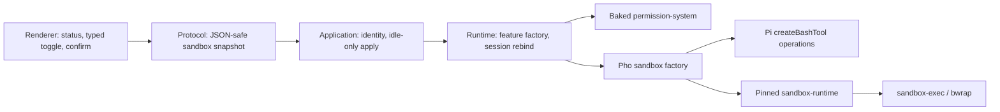

# Agent-tool sandbox research

## Status

**Superseded as the product contract** by [`product.md`](./product.md) and [`implementation-plan.md`](./implementation-plan.md) on 2026-08-16. Kept as candidate research. Do not implement from this note.

Pho Code still does not sandbox Pi tools in source. Renderer `sandbox: true` remains a Chromium UI boundary only.

Last evaluated: 2026-08-16 against:

- Pho Code's pinned Pi SDK `0.84.1` (ships `examples/extensions/sandbox/` using `createBashTool` + `@anthropic-ai/sandbox-runtime`);
- [`anthropic-experimental/sandbox-runtime`](https://github.com/anthropic-experimental/sandbox-runtime) research preview, npm `@anthropic-ai/sandbox-runtime` `0.0.73` (Apache-2.0), updated 2026-08-13;
- [`carderne/pi-sandbox`](https://github.com/carderne/pi-sandbox) `0.6.4` (MIT), which depends on the fork [`@carderne/sandbox-runtime`](https://www.npmjs.com/package/@carderne/sandbox-runtime) `^0.0.70` (Apache-2.0) rather than Anthropic's package.

This note is not an implementation contract. The promoted add-on pins Anthropic’s engine through a Pho-owned factory; it does not add `pi-sandbox`.

## Owner outcome

The owner should be able to let the agent run ordinary workspace `bash` with **operating-system enforcement** of filesystem and network limits, without pretending that Pho Code, Pi, or Electron already contains the runtime.

A first useful product would:

- wrap agent `bash` (and any equivalent `!` / `user_bash` path Pi still exposes) in OS primitives on macOS;
- keep `read` / `write` / `edit` honest: those tools run **inside the Node/Pi process**, so Seatbelt/bubblewrap never sees them unless a separate in-process policy intercepts them;
- degrade or refuse sandboxed execution rather than silently falling back to unsandboxed `bash`;
- stay disableable without breaking conversation, sessions, credentials, V3 review, or the permission feature;
- say plainly what is contained and what is not.

The target is **tool-process containment**, not a public-distribution threat model and not Phase F's "move Pi into another process."

## Why this can be a standalone add-on

[`roadmap-vnext.md` Phase F](../../../version/roadmap-vnext.md) already names runtime isolation. That phase is the larger job: extract the Pi Node runtime, then later evaluate containers/VMs, signing, and a public threat model.

OS-level wrapping of **agent `bash` children** can ship or fail independently of that extraction, the same way the terminal add-on is independent of V3:

- it can be a baked feature with a typed on/off and a small fixed policy;
- missing `sandbox-exec`, `rg`, or `bwrap` can fail that feature while chat continues;
- turning it off must not mutate sessions or the permission config.

It must **not** be described as:

- a sandbox for Pi extensions, skills, or MCP adapters;
- a sandbox for the owner PTY ([`terminal/product.md`](../../../features/terminal/product.md) already forbids that claim);
- a substitute for V3 recovery (the ledger is not a security boundary);
- a substitute for `@gotgenes/pi-permission-system` unless a later product decision explicitly replaces that gate for named tools.

Architecture already defers "tool policy sandbox" and "containment of the Pi runtime or extension code" in [`overview.md`](../../../architecture/overview.md). Promoting this add-on would implement the first of those, not the second.

## What exists today (no OS sandbox)

| Surface | Where it runs | Current gate | Contained? |
| --- | --- | --- | --- |
| Renderer | Chromium with `sandbox: true` | CSP, context isolation, typed bridge | UI process only |
| Pi SDK, extensions, skills | Electron main / Node | source-reviewed baked manifest | No |
| Pi `read` / `write` / `edit` | In-process Node fs | permission-system + V3 capture on write/edit | No OS box |
| Pi `bash` | Child process, app-user authority | permission-system command families | No OS box |
| GitHub MCP | Packaged stdio child | allowlisted tools, PAT in OS secret store | Process exists; not fenced |
| `pho-web` | In-process HTTP from runtime | SSRF/size limits, permission on `web_search` | Not Seatbelt |
| Cursor SDK tools | Cursor local agent path | harness policy; **not** permission-system | No |
| Owner terminal PTY | `node-pty` in Electron main | owner keystrokes = owner authority | Explicitly not a sandbox |
| V3 ledger | Application data | recovery of tracked write/edit | Not containment |

Personal trust policy still applies: the owner trusts selected workspaces and baked code. A sandbox add-on would reduce blast radius of **agent shell**, not make untrusted workspaces or unreviewed extensions safe.

## The two candidates are layers, not alternatives

```text
Pho Code desktop dialogs  (missing today)
        ^
        | structured select/confirm only
pi-sandbox / Pi example extension
        | wrap bash, optionally intercept read/write/edit
        v
sandbox-runtime (Anthropic or carderne fork)
        | wrapWithSandbox(command)
        v
macOS sandbox-exec / Linux bubblewrap + host HTTP/SOCKS proxies
```

### `@anthropic-ai/sandbox-runtime` (engine)

Lightweight OS wrapper for **arbitrary child processes**. Library + `srt` CLI.

- **macOS:** `sandbox-exec` + generated Seatbelt profiles; proxies on localhost ports. No extra OS packages except **ripgrep** for deny-path detection.
- **Linux:** bubblewrap + network namespace + `socat` bridge + bundled seccomp helper; **bwrap, socat, rg** required. Ubuntu 24.04+ may need unprivileged user-namespace policy changes.
- **Windows:** alpha, dedicated `srt-sandbox` user + WFP. Out of Pho Code scope.
- Network is **deny-by-default**, mediated by host HTTP and SOCKS5 proxies. Domain allow/deny, optional TLS terminate/MITM.
- Filesystem: reads are allow-by-default with deny-then-allow; writes are deny-by-default with allow-then-deny. Precedence is **opposite** for read vs write.
- Always-blocked writes include shell rc files, `.git/hooks`, `.git/config`, `.mcp.json`, and similar, even inside `allowWrite: ["."]`.
- Status: **beta research preview**. APIs and config may change. Apache-2.0.

It does **not** know Pi, Electron, or Pho Code. It cannot sandbox in-process `write`/`edit`. It cannot sandbox the Pi Node process unless that whole process is launched under `srt` (that is Phase F-shaped, and breaks the current main-process runtime).

Documented holes that must stay out of defaults:

- `allowUnixSockets` / `allowAllUnixSockets` (Docker socket = host);
- `allowAppleEvents` (launched apps run **outside** the box);
- `enableWeakerNetworkIsolation` / `enableWeakerNestedSandbox`;
- `allowUnauthenticatedSocksProxy` (any local process that finds the port can use it);
- domain allowlists without traffic inspection (`github.com` still allows push/exfil to any repo);
- Linux programs that ignore `HTTP_PROXY` (they just fail closed, or need weaker modes).

`sandbox-exec` is a long-standing Apple tool, not App Store Application Sandbox. It is the same family Claude Code uses. Treat it as best-effort OS policy, not a hypervisor.

### `pi-sandbox` (Pi package)

A published Pi extension (`pi install npm:pi-sandbox`) that:

1. initializes `SandboxManager` from `@carderne/sandbox-runtime`;
2. **replaces** the built-in `bash` tool with a sandboxed `createBashToolDefinition` / operations wrapper;
3. hooks `user_bash` the same way;
4. intercepts `tool_call` for `read` / `write` / `edit` **before** in-process execution;
5. prompts via **`ctx.ui.custom` TUI** with session / project / global allow options;
6. persists project rules to `.pi/sandbox.json` and global rules to `~/.pi/agent/sandbox.json`.

It is the right **shape** for a Pi host: engine + bash wrap + in-process fs policy + interactive grant. It is the wrong **artifact** to bake unchanged.

Hard conflicts with Pho Code:

| pi-sandbox behavior | Pho Code constraint |
| --- | --- |
| `pi install npm:…`, ambient package | Features enter only through `HarnessFeatureManifest`; packaged builds fail closed from app resources |
| Peer `@earendil-works/pi-coding-agent` `^0.80.0`; uses `createBashToolDefinition` | Pin is exact `0.84.1`; shipped example still exports `createBashTool` |
| Depends on `@carderne/sandbox-runtime` with a caret | Exact pin; prefer reviewing Anthropic upstream unless a named fork delta is required |
| `ctx.ui.custom` + `@earendil-works/pi-tui` | Host implements only structured `select` / `confirm` / `input`; custom TUI throws |
| Writes `.pi/sandbox.json` and agent-dir JSON | No generic JSON settings; project overlays already need an explicit trust dialog (permission-system) |
| Session allowances in extension memory | Must follow composite session controllers; rebind on Pi session replacement; never leak across chats |
| Defaults that open browser/Chrome/SSH holes (`allowBrowserProcess`, `allowLocalBinding`, `allowAllUnixSockets`, `allowUnauthenticatedSocksProxy`) | Must not ship as silent defaults; upstream README calls them significant loopholes |
| Hardcodes `enableWeakerNetworkIsolation: true` in `buildRuntimeConfig` | Anthropic documents this as an exfil vector through `trustd` |
| Requires `rg` on the process `PATH` | Electron GUI PATH often lacks Homebrew `/opt/homebrew/bin`; init fails closed |
| Second permission UI beside `@gotgenes/pi-permission-system` | Two ask/deny engines will confuse the owner and can disagree |

The official Pi example is the Pi-team wrap pattern and is now a first-class reference for the promoted add-on:

- public: [earendil-works/pi `examples/extensions/sandbox/index.ts`](https://github.com/earendil-works/pi/blob/main/packages/coding-agent/examples/extensions/sandbox/index.ts)
- pin: `packages/runtime/node_modules/@earendil-works/pi-coding-agent/examples/extensions/sandbox/index.ts` in `0.84.1` (same shape as `main` on 2026-08-16)

It is thinner than `pi-sandbox`: bash-only wrap, `user_bash`, no read/write intercept, no grant prompts, config merge from `~/.pi/agent/extensions/sandbox.json` and `.pi/sandbox.json`. Pho Code takes the wrap, not the JSON/TUI.

### Gondolin / micro-VM (out of first slice)

Pi also ships a `gondolin` example that routes built-in tools into a micro-VM. That is closer to real isolation and closer to Phase F cost. Do not mix it into this add-on.

## Recommended direction if promoted

Reuse the **engine**, not the **package**.

1. **Pin** `@anthropic-ai/sandbox-runtime` to an exact reviewed version (or a named, reviewed fork revision if Anthropic lags a Pi-required patch). Do not take `pi-sandbox` as a transitive caret.
2. **Author a Pho Code inline factory** (or a thin staged package we own) that:
   - wraps `createBashTool(cwd, { operations })` the way the [Pi official sandbox example](https://github.com/earendil-works/pi/blob/main/packages/coding-agent/examples/extensions/sandbox/index.ts) does;
   - hooks `user_bash` if that path is reachable from this host;
   - initializes/resets `SandboxManager` per process with **workspace-scoped** config;
   - uses existing desktop `select` / `confirm` dialogs, never `ctx.ui.custom`.
3. **Do not load** `npm:pi-sandbox`, user-global Pi packages, or project `.pi/sandbox.json` as composition.
4. **Keep permission-system.** First slice should treat OS sandbox as enforcement **after** a tool is allowed, or as a reason to auto-allow only a documented `bash` family **inside** the box. Do not ship two uncoordinated prompt stacks.
5. **Leave in-process `read`/`write`/`edit` to permission-system + V3** until a second milestone adds a Pho-owned path interceptor. Claiming "the agent is sandboxed" while `write` can still touch `~/.ssh` from Node would be a false security claim.
6. **Do not wrap** the owner PTY, `pho-web`, Cursor SDK, or GitHub MCP in the first slice.
7. **macOS first.** Linux remains a compatibility path that needs `bwrap`/`socat`/`rg` packaging or an honest "unavailable" diagnostic. Windows stays out.

### First-slice policy (candidate, not decided)

A small **typed** policy, not a JSON editor:

- filesystem write: selected workspace + a documented temp dir;
- filesystem read: deny `~/.ssh`, `~/.aws`, `~/.gnupg`, and the app credential/agent roots; allow workspace;
- network: deny all **or** a tiny baked allowlist (e.g. nothing by default);
- no Apple Events, no Docker socket, no unauthenticated SOCKS, no `allowedDomains: ["*"]`;
- one Settings toggle: sandbox agent `bash` on / off, idle-only apply;
- optional later: "allow this domain for this session" via the existing confirm dialog, stored in application metadata, never in a project JSON the agent can edit.

Packaging: stage the pinned JS engine plus a **bundled `rg`** (or PATH that the Electron adapter injects). Do not require the owner to `brew install ripgrep` for a GUI app. Linux extras are an explicit OS dependency if that platform is claimed.

## Trust, data, and honesty

Required UI/Settings copy if this ever ships:

- Agent `bash` children are OS-restricted; the Pi process, extensions, MCP, `write`/`edit`, `pho-web`, Cursor tools, and the owner terminal are not, unless a later slice says otherwise and tests it.
- Renderer sandboxing is unrelated.
- Permission dialogs are not the OS box.
- Domain allowlists are not traffic inspection.
- A disabled, missing, or failed sandbox is visible; the product must not imply containment.

Lifecycle:

- `SandboxManager.initialize` at runtime/session start when enabled; `reset` on disable, controller dispose, and app quit.
- Config is workspace-canonical. Switching projects must not keep the previous write-root.
- Session-only grants die with the controller; they are not JSONL and not Pi settings.
- Project-scoped extra allow paths, if ever added, follow the same **explicit trust** pattern as permission-system project overrides. The agent must not be able to grant itself persistence by writing `.pi/sandbox.json`.

V3 interaction: sandboxed `bash` can still mutate the workspace in ways the ledger does not track. Undo remains write/edit-only. Do not advertise sandbox as recovery.

Terminal interaction: owner-typed commands stay unsandboxed. That is correct and must stay disclosed.

## Architecture sketch (if promoted)



Ownership:

- **Electron adapter:** locate bundled `rg` / Linux helpers; inject PATH; never expose `srt` to the renderer.
- **Runtime:** initialize manager, wrap bash operations, diagnostics, dispose.
- **Application:** typed settings, refuse generic path/domain JSON dumps.
- **Protocol:** enabled/degraded/failed, redacted policy summary, no Seatbelt profiles, no proxy ports, no command strings beyond existing tool cards.
- **Renderer:** status and toggle only.

Dependency direction stays `renderer -> protocol <- shell adapter -> application -> runtime -> Pi SDK`. `sandbox-runtime` is a runtime/native-helper dependency, not a renderer import.

## Failure and rollback

- Unsupported platform: feature `degraded` / `failed`; `bash` stays permission-gated and unsandboxed **only if** Settings says sandbox is off or unavailable. If Settings says on and init fails, **do not run** agent `bash` until the owner turns it off or fixes the dependency.
- Missing `rg` / `bwrap`: named diagnostic, same fail-closed rule.
- Proxy or Seatbelt init failure: fail closed.
- Rollback: remove the baked feature in a later build. Historical session JSONL needs no rewrite. Application metadata for session grants can be ignored.

## Verification gates (when an implementation plan exists)

- **Unit:** policy matching, grant vs denyWrite precedence, JSON-safe snapshots, no secret/proxy-port leakage, fail-closed init.
- **Integration:** real Pi `0.84.1` in temp agent/workspace: allowed workspace write via bash, denied `~/.ssh` and denied network, abort/retry after confirm, session switch isolation, dispose/reset.
- **Desktop:** Electron GUI PATH without Homebrew still finds bundled `rg`; dialogs are structured not TUI; Settings honesty; terminal PTY unaffected.
- **Packaged:** macOS `.app` loads engine + `rg` from app resources with no global Pi and no `npm:pi-sandbox`.
- **Adversarial (later, not first slice):** unix socket, Apple Events, proxy-auth bypass, in-process write vs bash write. First slice should document known untested escapes rather than claim hardness.

## Open decisions

1. Standalone add-on now, or wait until Phase F extracts the Pi process?
2. First slice bash-only OS wrap, or bash plus in-process read/write/edit intercept?
3. After a command is inside the box, does permission-system still ask, auto-allow a documented family, or stay as today?
4. Network: deny-all, baked allowlist, or session grants through existing confirm UI?
5. Anthropic package vs carderne fork: which exact revision, and what delta is actually required for Pi `0.84.1`?
6. Bundled `rg` vs documented OS dependency?
7. Linux in the first verified surface, or macOS-only with a Linux diagnostic?
8. May a trusted project add allow-paths, or is policy application-owned only?

## Recommendation

Closed into [`product.md`](./product.md) and [`implementation-plan.md`](./implementation-plan.md). Anthropic engine, Pho-owned factory, no process-extraction wait, macOS first.

## References

- Promoted contract: [`product.md`](./product.md)
- Pho Code [`architecture/overview.md`](../../../architecture/overview.md) security posture
- Pho Code [`architecture/extension-model.md`](../../../architecture/extension-model.md)
- Pho Code [`version/roadmap-vnext.md`](../../../version/roadmap-vnext.md) Phase F
- Pho Code [`features/terminal/product.md`](../../../features/terminal/product.md)
- [Pi official sandbox example on `main`](https://github.com/earendil-works/pi/blob/main/packages/coding-agent/examples/extensions/sandbox/index.ts)
- Pinned Pi `0.84.1` copy of the same example
- [Anthropic sandbox-runtime](https://github.com/anthropic-experimental/sandbox-runtime)
- [Anthropic engineering note](https://www.anthropic.com/engineering/claude-code-sandboxing)
- [pi-sandbox](https://github.com/carderne/pi-sandbox)
- [carderne/sandbox-runtime fork](https://github.com/carderne/sandbox-runtime)
