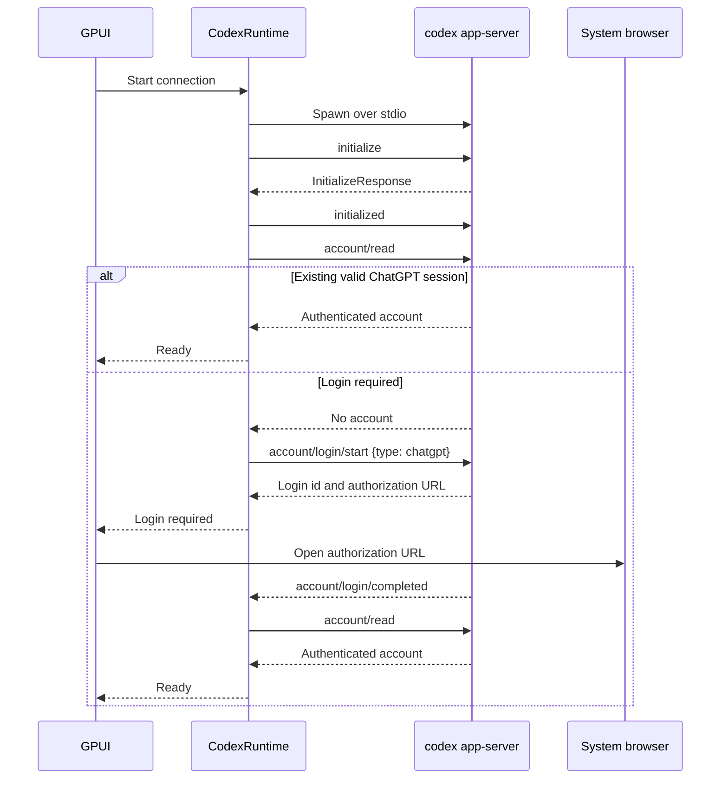

# ADR 0001: Use Codex app-server as the V1 runtime boundary

- Status: Superseded
- Decision date: 2026-07-14
- Scope: Pho Code V1 runtime integration
- Decision owners: Pho Code maintainers
- Source baselines: Codex `393f64565ab46f09d99ca4d9bd973537e72a114b`; Pi `0e6909f050eeb15e8f6c05185511f3788357ddb3`
- Supersedes: Nothing
- Superseded by: [ADR 0002](0002-native-agent-harness.md)

## Decision summary

Pho Code V1 will be a native GPUI client of an external `codex app-server` process using the default stdio JSONL transport. The app will use Codex's account, thread, turn, item, approval, compaction, and multi-agent protocol rather than implementing ChatGPT OAuth, the Codex Responses transport, an agent loop, conversation persistence, compaction, or subagent scheduling itself.

Pho Code will implement a concrete `CodexRuntime` module, not a generic multi-provider interface. The module boundary must be narrow enough that a future native runtime can replace it deliberately, but V1 code and UI will not be generalized for hypothetical providers.

This decision optimizes for a small maintainable application layer while retaining actual Codex behavior. It deliberately does not optimize for a standalone executable with no Codex runtime dependency.

## Context

Pho Code is intended to be a small non-TUI agent application written in Rust with GPUI. It takes inspiration from Codex's capabilities and Pi's restraint, but it has three non-negotiable runtime requirements: ChatGPT subscription authentication, Codex-quality compaction, and stateful subagents.

Those requirements make the runtime boundary the highest-leverage early decision. A desktop shell can remain small only if the complex agent semantics have one clear owner. Splitting authentication, model transport, compaction, persistence, and subagent state across the GUI and a sidecar would create two competing sources of truth and make restart recovery difficult.

The initial repository contains only a GPUI dependency scaffold and a hello-world entry point. Its GPUI git dependencies are currently unpinned in [`Cargo.toml`](../../Cargo.toml#L6), so reproducibility and runtime compatibility still need to be established during implementation.

## Decision drivers

The selected boundary must satisfy the following drivers:

1. Use a ChatGPT subscription without treating API-key billing as equivalent.
2. Preserve Codex authentication refresh and account semantics without exposing tokens to the GUI.
3. Support streamed messages, reasoning, tool calls, file changes, commands, and server-initiated approvals.
4. Preserve thread resume and fork behavior across application and runtime restarts.
5. Inherit Codex's automatic and manual compaction, including durable replacement history.
6. Support real child-agent sessions rather than one-shot parallel prompts.
7. Keep the Rust/GPUI code and dependency graph small enough to understand and evolve.
8. Allow explicit protocol compatibility checks and graceful handling of upstream evolution.
9. Avoid committing V1 to experimental transports or under-development multi-agent APIs.
10. Leave a technically credible path to a future native harness without paying that implementation cost now.

## Evidence

### Pi is a direct model client, not a Codex-agent client

Pi's Codex provider declares a ChatGPT backend and OAuth-based model provider in [`openai-codex.ts`](../../refs/pi/packages/ai/src/providers/openai-codex.ts#L7). Its OAuth implementation contains the OpenAI client ID, authorization and token endpoints, callback URI, device-code endpoints, and scopes in [`utils/oauth/openai-codex.ts`](../../refs/pi/packages/ai/src/utils/oauth/openai-codex.ts#L33).

After login, Pi builds its own Responses request with the complete model-visible context, tool definitions, reasoning settings, prompt-cache key, and streaming options in [`openai-codex-responses.ts`](../../refs/pi/packages/ai/src/api/openai-codex-responses.ts#L481). It resolves requests to the `/codex/responses` path in the same file at [the URL construction logic](../../refs/pi/packages/ai/src/api/openai-codex-responses.ts#L572), parses the stream itself, and supplies account and client headers itself.

Consequently, copying Pi's authentication and transport would connect Pho Code to the model backend, not to the Codex agent runtime. Pho Code would still need to own tool-loop continuation, approvals, persistence, compaction, resume and fork reconstruction, and subagent control.

Pi explicitly states that its core product skips subagents and plan mode in its [coding-agent README](../../refs/pi/packages/coding-agent/README.md#L17). Its smallness is partly the result of a different feature boundary, so “remain as small as Pi” cannot mean copying Pi's complete runtime approach while also requiring Codex's subagents.

Pi remains a valuable source for later study. Its credential store uses restrictive file permissions and cross-process refresh locking in [`auth-storage.ts`](../../refs/pi/packages/coding-agent/src/core/auth-storage.ts#L53), and its agent/session code demonstrates a compact event-driven structure. Those mechanisms become relevant only if Pho Code later owns authentication or a native harness; they are not needed at the V1 boundary.

### App-server is intended for rich Codex clients

The Codex repository describes `codex app-server` as the interface used to power rich clients in the first paragraph of its [app-server README](../../refs/codex/codex-rs/app-server/README.md#L1). The documented top-level primitives are threads, turns, and items, and the lifecycle covers initialization, thread start or resume, turn start, streamed events, interruption, and completion in [the lifecycle overview](../../refs/codex/codex-rs/app-server/README.md#L64).

The protocol is bidirectional and JSON-RPC-like, with the `jsonrpc` field omitted on the wire. Stdio is newline-delimited JSON and is the default transport; WebSocket is explicitly experimental and unsupported in [the protocol section](../../refs/codex/codex-rs/app-server/README.md#L20).

The server uses bounded internal queues and returns retryable overload error `-32001` when saturated, as documented under [backpressure behavior](../../refs/codex/codex-rs/app-server/README.md#L49). That establishes a client responsibility to bound its own queues and retry eligible requests with backoff rather than assuming an infinite event pipe.

The server can generate JSON Schema and TypeScript definitions that match the exact binary version in [the message-schema section](../../refs/codex/codex-rs/app-server/README.md#L55). This provides a versioned protocol boundary without importing Codex's Rust crates into the application.

### App-server owns ChatGPT login

The V2 account protocol supports browser-based ChatGPT login and device-code login in [`account.rs`](../../refs/codex/codex-rs/app-server-protocol/src/protocol/v2/account.rs#L68). It also defines a `chatgptAuthTokens` variant, but the source explicitly marks that path unstable and for OpenAI internal use only at [the variant declaration](../../refs/codex/codex-rs/app-server-protocol/src/protocol/v2/account.rs#L89).

The app-server documentation identifies managed ChatGPT authentication as the recommended mode and states that Codex persists and refreshes its own tokens in [the managed-auth section](../../refs/codex/codex-rs/app-server/README.md#L1919). Pho Code can therefore request login and observe account state without receiving access or refresh tokens. This keeps credential refresh and Codex-home storage under the runtime that already understands their semantics.

The official Codex documentation distinguishes ChatGPT subscription access from API-key usage-based access in the [authentication guide](https://learn.chatgpt.com/docs/auth.md). Supporting only Codex does not justify conflating those billing and policy models.

### App-server exposes the required control surface

The protocol maps thread creation and continuation through `thread/start` and `thread/resume` in [`common.rs`](../../refs/codex/codex-rs/app-server-protocol/src/protocol/common.rs#L482). It maps turn execution and interruption through `turn/start` and `turn/interrupt` in [the same request table](../../refs/codex/codex-rs/app-server-protocol/src/protocol/common.rs#L805).

Manual compaction is available as `thread/compact/start` in [`common.rs`](../../refs/codex/codex-rs/app-server-protocol/src/protocol/common.rs#L583). Automatic compaction remains a runtime concern and can occur before sampling, on a model compatibility change, or during continued execution; the main selection and continuation paths are visible in [`session/turn.rs`](../../refs/codex/codex-rs/core/src/session/turn.rs#L280) and [`session/turn.rs`](../../refs/codex/codex-rs/core/src/session/turn.rs#L798).

Codex persists the exact replacement history and compaction-window state when installing compacted history in [`session/mod.rs`](../../refs/codex/codex-rs/core/src/session/mod.rs#L3022). This is materially stronger than storing only a prose summary and is one reason compaction should remain inside the runtime that also owns resume and fork reconstruction.

Server-initiated requests cover command, file-change, and permission approvals in [`common.rs`](../../refs/codex/codex-rs/app-server-protocol/src/protocol/common.rs#L1468). The app-server [approval documentation](../../refs/codex/codex-rs/app-server/README.md#L1445) states that the client must answer these requests before Codex proceeds. A viable client must therefore handle requests in both directions; a notification-only stream reader would leave the turn waiting indefinitely.

The stable `multi_agent` feature is enabled by default, while `multi_agent_v2` is under development and disabled by default in [`features/src/lib.rs`](../../refs/codex/codex-rs/features/src/lib.rs#L1033). Stable collaboration events map to `CollabAgentToolCall` items in [`event_mapping.rs`](../../refs/codex/codex-rs/app-server-protocol/src/protocol/event_mapping.rs#L75); multi-agent V2 additionally maps `SubAgentActivity` items in [the same mapper](../../refs/codex/codex-rs/app-server-protocol/src/protocol/event_mapping.rs#L181). The current protocol type contains both item shapes in [`protocol/v2/item.rs`](../../refs/codex/codex-rs/app-server-protocol/src/protocol/v2/item.rs#L335). This lets the GUI project child activity without becoming the scheduler or mailbox owner while keeping V1 independent of the under-development event.

### Linking Codex crates would defeat the dependency goal

The in-process `codex-app-server-client` depends on app-server, core, configuration, execution server, protocol, transport, and other internal workspace crates in its [`Cargo.toml`](../../refs/codex/codex-rs/app-server-client/Cargo.toml#L15). Those crates use a workspace package version of `0.0.0`, visible in the Codex workspace [`Cargo.toml`](../../refs/codex/codex-rs/Cargo.toml#L131), rather than presenting a small independently versioned client library.

Importing that workspace graph would couple Pho Code's build, dependency resolution, and release cadence to Codex internals. Speaking JSONL to a separately versioned binary produces a narrower and more observable compatibility surface.

## Decision

### Process boundary

Pho Code will launch or connect to a compatible `codex app-server` process. The initial supported mode is a locally spawned child process using `--listen stdio://` or the equivalent default stdio configuration.

Stdout is reserved for protocol messages. Stderr is captured separately for bounded diagnostic logging and must never be parsed as protocol data. Process exit, EOF, malformed JSON, and incompatible handshake responses transition the runtime connection to an explicit failed or reconnecting state visible to the UI.

Version one may require the user to install a compatible Codex binary. Bundling or downloading a runtime is a packaging decision deferred until the supported operating systems, release channel, update policy, license-notice delivery, and artifact-size goals are known.

### Application boundary

The integration will be represented by a concrete `CodexRuntime` module with responsibilities no broader than:

- discovering and version-checking the runtime;
- starting, supervising, and stopping the child process;
- performing the protocol initialization handshake;
- correlating requests and responses;
- routing notifications and server-initiated requests;
- projecting typed runtime events into application actions;
- exposing account, thread, turn, compaction, and approval operations needed by the UI;
- recovering or failing clearly when the process or protocol becomes unavailable.

The module will not contain GPUI view code, transcript formatting, product navigation, or a second persistence implementation. It will not expose access tokens. It will not pretend to support arbitrary providers.

### Ownership boundaries

| Concern | Codex app-server | Pho Code |
| --- | --- | --- |
| ChatGPT authentication and refresh | Authoritative owner | Initiates login and renders status |
| Model transport and agent loop | Authoritative owner | Starts, steers, or interrupts turns |
| Tool execution and sandbox behavior | Authoritative owner | Selects supported policy and handles approvals |
| Thread, turn, and item persistence | Authoritative owner | Stores only identifiers and UI preferences as needed |
| Automatic and manual compaction | Executes and persists | Requests manual compaction and presents lifecycle |
| Subagent sessions and scheduling | Executes, limits, and persists | Projects the agent tree and child timelines |
| Protocol compatibility | Defines binary-specific schema | Checks version, decodes required methods, tolerates unknown events |
| Desktop experience | Emits structured state | Authoritative owner |

This table is a correctness boundary. A later feature should not move a concern across it accidentally because doing so risks divergent state during restart, resume, compaction, or child-agent execution.

### Connection and login lifecycle

The device-code variant can replace the browser branch when a browser callback is unavailable. Pho Code must correlate completion with the login identifier, support cancellation, and avoid treating the browser opening successfully as proof that authentication completed.

### Thread and event projection

The projection will key authoritative item state by `(thread_id, turn_id, item_id)`. Delta notifications update transient display state, while completed item and turn events establish final status. Unknown notifications are logged at a bounded rate and retained in diagnostics when useful; they do not crash the process reader.

The projection must keep child-thread timelines independent. A collaboration event in a parent may establish a relationship to a child thread, but child items remain keyed to the child. Flattening all child activity into the parent transcript would lose concurrency and lifecycle information.

The projection is reconstructible. On process restart, Pho Code asks Codex to list, read, or resume authoritative threads and rebuilds the UI state. It does not replay prior tool approvals, assume an interrupted command completed, or write a parallel transcript format as the recovery authority.

### Approvals and permissions

Pho Code will never approve command execution, file changes, or permission escalation merely because the request arrived from the local sidecar. The UI must display the action and scope and return an explicit user choice. When optional `availableDecisions` is supplied, the UI uses exactly that set; otherwise it uses only the conservative method-specific fallback tested for the pinned runtime, never an implicit approval.

Pending approval requests are tied to their connection and turn lifecycle. If the process exits or the turn is interrupted, the UI invalidates the pending interaction instead of sending a response to a new process or silently applying a remembered decision.

Persisted “always allow” behavior, if later supported by Codex's protocol, requires a separate product and security decision. It is not implied by this ADR.

### Compaction

Codex remains authoritative for token accounting, compaction selection, summary or encrypted replacement generation, history replacement, window identity, and reconstruction. Pho Code renders compaction item state and may expose the manual `thread/compact/start` operation.

Pho Code must not infer that a compaction completed from a temporary reduction in displayed messages. Completion is driven by the protocol's authoritative item or turn state. The UI should preserve access to the visible transcript while communicating that the model-visible continuation context has changed.

Live acceptance testing must cover repeated automatic and manual compaction followed by process restart, thread resume, and thread fork. A mocked item event verifies the reducer but does not verify durable reconstruction.

### Subagents

V1 targets the stable multi-agent feature and renders its `CollabAgentToolCall` lifecycle. The decoder may understand `SubAgentActivity` and other V2 activity types when present, but no required UI workflow may depend solely on under-development V2 tools or fields.

Each child agent is treated as a thread with its own status and transcript. The UI derives parent-child relationships from thread metadata and collaboration events, exposes bounded status summaries, and allows navigation to the child without taking ownership of agent scheduling.

Codex remains responsible for context forking, active-turn capacity, total-agent and depth limits, mailboxes, interruption, completion delivery, and persisted spawn edges. If a future native harness is pursued, those become explicit runtime requirements rather than optional enhancements.

### Protocol compatibility

The implementation will define and test a supported Codex version policy before release. During development, the app should identify the actual binary, generate or compare its JSON Schema, and fail with an actionable compatibility error if a required method or response shape is missing.

The Rust client should use a small typed surface for required messages and a raw envelope for routing. Exhaustive generated enums tend to reject new upstream variants; routing by method and preserving unknown payloads allows forward-compatible observation without falsely accepting incompatible required fields.

Compatibility tests will use checked-in JSON fixtures for the minimum required flows and at least one live smoke suite against the pinned binary. The fixture source version must be recorded. Updating the binary without updating fixtures and compatibility notes is not a complete upgrade.

## Consequences

### Benefits

- Pho Code inherits the runtime behavior that motivated the product instead of approximating it.
- The application does not handle OAuth secrets or duplicate refresh logic.
- Thread persistence, compaction checkpoints, fork and resume, and subagent state share one authority.
- The Rust dependency graph remains far smaller than an in-process Codex integration.
- Stdio gives a local, inspectable, mockable transport with no listening network port.
- The application can concentrate on a high-quality GPUI state model and interaction design.
- A narrow runtime module preserves an incremental path to a native harness if later justified.

### Costs and constraints

- Pho Code depends on a compatible Codex executable and inherits its runtime footprint.
- App-server protocol evolution can break required messages, so version policy and compatibility tests are mandatory.
- Process supervision, bidirectional RPC, backpressure, and reconnection still require careful implementation.
- A sidecar crash can interrupt active turns or invalidate approvals even when the GUI remains healthy.
- Packaging a polished desktop application may eventually require bundling, locating, updating, or diagnosing the external runtime.
- Pho Code is initially a client and controller for the Codex harness rather than a fully independent agent harness.

The last consequence is intentional. Calling the V1 implementation an independent harness would obscure the ownership boundary and lead maintainers to reproduce runtime behavior piecemeal in the UI.

## Rejected and deferred alternatives

### Port Pi's OAuth and Responses transport

Rejected for V1. This would remove the external binary but require Pho Code to build the missing runtime semantics itself. It would also couple the product to OAuth identifiers, headers, endpoint behavior, and model metadata whose suitability for another client identity is not established by the audited source.

A future native implementation may study Pi's credential locking, streaming parser, event loop, and append-only sessions. It must use an authentication and model-transport contract appropriate for Pho Code rather than assuming source availability establishes product authorization.

### Link `codex-core` or `codex-app-server-client`

Rejected for V1. The crates are part of a large internal workspace graph rather than a small stable client SDK. Linking them would expand compile time, binary size, dependency conflicts, and upstream coupling without removing the need to understand app-server or core evolution.

### Implement a native harness immediately

Deferred. An independent runtime would need to own authentication, streaming Responses state, tool continuation, sandbox and approvals, durable sessions, compaction checkpoints, resume and fork reconstruction, subagent registries and mailboxes, concurrency limits, cancellation, and parent-result delivery.

That work may become appropriate if offline packaging, custom models, runtime extensibility, or removal of the Codex binary becomes a validated product requirement. It is not justified solely by the phrase “our own harness,” because the observable user outcome can be proven first through the smaller client boundary.

### Drive `codex exec` as a subprocess per prompt

Rejected. A one-shot command interface does not provide the bidirectional long-lived event and approval contract needed for an interactive desktop client, nor does it naturally expose the authoritative thread and child-agent projection required by the product.

### Use WebSocket transport locally

Rejected for V1 because the upstream documentation marks it experimental and unsupported. Stdio already satisfies local process isolation and avoids port discovery and listener security concerns.

## Failure and recovery requirements

The implementation plan derived from this ADR must include these cases:

1. Missing Codex binary produces an actionable setup state rather than a blank or crashing window.
2. Unsupported binary version or required protocol mismatch identifies the observed and supported versions.
3. Initialization failure cannot leak queued requests into an uninitialized connection.
4. Malformed stdout is reported and cannot be confused with stderr logging.
5. Overload error `-32001` is retried only for eligible idempotent operations with exponential backoff and jitter; non-idempotent ambiguity is surfaced.
6. EOF or process exit fails outstanding requests exactly once and invalidates pending approvals.
7. Restart rebuilds thread projection from Codex rather than replaying prior commands or approvals.
8. Login cancellation and browser failure return to a recoverable unauthenticated state.
9. Unknown notifications do not crash decoding or grow diagnostics without bounds.
10. UI closure interrupts or detaches according to an explicit policy; it must not orphan a child process accidentally.
11. Child-thread events remain attributed correctly during concurrent parent and child turns.
12. A compaction or subagent failure remains visible and does not fabricate successful completion.

## Security and privacy requirements

- Never request or use the internal `chatgptAuthTokens` login variant.
- Never read, mirror, expose, or log Codex token files or keyring values.
- Treat protocol payloads, prompts, command output, file paths, and reasoning content as potentially sensitive.
- Redact or disable verbose protocol logging by default; diagnostic export requires an explicit user action and documented redaction limits.
- Preserve the approval and sandbox policies supplied to Codex rather than implementing an implicit bypass in the GUI.
- Keep the stdio sidecar local. Any future remote transport requires a separate threat model, authentication design, and ADR.
- Bound stdout and stderr buffers so a noisy or compromised child cannot exhaust application memory.
- Do not pass secrets on a process command line where they can appear in process listings.
- Validate workspace paths and distinguish the UI-selected workspace from any path reported by an untrusted or incompatible message.

## Implementation constraints

The first implementation slice is complete only when it can:

1. locate and validate the intended Codex binary;
2. spawn app-server and complete `initialize` followed by `initialized`;
3. read account state and complete browser or device-code ChatGPT login without exposing tokens;
4. start a thread and stream one turn into a reducer-backed GPUI transcript;
5. receive and answer at least one server-initiated approval request;
6. interrupt an active turn;
7. stop and restart the sidecar; and
8. resume the thread and reconstruct the visible authoritative state.

This is the representative vertical slice. Compaction and subagent UI should build on the same projection rather than introduce separate event systems.

## Validation plan

### Protocol fixtures

Check in sanitized envelopes for initialization, unauthenticated and authenticated account reads, login start and completion, thread start and resume, turn and item deltas, item completion, turn completion, approval requests and responses, compaction items, collaboration items, overload, and unknown notifications.

Fixture tests validate framing, correlation, reducer transitions, unknown-method tolerance, and failure cleanup. They must not be reported as proof that authentication refresh, remote compaction, tool execution, or persisted subagents work against the service.

### Live smoke tests

Against the pinned Codex runtime, verify login reuse, a streamed text turn, a command requiring approval, interruption, runtime restart, thread resume, manual compaction, automatic compaction under a controlled threshold if configurable, fork after compaction, one stable V1 subagent, child completion delivery, and correct attribution of concurrent events.

Any live check that requires a subscription, browser, platform keyring, or external service must document the environment and result. A contributor-run check is evidence supplied by that contributor, not an independently executed CI result unless CI actually ran it.

### Packaging checks

Before distributing the application, verify binary discovery on each supported platform, version diagnostics, code signing and sandbox interaction, child-process cleanup, license notices, update compatibility, and behavior when the Codex binary is removed or upgraded independently.

## Open follow-up decisions

This ADR does not decide:

- whether Pho Code will bundle Codex or require a user-managed installation;
- the exact supported Codex version range and upgrade cadence;
- which operating systems are in the first supported release;
- whether the app attaches to an existing app-server control socket in addition to spawning stdio;
- the default Codex sandbox and approval policies presented by the product;
- whether closing a window interrupts, detaches, or continues an active turn;
- how much reasoning and diagnostic content is displayed or retained in the GUI;
- whether a native harness will ever be implemented.

Each materially affects packaging, security, compatibility, or user-visible behavior and should be resolved through implementation evidence or a dedicated ADR.

## Licensing consequence

Codex is distributed under Apache-2.0, as shown in [`refs/codex/LICENSE`](../../refs/codex/LICENSE#L1). Pi is distributed under MIT, as shown in [`refs/pi/LICENSE`](../../refs/pi/LICENSE#L1). This ADR copies no upstream implementation code.

If later work copies or adapts substantial source, it must preserve applicable notices and satisfy the corresponding license. The build and packaging plan must separately determine which notices are required for an external or bundled Codex runtime and for any code derived from the references.

## Validation status of this decision

The decision is supported by a read-only source audit and by generating the locally installed Codex `0.144.1` app-server schema. No Pho Code integration code or live authenticated behavioral test existed when this ADR was accepted.

The first vertical slice must therefore validate the process and protocol assumptions before the remaining architecture is treated as operationally proven. If the pinned runtime cannot provide the documented account, approval, compaction, or subagent behavior through app-server, stop and revisit this decision rather than silently moving those responsibilities into unrelated UI modules.
