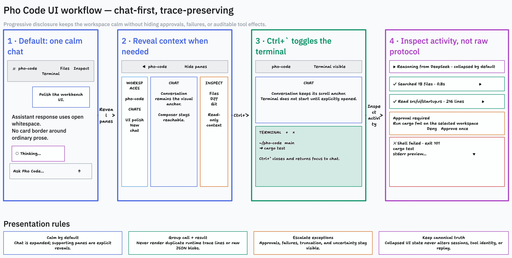

# ADR 0006: Adopt a chat-first native workbench presentation

- Status: Accepted
- Decision date: 2026-07-18
- Scope: Native workbench presentation, transcript disclosure, pane visibility, and terminal reveal behavior
- Decision owners: Pho Code maintainers
- Supersedes: [ADR 0004](0004-native-workbench-phase-6.md) only where it makes four functional regions simultaneously visible by default or leaves transcript disclosure and terminal reveal behavior underspecified
- Also supersedes: [ADR 0005](0005-release-v1-and-defer-phase-6b.md) only where it required Phase 6B to pass before this bounded presentation implementation; Phase 6B instead qualifies the integrated Phase 6C surface before Phase 7 or broader expansion

## Document role

This ADR owns the decision to make chat the only expanded surface for a new workbench profile, reveal navigation/inspection/files on demand, group tool calls and results into progressively disclosed lifecycle rows, and make `Control-backtick` a true terminal visibility toggle with lazy first creation.

It does not redefine agent execution, tool approval, session durability, workspace containment, terminal process authority, or the V1/V2 backend boundary. Current behavior belongs to the amended [GPUI workbench](../architecture/gpui-workbench.md), [native lifecycle](../architecture/native-workbench-lifecycle.md), and [user terminal](../architecture/user-terminal.md) contracts. Delivery belongs to [Phase 6C](../implementation/v2/phase-6c-chat-first-ui-polish.md).

The image is a presentation workflow, not executable evidence. Typed state, accessibility behavior, safety visibility, and acceptance tests in the linked architecture and phase plan remain authoritative.

## Context

V1 `0.1.0` proved a useful native GPUI shell over the shared Pho Code runtime. Its implementation currently projects the four functional regions with strong persistent borders, renders some runtime/tool information as raw standalone transcript cards, keeps an inspection/terminal column visible even when unused, and maps `Control-backtick` to terminal focus rather than terminal visibility.

Those choices expose capability but make the primary task difficult to scan. A coding-agent workbench spends most of its time in one conversation. Navigation, workspace inspection, files, and a user PTY remain important, but they are contextual surfaces rather than equal visual owners at every moment.

The existing architecture already requires canonical assistant-phase grouping, paired tool calls/results, collapsed provider reasoning, stable identities, typed intents, exact approvals, and terminal separation. The desired redesign therefore does not require a new runtime or a TypeScript/Electron rewrite. It requires completing the presentation projection and giving pane visibility an explicit state model.

ADR 0005 moved the remaining native parity, terminal, accessibility, display, and theme qualification to Phase 6B and originally placed that gate before all product expansion. Qualifying the old four-pane presentation and then immediately replacing it would create stale evidence. This decision permits the bounded Phase 6C presentation implementation first, then requires Phase 6B to exercise the integrated final surface. It does not erase or bypass any Phase 6B criterion, and Phase 7 or broader expansion remains blocked until Phase 6B passes.

## Decision

### Chat-first shell

The default `ChatFirstV1` layout profile expands only the selected chat. Navigation, inspection, files, and terminal remain discoverable through labeled toolbar controls, keyboard bindings, accessible names, and persisted user choices.

Chat is structural and cannot be hidden. Revealed context panes participate in bounded resizable groups and never overlay or starve the composer. The workbench keeps the four functional regions accepted by ADR 0004; it changes their default visibility and visual priority rather than removing their capabilities.

New or safely reset preferences use the chat-only default. Migration preserves compatible explicit navigation/file collapse choices where available, starts inspection and terminal hidden, clamps all retained geometry, and never mutates sessions or terminal process state.

### Progressive transcript disclosure

Pho Code does not fully hide agent tools or provider-returned reasoning. It presents them according to safety and recovery value:

- successful read, search, and list activity is collapsed into one concise lifecycle row;
- tool call and result remain separately identifiable canonical records but render as one group;
- provider-returned reasoning is labeled by origin and collapsed by default;
- active work remains visible with semantic status;
- approvals, patch/shell effects, denial, failure, timeout, truncation, stale identity, interruption, and uncertainty are visible without requiring the user to discover hidden state;
- expanding or collapsing a row changes only local presentation preference;
- raw provider/tool payloads are never the primary transcript surface, but bounded structured details and artifact/source access remain available when the canonical contract permits them.

No disclosure rule can imply success before a terminal event, suppress an approval, detach a result from its call, or remove the information required to understand an effect or recover from failure.

### Terminal reveal and lifecycle

`Control-backtick` is an application shortcut that toggles the terminal surface:

1. If hidden with no terminal entry, reveal the surface, obtain valid dimensions, lazily request one terminal, and focus it when ready.
2. If hidden with an existing opening/running/exited/error entry, reveal and focus the selected terminal without recreating or restarting it.
3. If visible, hide the surface and restore the most recent valid non-terminal focus target.

Hiding is presentation-only. It does not close a PTY, send input, signal a process, discard scrollback, or mark cleanup complete. Starting, closing, interrupting, restarting, and application shutdown remain explicit terminal-actor operations. A creation failure leaves the surface visible with a recoverable error instead of disappearing.

### Visual system

The workbench uses semantic layers rather than a bright grid of equal cards. Ordinary assistant text sits directly on the primary chat surface. User prompts, grouped tool lifecycle rows, approvals, errors, and selected controls may use raised surfaces. One-pixel low-contrast separators establish pane boundaries; focus, warning, error, selection, insertion, and deletion retain accessible semantic contrast.

The initial dark profile is based on these roles rather than hard-coded per-view values:

| Role | Initial dark value |
| --- | --- |
| Window background | `#0B0D10` |
| Primary surface | `#111318` |
| Raised surface | `#171A20` |
| Separator | `#272B33` |
| Primary text | `#F2F4F7` |
| Muted text | `#969DA8` |
| Focus/accent | `#7CB7FF` |
| Success | `#72D69D` |
| Warning | `#E5B96B` |
| Error | `#F07C7C` |

These values are starting tokens, not permission to weaken light/high-contrast profiles or encode meaning by color alone.

### Implementation boundary

The redesign remains Rust/GPUI over the current shared runtime. Direct GPUI primitives are the default implementation path. Reusing `gpui-component` resizable panels or virtual lists requires the existing one-GPUI-source compatibility, feature, license, and qualification gate; visual convenience does not permit a second mismatched GPUI revision.

Phase 6C introduces no arbitrary docking system, public panel API, webview shell, second native runtime, provider process adapter, or concurrent agent execution.

### Delivery order

Phase 6C packages 6C.0 through 6C.6 may begin from the released V1 baseline while Phase 6B remains open. Phase 6B then runs its complete parity, terminal, accessibility, display, theme, supported-macOS, and supervised-task matrix against that integrated surface. Phase 6C qualification/evidence closes only with the resulting Phase 6B pass.

This is a sequencing exception for the bounded presentation work defined here, not permission to start compaction, subagents, another backend, portability, signing, distribution, or other later expansion.

## Consequences

- The primary first-run experience becomes calm and conversation-oriented while retaining all accepted workbench capabilities.
- Pane visibility, terminal visibility, focus restoration, and transcript disclosure become typed, testable presentation state instead of incidental render conditions.
- Transcript work must precede visual polish because raw and duplicated tool state cannot be repaired safely with styling alone.
- Existing preferences require an explicit bounded migration; silent reinterpretation of session or terminal truth is prohibited.
- Hidden running terminals continue to consume their documented bounded resources until explicitly closed or application shutdown completes.
- Phase 6B qualifies the integrated Phase 6C surface and remains the prerequisite for Phase 7 or broader expansion. Phase 6C cannot be used to relabel missing V1 native evidence as passed.

## Rejected alternatives

### Rewrite the application in TypeScript/Electron

Rejected. Cursor's web-platform inheritance may make CSS iteration convenient, but Pho Code's problem is incomplete typed presentation over an already shared Rust runtime. A rewrite would duplicate or bridge credential, session, approval, filesystem, Git, and PTY ownership while discarding the current GPUI integration without proving a product benefit.

### Keep all four regions expanded by default

Rejected because capability exposure currently competes with the selected chat, especially before the user requests file, diff, or terminal context. Explicit reveal preserves the capabilities without equal visual weight.

### Hide every tool call and reasoning record

Rejected because approval, exact effect, failure, truncation, interruption, uncertainty, and recovery information must remain inspectable. Progressive disclosure reduces noise without deleting auditability.

### Start the terminal process during application startup

Rejected because a visible-but-unused terminal should not execute shell startup files, allocate a PTY, or consume process resources. First creation follows explicit reveal/start intent.

### Close the terminal whenever its pane is hidden

Rejected because visibility is not process authority. Collapsing a pane cannot silently terminate user work.

### Add an arbitrary docking framework

Rejected for this phase. The accepted regions need bounded reveal, collapse, and resize behavior, not user-authored panel graphs. A docking framework would broaden persistence, migration, focus, accessibility, and recovery scope.

## Reversal conditions

Revisit this decision if native qualification shows the chat-only default makes essential state undiscoverable, if lazy terminal creation cannot preserve the actor's ownership and cleanup guarantees, if grouped lifecycle rows cannot retain exact canonical call/result/approval identities, or if the supported display/accessibility matrix requires a different default profile. Any reversal must preserve canonical runtime truth and be recorded in a later ADR.
