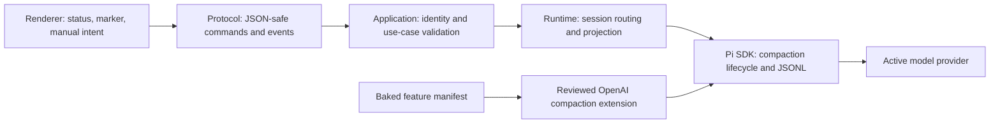
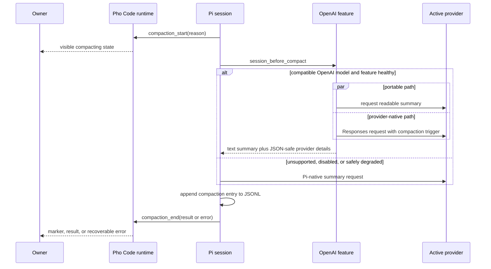

# Compaction

## Status

**Proposed feature design; documentation only.** Pho Code currently inherits Pi-native automatic compaction, but it does not expose compaction lifecycle events or a manual compaction action. This document does not select, pin, package, or enable an OpenAI server-compaction extension.

Last evaluated: 2026-08-14 against Pho Code's pinned Pi SDK `0.84.1` and upstream `pi-openai-server-compaction` `main`, whose package manifest currently reports version `0.1.0` and Pi peer range `>=0.80.9 <0.81.0`.

**OMP research note.** The next compaction pass will learn from Oh My Pi's compaction surface: visible start/end lifecycle, a display transcript that does not restart at the cut, manual `/compact` with optional focus, mechanical shake/pruning before summarization, snapcompact bitmap archives, handoff into a new session, branch summaries during `/tree`, and provider-native Responses compaction with a portable text fallback. OMP is external research and is not a repository submodule. Its ideas must be adapted through Pi's public compaction APIs and baked features rather than by reproducing OMP's agent loop; record an exact upstream URL and revision when that research is promoted.

## Owner outcome

Long-running chats should continue after their active model context becomes crowded without silently discarding the state needed to finish the task. The owner should be able to tell when compaction happens, distinguish provider-native continuity from a portable text summary, request compaction deliberately, and understand the privacy and cost consequences.

For supported OpenAI models, the intended direction is a hybrid compaction path:

- retain a readable Pi text summary so Pi JSONL sessions remain portable and useful across resume, model changes, future fork/tree operations, and non-OpenAI providers;
- additionally use OpenAI's Responses compaction protocol when compatibility, privacy, and live verification gates are satisfied;
- fall back to Pi-native compaction without making ordinary conversation depend on provider-native opaque state.

The target is continuity with explicit ownership and recovery semantics. It is not a second transcript format or a Pho Code-owned agent loop.

## Non-goals

The first promoted slice will not:

- replace Pi JSONL as transcript authority;
- parse, edit, or claim to understand OpenAI's opaque compaction artifacts;
- enable ambient global or project extensions;
- expose arbitrary extension paths, package installation, provider payload JSON, or generic settings;
- make fork/tree navigation part of the compaction implementation unless that lifecycle is promoted separately;
- promise identical context, cost, or recall across providers;
- treat encrypted or opaque provider state as a backup of the readable transcript;
- change models automatically as part of compaction.

## Current behavior

Pho Code creates production sessions through Pi's normal services and does not override the production compaction setting. In pinned Pi `0.84.1`, automatic compaction is enabled by default unless the effective Pi settings disable it. Pi normally triggers threshold compaction when:

```text
contextTokens > contextWindow - reserveTokens
```

The pinned defaults are a `16,384`-token response reserve and approximately `20,000` recent tokens retained. Pi may also compact after an overflow and retry the interrupted model operation.

Pi writes a `compaction` entry to the authoritative session JSONL. That entry contains a readable summary, the first retained entry ID, the estimated pre-compaction token count, optional summarization usage, and extensible JSON-safe details. Subsequent model context is reconstructed from the summary plus retained recent messages; the earlier transcript remains in the JSONL tree.

Pho Code currently has four important limitations:

- deterministic test sessions explicitly disable compaction, so existing desktop tests do not prove a real compaction path;
- `compaction_start` and `compaction_end` events are accepted by the Pi subscription but ignored by the runtime projection;
- `compactionSummary` messages are omitted from the rendered transcript;
- there is no typed manual-compaction command, progress state, cancellation action, or visible compaction marker.

Changing the session model resends existing turns as ordinary context and deliberately does not compact or fork automatically.

## Proposed provider policy

Provider selection changes how compacted context can be reused, so the behavior must be explicit rather than described as one universal algorithm.

| Active model family | Proposed compaction path | Portable Pi summary | Provider-native artifact | Initial support posture |
| --- | --- | --- | --- | --- |
| `openai-codex/*` | Hybrid Pi summary plus compatible OpenAI Responses compaction history | Required | Candidate | Preferred first OpenAI evaluation because the candidate preserves Pi's built-in Codex transport |
| direct `openai/*` Responses models | Hybrid path, potentially including stored Responses continuity and a custom stream | Required | Candidate | Blocked on explicit data-retention acceptance and Pi `0.84.1` compatibility |
| Azure OpenAI | Pi-native | Required | None initially | Excluded until endpoint, auth, retention, and live behavior are independently verified |
| non-OpenAI or unsupported models | Pi-native | Required | None | Supported fallback |
| unknown or changed model | Pi-native | Required | Do not replay | Fail closed against cross-model provider-state reuse |

Provider-native state must be replayed only when the provider, model family, request shape, and stored artifact version are compatible. Switching away from OpenAI must leave the portable Pi summary sufficient for the next model. Switching back must reconstruct compatible state from the session entry rather than trusting stale memory.

## Candidate OpenAI extension

[`algal/pi-openai-server-compaction`](https://github.com/algal/pi-openai-server-compaction) is the current design candidate. Its documented architecture keeps two representations:

1. a portable Pi text summary stored through Pi's normal compaction entry;
2. OpenAI-native replacement history stored under `CompactionEntry.details.remoteCompaction` for compatible future Responses calls.

For direct `openai/*` models, the candidate also documents `store: true`, `context_management`, optional `previous_response_id` continuity, and a WebSocket transport with HTTP fallback. For `openai-codex/*`, it preserves Pi's built-in Codex transport and injects reconstructed remote-compaction history only after compaction boundaries. See the upstream [README](https://github.com/algal/pi-openai-server-compaction#readme) and [architecture](https://github.com/algal/pi-openai-server-compaction/blob/main/ARCHITECTURE.md).

The candidate is not ready to enter the Pho Code manifest:

- upstream labels it experimental and recommends a reversible project-local trial;
- its current peer range is Pi `>=0.80.9 <0.81.0`, which excludes Pho Code's pinned Pi `0.84.1`;
- its package requires Node `>=22`, which must be checked against the Electron-embedded Node runtime rather than the developer's interactive shell;
- it is currently a private package manifest loaded from source rather than a published immutable release artifact;
- its direct OpenAI path changes request retention and transport behavior beyond compaction itself;
- its reported benchmark indicates a continuity advantage with material token, billed-context, variability, and reliability qualifications; it is evidence for evaluation, not an acceptance result for Pho Code;
- compaction usage stored in extension details is documented as not yet included in Pi session statistics.

The upstream source is MIT-licensed. Promotion therefore requires either an upstream release compatible with the pinned Pi version or a narrowly reviewed and attributed Pho Code adaptation, plus the repository's normal attribution and third-party-notice updates. Removing a peer-range check without auditing the changed Pi APIs is not compatibility work.

## Architecture and ownership

Compaction remains inside the existing dependency direction:



Ownership remains:

- **Pi SDK:** decides native threshold/overflow behavior, builds active context, owns `AgentSession.compact()`, writes compaction entries, and keeps session JSONL authoritative.
- **Baked OpenAI feature:** may customize Pi's compaction hook and provider request path for explicitly supported OpenAI models. It must not become a parallel transcript manager.
- **Runtime:** routes commands to the exact composite session, projects lifecycle state, clears stale per-session extension state on replacement, and normalizes failures.
- **Application:** validates workspace/session identity and refuses manual actions against missing, replaced, or incompatible sessions.
- **Protocol:** carries bounded summaries of compaction state; it never carries opaque artifacts, provider authorization, raw request payloads, or full summaries unless the UI explicitly needs them.
- **Renderer:** shows status and sends typed intent. It does not calculate cut points or mutate session files.

The extension, if selected, must be an immutable app-owned feature loaded only through `HarnessFeatureManifest`. Production must not read the user's global Pi package installation or a workspace extension path. Typed settings may change only behavior intentionally supported by Pho Code.

## Compaction flow

The proposed flow preserves one authoritative session operation:



Manual and automatic compaction must converge on the same Pi lifecycle. Pho Code should call the pinned public `AgentSession.compact(customInstructions?)` API for a manual request rather than reproducing cut-point or summary logic. A manual request against an active run follows Pi's documented abort-before-compact behavior and must be presented honestly before implementation is accepted.

## Data and privacy

Three locations must be distinguished:

| Data | Owner | Location/lifetime | User consequence |
| --- | --- | --- | --- |
| Full transcript and readable compaction summary | Pi | App-owned session JSONL until the chat is moved to OS Trash | Locally inspectable and portable; remains authoritative |
| Opaque OpenAI compaction artifact and compatibility metadata | Pi entry populated by baked feature | `CompactionEntry.details` in the same JSONL lifetime | Not human-readable; useful only to compatible provider turns |
| Live response IDs, reconstructed replay state, and optional socket state | Baked feature | Memory owned by one session controller | Must be cleared on lifecycle boundaries and never transferred between chats |
| Direct OpenAI stored Responses state | OpenAI | Provider-controlled retention when `store: true` is used | Conversation data is retained server-side under provider policy |

The direct `openai/*` path cannot ship under the label “compaction only” if it enables `store: true` for ordinary turns. That changes external retention and must receive an explicit product decision, an owner-facing disclosure, and verification against the authentication method in use.

Moving a chat to OS Trash moves the local JSONL and its opaque artifact, but does not delete provider-retained Responses state. Pho Code must not imply that local Trash performs remote deletion. Archive and restore preserve the same JSONL and therefore preserve compatible artifacts without creating a second copy owned by application metadata.

Diagnostics may report provider family, artifact version, reason, token estimates, success/fallback, and redacted error class. They must not expose opaque artifacts, response IDs, request headers, tokens, cookies, complete prompts, or authorization data to the renderer or general logs.

## Session lifecycle

Compaction state belongs to the composite `{workspaceId, sessionId}` controller. Background sessions may compact while another chat is selected; their events must update only their own activity and snapshot.

Any provider-native transient state must be cleared or reconstructed on:

- session creation, open, resume, and reload;
- Pi-internal session replacement;
- future fork, clone, branch, or tree navigation;
- model or provider change;
- successful, failed, or aborted compaction;
- controller eviction and application shutdown.

An application restart reconstructs only from validated JSONL entries. A cached response ID or socket is never durable truth. Unknown artifact versions remain preserved in Pi JSONL but are ignored for provider replay.

## User-visible contract

The first promoted UX should remain conversation-centered:

- show a compact in-progress state when Pi emits `compaction_start`, including whether the reason is manual, threshold, or overflow;
- settle it from `compaction_end` with success, aborted, fallback, or failure state;
- add a transcript boundary marker without replacing or pretending to display the full provider-native artifact;
- update context usage after compaction; `tokens` and `percent` may correctly be unknown until the next model response;
- offer one typed **Compact context** action with optional bounded instructions only if those instructions materially help the owner;
- explain that compaction is lossy for active model context while the full Pi transcript remains in JSONL;
- explain provider-native use and server retention before enabling any direct OpenAI path that requires stored Responses.

The UI must not claim that compaction reduces cumulative session cost or deletes older messages. It changes the context sent to later model requests; cumulative usage and the full persisted transcript remain separate concepts.

## Failure and rollback

Ordinary chat must not become unusable merely because the OpenAI-specific feature is unavailable.

- Unsupported provider/model: use Pi-native compaction.
- Missing or mismatched packaged feature: report a named diagnostic and use Pi-native compaction if runtime composition can safely continue.
- Remote artifact request fails while a valid portable summary succeeds: persist/use the portable summary and report degraded OpenAI continuity.
- Portable summary fails: preserve the pre-compaction session path and surface the Pi compaction failure; do not append a fabricated success marker.
- Unknown or corrupt remote details: ignore them for replay, retain the JSONL entry, and use the readable summary.
- Model changes during or after compaction: do not replay incompatible provider state.
- Application quits during compaction: use Pi's bounded abort/dispose lifecycle and re-read JSONL on restart; do not repair session files speculatively.

Rollback means removing or disabling the baked provider-native behavior in a later app build while continuing to read the portable Pi summary. Existing opaque details may remain in historical JSONL and must be harmless when ignored. Rollback must not require rewriting every session.

## Promotion and verification gates

No implementation should begin until the owner approves an implementation plan that resolves the open decisions below. Promotion must name an exact upstream revision or adapted source revision, license, reviewed files, Pi compatibility range, packaged assets, and rollback mechanism.

Required evidence for acceptance:

- **Unit verified:** provider/model classification, artifact-version validation, cross-model rejection, event projection, JSON safety, and error redaction.
- **Integration verified:** real pinned Pi `0.84.1` sessions in isolated temporary agent/workspace roots cover threshold, overflow, manual, repeated, aborted, failed, resume/reload, and model-switch behavior.
- **Desktop verified:** visible progress/settlement, background-chat isolation, manual action, context-usage reset, archive/restore, and failure presentation work in Electron.
- **Packaged verified:** the selected feature loads only from app-owned resources with no global Pi installation, and missing/mismatched resources fail as designed.
- **Real-provider verified:** separate `openai-codex/*` and direct `openai/*` journeys demonstrate post-compaction continuity, request/retention behavior, usage reporting limits, restart, model switch away/back, and safe fallback.

The upstream benchmark may inform the decision, but it does not replace Pho Code verification against its pinned SDK, provider auth paths, session registry, or packaged application.

## Open decisions

1. Should the first provider-native release target only `openai-codex/*`, or also direct `openai/*`?
2. Is provider-side storage through `store: true` acceptable for direct OpenAI turns, and what disclosure or opt-in is required?
3. Will compatibility come from an upstream Pi `0.84.1` release or a narrow Pho Code-maintained adaptation?
4. Should automatic provider-native compaction be always on for compatible models, or controlled by one typed feature setting?
5. Should manual compaction accept custom instructions in the first UI, or begin as a single confirmation-free action while idle?
6. How should provider-native compaction usage be shown until it is included in Pi's aggregate session statistics?
7. What exact local and provider-side deletion guidance is possible for stored Responses data?

## References

- Pho Code [architecture overview](../architecture/overview.md)
- Pho Code [extension model](../architecture/extension-model.md)
- Pho Code [future-release roadmap](../version/roadmap-vnext.md)
- Pinned Pi `0.84.1` compaction documentation in `packages/runtime/node_modules/@earendil-works/pi-coding-agent/docs/compaction.md`
- [`pi-openai-server-compaction` README](https://github.com/algal/pi-openai-server-compaction#readme)
- [`pi-openai-server-compaction` architecture](https://github.com/algal/pi-openai-server-compaction/blob/main/ARCHITECTURE.md)
- [`pi-openai-server-compaction` package manifest](https://github.com/algal/pi-openai-server-compaction/blob/main/package.json)
- [`pi-openai-server-compaction` test plan](https://github.com/algal/pi-openai-server-compaction/blob/main/TESTPLAN.md)
- [`pi-openai-server-compaction` validation record](https://github.com/algal/pi-openai-server-compaction/blob/main/VALIDATION.md)
