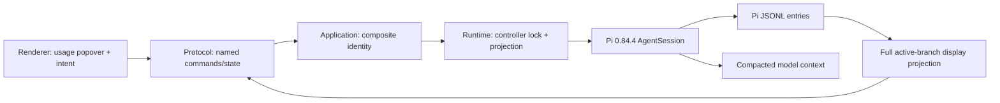

# Context compaction implementation plan

## Status and use

Owner-promoted implementation plan for the **context compaction** add-on (2026-08-20). This is the implementation contract, not acceptance evidence. Pi-native automatic compaction exists today; the Pho Code projection, display transcript, manual action, and cancellation described here do not.

Read [`product.md`](./product.md), [`../../architecture/runtime-and-data.md`](../../architecture/runtime-and-data.md), [`../../architecture/protocol-and-ipc.md`](../../architecture/protocol-and-ipc.md), [`../../ui/implementation/conversation-ui.md`](../../ui/implementation/conversation-ui.md), and the accepted bounded-Stop contract under [`../../archive/urgent/agent-stop`](../../archive/urgent/agent-stop/README.md) before implementation.

This add-on is independent of session tree/fork and the integrated terminal. Do not add either to its milestones.

Milestones 3–4 (Pho cutover: budget signal, notes, history lookup, cutover hook) were owner-promoted on 2026-09-01 under the backend strategy matrix in [`product.md`](./product.md) and [`logs/2026-09-01-pho-cutover-strategy.md`](./logs/2026-09-01-pho-cutover-strategy.md). They are gated on Milestone 2 acceptance and must not start against an unaccepted projection.

## Global acceptance rules

Every milestone must:

- preserve `renderer -> protocol <- shell adapter -> application -> runtime -> Pi SDK`;
- treat installed Pi `0.84.4` `.d.ts` and `.js` as the compaction API authority; bundled prose that describes another entry shape is not the pin;
- keep Pi responsible for thresholds, cut points, summary requests, entries, context rebuilding, overflow recovery, and retry;
- keep the renderer free of Pi entries, runtime objects, filesystem paths, provider payloads, and opaque artifacts;
- key commands, events, locks, state, and snapshot updates by `{workspaceId, sessionId}`;
- serialize manual compaction per controller and refuse concurrent/manual-busy calls before `AgentSession.compact()`;
- tolerate valid unpaired, repeated, late, and stale Pi compaction events rather than assuming a perfect start/end pair;
- keep the full active-branch display transcript separate from Pi's compacted `session.messages` model context;
- use persisted Pi entry ids for new transcript and compaction-marker identity, with compatibility for existing assistant-rewrite overlays;
- bound summary detail, error text, event payloads, and transcript projections and assert JSON safety;
- keep cumulative usage separate from current-context use and allow context tokens/percent to be unknown;
- add no provider-native extension, request override, transport, storage behavior, or settings in the acceptance milestones;
- distinguish unit, integration, desktop, packaged, owner-verified, and unverified evidence;
- update architecture, development, conversation UI, current state, and workstream logs only when the corresponding behavior lands; do not mark accepted before the final gate;
- (M3–M4) keep Pi the owner of cut points, split turns, entry append, context rebuild, and overflow retry; the Pho hook supplies only summary content through the documented `session_before_compact` extension point;
- (M3–M4) fall back to Pi's default summarizer whenever the notes file is empty, for every trigger reason; never perform a no-summary, no-fallback cutover;
- (M3–M4) treat notes and history tool output as untrusted bounded model data; history tools are read-only over the active branch.

## Pinned Pi facts that shape the design

The following are implementation constraints, not loose upstream inspiration:

- `AgentSession.compact(customInstructions?)`, `abortCompaction()`, `isCompacting`, `isIdle`, `getContextUsage()`, and compaction events are public in `0.84.4`.
- Automatic defaults are enabled, `reserveTokens: 16384`, and `keepRecentTokens: 20000`; the threshold comparison is strict `>`.
- Manual compaction works even if automatic compaction is disabled.
- `compact()` aborts the current agent operation before validating and summarizing. Pho Code therefore refuses manual requests unless the session is idle.
- The summary is another active-provider request. It uses the current model/thinking level, a fresh routing session id, no prompt-cache retention, and Pi's bounded summary-output policy.
- `compaction_start`/`compaction_end` carry live reason, result, abort, retry, and optional error information. The persisted entry does **not** store reason, `estimatedTokensAfter`, failed/aborted attempts, or `willRetry`.
- Manual start occurs before all validation. Some automatic early failures emit nothing. A repeated overflow-recovery failure can emit `compaction_end` without a preceding start. Reducers must settle from authoritative end events even when no matching start was observed.
- A successful silent-overflow response may compact without retry; `willRetry` belongs to the event, not to the reason alone.
- Installed `CompactionEntry` uses `firstKeptEntryId`; bundled `docs/session-format.md` mentions a newer `retainedTail` form that is absent from installed types/implementation. Do not code to that prose.
- Pinned `compact()` has no safe reentrancy guard: concurrent calls can replace its shared abort controller. Pho Code must provide the guard. Track upstream [issue #7738](https://github.com/earendil-works/pi/issues/7738), but do not wait for an upgrade in this slice.
- (M3–M4) `pi.registerTool()` is the same public mechanism the trash/web/retrieval/sandbox features already use; tool definitions carry `promptGuidelines` that teach the notes discipline without harness prompt surgery.
- (M3–M4) `session_before_compact` fires for every trigger (`manual`/`threshold`/`overflow`) with `preparation.firstKeptEntryId`, `preparation.tokensBefore`, and `willRetry`; a handler may return a custom compaction (`fromHook`, JSON-safe `details`) or decline. Characterization must prove that declining lets Pi's default summarizer proceed.
- (M3–M4) the `context` event fires before each LLM call with mutable messages; characterization must prove mutations affect only the outgoing request, not persisted JSONL, and measure banded-injection prompt-cache impact.
- (M3–M4) `ctx.sessionManager` is a `ReadonlySessionManager` (`getBranch`/`getEntries`/`getEntry`/`getTree`); history tools read the active branch only.
- (M3–M4) because pinned `compact()` aborts the current operation, a model-requested cutover is two-phase: a generation-checked controller flag plus compaction at turn settle, never a reentrant mid-run call.

## Architecture



| Layer | Owns | Must not own |
| --- | --- | --- |
| `packages/ui` | Usage-popover action/state; transcript boundary and bounded summary disclosure; accessible progress/error/cancel | Pi settings, thresholds, JSONL parsing, provider payloads |
| `packages/protocol` | JSON-safe inputs, lifecycle/result projections, transcript-item union, bounds, named bridge methods/events | Pi types, arbitrary `details`, full session files |
| `packages/application` | Workspace/session identity, command routing, stable error mapping | Electron, Pi, transcript reconstruction |
| `packages/runtime` | Manual-operation guard, Pi calls/events, full-branch display projection, summary lookup/redaction, controller lifecycle | Electron, React, a second summary algorithm |
| `apps/desktop/electron` | Fixed IPC/preload methods and sender validation | Compaction policy or provider logic |
| Pi SDK | Automatic/manual compaction, summary provider request, entry append, context rebuild, overflow retry | Pho Code view state |

### Why display projection must change

Today `buildSnapshot()` projects `session.messages`. After compaction, that array is the reduced LLM context: compaction summary plus retained/post-boundary messages. `projectMessages()` also drops `compactionSummary`. The visible transcript therefore loses summarized earlier turns.

The accepted implementation builds two explicit views:

```text
Pi model input  = session.messages / SessionManager.buildSessionContext()
Pho display     = SessionManager.getBranch() projected in chronological order
```

The display projector follows only the active branch, not abandoned branches. It renders ordinary message entries with the current tool/result grouping and hidden Plan-execute filtering, skips non-display metadata, and inserts a `compaction` transcript item for every successful Pi compaction entry on that branch. It does not feed the full display list back into Pi.

### Stable identity and rewrite compatibility

New display message ids use the underlying Pi `SessionMessageEntry.id`; boundary ids use `CompactionEntry.id`. This prevents ids from changing when Pi rebuilds compacted context.

Existing `pho-code.assistant-rewrite` entries may refer to legacy `role:timestamp:index` ids. During migration/projection:

1. prefer an overlay keyed by the persisted Pi entry id;
2. calculate the legacy id using the same branch/message ordering used before the migration and accept that key as fallback;
3. write all new overlays with the Pi entry id;
4. do not rewrite historical JSONL entries merely to migrate ids.

Focused tests must prove that an existing rewritten assistant turn remains rewritten before and after compaction and reopen.

## Protocol contract

Add a dedicated `compaction.ts` contract and export it from the protocol package. Exact property names may tighten during implementation; the ownership and bounds may not.

### Commands

| Command | Input | Result |
| --- | --- | --- |
| `compactSession` | `{ workspaceId, sessionId }` | `SessionSnapshot` after the manual operation settles |
| `cancelSessionCompaction` | `{ workspaceId, sessionId }` | `void` acknowledgement; settlement arrives by event/snapshot |
| `getCompactionDetail` | `{ workspaceId, sessionId, compactionId }` | `CompactionDetail` for an entry on the target's active branch |

Do not add custom instructions, threshold values, provider flags, `setAutoCompaction`, `invokePi`, a generic session operation, or a renderer-supplied session-file path.

### Snapshot state

```ts
type CompactionReason = "manual" | "threshold" | "overflow";

interface SessionCompactionState {
  status: "idle" | "compacting";
  reason?: CompactionReason;
  startedAt?: string;
  cancelable: boolean;
}
```

`SessionSnapshot.compaction` is always present after the protocol addition. A reconstructed session starts idle. `cancelable` is true for a Pho Code-initiated manual operation; automatic compaction is cancelled through the owning run's existing Stop path.

### Transcript item

Replace the snapshot's message-only display list with a compatible union:

```ts
interface TranscriptCompactionBoundary {
  kind: "compaction";
  id: string;
  createdAt: string;
  reason?: CompactionReason;
  tokensBefore: number;
  estimatedTokensAfter?: number;
  hasSummary: boolean;
}

type TranscriptItem =
  | ({ kind: "message" } & TranscriptMessage)
  | TranscriptCompactionBoundary;
```

If changing `SessionSnapshot.messages` would cause unnecessary migration churn, retain the field name but change its element type to `TranscriptItem`; do not create parallel full and compacted transcript arrays. Reducers and UI grouping must branch on `kind` before `role`.

Persisted markers usually omit `reason` and `estimatedTokensAfter`, because Pi does not store them. The runtime may enrich the just-observed marker in memory while that controller is resident, keyed by compaction entry id. It must not attach live data to the wrong entry by assuming that every end has a start.

### Detail result

```ts
interface CompactionDetail {
  workspaceId: string;
  sessionId: string;
  compactionId: string;
  summary: string;
  truncated: boolean;
  tokensBefore: number;
  estimatedTokensAfter?: number;
}
```

The runtime resolves `compactionId` against the target controller's current active branch and rejects non-compaction, missing, abandoned-branch, or cross-session ids. It returns no Pi `details`, raw usage object, filesystem path, provider artifact, or response id.

### Events

Add one sequenced, session-scoped event:

```ts
interface CompactionStateChangedPayload {
  compaction: SessionCompactionState;
  outcome?: "succeeded" | "aborted" | "failed";
  reason?: CompactionReason;
  tokensBefore?: number;
  estimatedTokensAfter?: number;
  willRetry?: boolean;
  error?: HarnessError;
}
```

Start projects `compacting`. End always settles to `idle`, even if no start was observed. Success/abort/failure is derived from Pi's explicit `result`, `aborted`, and `errorMessage` fields, not text matching. On success, emit or follow with an authoritative session snapshot so transcript items, context use, cumulative usage, and activity reconcile.

Late events from a disposed/reopened controller must fail its generation check. A stale start must not replace a newer idle snapshot.

### Bounds

| Value | Bound | Behavior |
| --- | --- | --- |
| ids | existing non-empty protocol id bound | reject malformed/cross-owner values |
| summary returned by detail | 64 KiB UTF-16 code units | truncate at a valid string boundary and set `truncated` |
| live error message | existing `HarnessError` bound | redact and truncate |
| token estimates | finite safe non-negative integer | omit invalid values; never coerce opaque data |
| Pi `details` | never projected | ignore unless a future named feature defines a schema |

## Runtime lifecycle and serialization

Add controller-owned manual state, not a process-global promise:

```ts
interface ManualCompactionOperation {
  startedAt: string;
  promise: Promise<unknown>;
  cancelRequested: boolean;
}
```

`compactSession` sequence:

1. Resolve the exact controller from `{workspaceId, sessionId}`.
2. Under the controller lifecycle lock, reject if a manual operation exists, `session.isCompacting`, `!session.isIdle`, an active run is unsettled, a replacement/rebind is running, or no model is selected.
3. Install the operation record before calling Pi so a second command cannot pass the guard.
4. Call `session.compact()` with no custom instructions. Do not create an `ActiveRun` or fake run id.
5. Reconcile outcome primarily through Pi events, but also catch/reconcile the returned promise so a missing event cannot leave the lock stuck.
6. Clear the operation only if it is still the same operation generation.
7. Publish an authoritative snapshot and background activity.

`cancelSessionCompaction` resolves the same controller, requires an active manual operation, sets `cancelRequested`, and calls `abortCompaction()`. It is idempotent after the first signal. It does not call `abortRun`, cancel queues, or abort another session.

Automatic compaction never installs a manual operation. Pi events still update `SessionCompactionState`; the existing active run remains the settlement authority. `compaction_end` must not call `finishRun`.

### Activity, archive, removal, replacement, and shutdown

- Manual compaction counts as `working` for session activity and protects the controller from idle eviction.
- Archive remains metadata-only and may hide a manually compacting chat while its Archived row stays working.
- Prepare/remove session treats `isCompacting`, a manual operation, or non-idle Pi state as busy.
- Session replacement invalidates the old operation generation, unsubscribes, and publishes the replacement's authoritative idle state.
- Disposal calls `abortCompaction()` and observes the manual promise only within the existing bounded aggregate deadline. It never waits without a bound or repairs JSONL.
- Restart reconstructs successful markers from Pi entries and clears all transient start/reason/error state.

## Failure semantics

| Condition | Required behavior |
| --- | --- |
| Concurrent manual request | Typed `session_busy` / already compacting; never call Pi twice |
| Busy run, retry, queue, auto-compaction, or branch summary | Refuse manual request; owner can Stop or wait |
| No model/auth | Recoverable named error; no marker |
| Already compacted / nothing to compact | Recoverable explanation; state returns idle; no fabricated marker |
| Extension cancels | Outcome `aborted`; no success marker beyond any entry Pi actually wrote |
| Pi end without start | Settle current projection and snapshot; do not underflow a counter or ignore the event |
| Start without end because controller dies | Replacement/restart snapshot returns idle; bounded disposal aborts |
| Overflow compaction succeeds with `willRetry` | Keep run working; show compaction success while Pi continues the run |
| Silent overflow succeeds without retry | Honor `willRetry: false`; do not infer retry from reason |
| Summary request fails | Redacted recoverable compaction error; preserve display branch and ordinary chat |
| Detail id is stale/abandoned/cross-session | Reject; do not expose another branch/session summary |
| Malformed/unknown `details` | Ignore and preserve in Pi JSONL; never send to renderer |

## File ownership (intended)

| Path | Change |
| --- | --- |
| `packages/protocol/src/compaction.ts` (new) | State, events, detail, validators, bounds |
| `packages/protocol/src/conversation.ts`, `events.ts`, `version.ts`, `bridge.ts`, `index.ts` | Transcript union, snapshot field, named commands/event |
| `packages/runtime/src/transcript.ts` | Full active-branch display projector, stable ids, marker projection |
| `packages/runtime/src/assistant-rewrite.ts` | Stable-id write and legacy overlay fallback |
| `packages/runtime/src/pi-runtime.ts` | Controller manual guard, commands, event projection, detail lookup, activity/lifecycle |
| `packages/runtime/src/harness-runtime.ts` | Runtime interface additions |
| `packages/application/src/bootstrap.ts` | Composite-identity validation and delegation |
| `apps/desktop/electron/ipc.ts`, `preload.ts`, `main.ts` | Fixed commands and event forwarding only |
| `packages/ui/src/composer-usage.tsx` | Compact/cancel action and honest current-vs-cumulative copy |
| `packages/ui/src/transcript.tsx`, `lib/work-log.ts` | Boundary rendering and grouping around boundaries |
| `apps/desktop/src/App.tsx`, renderer bridge/reducer helpers | Keyed state/event routing and command wiring |
| `packages/runtime/test/*compaction*.test.ts` | Pinned-Pi integration and display projection |
| `packages/protocol/test/protocol.test.ts` | Validation/reducer/JSON-safety coverage |
| `apps/desktop/tests/compaction.spec.ts` (new) | Electron lifecycle, continuity, background isolation, cancel |
| `packages/runtime/src/context-continuity-feature.ts` (new, M3–M4) | Banded budget injector, notes/history tools, cutover hook and flag; follows the existing inline-feature pattern |
| `packages/runtime/src/features.ts` (M3–M4) | One explicit owner-specified manifest entry; no ambient discovery |
| `packages/runtime/test/*context-continuity*.test.ts` (new, M3–M4) | Hook fallback, digest cutover, tool bounds, two-phase flag, characterization |

No packaged feature resource, dependency, CSP exception, native module, Settings schema, or attribution entry is required for the Pi-native slice. Milestones 3–4 add one typed feature toggle and the session-owned notes sidecar file; no other Settings schema, dependency, or packaged resource.

## Milestone 0: pinned-Pi characterization and safe runtime vertical slice

### Outcome

Pho Code can safely request and cancel one manual compaction for one controller, project all native lifecycle outcomes, and reconstruct a full active-branch transcript in package tests. No owner-facing button is required yet.

### Implementation sequence

1. Add repository-owned characterization tests against installed Pi `0.84.4` for manual, threshold, overflow, abort, repeated, and no-content paths.
2. Add protocol compaction state, transcript-item union, commands, validators, event, and bounds.
3. Implement `projectDisplayTranscript(sessionManager.getBranch())` with persisted ids, compaction boundaries, tool-result grouping, hidden Plan-execute behavior, and rewrite compatibility.
4. Add controller-local manual serialization and exact composite routing.
5. Project Pi start/end events with unpaired-event tolerance; enrich only the matching newly appended entry.
6. Add bounded detail lookup and redacted failures.
7. Update runtime/application interfaces and unit/integration tests; do not expose UI until the vertical slice is stable.

### Acceptance criteria

- concurrent manual calls result in one Pi call and one typed busy error;
- a manual request during a run, retry, queue, compaction, or branch summary is refused before Pi's abort-before-compact behavior;
- manual success appends one real Pi entry and returns an idle snapshot containing the full pre/post display transcript plus one boundary;
- cancel settles the manual operation and admits a later prompt/compaction;
- an end-without-start fixture settles to idle and does not corrupt another session;
- threshold/overflow events remain owned by the active run and do not settle it prematurely;
- restart/reopen reconstructs a generic marker from JSONL and no stale progress;
- existing assistant rewrite overlays survive projection migration and compaction;
- no `details`, summary body, path, credential, or provider payload crosses ordinary events.

### Proportional verification

- protocol unit tests for inputs, union reducers, bounds, JSON safety, malformed/unpaired events;
- runtime pure tests for branch projection, stable ids, tool pairing, repeated compactions, and legacy rewrite overlays;
- real pinned-Pi integration in isolated agent/workspace roots for manual, threshold, explicit overflow, silent overflow, length recovery, retry/backoff, abort, failure, repeated compaction, reload, model switch, and two-session isolation;
- no Electron/package lane until Milestone 1 changes the bridge and UI.

## Milestone 1: usage action, transcript boundary, and desktop lifecycle

### Outcome

The owner can compact an idle selected chat from the existing usage popover, cancel it, switch chats without losing ownership, keep the full display transcript, and inspect the readable summary from an inline boundary.

### Implementation sequence

1. Add fixed IPC/preload methods and bridge-command parity checks.
2. Wire keyed compaction state and events into `App.tsx` without putting compaction on the high-frequency live-token store.
3. Add Compact context / Compacting context… / Cancel to the usage popover with keyboard and screen-reader labels.
4. Teach transcript grouping to treat a compaction boundary as a hard visual separator without merging adjacent assistant work across it.
5. Render a slim divider; fetch/collapse/expand summary on demand; sanitize it through the settled Markdown path.
6. Update activity projection for background manual compaction and existing archive/removal busy gates.
7. Add named empty, aborted, already-compacted, failed, and nullable-context-usage states.
8. Cross-link the implementation log with the composer usage feedback record and bounded-Stop evidence.

### Acceptance criteria

- usage popover distinguishes current context from cumulative tokens/cost;
- idle session with model exposes Compact context; busy/missing-model state explains why it is unavailable;
- repeated click cannot start a second paid request;
- progress appears for the owning chat; background chat switch does not move or clear it;
- Cancel stops a manual operation without cancelling another chat or adding a fake successful marker;
- automatic threshold/overflow progress appears during its existing run; Stop continues to own run cancellation;
- full pre-boundary messages remain visible after success and after reopen;
- boundary expansion returns the exact validated readable summary, capped and sanitized;
- context percent may show unknown after success while cumulative session usage remains visible;
- keyboard focus returns to the usage trigger after action/close, and reduced motion remains usable;
- preload exposes no generic compaction channel, entry reader, filesystem path, or Pi object.

### Proportional verification

- UI unit tests for popover states, boundary grouping, expand/collapse, sanitized summary, focus, and reduced motion;
- application tests for composite identity, busy/cross-session refusal, and detail lookup;
- Electron journey: manual start, background switch, cancel, retry success, full transcript continuity, summary expansion, relaunch marker;
- Electron automatic fixtures for threshold and overflow, including end-without-start tolerance;
- security/bridge parity tests for the named facade.

## Milestone 2: packaged/real-provider evidence and acceptance

### Outcome

The Pi-native add-on is verified on the real desktop and unsigned macOS package, documentation is current, and no provider-specific claim is implied.

### Implementation sequence

1. Run one real-provider manual compaction on a long disposable session and confirm useful continuation on the same model.
2. Exercise automatic threshold or a controlled long-context path when practical; do not manufacture a public support claim from a tiny fake summary.
3. Run the packaged deterministic/manual journey with isolated app/Pi/workspace data and no global Pi CLI.
4. Verify archive/restore, busy Trash refusal, background activity, Stop, quit, reopen, model switch, and context meter around a boundary.
5. Update `architecture/runtime-and-data.md`, `protocol-and-ipc.md`, `renderer-and-ui.md`, `codebase-map.md`, `development.md`, `conversation-ui.md`, and `current-state.md` to accepted behavior.
6. Write an independent acceptance review; keep implementation logs immutable.

### Acceptance criteria

- manual and automatic native compaction preserve usable continuation under the selected real provider without claiming identical recall elsewhere;
- packaged macOS loads the same pinned Pi behavior from app-owned dependencies with no extra extension/resource;
- full display transcript and persisted marker survive packaged relaunch;
- background ownership, cancel, Stop, archive, and Trash refusal follow the product lifecycle table;
- failure/abort leave valid Pi JSONL and a later prompt succeeds;
- docs clearly separate current Pi-native behavior from deferred provider-native research;
- independent review inspects reentrancy guard, unpaired events, stable ids, full-branch projection, summary bounds/redaction, and shutdown.

### Proportional verification

- full root unit/integration and desktop lanes;
- production build;
- unsigned macOS package and packaged smoke;
- owner-monitored real-provider journey;
- Linux remains not verified until exercised on Linux.

## Milestone 3: budget signal, notes, and history lookup (gated on M2 acceptance)

### Outcome

The model sees a banded remaining-context signal, maintains a bounded per-session notes file, and can search and read the active-branch transcript through read-only tools. No cutover behavior changes yet: Pi's default summarizer still runs for every trigger.

### Implementation sequence

1. Characterization tests against installed Pi `0.84.4`: `context`-event mutation is request-only; declining `session_before_compact` lets the default summarizer run; tool registration through the inline-feature path.
2. Add `createContextContinuityFeature()` behind one typed feature toggle in the source-controlled manifest; disabled means no tools, no injector, no hook.
3. Banded budget injector: one ephemeral remaining-context line at 50/25/10 percent bands via the `context` event; measure prompt-cache impact on supported providers.
4. Notes tools `notes_append`/`notes_write`/`notes_read` against one bounded session-owned sidecar file; per-call and whole-file bounds; untrusted-data handling; Archive/Trash lifecycle wired to the owning session.
5. History tools `history_search(query)`/`history_read(entryId)` over `ReadonlySessionManager.getBranch()`; bounded snippet output with entry ids; truncation flags; active branch only.
6. Tool `promptGuidelines` teach: keep notes current; when the band warns, save state before continuing.

### Acceptance criteria

- tools and injector exist only when the manifest feature is enabled;
- notes persist across restart and follow the session's Archive/Trash path; bounds are enforced before content enters context;
- history search/read return bounded, sanitized, active-branch-only results and never mutate entries;
- the budget line never persists to JSONL and measurably respects prompt caches;
- Pi's default summarizing compaction is unchanged in this milestone;
- no filesystem path, Pi object, or raw entry JSON crosses to the renderer.

### Proportional verification

- runtime unit/integration tests with real pinned Pi in isolated roots: tool bounds, notes lifecycle, search correctness, injector banding;
- protocol/application changes only if UI surfaces any of this state (default: none);
- no desktop lane unless owner-facing UI lands.

## Milestone 4: Pho cutover hook and model-requested `new_context` (gated on M3)

### Outcome

Every compaction trigger on the Pi adapter uses the Pho cutover strategy: notes digest at Pi's cut point when notes exist, Pi's default summarizer when they do not. The model can request a cutover two-phase; the owner keeps the single Compact context action; markers honestly distinguish digest from summary.

### Implementation sequence

1. Characterization: custom-compaction entries with digest-length summaries and Pi-computed `firstKeptEntryId` rebuild context identically to default compactions, including repeated and split-turn cases.
2. The `session_before_compact` hook: read bounded notes; empty → decline (Pi summarizes); non-empty → return `{ compaction: { summary: digest + recall pointer, firstKeptEntryId: preparation.firstKeptEntryId, tokensBefore: preparation.tokensBefore, details: { kind: "pho-cutover" } } }`.
3. The `new_context` tool: set a generation-checked cutover flag on the session controller; tool result instructs the model to save notes; on turn settle and idle, the runtime runs `compact()` through the existing manual-operation guard; the flag clears on success, error, abort, replacement, and disposal.
4. Marker copy distinguishes "compacted from notes" from Pi summary; the existing bounded detail command returns the digest unchanged.
5. Owner-facing copy explains the strategy honestly: notes and recent messages are kept, earlier work left model context and stays searchable.

### Acceptance criteria

- threshold, overflow, manual, and model-requested triggers all route through the hook; empty-notes runs fall back to Pi's summarizer with correct marker copy;
- a model-requested cutover never aborts the in-flight turn, never drops sibling tool outputs, and never fires from a stale flag after error/retry/replacement;
- the digest path makes no summary provider request; the fallback path behaves exactly like M0–M2;
- full display transcript continuity and stable entry identity hold across digest cutovers;
- failure or abort leaves valid Pi JSONL and a later prompt succeeds.

### Proportional verification

- real pinned-Pi integration for every trigger reason, empty/non-empty notes, repeated cutovers, split turns, overflow retry, and two-session isolation;
- Electron journey for the model-requested flow with a scripted extension driver, background switch, and relaunch;
- packaged smoke unchanged from M2 plus the feature enabled.

## Deferred provider-native evaluation

Owner decision, 2026-09-01: OpenAI models on the Pi adapter are the single intended provider-native exception — the target is compaction through the OpenAI API. That path is **not** promoted by Milestones 3–4 and does not block their acceptance; until it separately lands, OpenAI models use the Pho cutover strategy, which is provider-agnostic. Codex app-server and ACP backends are never covered here: their compaction is backend-owned and the adapters publish that capability.

Promote the OpenAI path separately only after all of these are resolved:

- an exact implementation compatible with Pi `0.84.4` or an explicit reviewed Pi upgrade;
- official OpenAI server-side versus standalone endpoint choice;
- `store: false`/ZDR and account-retention behavior for the actual auth paths;
- portable Pi summary alongside opaque artifact, versioned JSON-safe schema, and size bounds;
- compatibility key covering provider, model family, request/tool/system shape, and artifact version;
- replay rejection on model/provider change, unknown artifact, tree/fork, and stale state;
- usage/cost accounting and UI disclosure;
- rollback that ignores opaque details without rewriting session files;
- packaged resource, license, attribution, and no-global-install proof;
- separate live evidence for `openai-codex/*` and direct `openai/*`.

Current sources:

- [OpenAI compaction guide](https://developers.openai.com/api/docs/guides/compaction) documents server-side `context_management`, standalone `/responses/compact`, opaque items, and `store: false` flows.
- [`pi-openai-server-compaction` at `8a3de2f`](https://github.com/algal/pi-openai-server-compaction/tree/8a3de2f3b0c178fdd6f73f2f94172dfc3943e466) remains experimental/private and peers Pi `<0.81.0`; its direct OpenAI path also changes storage, continuation, and transport.
- [Oh My Pi at `7e54061`](https://github.com/can1357/oh-my-pi/blob/7e54061cbb1181dbc8dd7f0b37a1f12435a39e05/docs/compaction.md) demonstrates useful display/context separation but owns a different agent loop and rapidly evolving shake/snapcompact/handoff/maintenance system. Pho Code does not copy it.

## Explicitly deferred from acceptance

- custom manual summary instructions;
- auto-compaction toggle, reserve/keep controls, thresholds, or settings UI;
- provider-native opaque compaction (the OpenAI API exception follows the gated evaluation above);
- shake/tool-output mutation, snapcompact images, idle/speculative compaction;
- branch summaries, fork/tree, new-session handoff, cross-session memory, or transcript export;
- no-summary cutover with no notes digest and no Pi-summary fallback (rejected; see [openai/codex#31822](https://github.com/openai/codex/issues/31822));
- per-provider recall guarantees or synthetic benchmark acceptance thresholds;
- Linux desktop/package and Windows support.

## Exit checks

Use focused tests during implementation. Before acceptance run:

```bash
bun run typecheck
bun run lint
bun test
bun run test:desktop
bun run build
bun run package:mac
bun run test:packaged
```

The irreplaceable evidence is pinned-Pi manual/automatic lifecycle, one-call serialization, unpaired-event tolerance, full active-branch display continuity, composite background ownership, bounded/cancellable manual behavior, and packaged relaunch without another Pi installation.

## Acceptance gate

The add-on may be accepted only when:

- the owner can request and cancel Pi-native compaction from the usage popover while idle;
- automatic threshold/overflow lifecycle is visible without changing Pi's run settlement;
- concurrent manual requests cannot reach Pi;
- the display transcript does not restart at the compaction cut and uses stable persisted identity;
- a real Pi entry backs every successful boundary and its summary is fetched only through a bounded validated command;
- restart, background sessions, archive, Stop, Trash refusal, and bounded shutdown follow the contract;
- current-context and cumulative-usage copy is honest;
- desktop, packaged macOS, and one real-provider journey have recorded evidence;
- architecture/current-state/development/UI docs reflect only verified behavior;
- provider-native support remains clearly deferred unless separately promoted and accepted.

This gate accepts Milestones 0–2 (Pi-native projection, manual action, lifecycle). Milestones 3–4 carry their own acceptance criteria above and extend this gate only when their evidence lands; the OpenAI provider-native exception and backend-owned Codex/ACP behavior remain outside this gate entirely.
