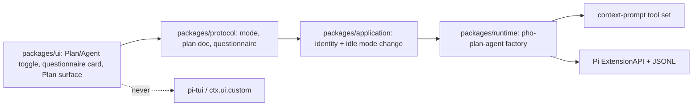

# Plan / Agent and ask-user implementation plan

## Status and use

Owner-approved implementation plan for the **Plan / Agent and ask-user** add-on (2026-08-16). This is the implementation contract, not acceptance evidence. No milestone is accepted until its stated evidence exists.

Read the product contract in [`product.md`](./product.md), the research note in [`research.md`](./research.md), accepted architecture in [`../../architecture/overview.md`](../../architecture/overview.md), the extension model in [`../../architecture/extension-model.md`](../../architecture/extension-model.md), and conversation chrome in [`../../ui/implementation/conversation-ui.md`](../../ui/implementation/conversation-ui.md) before implementation.

This add-on is independent of archived V3, the terminal add-on, the sandbox add-on, and Phase F. Do not put this work in `archive/v3/` or treat Seatbelt / process extraction as a prerequisite.

The product is **end-to-end**. Milestones sequence the build; they do not shrink the accepted outcome.

Owner order (2026-08-16):

| Milestone | Outcome | Why this order |
| --- | --- | --- |
| **0** | Ask-back in the running app | Owner can test A/B/C or Type something before Plan exists |
| **1** | Full Plan and Agent | Hardest slice: modes, tool policy, Plan document, Execute |
| **2** | Cursor-style `todo` tool | Same list in Agent and Plan; chrome on the M1 surfaces |
| **3** | Packaged honesty | Acceptance wrap, not a fourth product |

Ask-back, Plan/Agent, session todos, and the Plan document are all required for add-on acceptance.

## Global acceptance rules

Every milestone must:

- preserve `renderer -> protocol <- shell adapter -> application -> runtime -> Pi SDK`;
- keep Pi `0.84.1` as the agent/session authority;
- keep the renderer free of `electron`, `node:*`, Pi SDK, MCP SDKs, PTY libraries, and `pi-tui`;
- use a Pho-owned inline factory; never bake `@juicesharp/rpiv-ask-user-question` or `@kmiyh/pi-plan-mode`;
- keep protocol values JSON-safe; no TUI components, class instances, or Pi session objects cross the bridge;
- never implement `ctx.ui.custom` or `ctx.ui.editor`;
- intersect Plan tool policy with context-prompt enabled tools;
- keep `write` / `edit` / `move_to_trash` off in Plan even when YOLO is on;
- treat ask-user cancel as a tool decline, not a permission deny;
- treat questionnaire host failure as “owner never saw the questions,” not a decline;
- distinguish unit, integration, desktop, packaged, and unverified evidence;
- record juicesharp/Pi adaptations in [`../../references-and-attribution.md`](../../references-and-attribution.md) when code is copied or closely adapted;
- update architecture, development, attribution, and current-state only when the corresponding milestone lands, and mark accepted behavior only after the acceptance gate.

## Architecture



| Layer | Owns | Must not own |
| --- | --- | --- |
| `packages/ui` | Composer Plan/Agent control, questionnaire card, Plan sidebar content | Pi tools, JSONL writes, tool allowlists |
| `packages/protocol` | `sessionMode`, plan snapshot, questionnaire request/result, `setSessionMode`, plan save/execute | Native helpers, markdown AST objects |
| `packages/application` | Composite session identity, idle-only mode change, execute/refine intents | Electron, Pi `registerTool` |
| `packages/runtime` | Inline factory, tool intersection, prompts, `ask_user_question`, plan custom entry, questionnaire emit | Electron APIs, renderer, `pi-tui` |
| `apps/desktop` | Bridge/preload alignment only | Feature composition |

### Why not bake juicesharp

The package is a Pi CLI TUI with XDG config, `pi-tui`, optional i18n, and a 560 ms overlay graph. Pho Code is `mode: "rpc"` and already forbids `ctx.ui.custom`. Reuse schema, validation, envelope, guidelines, and the RPC walker **as attributed source**, inside a Pho factory. Same decision as not baking `pi-sandbox`.

### Why not bake Pi plan-mode

The example calls `ui.editor`, `setWidget`, `/plan`, and a bash regex that allows `curl`. Tool names omit retrieval, web, trash, GitHub, and Cursor. Take the policy idea; write the factory against Pho Code’s actual tool set.

### Tool intersection

```text
activeTools = enabledToolNames(contextPromptSections) ∩ planAllowlist
activeTools ∪= ["ask_user_question"]            // Milestone 0
activeTools ∪= ["todo"]                         // Milestone 2, when factory healthy
```

`planAllowlist` in Plan is every currently registered tool except `write`, `edit`, `move_to_trash`, and Cursor SDK tools. In Agent/Execute it is the full registered set. Re-apply after context-prompt save, session replace, and mode change.

## Protocol contract

Add explicit JSON-safe types. Do not overload permission `HostDialogKind` with questionnaire fields.

```ts
type SessionAgentMode = "plan" | "agent";

interface PlanTodoItem {
  id: string;
  content: string;
  status: "pending" | "in_progress" | "completed";
}

interface SessionPlanSnapshot {
  mode: SessionAgentMode;
  executing: boolean;
  documentMarkdown: string;
  todos: PlanTodoItem[];
  remainingCount: number;
}

interface SetSessionModeInput {
  workspaceId: string;
  sessionId: string;
  mode: SessionAgentMode;
}

interface UpdateSessionPlanDocumentInput {
  workspaceId: string;
  sessionId: string;
  documentMarkdown: string;
}

interface ExecuteSessionPlanInput {
  workspaceId: string;
  sessionId: string;
}

interface AskUserOption {
  label: string;
  description: string;
  preview?: string;
}

interface AskUserQuestion {
  question: string;
  header: string;
  options: AskUserOption[]; // 2–4
  multiSelect?: boolean;
}

interface AskUserRequest {
  requestId: string;
  questions: AskUserQuestion[]; // 1–4
}

type HostDialogKind = "confirm" | "select" | "input" | "questionnaire";
```

`SessionSnapshot` gains `plan: SessionPlanSnapshot`. Commands: `setSessionMode`, `updateSessionPlanDocument`, `executeSessionPlan`, `refineSessionPlan` (or `executeSessionPlan` with `action: "execute" | "stay" | "refine"`). Questionnaire resolve extends `ResolveHostDialogInput` with JSON-safe answers (selected labels, custom text, notes, cancelled).

Bounds (validate twice):

| Limit | Value | Behavior |
| --- | --- | --- |
| questions | 1–4 | reject above/below |
| options per question | 2–4 | reject |
| header | 1–16 chars | reject |
| option label | 1–60 chars | reject reserved labels |
| preview / note / custom answer | 8 KiB each | truncate or reject — pick one in Milestone 0 and test it |
| plan document | 256 KiB | reject above |
| todos | 50 | reject above |
| todo content | 200 chars | reject above |

Renderer never receives Pi tool objects or unsanitized HTML.

## File ownership (intended)

| Path | Change | Lands in |
| --- | --- | --- |
| `packages/protocol/src/plan-agent.ts` (new) | questionnaire types/bounds first; mode/plan snapshot in M1 | 0, 1 |
| `packages/protocol/src/resources.ts` | `HostDialogKind` + `"questionnaire"` | 0 |
| `packages/protocol/src/bridge.ts`, `version.ts`, session snapshot | questionnaire resolve in M0; `plan` + mode commands in M1 | 0, 1 |
| `packages/runtime/src/plan-agent-feature.ts` (new) | factory: ask-user in M0; Plan policy in M1; `todo` in M2 | 0–2 |
| `packages/runtime/src/ask-user-question.ts` (new) | schema, validate, envelope (juicesharp-adapted) | 0 |
| `packages/runtime/src/todo-tool.ts` (new) | `todo` merge-replace + branch reconstruct | 2 |
| `packages/runtime/src/plan-agent-state.ts` (new) | JSONL custom entry load/save | 1 |
| `packages/runtime/src/features.ts` / default manifest | factory entry | 0 |
| `packages/runtime/src/extension-host.ts` | questionnaire request/resolve; keep `custom`/`editor` throwing | 0 |
| `packages/runtime/src/context-prompt.ts` / `pi-runtime.ts` | tool intersection with Plan | 1 |
| `packages/application` | questionnaire use case in M0; mode/plan/execute in M1 | 0, 1 |
| `packages/ui/src/composer.tsx` | Plan/Agent control | 1 |
| `packages/ui/src/ask-user-card.tsx` (new) | A/B/C + Type something card | 0 |
| `packages/ui/src/plan-document-panel.tsx` (new) | Plan surface | 1 |
| `packages/ui/src/right-sidebar.tsx` | surface `"plan"` | 1 |
| `packages/ui/src/host-dialog.tsx` | dispatch questionnaire vs permission | 0 |
| `docs/references-and-attribution.md` | juicesharp / Pi example rows when code lands | matching milestone |

## Milestone 0: ask-back (desktop-testable)

### Outcome

The owner can run a normal Agent chat and get a juicesharp/Claude questionnaire card: pick **A / B / C** (or D) or **Type something**. Implement this first so the card can be tested in Electron before Plan exists.

No Plan/Agent toggle and no `todo` tool yet. Today's tool set is unchanged except `ask_user_question` is added.

### Implementation sequence

1. Pho-owned inline factory registered in the default manifest. It only registers `ask_user_question`.
2. juicesharp-adapted schema, reserved labels, validation, result envelope, and prompt guidelines. Attribute the adaptation.
3. New `HostDialogKind` `"questionnaire"` (or equivalent JSON-safe request). Do not overload permission copy.
4. Renderer card: A/B/C/(D), descriptions, Type something, multi-select, tabs, Submit, Escape cancel, optional sanitized preview, optional note.
5. Factory execute path prefers the card; falls back to juicesharp-style `select`/`input` walker only if the kind cannot render.
6. Abort, session switch, and quit cancel the tool with the decline envelope. Host/render failure uses the "never saw" string, not decline.
7. Inspect the diff: no juicesharp package, no `pi-tui`, `custom`/`editor` still throw.

### Acceptance criteria

- desktop: model asks two questions; owner picks **B** on one and types a custom answer on the other; Submit returns both in the tool result;
- reserved label `Other` is rejected before UI;
- Escape → decline string, run continues;
- simulated card failure → "never saw" error, not decline;
- permission dialog still works for `bash` and does not reuse questionnaire chrome;
- one pending dialog at a time;
- invalid questionnaires return structured `error` codes, not throws.

### Proportional verification

- unit tests for validation, envelope, card state (letter/digit shortcuts, Submit blocked until required answers);
- protocol tests for questionnaire resolve;
- runtime integration with real Pi `0.84.1` in temp dirs;
- Electron journey: ask-back card plus a permission `bash` ask in the same chat to prove the docks do not mix.

## Milestone 1: full Plan mode and Agent mode (hardest)

### Outcome

The owner can switch **Plan** and **Agent** per chat. Plan turns write tools off (even under YOLO), intersects Context prompt, persists on resume, and holds a Plan document the owner can Execute, Stay, or Refine. Ask-back from Milestone 0 stays available in both modes.

This milestone does **not** ship the Cursor `todo` tool. Execute injects the Plan document until Milestone 2.

### Implementation sequence

1. Protocol `setSessionMode`, snapshot `plan.mode` / document, custom JSONL entry `pho-code.plan-agent`.
2. Application: refuse mid-run, missing session, or replaced controller.
3. Composer Plan/Agent control next to thinking; disabled while a run is live. Honest "Plan" mark; no sandbox claim.
4. Tool intersection and `tool_call` backstop: Plan drops `write` / `edit` / `move_to_trash` and Cursor SDK tools; keeps `ask_user_question`.
5. `before_agent_start` Plan vs Agent vs Execute context.
6. Right-sidebar surface `"plan"`: sanitized markdown/mermaid document, owner edit while idle, inspect-only during Execute. Same host rules as Changes / Context prompt / Terminal.
7. Execute / Stay / Refine on that surface. Execute restores Agent tools, injects the document, starts a turn. V3 captures Execute writes.
8. Conversation-ui log: this add-on owns Plan/Agent chrome.

### Acceptance criteria

- new chat is Agent;
- toggle Plan while idle updates snapshot and JSONL; toggle while streaming is refused; reopen stays Plan;
- desktop: model cannot `write` in Plan; Agent `write` still hits V3;
- context prompt with `bash` disabled stays disabled in Plan;
- YOLO does not restore write tools in Plan;
- Plan document appears without a `Plan:` regex requirement;
- Execute: write/edit tools return; a workspace `write` is captured by V3;
- Stay: remains Plan, no turn started;
- Refine: composer focused, document unchanged, next turn still Plan tools;
- ask-back still works in Plan and in Agent;
- surface re-click collapses; Terminal/Changes still work;
- Linux-compatible control (no macOS-only shortcut as the only path);
- oversized document rejected.

### Proportional verification

- protocol/application unit tests for mode and document bounds;
- runtime integration: intersection, YOLO, resume, Execute injection;
- UI unit tests for surface `"plan"` exhaustive switch;
- Electron journey: toggle Plan, no write tools, write a document, Execute, V3 row, ask-back still opens.

## Milestone 2: Cursor-style todo tool

### Outcome

The model gets a `todo` tool with the same merge-replace list Cursor uses (`pending` / `in_progress` / `completed`, at most one in progress). The list is session-scoped and works in **Agent without Plan**. The Plan surface and Execute consume that same list.

### Implementation sequence

1. Register `todo` (or `todo_write` — pick one name here and keep it). Replace-the-list input; reconstruct latest from branch tool-result details (Pi `todo.ts` persist idea, not its TUI).
2. Snapshot `plan.todos` / `remainingCount` from that reconstruction.
3. Transcript compact checklist and composer `n/m` chip whenever the list is non-empty.
4. Plan surface renders the same list. Execute injects remaining `pending` / `in_progress` items when any exist; otherwise keep Milestone 1 document injection.
5. All todos `completed` during Execute clears `executing` and returns to Agent.
6. Attribute Pi `todo.ts` persist if that reconstruction is copied closely.

### Acceptance criteria

- Agent mode (no Plan): model writes three todos; composer shows `0/3`; one `in_progress` then `completed` updates the chip without opening Plan;
- Plan sidebar checklist is the same session list;
- two `in_progress` items rejected;
- empty `todos: []` clears the list;
- resume restores the latest list from tool details;
- Execute with remaining todos injects those items; V3 still captures writes;
- `[DONE:n]` in assistant prose does not change todo state.

### Proportional verification

- runtime tests for merge-replace, reconstruct, one-in-progress, bounds;
- UI unit tests for composer chip and transcript checklist;
- Electron journey: Agent todos without Plan; Plan → Execute using that list.

## Milestone 3: packaged honesty, docs, architecture

### Outcome

Unsigned macOS `.app` includes the factory. Architecture, notices, and current-state match shipped behavior.

### Implementation sequence

1. Packaged smoke: ask-back card, Plan toggle, Execute write captured, Agent todos, no juicesharp/`pi-tui` in the asar feature set.
2. Attribution and third-party notices if juicesharp/Pi example code was adapted.
3. Architecture: Plan/Agent is an accepted baked feature; `custom` remains unsupported; questionnaire is a structured host dialog.
4. Development runbook: how to exercise ask-back, Plan vs Agent, and todos in isolated data.
5. Honesty copy in composer/Plan surface matches the product bullets.

### Acceptance criteria

- packaged `.app` on macOS, isolated userData;
- current-state records the add-on only after this evidence;
- architecture no longer lists Plan/Agent as unpromoted backlog only;
- no `pi-tui` in renderer import lint.

### Proportional verification

- `bun run package:mac` + `bun run test:packaged` journey;
- security/preload tests still forbid generic invoke.

## Deferred on purpose

Not required to accept this add-on:

- Cursor Ask as a third mode;
- live React / MDX canvases;
- subagents, worktrees, session fork/tree;
- OS sandbox of Plan-mode `bash` (sandbox add-on);
- juicesharp notes-on-every-option extras beyond the product’s optional note field, i18n, BEL, collapse-to-read-transcript shortcut;
- auto-prompt at every Plan `agent_end`;
- Linux packaged verification beyond existing desktop compatibility.

Those may become later expansions of this same add-on. They are not silent follow-on inside Milestone 0–3.

## Exit checks

Use focused checks during milestones. Before add-on acceptance, run the root contract relevant to the final code:

```bash
bun run typecheck
bun run lint
bun test
bun run test:desktop
bun run build
bun run package:mac
bun run test:packaged
```

The irreplaceable evidence is: Plan disables write tools (including under YOLO), ask-user card with A/B/C or typed answers, session todos in Agent and Plan, Plan document Execute path with V3 capture, JSONL resume, no baked juicesharp/`pi-tui`, and honest copy.

## Acceptance gate

The add-on may be accepted only when:

- composer Plan/Agent works and persists;
- Plan keeps `write`/`edit`/`move_to_trash` off even in YOLO;
- `ask_user_question` shows a questionnaire card (options or Type something) distinct from permission;
- session todos work in Agent without Plan, and the Plan surface shows the same list;
- the Plan surface holds the document; Execute/Stay/Refine match the product;
- Execute writes are V3-tracked;
- packaged macOS evidence exists;
- notices, architecture, and current-state are honest;
- an independent review inspects juicesharp attribution, tool intersection, and that `ctx.ui.custom` remains unsupported.
