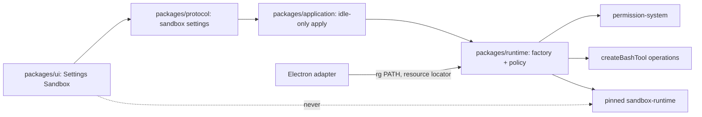

# Agent-tool sandbox implementation plan

## Status and use

Owner-approved implementation plan for the **agent-tool sandbox** add-on (2026-08-16). This is the implementation contract. Status is **Accepted**. Review: [`logs/2026-08-17-acceptance-review.md`](./logs/2026-08-17-acceptance-review.md). Earlier milestone evidence: [`logs/2026-08-17-m1-acceptance-review.md`](./logs/2026-08-17-m1-acceptance-review.md), [`logs/2026-08-17-m2-permission-skip.md`](./logs/2026-08-17-m2-permission-skip.md), [`logs/2026-08-17-m3-file-tool-policy.md`](./logs/2026-08-17-m3-file-tool-policy.md), [`logs/2026-08-17-deny-copy.md`](./logs/2026-08-17-deny-copy.md), [`logs/2026-08-17-m4-packaged-macos.md`](./logs/2026-08-17-m4-packaged-macos.md).

Read the product contract in [`product.md`](./product.md), the research note in [`research.md`](./research.md), accepted architecture in [`../../architecture/overview.md`](../../architecture/overview.md), and the extension model in [`../../architecture/extension-model.md`](../../architecture/extension-model.md) before implementation.

This add-on is independent of archived V3, the terminal add-on, and Phase F. Do not put sandbox work in `archive/v3/` or treat process extraction as a prerequisite.

## Global acceptance rules

Every sandbox milestone must:

- preserve `renderer -> protocol <- shell adapter -> application -> runtime -> Pi SDK`;
- keep Pi `0.84.1` as the agent/session authority;
- pin `@anthropic-ai/sandbox-runtime` to an exact version; never `pi-sandbox`, never a caret, never `@carderne/sandbox-runtime`;
- keep the renderer free of `electron`, `node:*`, Pi SDK, MCP SDKs, PTY libraries, and sandbox-runtime;
- put `SandboxManager` initialize/reset, `rg` location, and `wrapWithSandbox` behind runtime code plus an injected resource/PATH locator from the Electron adapter;
- keep protocol values JSON-safe; no Seatbelt profiles, proxy ports, class instances, or child-process handles cross the bridge;
- apply Settings idle-only, like permission settings;
- fail closed when enabled and unhealthy: refuse agent `bash`, do not silently unsandbox;
- refuse renderer-supplied filesystem paths and domain strings except through typed Settings commands validated again in application/runtime;
- keep the owner PTY, GitHub MCP, `pho-web`, and Cursor SDK unwired to this engine;
- distinguish unit, integration, desktop, packaged, and unverified evidence;
- update architecture, development, attribution, third-party notices, and current-state only when the corresponding milestone lands, and mark accepted behavior only after the acceptance gate.

## Architecture



| Layer | Owns | Must not own |
| --- | --- | --- |
| `packages/ui` | Settings section, honesty copy, status | Seatbelt, `rg`, spawn, domain DNS |
| `packages/protocol` | Snapshot, update input, status enum, domain/path bounds | Native helpers |
| `packages/application` | Idle-only apply, identity, JSON-safe snapshots | Electron, `SandboxManager` |
| `packages/runtime` | Feature factory, `SandboxManager` lifecycle, bash operations wrap, in-process path policy, permission skip wiring | Electron APIs, renderer |
| `apps/desktop/electron` | Locate bundled `rg`, inject PATH for GUI launches, packaged resource staging | Feature composition, Pi tools |

One process-level `SandboxManager`. Per bash invocation, wrap with that session’s cwd as the workspace write-root plus Settings-derived network/filesystem lists. Do not `reset()` on chat switch. `reset()` on disable, failed reconfigure, and quit.

### Why not extract Pi first

`sandbox-runtime` sandboxes **children**. Pi `bash` is already a child. File tools stay in-process by product choice (V3 capture). Phase F would sandbox a different process with credential and model-HTTP needs this add-on must not take on.

### Pi wrap pattern (official example)

Use the Pi team’s sandbox extension as the bash-integration reference, not `pi-sandbox`:

- [earendil-works/pi `examples/extensions/sandbox/index.ts`](https://github.com/earendil-works/pi/blob/main/packages/coding-agent/examples/extensions/sandbox/index.ts)
- pinned copy in `0.84.1`: `packages/runtime/node_modules/@earendil-works/pi-coding-agent/examples/extensions/sandbox/index.ts`

Implemented shape to follow:

1. `SandboxManager.initialize(config)` on enable / session start;
2. `createBashTool(cwd, { operations })` whose `exec` calls `SandboxManager.wrapWithSandbox(command)` then spawns;
3. `pi.on("user_bash")` returning the same operations;
4. `SandboxManager.reset()` on disable / shutdown.

Prefer Pi’s public bash helpers from the pinned SDK (`createBashTool`, `BashOperations`, and shell-path helpers if exported) over the example’s hard-coded `spawn("bash", ["-c", …])` when the pin provides them. Verify the call shape against installed typings.

Reject from the same example: `sandbox.json` merge, `--no-sandbox`, TUI `/sandbox`, always-on npm/GitHub allowlist, and `process.cwd()` as the only root. Policy is Settings. Cwd is the composite session workspace. Enable defaults on because workspace and temp stay allowed; network still defaults to deny.

If GitHub `main` and Pi `0.84.1` diverge, the pinned SDK example and typings win.

### Why not `pi-sandbox`

Custom TUI, ambient install, project JSON, caret fork, and a second prompt UI violate the extension model. It is a third-party package on a runtime fork. The official example above is the Pi-team pattern.

## Protocol contract

Add explicit JSON-safe types. Do not expose generic sandbox JSON.

```ts
type SandboxNetworkMode = "deny" | "allowlist";
type SandboxStatus = "off" | "starting" | "healthy" | "failed" | "unavailable";

interface SandboxSettingsSnapshot {
  enabled: boolean;
  status: SandboxStatus;
  statusReason?: "rg-missing" | "sandbox-exec" | "unsupported-platform" | "init" | "idle-pending";
  networkMode: SandboxNetworkMode;
  allowedDomains: string[];
  includePackageRegistryDefaults: boolean;
  additionalReadPaths: string[];
  additionalWritePaths: string[];
  platformSupported: boolean;
}

interface UpdateSandboxSettingsInput {
  enabled?: boolean;
  networkMode?: SandboxNetworkMode;
  allowedDomains?: string[];
  includePackageRegistryDefaults?: boolean;
  additionalReadPaths?: string[];
  additionalWritePaths?: string[];
}
```

Commands: `updateSandboxSettings`. Snapshot rides on `HarnessSettingsSnapshot.sandbox` like GitHub MCP.

Bounds (validate twice):

| Limit | Value | Behavior |
| --- | --- | --- |
| allowedDomains length | 64 | reject above |
| domain string | 1–253 chars | reject `"*"`, reject empty, allow one leading `*.` label |
| additional paths | 32 each list | reject above |
| path string | 1–1024 chars | canonicalize; reject `..` traversal after resolve |

Renderer never receives proxy ports, profile text, or `rg` paths.

## Permission skip

When status is `healthy`:

1. Evaluate permission-system first for **deny** (permanent removal, privilege, path denials).
2. If the tool is agent `bash` / `user_bash` and the decision would have been `ask`, treat as allow and run wrapped.
3. After Milestone 3, if the tool is `read`/`write`/`edit` and the canonical path is in policy, treat `ask` as allow; if out of policy, deny with a sandbox reason.
4. Never convert `deny` to allow.

Implementation should use the pinned permission-system’s public hook/override if one exists; otherwise a documented runtime adapter next to the existing permission host binding. Do not fork `@gotgenes/pi-permission-system`.

## File ownership (intended)

| Path | Change |
| --- | --- |
| `packages/protocol/src/sandbox.ts` (new) | types, bounds, JSON-safety |
| `packages/protocol/src/settings.ts`, `bridge.ts`, `version.ts` | snapshot + `updateSandboxSettings` |
| `packages/runtime/src/sandbox-settings.ts` (new) | persist application-owned config |
| `packages/runtime/src/sandbox-policy.ts` (new) | domain/path matching, baked registry list |
| `packages/runtime/src/sandbox-runtime.ts` (new) | `SandboxManager` lifecycle, bash operations |
| `packages/runtime/src/sandbox-feature.ts` (new) | inline factory, `user_bash`, file-tool intercept |
| `packages/runtime/src/features.ts` | manifest entry when locator can resolve the engine |
| `packages/application/src/bootstrap.ts` | idle-only update use case |
| `packages/ui/src/lib/settings-section.ts` | `"sandbox"` section |
| `packages/ui/src/sandbox-settings.tsx` (new) | controls + honesty |
| `apps/desktop/electron` | `rg` staging/PATH |
| `scripts/package-mac.ts` | stage engine + `rg` under app-owned resources |
| `docs/references-and-attribution.md`, `docs/third-party-notices.md` | Apache-2.0 engine, `rg` license |

## Milestone 0: engine pin, `rg`, fail-closed lifecycle

### Outcome

Prove `sandbox-exec` wrapping from the Pho Code runtime in isolated directories, with bundled `rg`, without Settings chrome.

### Implementation sequence

1. Review `@anthropic-ai/sandbox-runtime` at the current latest (`0.0.73` as of 2026-08-13). Pin the exact version that typechecks against Electron’s embedded Node and Pi `0.84.1`. Record it in the pin table in the same change.
2. Stage `rg` as an app-owned binary for macOS arm64 (and x64 if the package path already distinguishes). Electron adapter puts that directory on the child `PATH` used by sandbox init.
3. Runtime service: `initialize` / `reset` / status. Tests use temp cwd.
4. Wrap one `createBashTool` operations exec the way the [Pi official sandbox example](https://github.com/earendil-works/pi/blob/main/packages/coding-agent/examples/extensions/sandbox/index.ts) does (`wrapWithSandbox` then spawn), verified against the `0.84.1` copy: workspace write succeeds, `~/.ssh` read fails, network to an unlisted host fails when mode is deny.
5. Enabled+failed refuses bash. Disabled uses unsandboxed Pi bash (permission still applies in later milestones).
6. Inspect the diff: no `pi-sandbox`, no renderer import, no weaker-isolation flags.

### Acceptance criteria

- exact pin recorded;
- isolated integration: allowed workspace `touch` via wrapped bash; denied sensitive path; denied network;
- missing `rg` becomes `rg-missing` and refuses bash when enabled;
- unsupported platform is `unavailable`;
- `reset` on dispose does not hang.

### Proportional verification

- runtime integration with temp agent/workspace (real Pi `0.84.1`);
- unit tests for status mapping;
- **not verified** until an Electron GUI-PATH test in Milestone 1: Homebrew-less `PATH` still finds staged `rg`.

### Pin table (update in the Milestone 0 change)

| Package | Planned pin | Status |
| --- | --- | --- |
| `@anthropic-ai/sandbox-runtime` | `0.0.73` | pinned in `@pho-code/runtime`; Apache-2.0; `engines.node` `>=20.11.0` (Electron 43 embeds Node 24.18.1) |
| `pi-sandbox` | not a dependency | rejected |
| `@carderne/sandbox-runtime` | not a dependency | rejected |
| bundled `rg` | BurntSushi/ripgrep `15.2.0` (Unlicense OR MIT); macOS arm64 + x64 SHA-256 in `packages/runtime/src/sandbox-artifact.ts` | **recorded in Milestone 0** |

## Milestone 1: Settings + bash wrap in Electron

### Outcome

The owner can enable sandbox in Settings, set deny vs allowlist domains, and run agent `bash` under Seatbelt in a real Electron window. Permission asks for bash may still appear until Milestone 2.

### Implementation sequence

1. Protocol snapshot/update + application idle-only apply.
2. Settings section with honesty copy, status, network mode, domain list, registry-defaults toggle, extra paths (paths may be stored now and enforced for bash write/read via srt; file-tool intercept is Milestone 3).
3. Manifest factory wraps bash and `user_bash`.
4. Electron: GUI PATH includes staged `rg`.
5. Disabled = today’s unsandboxed bash.

### Acceptance criteria

- Settings enable while idle initializes; while running, apply waits;
- deny-network: `curl` to a public host fails inside agent bash;
- allowlist: listed domain succeeds, unlisted fails;
- `"*"` rejected by protocol validation;
- extra write path outside workspace is the only extra writable root besides workspace and temp;
- owner PTY (if present) is unaffected;
- GUI launch without Homebrew still inits on macOS;
- failed init shows `failed` and blocks bash.

### Proportional verification

- protocol unit tests for domain/path bounds;
- application idle-only tests;
- Electron journey: enable, bash `touch` in workspace, bash `curl` denied, disable restores unsandboxed bash still permission-gated.

## Milestone 2: permission skip for in-box bash

### Outcome

Healthy sandbox stops permission **asks** for agent bash. Denies remain. No unsandbox retry.

### Implementation sequence

1. Wire deny-first, then skip ask for wrapped bash.
2. Keep `rm` and privilege rules as deny.
3. Tool error on OS deny; no confirm dialog offering to disable sandbox.
4. YOLO does not wrap MCP/PTY; sandbox on is not YOLO.

### Acceptance criteria

- developer/okay/baby: in-workspace `git status` (or equivalent allowed-by-OS command) runs with no select dialog when sandbox healthy;
- `rm` of a workspace file is still denied with the Trash reason;
- OS network deny is a tool error, not a permission prompt;
- disable restores bash asks according to the active permission profile.

### Proportional verification

- runtime tests with the baked permission feature;
- Electron journey: no dialog for sandboxed `pwd`; dialog or deny as today after disable.

## Milestone 3: in-process file-tool policy

### Outcome

`read` / `write` / `edit` obey the same Settings filesystem policy. In-policy file tools skip permission asks. Out-of-policy is deny. V3 still captures successful write/edit.

### Implementation sequence

1. Canonical path matcher shared with bash policy.
2. Intercept `tool_call` (or equivalent public Pi hook) for `read`/`write`/`edit` only.
3. Skip permission ask when in policy and sandbox healthy.
4. Do not intercept `move_to_trash`, retrieval, or MCP.
5. Tests: write `~/.ssh/id_rsa` denied even in developer mode when sandbox on; workspace write captured by V3.

### Acceptance criteria

- sandbox on: workspace `write`/`edit` succeed without ask in profiles that would have asked;
- path outside policy denied with a sandbox reason;
- `.env` / key denies hold;
- V3 ledger still records the allowed write;
- sandbox off: file tools follow permission-system only.

### Proportional verification

- runtime integration with V3 capture fixtures;
- Electron: Settings extra write path allows that file tool; default does not.

## Milestone 4: packaged macOS, docs, honesty

### Outcome

Unsigned macOS `.app` loads engine + `rg` from app resources. Architecture, notices, and current-state match shipped behavior.

### Implementation sequence

1. `package:mac` stages pinned engine and `rg`; no global Pi; no `npm:pi-sandbox`.
2. Packaged smoke: sandbox starts healthy, workspace bash write, denied curl, file-tool deny outside policy.
3. Attribution and third-party notices (Apache-2.0 engine, `rg` license).
4. Architecture overview: tool-policy sandbox is implemented for agent bash + in-process file tools; Pi process containment remains deferred.
5. Development runbook: `rg` staging, GUI PATH.
6. Settings/About honesty matches the product bullets.

### Acceptance criteria

- packaged `.app` on macOS, isolated userData, no Homebrew `rg` on PATH;
- missing staged `rg` → `rg-missing`, bash refused if enabled;
- current-state records the add-on only after this evidence;
- architecture no longer lists “tool policy sandbox” as wholly deferred.

### Proportional verification

- `bun run package:mac` + `bun run test:packaged` journey;
- security/preload tests still forbid generic invoke.

## Deferred on purpose

Not required to accept this add-on:

- Linux bubblewrap/`socat` packaged verification;
- wrapping GitHub MCP, `pho-web`, Cursor SDK, or the owner PTY;
- Phase F process extraction;
- runtime domain/path grant prompts;
- project `.pi/sandbox.json` or Cursor-style repo JSON;
- TLS terminate / MITM;
- `allowedDomains: ["*"]`;
- Windows;
- adversarial escape-hunting beyond the documented engine limitations.

Those may become later expansions of this same add-on. They are not silent follow-on inside Milestone 0–4.

## Exit checks

Use focused checks during milestones. Before add-on acceptance, run the root contract relevant to the final code:

```bash
bun run typecheck
bun run lint
bun test
bun run test:desktop
bun run build
bun run package:mac
bun run test:packaged
```

The irreplaceable evidence is: pinned Anthropic engine, bundled `rg` under GUI PATH, Seatbelt-wrapped agent bash, permission skip without converting denies, in-process file-tool policy, fail-closed init, packaged macOS without a Pi CLI, and honest Settings copy.

## Acceptance gate

The add-on may be accepted only when:

- Settings Sandbox can enable a healthy macOS box or fail closed;
- agent `bash` is OS-wrapped and does not ask when in-box and healthy;
- `read`/`write`/`edit` follow the same filesystem policy in-process;
- permission denies still hold;
- owner PTY / MCP / Cursor / `pho-web` are unchanged;
- packaged macOS evidence exists;
- notices, architecture, and current-state are honest;
- an independent review inspects pins, PATH/`rg` staging, permission skip, and that no unsandbox retry exists.
