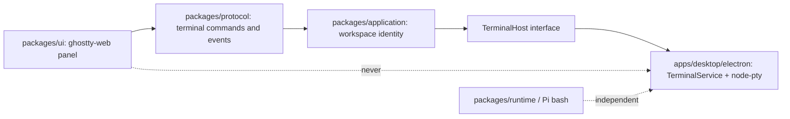

# Integrated terminal implementation plan

## Status and use

Owner-approved implementation plan for the **integrated terminal** add-on (2026-08-16). This is the implementation contract, not acceptance evidence. No milestone is accepted until its stated evidence exists.

Read the product contract in [`product.md`](./product.md), the accepted architecture in [`../../architecture/overview.md`](../../architecture/overview.md), and the desktop-shell decision in [`../../architecture/desktop-shell.md`](../../architecture/desktop-shell.md) before implementation.

This add-on is independent of archived V3. Do not put terminal work in `archive/v3/` or extend the accepted V3 recovery contract implicitly.

## Global acceptance rules

Every terminal milestone must:

- preserve `renderer -> protocol <- shell adapter -> application -> runtime -> Pi SDK`;
- keep Pi `0.84.4` as the agent/session authority; this add-on does not import Pi for PTY ownership;
- keep the renderer free of `electron`, `node:*`, Pi SDK, MCP SDKs, and PTY libraries;
- put PTY spawn, env, cwd, write, resize, kill, and replay behind an injected `TerminalHost` implemented only in the Electron adapter;
- keep protocol values JSON-safe strings and numbers; no `Buffer`, `ArrayBuffer`, class instances, or process handles cross the bridge;
- use a dedicated terminal event subscription, never the conversation live-run `subscribe()` hot path;
- refuse renderer-supplied filesystem paths, env maps, and shell executables;
- keep hide ≠ kill as specified in the product contract;
- degrade the Terminal surface without breaking chat, Changes, Context prompt, settings, or shutdown;
- distinguish unit, desktop, packaged, security, and unverified evidence;
- update architecture, development, conversation-ui, attribution, third-party notices, and current-state only when the corresponding milestone lands, and mark accepted behavior only after the acceptance gate.

## Architecture



| Layer | Owns | Must not own |
| --- | --- | --- |
| `packages/ui` | `RightSidebarSurface` includes `"terminal"`; lazy `TerminalPanel`; ghostty-web `init` / `Terminal`; fit/resize; theme mapping; focus; keep-alive hide | `node-pty`, `node:*`, Electron, cwd, env, PIDs |
| `packages/protocol` | Commands, snapshots, events, size/replay bounds, JSON-safety helpers | Native modules, WASM loading |
| `packages/application` | Validates `workspaceId`, maps it to the canonical workspace already known to the harness, calls `TerminalHost` | Electron APIs, node-pty, Pi session loop |
| `apps/desktop/electron` | `TerminalService`, node-pty load/rebuild, spawn-helper executable bit, replay, backpressure, sender ownership, quit teardown, dedicated IPC | Feature manifest composition, Pi tools |
| `packages/runtime` | Unchanged | Owner PTY |

`ArgvProcessLauncher` remains one-shot argv spawn for Trash and similar tools. Do not extend it into a PTY.

### TerminalHost

Place the interface next to other application ports (new `packages/application/src/terminal-host.ts`, or equivalent). Exact field names may tighten during protocol design; the invariants may not.

```ts
interface TerminalHost {
  ensure(input: EnsureTerminalInput): Promise<TerminalPanelSnapshot>;
  write(input: WriteTerminalInput): Promise<void>;
  resize(input: ResizeTerminalInput): Promise<void>;
  restart(input: RestartTerminalInput): Promise<TerminalPanelSnapshot>;
  close(input: CloseTerminalInput): Promise<TerminalPanelSnapshot | null>;
  disposeWorkspace(workspaceId: string): void;
  disposeAll(): Promise<void>;
}
```

The Electron composition root constructs one `TerminalService` and passes it into the application as `TerminalHost`. Tests may inject a fake host.

### Why not the Pi runtime

The owner PTY is a desktop-shell capability, like the native folder picker. Putting it in `packages/runtime` would couple process lifetime to Pi session controllers and invite later “pipe bash into the panel” shortcuts. Runtime stays unaware.

## Protocol contract

Add explicit JSON-safe commands. Do not expose generic `spawn`, `ptyWrite`, or `invoke(channel)`.

Commands (IPC namespace remains `pho-code:v1:*`):

| Command | Input | Result |
| --- | --- | --- |
| `ensureTerminal` | `{ workspaceId, cols, rows }` | `TerminalPanelSnapshot` |
| `writeTerminal` | `{ terminalId, data }` | `void` |
| `resizeTerminal` | `{ terminalId, cols, rows }` | `void` |
| `restartTerminal` | `{ terminalId, cols, rows }` | `TerminalPanelSnapshot` |
| `closeTerminal` | `{ terminalId }` | `TerminalPanelSnapshot \| null` |

`DesktopBridge` also gains `subscribeTerminal(listener): Unsubscribe` on a dedicated channel (`pho-code:v1:terminalEvent`). Conversation reducers must ignore these events.

Snapshot (one session per workspace in this add-on):

```ts
type TerminalSessionStatus = "running" | "exited" | "error";

interface TerminalSessionSnapshot {
  terminalId: string;
  workspaceId: string;
  status: TerminalSessionStatus;
  title: string;
  cols: number;
  rows: number;
  replay: string;
  truncated: boolean;
  exitCode?: number | null;
  signal?: number | null;
  errorCode?: "native-missing" | "spawn" | "shell-not-found" | "wasm" | "unavailable";
}

interface TerminalPanelSnapshot {
  workspaceId: string;
  terminalId: string;
  session: TerminalSessionSnapshot;
}
```

Events:

```ts
type TerminalEvent =
  | { type: "terminalData"; terminalId: string; data: string }
  | { type: "terminalExit"; terminalId: string; exitCode: number | null; signal: number | null }
  | { type: "terminalError"; terminalId: string; errorCode: string; message: string }
  | { type: "terminalTitle"; terminalId: string; title: string };
```

Do not send `ArrayBuffer` or Node `Buffer`. `data` is a string.

### Bounds

Validate in protocol helpers and again in the host:

| Limit | Value | Behavior |
| --- | --- | --- |
| cols | 10–500, default 80 | clamp |
| rows | 4–200, default 24 | clamp |
| `writeTerminal` payload | 128 KiB UTF-16 code units per call | reject above; host chunks at this size without splitting surrogate pairs |
| title | 80 characters | truncate |
| replay | 1,000,000 UTF-16 code units | drop oldest, set `truncated` |
| live data coalescing | host may merge pending `terminalData` for the same id when the renderer is behind | never unbounded queue |
| one PTY per workspace | enforced by `TerminalService` | `ensure` returns the existing session |

The renderer never submits cwd, env, shell path, or PID.

### ghostty-web attach

```ts
import { init, Terminal } from "ghostty-web";

await init();
const term = new Terminal({
  fontSize: clampedAppearanceChatFontSize,
  fontFamily: themeMonospaceStack, // computed `--font-mono` (owner-selected code family or the default stack)
  cursorBlink: !prefersReducedMotion,
  theme: mappedCssVariables,
});
term.open(container);
term.onData((data) => void phoCode.writeTerminal({ terminalId, data }));
```

`init()` runs once per renderer lifetime. Fit with a `ResizeObserver` on the sidebar content pane; call `resizeTerminal` when cols/rows change. Map light/dark/palette tokens into ghostty-web’s theme object. Do not import xterm CSS or a second terminal stylesheet system.

Lazy-load the panel module so ordinary UI unit tests and the conversation path do not load WASM.

## Process, environment, and teardown

- **Shell allowlist:** absolute `process.env.SHELL` when it is one of `/bin/zsh`, `/bin/bash`, `/bin/sh`, `/usr/bin/zsh`, `/usr/bin/bash`, `/usr/bin/sh`. Otherwise macOS `/bin/zsh` then `/bin/bash`. Refuse relative paths. Verify execute permission before spawn.
- **cwd:** canonical workspace directory from application state. `stat` must be a directory.
- **env:** do not clone `process.env`. Start from an allowlist (`PATH`, `HOME`, `USER`, `LOGNAME`, `LANG`, `LC_*`, `TMPDIR`, `COLORTERM`, and Linux `XDG_*` when present). Set `TERM=xterm-256color`. Delete `TERMINFO` / `TERMINFO_DIRS` if they appear. Never copy `PHO_CODE_*`, `PI_*`, provider tokens, or GitHub PAT names. GUI launches may miss interactive-only `.zshrc` aliases; that is acceptable and must not be “fixed” by sourcing an arbitrary user script from the renderer.
- **name:** `xterm-256color` for node-pty `name` (ghostty-web is xterm-API compatible).
- **Sender ownership:** only the `webContents` that created the session may write/resize/restart/close it.
- **Unix teardown:** kill the process group when possible, then the child; SIGTERM with the existing shutdown grace, then SIGKILL. Include leftover PIDs on the bounded-shutdown probe. Never delete workspace files as recovery.
- **spawn-helper:** packaged `node-pty`’s `spawn-helper` must be executable; fail closed if packaged and missing, chmod only in unpackaged development.

## CSP, WASM, and packaging

ghostty-web `0.4.0` tries `data:application/wasm;base64,...`, then `./ghostty-vt.wasm`, then `/ghostty-vt.wasm`. OpenCode broke when CSP blocked the data URL. Pho Code will:

1. set production `script-src 'self' 'wasm-unsafe-eval'` so `WebAssembly.compile` is allowed;
2. ship `ghostty-vt.wasm` as a same-origin renderer asset (Vite `?url` or renderer `public/`);
3. **not** add `connect-src data:` unless Milestone 0 proves the file fallback never runs in Electron;
4. keep `object-src 'none'` and the rest of the production CSP;
5. verify both `bun run dev` (Vite HTTP) and packaged `file:` / custom-protocol loads.

`node-pty` is the first Electron-ABI native module added for this add-on. It belongs on `apps/desktop` only.

Packaging today sets `npmRebuild: false`. Milestone 0 must change the macOS package path so `pty.node` is rebuilt for Electron `43.4.0` (embedded Node 24.x) during development and `package:mac`, unpacked via existing `asarUnpack` `*.node`, and never compiled on the owner’s first launch. Missing or wrong-ABI native code surfaces `errorCode: "native-missing"` on the Terminal surface.

ghostty-web belongs on `packages/ui`. Package-boundary tests must assert:

- UI may depend on `ghostty-web`;
- desktop may depend on `node-pty`;
- UI, protocol, application, and runtime must not depend on `node-pty`;
- renderer/preload still cannot import `electron` or `node-pty`.

## File ownership (intended)

| Path | Change |
| --- | --- |
| `packages/protocol/src/terminal.ts` (new) | types, bounds, JSON-safety |
| `packages/protocol/src/version.ts`, `bridge.ts`, `index.ts` | commands and `DesktopBridge` methods |
| `packages/application/src/terminal-host.ts` (new) | `TerminalHost` + workspace-validated use cases |
| `apps/desktop/electron/terminal-service.ts` (new) | node-pty lifecycle, replay, events |
| `apps/desktop/electron/ipc.ts`, `preload.ts`, `main.ts` | named IPC, quit dispose, project-remove dispose |
| `apps/desktop/electron/security-policy.ts` | `'wasm-unsafe-eval'`; data: only if proven required |
| `apps/desktop/electron.vite.config.ts` | WASM asset emission for the renderer |
| `scripts/package-mac.ts` | Electron-ABI rebuild for `node-pty` |
| `packages/ui/src/right-sidebar.tsx` | surface `"terminal"` + icon |
| `packages/ui/src/terminal-panel.tsx` (new) | lazy ghostty-web view |
| `apps/desktop/src/App.tsx` | surface wiring, keep-alive hide |
| `apps/desktop/tests/terminal.spec.ts` (new) | Electron journeys |
| `apps/desktop/tests/security.spec.ts` | CSP assertions |
| `docs/architecture/overview.md` | renderer may host a VT view; PTY stays behind `TerminalHost` |
| `docs/references-and-attribution.md`, `docs/third-party-notices.md` | ghostty-web, Ghostty VT, node-pty |

Do not add a baked `HarnessFeatureManifest` entry. This is not a Pi extension.

## Milestone 0: native PTY, WASM, and CSP proof

### Outcome

Prove the two loaders this add-on depends on, and lock the pins, without shipping owner-facing chrome.

1. An Electron 43.4.0 process can `require("node-pty")` and spawn the allowlisted shell in a temporary directory.
2. The sandboxed renderer can `init()` ghostty-web, construct a `Terminal`, and round-trip bytes without xterm.js.
3. Production CSP compiles WASM. The data-URL probe either fails over to the same-origin wasm file or a documented `connect-src` exception is added with a security-test update.
4. `package:mac` stages an Electron-ABI `pty.node` (or this milestone stops and records why rebuild cannot be automated yet).

UI may be a development-only or test-only attach. Do not add the right-rail icon until Milestone 1.

### Implementation sequence

1. Pin `ghostty-web` `0.4.0` on `packages/ui`.
2. Spike `node-pty` against Electron `43.4.0`. Record the exact version that loads in this plan’s pin table in the same change. Candidate is current N-API `node-pty` 1.x; do not ship a caret range.
3. Add protocol types and bounds with unit tests (no Electron).
4. Implement `TerminalService` + fake-able `TerminalHost` with replay truncation, write chunking, allowlisted shell, and sender ownership.
5. Wire named IPC and `subscribeTerminal`.
6. Emit `ghostty-vt.wasm` as a renderer asset; call `init()` in a test or isolated harness page.
7. Adjust CSP and security tests.
8. Teach `package-mac` / desktop install to rebuild `node-pty` for Electron’s ABI.
9. Inspect the actual diff: no xterm.js, no runtime import of node-pty, no generic IPC.

### Acceptance criteria

- `node-pty` loads inside Electron, not only system Node;
- spawn in an isolated temp workspace prints a marker and exits cleanly;
- ghostty-web `init` + `write` works under the production CSP string used by packaged windows;
- `connect-src data:` is absent unless the spike log shows the file fallback is unreachable;
- wrong-ABI or missing native module becomes `native-missing`, not a main-process crash;
- protocol tests reject oversized writes, non-finite cols/rows, and empty terminal ids;
- package-boundary tests encode the dependency direction.

### Proportional verification

- protocol unit tests for bounds and JSON safety;
- application tests with a fake `TerminalHost`;
- one Electron proof that node-pty spawn and WASM init both succeed (may live in `apps/desktop/tests` as a focused spec);
- security spec asserts the new CSP tokens and still forbids generic invoke;
- packaged native rebuild may be completed in Milestone 2 if Milestone 0 at least fails closed in unpackaged Electron and documents the remaining package script change. Prefer finishing rebuild in Milestone 0.

### Pin table (update in the Milestone 0 change)

| Package | Planned pin | Status |
| --- | --- | --- |
| `ghostty-web` | `0.4.0` | selected |
| `node-pty` | exact 1.x version proven on Electron 43.4.0 | **record during Milestone 0** |
| `@xterm/xterm` | not a dependency | rejected |

## Milestone 1: right-sidebar Terminal surface

### Outcome

The owner can open Terminal from the existing right sidebar in a real Electron window, type in the selected workspace’s login shell, see output, resize the panel, and switch to Changes without killing the process.

### Implementation sequence

1. Extend `RightSidebarSurface` with `"terminal"` and a rail icon; keep exhaustive `switch` handling.
2. Lazy-load `TerminalPanel`; map appearance font size and CSS variables; honor reduced motion.
3. `ensureTerminal` when the surface is selected and a workspace is active; disable the icon otherwise.
4. Keep ghostty-web mounted hidden when switching to Changes or Context prompt.
5. `ResizeObserver` → `resizeTerminal`.
6. Focus: printable keys go to the PTY; Escape-to-collapse is skipped while focused.
7. OSC title in the panel chrome; Restart and Close actions.
8. Hyperlinks through the existing `http:`/`https:` main-process gate.
9. Empty, error, exited, and no-workspace states.
10. Update [`ui/implementation/conversation-ui.md`](../../ui/implementation/conversation-ui.md) to describe the rail icon as in-source (not accepted) once the surface exists.

### Acceptance criteria

- Terminal icon sits on the collapsed pill and expanded rail;
- no workspace: icon disabled with the product reason string;
- `echo` of a unique marker appears in the view;
- sidebar resize changes cols/rows and the shell sees the new size (`stty size` or equivalent);
- switching to Changes keeps the same PTY (marker process or a long-lived `sleep` still running);
- chat switch in the same project keeps the same `terminalId`;
- focused Escape does not collapse the sidebar;
- http(s) link click does not use `window.open`;
- WASM or spawn failure shows a named error, not a blank canvas;
- conversation streaming still does not re-render per terminal byte.

### Proportional verification

- UI unit tests for pill/rail surface selection and disabled-without-workspace;
- Electron journey in `apps/desktop/tests/terminal.spec.ts`: open surface, echo marker, surface switch keep-alive, chat switch keep-alive, resize;
- no visual-regression framework.

## Milestone 2: lifecycle, packaged native module, honesty

### Outcome

Hide, project switch, Restart, Close, quit, and the unsigned macOS `.app` behave as the product contract. Docs and notices match the shipped pins.

### Implementation sequence

1. Collapsed-sidebar unmount restores from host replay without respawning.
2. Workspace/project switch ensures the newly selected workspace and does not write to the previous PTY from the new view.
3. Remove-project disposes that workspace’s PTY.
4. Restart clears replay and replaces the process; Close disposes; next ensure is a new id.
5. Quit: dispose all PTYs under the bounded shutdown deadline; probe records leftovers.
6. Finish Electron-ABI packaging if not done in Milestone 0; packaged smoke loads wasm + pty without a Pi CLI.
7. Attribution and third-party notices for `ghostty-web`, Ghostty VT, and `node-pty`.
8. Architecture overview: renderer may host a VT emulator over protocol I/O; “no terminals in the renderer” means no PTY/process handles.
9. Development runbook: native rebuild prerequisite for `node-pty`.
10. Settings/About honesty: this panel is not a sandbox.

### Acceptance criteria

- collapse and re-expand shows replay (or keep-alive) without a new `terminalId`;
- two recents: each workspace has its own PTY; switching does not mix output;
- Restart changes `terminalId` or equivalently replaces the process so a previous `sleep` is gone;
- Close then open is a new shell;
- quit does not hang on a running `sleep`;
- packaged `.app` on macOS runs the echo journey from isolated userData;
- missing `pty.node` in a sabotaged fixture degrades to `native-missing`;
- production CSP tests still forbid `'unsafe-eval'` except the documented `'wasm-unsafe-eval'`;
- current-state records the add-on only after this milestone’s evidence exists.

### Proportional verification

- unit tests for replay truncation and workspace-keyed session maps;
- Electron journeys for collapse replay, project switch, Restart, Close;
- one packaged macOS journey;
- security specs for CSP and preload surface.

## Deferred on purpose

Not required to accept this add-on:

- extra tabs, splits, or a tab cap;
- keyboard shortcut;
- chat-scoped PTYs;
- agent-attached PTY / piping `bash` into the panel;
- persistent eval kernels;
- Windows ConPTY;
- Linux packaged artifact;
- disk-backed scrollback;
- Settings shell path;
- T3 browser/files rail surfaces.

## Exit checks

Use focused checks during milestones. Before add-on acceptance, run the root contract relevant to the final code:

```bash
bun run typecheck
bun run lint
bun test
bun run test:desktop
bun run build
bun run package:mac
bun run test:packaged
```

The irreplaceable evidence is Electron-ABI `node-pty`, sandboxed ghostty-web under production CSP, hide ≠ kill, workspace-scoped identity, and a packaged macOS echo journey without a Pi CLI.

## Acceptance gate

The add-on may be accepted only when:

- the right sidebar exposes a Terminal surface that drives one login shell per selected workspace;
- ghostty-web is the emulator and xterm.js is not a dependency;
- the renderer has no PTY, path, env, or generic IPC authority;
- hide/collapse/chat-switch do not kill the process;
- Restart and Close are explicit and work;
- quit is bounded;
- packaged macOS evidence exists;
- CSP, notices, architecture, and current-state are honest;
- an independent review inspects native rebuild, WASM loading, IPC bounds, sender ownership, and env allowlisting.
