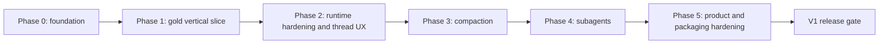

# Pho Code implementation plan

- Status: Historical app-server plan; do not execute
- Last updated: 2026-07-14
- Product boundary: [ADR 0001](decisions/0001-codex-app-server-sidecar.md)
- Superseded by: [Native harness implementation roadmap](implementation/README.md) under [ADR 0002](decisions/0002-native-agent-harness.md)
- Architecture: [System](architecture/system.md), [app-server protocol](architecture/app-server-protocol.md), [compaction](architecture/compaction.md), and [subagents](architecture/subagents.md)
- Research: [Pi](research/pi-source-study.md) and [Codex](research/codex-source-study.md)

> This plan is preserved to keep the reasoning and acceptance work behind ADR 0001 auditable. Current implementation starts with [V1 Phase 0](implementation/v1/phase-0-foundation.md).

## Objective

Deliver a small native GPUI application that runs the Codex agent against a local workspace through a ChatGPT subscription. The first usable release must support managed login, durable threads, streamed turns, explicit approvals, interruption, restart and resume, Codex compaction, and stable Codex subagents.

The plan optimizes for verified vertical behavior. It does not measure progress by the number of screens, abstractions, or protocol methods implemented.

## Definition of success

Pho Code V1 is successful when a user can:

1. open the application and receive an actionable runtime status;
2. sign in through managed ChatGPT login without giving Pho Code a token;
3. choose a local workspace and start or resume a Codex thread;
4. stream a tool-capable turn with legible structured activity;
5. approve or deny commands, file changes, and permission requests explicitly;
6. interrupt an active turn and observe authoritative completion;
7. restart Pho Code or app-server and resume the persisted thread without duplicate or fabricated state;
8. observe automatic compaction and request manual compaction while retaining visible history;
9. see stable V1 subagents as child threads, inspect their activity, handle their approvals, and observe result delivery;
10. diagnose missing runtime, incompatible version, authentication failure, overload, malformed transport, turn failure, compaction failure, and child failure.

The code is successful when it remains small enough that each concern has a clear owner and the core state transitions can be tested without launching the GUI.

## Planning assumptions

- Codex is the only V1 backend.
- `codex app-server` runs as a local child process over stdio JSONL.
- Development begins against the locally observed `codex-cli 0.144.1`, but release compatibility is not decided until the foundation spike verifies source and binary behavior.
- Managed ChatGPT browser login is primary; device-code login is fallback.
- Stable `multi_agent` V1 is enabled by the supported runtime; multi-agent V2 is not required.
- Codex owns credentials, rollouts, compaction checkpoints, tools, sandboxing, and agent scheduling.
- Pho Code initially requires a user-managed compatible Codex binary unless packaging work deliberately changes that policy.
- The first supported operating system can be macOS for development, but platform support remains an explicit release decision.
- The existing GPUI dependencies are a scaffold and must be pinned before reproducible implementation work.

## Constraints

- Do not introduce multi-provider abstractions.
- Do not link Codex's internal Rust workspace.
- Do not call the Responses backend directly.
- Do not read or store Codex tokens.
- Do not auto-approve runtime requests.
- Do not implement a second transcript database.
- Do not rely on WebSocket or experimental app-server fields.
- Do not enable multi-agent V2 for a V1 acceptance test.
- Do not add a plugin system, terminal emulator, file explorer, or IDE shell to make the app appear complete.
- Do not claim a live capability passed when only fixtures were run.
- Do not permanently delete files during development; use the repository's recoverable deletion policy.

## Delivery strategy

Every phase produces an observable vertical improvement and has a gate. A later phase begins only after the prior gate's correctness findings are incorporated. Work may overlap only when module ownership and acceptance evidence remain independent.

Compaction precedes subagents because both rely on correct thread reconstruction, and child sessions add concurrency to every protocol and UI path.

## Workstream map

| Workstream | Primary output | Depends on |
| --- | --- | --- |
| Build foundation | Reproducible GPUI application and test harness | None |
| Runtime process | Binary discovery, child supervision, shutdown | Build foundation |
| Protocol transport | JSONL framing, reader/writer, envelopes, correlation | Runtime process |
| Domain projection | Deterministic thread/turn/item reducer | Protocol fixture definitions |
| Account | Managed login and account state | Initialized protocol |
| Thread and turn | Start, stream, interrupt, read, resume, fork | Account and projection |
| Approvals | Bidirectional server requests and explicit decisions | Protocol correlation and item projection |
| Recovery | Restart, ambiguity handling, reconstruction | Thread read/resume and projection |
| Compaction | Manual and automatic item lifecycle | Recovery |
| Subagents | Agent tree and child transcripts | Recovery, approvals, compaction projection |
| Product hardening | Accessibility, diagnostics, performance, packaging | All behavioral workstreams |

## Phase 0: foundation and compatibility spike

### Goal

Create a reproducible native application shell and prove the selected Codex binary and protocol profile before building product state around assumptions.

### Work package F0.1: pin the Rust dependency baseline

Tasks:

- Record exact revisions for `gpui`, `gpui_platform`, and `gpui-component` instead of floating git heads.
- Generate or commit a lockfile according to application-repository convention.
- Document required Rust toolchain and platform packages.
- Build the current hello-world scaffold on the initial development platform.
- Decide whether `gpui_platform` is required directly or only transitively.
- Add only the minimal serialization, error, logging, process, and channel dependencies justified by the vertical slice.

Checks:

- `cargo fmt --check`
- `cargo check`
- `cargo test`
- `cargo clippy --all-targets --all-features -- -D warnings`, after feature shape is stable enough for this command

Acceptance:

- A clean checkout resolves the same revisions and opens a minimal GPUI window.
- Dependency purpose is documented in `Cargo.toml` or nearby architecture notes when nonobvious.
- No generic agent/provider framework is introduced.

### Work package F0.2: select the supported Codex development runtime

Tasks:

- Verify the executable discovery path and actual app-server launch syntax.
- Record `codex --version` and compare the binary behavior with generated schema.
- Generate JSON Schema into a temporary audit location.
- Select an initial exact supported development version.
- Record required stable methods, notifications, server requests, and item variants.
- Verify that browser/device login, compact, stable collaboration item, and approval types exist in that schema.
- Decide startup behavior for missing, older, and newer versions.

Acceptance:

- The version policy is explicit enough for the application to allow or reject startup.
- Generated schema and focused fixtures identify their source version.
- No experimental opt-in is needed for the baseline profile.

### Work package F0.3: protocol fixture corpus

Create sanitized fixtures for:

- initialize request and response;
- initialized notification;
- signed-out and signed-in account read;
- browser and device login start and completion;
- thread start, list, read, resume, and fork;
- turn start, item start, agent delta, item completion, and turn completion;
- command, file, and permission approval requests and responses;
- turn interrupt;
- context-compaction item lifecycle;
- stable collaboration spawn completion with `receiverThreadIds`, plus optional child metadata and lifecycle events;
- overload error;
- warning, error, unknown notification, malformed line, and EOF.

Acceptance:

- Fixtures contain no credentials, prompt secrets, private paths, or personal account data.
- Each fixture is parseable independently and labeled with direction and source version.
- Tests can replay a complete text-only turn without a live service.

### Work package F0.4: error and diagnostic baseline

Tasks:

- Define runtime, transport, protocol, authentication, thread, turn, compaction, subagent, and invariant error categories.
- Define a redacted diagnostic event structure.
- Establish bounded diagnostic retention.
- Decide how errors carry connection generation and thread/turn/item context.

Acceptance:

- No error path requires logging a raw protocol payload.
- User-facing state can distinguish missing runtime from incompatible runtime and failed turn.

### Phase 0 gate

Proceed only when a pinned application opens, the selected app-server launches and initializes through a small spike, required schema elements are verified, fixtures exist, and dependency choices remain narrow.

If app-server cannot expose a required stable behavior, revisit ADR 0001 before compensating in the UI.

## Phase 1: gold-standard vertical slice

### Goal

Deliver one complete path from application launch through login, one streamed tool-capable turn, one explicit approval, interruption, sidecar restart, and thread resume. This is the representative implementation unit for all later work.

### Work package V1.1: process supervisor

Tasks:

- Discover configured and PATH-based Codex binary candidates.
- Validate supported version before user work.
- Spawn app-server with piped stdin, stdout, and stderr.
- Create a connection generation.
- Observe exit and capture bounded diagnostics.
- Implement graceful shutdown and forced termination fallback without orphaning the child.
- Expose typed runtime state to the domain reducer.

Edge cases:

- missing executable;
- permission denied;
- immediate exit;
- unsupported version;
- stderr flood;
- shutdown during spawn;
- multiple simultaneous start intents.

Acceptance:

- Every process transition is visible in state.
- EOF and exit fail outstanding work once.
- Stderr cannot block stdout.
- No secret is passed on the command line.

### Work package V1.2: JSONL transport and envelope router

Tasks:

- Implement bounded line reading and single-line writing.
- Classify response, error, notification, and server-request envelopes.
- Correlate client requests.
- Keep server requests in a separate registry.
- Route unknown notifications without killing the reader.
- Reject malformed stdout.
- Add cancellation and writer shutdown.

Acceptance:

- Framing and envelope tests cover partial reads, multiple messages, invalid data, overflow, unknown methods, and EOF.
- Terminal events are never dropped under synthetic delta load.
- Request IDs never resolve across connection generations.

### Work package V1.3: initialization and account

Tasks:

- Send `initialize` and await a compatible result.
- Send `initialized` exactly once.
- Read account state.
- Implement browser login, device-code fallback, cancellation, and completion correlation.
- Reread account after completion or account update.
- Build signed-out, pending, signed-in, and failed GPUI states.

Acceptance:

- No non-initialization request is sent early.
- Tokens never enter Pho Code state or logs.
- Opening a browser does not mark login successful.
- Cancel and process exit leave a recoverable signed-out state.

### Work package V1.4: normalized domain state and reducer

Tasks:

- Define runtime, account, workspace, thread, turn, item, approval, and agent-node types required by the slice.
- Implement deterministic domain actions and reducer.
- Preserve UI-only expansion state across authoritative item replacement.
- Test completion without start, duplicate events, late deltas, and reconstruction.

Acceptance:

- Domain tests run without GPUI or a child process.
- Views receive no raw JSON values.
- Child-thread-capable identity is present even before the subagent UI phase.

### Work package V1.5: thread, turn, and transcript

Tasks:

- Start one persisted thread for the selected workspace.
- Submit one user input through `turn/start`.
- Project turn, item, and agent-message deltas.
- Render a minimal structured transcript and composer.
- Implement interrupt and authoritative completion.

Acceptance:

- A text response streams without blocking the window.
- Completion produces stable final text without duplication.
- Interrupt waits for runtime state rather than changing locally to completed.
- Command and file items have structured rows even before rich output views exist.

### Work package V1.6: approval path

Tasks:

- Handle command, file-change, and permission server requests.
- Present one contextual approval interaction.
- Validate connection generation and effective decisions: use exact `availableDecisions` when present, otherwise the conservative method-specific fallback tested for the pinned runtime.
- Send exactly one response.
- Keep reading protocol while awaiting the user.
- Finalize the related operation only from item completion.

Acceptance:

- Approve and deny paths work in fixtures and at least one live command flow.
- Stale approval is invalidated by interrupt, turn completion, or process exit.
- No default or keyboard shortcut accidentally means approve.

### Work package V1.7: restart and resume

Tasks:

- Stop or crash the sidecar after a completed thread exists.
- Launch a new connection generation.
- Reinitialize and reread account state.
- Request `thread/read` with `includeTurns: true` or resume the selected thread.
- Reconcile authoritative turns and items with UI projection.
- Surface ambiguity for any operation active at disconnect.

Acceptance:

- Completed messages do not duplicate.
- Pending approval does not survive as actionable.
- The user can continue with a new turn after resume.
- No prior mutating request is blindly replayed.

### Phase 1 gate

The slice is accepted only after fixture tests and a live signed-in walkthrough cover launch, login reuse or login completion, one streamed turn, one approved and denied action, interruption, sidecar restart, thread resume, and continued conversation.

Pause for architecture review if the implementation needs raw protocol data in views, a second transcript store, token access, or a generic provider abstraction.

## Phase 2: runtime hardening and thread experience

### Goal

Make the vertical slice reliable under concurrency, overload, protocol evolution, and ordinary conversation management before adding compaction and child-agent concurrency.

### Work package H2.1: queue bounds and delta coalescing

Tasks:

- Set and test inbound, outbound, outstanding-request, pending-server-request, line, delta, and diagnostic bounds.
- Coalesce high-frequency agent text by item ID for rendering.
- Truncate command preview while preserving final structured state.
- Prioritize approval responses and terminal events.
- Surface local and server overload.

Acceptance:

- A synthetic high-volume stream does not freeze the GPUI event loop or exhaust memory.
- Item and turn completion survive saturation.
- Dropped or coalesced diagnostic counts are visible.

### Work package H2.2: request ambiguity and retry policy

Tasks:

- Classify each method as idempotent, user-repeatable after state check, or non-retryable under ambiguity.
- Add capped exponential backoff with jitter for eligible overload responses.
- Add deadlines appropriate to account, thread, and control operations.
- Recover authoritative thread state after mutating-operation timeout or disconnect.

Acceptance:

- Tests prove that turn start, fork, compact, and approval are not blindly repeated.
- Account read and thread list retry within a bounded policy.

### Work package H2.3: thread list, read, resume, and fork UX

Tasks:

- Load a bounded recent-thread page.
- Start, select, read, and resume threads by workspace; every transcript-reconstruction read sets `includeTurns: true`.
- Fork a thread and show distinct identity.
- Preserve sidebar selection and expansion as preferences.
- Handle missing or archived threads clearly.

Acceptance:

- Switching threads does not mix items or active approvals.
- Forked source and target diverge independently.
- Preferences are not used as conversation authority.

### Work package H2.4: structured tool views

Tasks:

- Render command status and bounded output.
- Render file-change status and patch updates.
- Render generic tool/MCP activity supported by baseline fixtures.
- Attach warnings and failures to affected items.
- Preserve keyboard and accessibility semantics.

Acceptance:

- A user can identify what action ran, whether it was approved, and how it ended without reading raw JSON.

### Work package H2.5: compatibility diagnostics

Tasks:

- Add supported-version startup decision.
- Report missing required methods or response fields.
- Count unknown notifications and item types with bounded summaries.
- Provide a redacted diagnostic export design.
- Document runtime upgrade and fixture refresh steps.

Acceptance:

- New additive notification does not break a turn.
- Missing security-sensitive approval fields fail visibly.
- Version mismatch reports observed and supported versions.

### Work package H2.6: preferences persistence

Tasks:

- Define a small versioned preferences schema.
- Store window state, recent workspace/thread IDs, display preferences, and optional runtime path.
- Write atomically and recover from corruption.
- Exclude tokens, transcript authority, approvals, raw diagnostics, and reasoning.

Acceptance:

- Corrupt preferences do not block access to Codex threads.
- A source inspection proves no credential field exists.

### Phase 2 gate

Proceed when long synthetic streams remain responsive, thread switching and fork are correct, retry ambiguity is tested, unknown notifications are tolerated, preferences remain nonauthoritative, and structured tool activity is usable.

## Phase 3: compaction

### Goal

Expose Codex compaction as a reliable user-visible runtime operation and verify durable continuation across checkpoint boundaries.

### Work package C3.1: compaction domain projection

Tasks:

- Add context-compaction item handling.
- Distinguish local requesting state from runtime item lifecycle.
- Correlate manual origin when safe.
- Support automatic compaction with no local request.
- Preserve completed compaction rows in transcript.

Acceptance:

- Completion without start, repeated compaction, mid-turn compaction, and child-thread attribution pass reducer tests.

### Work package C3.2: manual interaction

Tasks:

- Add “Compact context” action with eligibility rules.
- Prevent duplicate local requests synchronously.
- Send `thread/compact/start` and await item lifecycle.
- Explain that visible history remains while model context changes.
- Handle rejection, failure, interruption, and ambiguous disconnect.

Acceptance:

- One interaction emits at most one request.
- Request result alone never finalizes the UI.
- Failure installs no local summary and removes no transcript rows.

### Work package C3.3: durable behavior verification

Scenarios:

- manual compaction followed by additional turn;
- automatic compaction under controlled configuration or long session;
- mid-turn compaction followed by tool continuation;
- repeated compaction;
- sidecar restart and resume;
- fork after compaction;
- failed or interrupted compaction;
- child-thread compaction when subagent phase is later available.

Acceptance:

- Resume and fork retain coherent pre- and post-compaction task context.
- Transcript projection has no duplicates or artificial deletions.
- Fixture and live evidence are reported separately.

### Phase 3 gate

Compaction is complete only after at least one live manual checkpoint survives sidecar restart and resume, a fork continues independently, and the reducer handles automatic and mid-turn item placement.

## Phase 4: stable subagents

### Goal

Make Codex's stable collaboration visible and usable as a tree of independent threads without enabling multi-agent V2.

### Work package A4.1: collaboration item projection

Tasks:

- Decode stable `CollabAgentToolCall` tools and statuses.
- Preserve plural receiver IDs and agent-state summaries.
- Map spawn, send input, resume, wait, and close operations.
- Handle completion without start and unknown future enum values safely.

Acceptance:

- Parent collaboration rows remain distinct from child transcripts.
- Unsupported required status cannot become success.

### Work package A4.2: agent tree

Tasks:

- Create `AgentNode` and `AgentTree` projection.
- Reconcile relationship evidence from thread metadata and collaboration items.
- Support transient orphans and conflicting-parent diagnostics.
- Order by spawn sequence and keep completed nodes.
- Add sidebar tree and parent-child navigation.

Acceptance:

- Child before parent-event and parent-event before child both produce one correctly linked node.
- Selecting a node changes view only, not runtime parentage.

### Work package A4.3: child transcript and approvals

Tasks:

- Reuse the thread transcript component for child threads.
- Attribute child command, file, compaction, and tool items correctly.
- Show child identity and workspace in approval prompts.
- Keep parent and multiple children streaming concurrently.

Acceptance:

- No child item appears in the parent item map.
- Child approval never inherits parent approval automatically.
- Concurrent deltas remain responsive and final state is complete.

### Work package A4.4: result and failure presentation

Tasks:

- Link child-task completion, later collaboration operations, and parent messages without conflating them; spawn-item completion confirms creation, not task completion.
- Render capacity, depth, spawn, child-turn, and closure failure states.
- Keep failed and completed nodes navigable.
- Show optional V2 activity only as enrichment when encountered.

Acceptance:

- Disagreement between child and parent item status remains visible.
- Capacity failure does not fabricate a child identity.
- V1 works with V2 disabled.

### Work package A4.5: restart reconstruction

Tasks:

- Restart after a root has at least one completed and one active or interrupted child.
- Resume root and reconstruct relationship edges.
- Load child summaries or transcripts on demand.
- Invalidate connection-bound approvals and controls.
- Never respawn or resend delegated prompts.

Acceptance:

- The tree returns without duplicate nodes.
- Completed children remain linked.
- Uncertain active children are reconciled from runtime status.

### Work package A4.6: live collaboration scenarios

Scenarios:

- one bounded independent child task;
- two concurrent non-overlapping child tasks;
- one child requiring approval;
- one child failing;
- capacity or depth rejection;
- root interruption during delegation;
- sidecar restart and tree reconstruction;
- controlled shared-file conflict visibility;
- child compaction.

Acceptance:

- Structural invariants pass even when model wording and scheduling vary.
- Shared-workspace concurrency is visible and never described as automatically conflict-free.

### Phase 4 gate

Subagents are complete when stable V1 alone provides visible spawn, independent child threads, approvals, completion and failure attribution, concurrency, and restart reconstruction. Manual V2-only controls remain absent.

## Phase 5: product, accessibility, and packaging hardening

### Goal

Turn the verified runtime experience into a dependable desktop release without expanding product scope.

### Work package P5.1: focused desktop interaction

Tasks:

- Refine workspace, thread, agent-tree, transcript, approval, composer, and status layout.
- Establish keyboard navigation and focus management.
- Avoid focus theft during streaming.
- Add empty, loading, missing-runtime, signed-out, and failed states.
- Virtualize or incrementally load transcript only when measurement requires it.

Acceptance:

- Every required workflow is keyboard-operable.
- Approval decisions have explicit labels and no unsafe default.
- Streaming remains responsive with long history and concurrent children.

### Work package P5.2: privacy and diagnostic review

Tasks:

- Audit logs for prompts, paths, tokens, command output, diffs, and reasoning.
- Confirm bounded stdout, stderr, delta, and diagnostic retention.
- Implement redacted export only after its contract is reviewed.
- Test account logout and preference retention separately.

Acceptance:

- No token enters application state, logs, fixtures, or crash metadata.
- Sensitive content is absent by default from diagnostics.

### Work package P5.3: runtime packaging decision

Evaluate:

- require user-installed Codex;
- bundle a pinned Codex binary;
- provide guided installation without automatic download;
- supported operating systems and architectures;
- signing, notarization, sandbox, and update interaction;
- Apache-2.0 license and NOTICE obligations;
- binary-size and release-cadence consequences.

Produce a dedicated ADR before changing the development assumption.

### Work package P5.4: release compatibility suite

Tasks:

- Run full fixtures against the release DTOs.
- Run live smoke suite against the packaged or required binary.
- Test missing, older, supported, and newer-runtime behavior.
- Test application and sidecar shutdown paths.
- Test corrupted preferences and unavailable workspace.
- Record platform-specific checks.

Acceptance:

- Release notes state supported runtime policy.
- Verification report distinguishes local, CI, and user-supplied evidence.

### Phase 5 gate

Proceed to V1 release only after security review, accessibility pass, runtime distribution decision, compatibility suite, license review, and verified cleanup behavior on every supported platform.

## V1 release gate

All conditions are mandatory:

### Product

- Managed ChatGPT login and logout are understandable.
- Start, resume, fork, stream, steer when supported, and interrupt work.
- Required approvals are explicit.
- Compaction and stable subagents meet their dedicated acceptance criteria.
- Missing runtime and recovery states are actionable.

### Correctness

- Reducer invariants pass.
- Request ambiguity never causes blind mutation replay.
- Restart reconstructs threads, compacted history, and child tree.
- Completion events remain authoritative under load.
- Unknown additive notifications are bounded and nonfatal.

### Safety

- No token handling or internal token injection.
- No automatic approval.
- No remote transport.
- No unbounded child output or diagnostic retention.
- Workspace and child identity are shown for approvals.

### Quality

- Formatting, checking, tests, and lint pass on supported targets.
- Live smoke evidence exists for authentication, approvals, resume, compaction, and subagents.
- Accessibility and keyboard flows are verified.
- Documentation matches implemented behavior.
- Licenses and runtime distribution obligations are met.

## Test architecture

### Unit tests

Own deterministic logic:

- envelope classification;
- method retry classification;
- reducer transitions and invariants;
- parent-child reconciliation;
- compaction state;
- error categorization;
- redaction;
- settings migration;
- queue coalescing policy.

### Fixture integration tests

Drive the real transport decoder, request registry, protocol mapper, and reducer with captured sanitized JSONL. They should test concurrency, ordering variations, reconnect, malformed input, and unknown additions.

### Sidecar process tests

Use a deterministic fake child executable or test process to verify spawn, stdin/stdout framing, stderr capture, EOF, exit status, line limits, cancellation, and shutdown without relying on the service.

### Live runtime tests

Use a pinned real Codex binary and authenticated test environment for behaviors that fixtures cannot prove: OAuth reuse, tool approval pause, sandbox execution, persisted resume, remote or local compaction, and subagent scheduling.

### Manual GPUI checks

Until reliable native UI automation exists, maintain exact checklists for focus, keyboard controls, modal safety, streaming responsiveness, long transcripts, concurrent agents, window close, and accessibility semantics. Do not report them as automated.

## Verification matrix

| Capability | Unit | Fixture | Fake sidecar | Live Codex | Manual UI |
| --- | --- | --- | --- | --- | --- |
| JSONL bounds and routing | Required | Required | Required | Smoke | Not needed |
| Initialization | Required | Required | Required | Required | Status check |
| Managed login | State only | Required | Optional | Required | Required |
| Thread and turn projection | Required | Required | Optional | Required | Required |
| Approvals | Required | Required | Required | Required | Required |
| Interrupt | Required | Required | Required | Required | Required |
| Restart and resume | Required | Required | Required | Required | Required |
| Compaction | Required | Required | Optional | Required | Required |
| Subagent tree | Required | Required | Optional | Required | Required |
| Overload and unknown events | Required | Required | Required | Opportunistic | Status check |
| Privacy and redaction | Required | Required | Required | Audit | Required |

“Required” means the phase cannot pass without evidence at that level.

## Requirement traceability

| Requirement | Architecture source | Delivery gate |
| --- | --- | --- |
| ChatGPT subscription without token handling | ADR 0001; protocol auth | Phase 1 |
| Small concrete Codex client | ADR 0001; system dependency rules | Phase 0 and review throughout |
| Bidirectional approvals | Protocol server requests | Phase 1 |
| Durable resume and fork | System persistence; protocol restart | Phases 1 and 2 |
| Codex compaction | Compaction architecture | Phase 3 |
| Stable stateful subagents | Subagent architecture | Phase 4 |
| Version compatibility | Protocol compatibility | Phases 0, 2, and 5 |
| Safe bounded concurrency | System concurrency; protocol queues | Phase 2 and Phase 4 |
| Clean GPUI separation | System dependency rules | Phase 1 onward |
| Packaging and licenses | ADR consequences | Phase 5 |

## Risk register

| Risk | Consequence | Mitigation | Trigger for reassessment |
| --- | --- | --- | --- |
| App-server protocol drift | Runtime upgrade breaks required flows. | Pin support, generate schema, fixtures, tolerant notifications, explicit upgrade review. | Required response or approval shape changes. |
| External runtime unavailable | App cannot start useful work. | Actionable discovery UI and packaging decision. | Frequent setup failure or distribution requirement. |
| GPUI dependency drift | Builds become irreproducible or APIs change unexpectedly. | Pin git revisions and toolchain. | Upgrade needed for platform or bug fix. |
| Approval deadlock | Turn waits forever or UI tempts unsafe bypass. | Bidirectional registry in gold slice, priority response queue, invalidation tests. | Unknown server-request method appears. |
| Mutation replay after disconnect | Duplicate turn, fork, compact, or approval. | Method ambiguity policy and authoritative read/resume. | Any auto-retry added to mutating method. |
| Projection divergence | Duplicate or missing transcript and child state. | Normalized IDs, completion authority, reconstruction tests. | View requests raw JSON or local transcript writes. |
| Token or sensitive-data leak | Account compromise or privacy incident. | Managed auth only, redacted bounded diagnostics, review fixtures. | Any credential or raw payload field enters app state. |
| Compaction appears successful but resume fails | Long sessions lose working context. | Checkpoint resume/fork live gate. | Compaction implementation or runtime version changes. |
| Subagent V2 leakage | V1 depends on unstable tools or fields. | Stable V1 acceptance with V2 disabled. | Desired UI control exists only in V2. |
| Shared-workspace conflicts | Children overwrite or invalidate work. | Clear attribution, conservative agent instructions, conflict scenarios. | Product promises automatic conflict prevention. |
| Unbounded output | Memory pressure and UI stalls. | Line, queue, delta, command, stderr, and diagnostic bounds. | New item type streams large data. |
| Premature abstraction | Small client becomes a framework. | Concrete modules, architecture review, delete unused indirection recoverably. | Trait has only one implementation or setting has no user. |
| Packaging expands scope | Signing, updates, and binary size delay release. | Defer bundling until behavior works; dedicated ADR. | User-managed runtime is unacceptable for target distribution. |

## Architecture tripwires

Stop and review before merging a change that:

- adds a second backend or generic provider registry;
- handles OAuth tokens in Pho Code;
- sends direct model-service requests;
- links Codex internal crates;
- writes authoritative transcript data locally;
- generates a compaction summary;
- creates a child process per subagent outside Codex;
- enables multi-agent V2 or another experimental field;
- auto-approves an operation;
- retries a mutating request without state recovery;
- parses protocol JSON inside a GPUI view;
- performs blocking I/O during render;
- adds an unbounded channel, buffer, or log;
- introduces a plugin API before real extensions exist.

The review should either simplify the change or update the governing ADR with evidence.

## Change sequencing

Prefer small commits or pull requests with one verifiable responsibility:

1. dependency pin and minimal window;
2. fake sidecar and process supervisor;
3. JSONL envelopes and fixture harness;
4. domain reducer;
5. initialization and account state;
6. thread and text turn;
7. approvals and structured tools;
8. interrupt and restart/resume;
9. hardening and thread UX;
10. compaction;
11. collaboration items and agent tree;
12. child transcripts and recovery;
13. product and packaging hardening.

Do not split tightly coupled protocol and reducer changes across branches that cannot be tested independently. Delegate only file-disjoint or clearly owned work and integrate through the domain contract.

## Documentation maintenance

Implementation changes must update:

- ADRs when a decision changes;
- protocol document when supported methods, events, compatibility, or retry policy changes;
- system document when ownership or dependency direction changes;
- compaction or subagent documents when their acceptance behavior changes;
- this plan when phase gates or work packages change;
- `AGENTS.md` when build commands or repository conventions change;
- source studies only when upstream revisions or research findings change.

Source studies remain descriptive; do not edit them to pretend an upstream project matches a later Pho Code decision.

## Evidence reporting

Every phase report should list:

- files and behavior changed;
- commands actually run and outcomes;
- fixture source version;
- live runtime version and environment when applicable;
- checks not run and why;
- known risks or unsupported paths;
- whether the phase gate is fully met.

Do not use “tested” without naming the evidence level. External browser, subscription, keyring, or platform checks performed by a user should be recorded as user-validated evidence.

## Deferred roadmap

After V1 evidence exists, evaluate rather than assume:

- bundling Codex;
- additional operating systems;
- richer diff and command views;
- stable manual child controls;
- multi-agent V2 adoption;
- skills or app management surfaces;
- project-level permission profiles;
- diagnostic export;
- a native harness;
- plugins or extensions;
- providers beyond Codex.

Each addition must identify the user outcome, ownership boundary, compatibility cost, and feature it can remove or simplify in exchange.

## Immediate next implementation batch

The next code batch should complete Phase 0 and stop after a runnable compatibility spike:

1. pin GPUI dependencies and toolchain assumptions;
2. open a minimal native window;
3. discover and version-check `codex`;
4. spawn app-server over stdio;
5. send `initialize` and `initialized`;
6. display ready, missing, incompatible, and failed runtime states;
7. build fixture infrastructure for the handshake;
8. run formatting, checking, tests, and lint appropriate to the resulting crate.

Review that batch before adding account login. This keeps the first code calibration focused on process, protocol, GPUI task boundaries, and reproducibility—the foundation every required feature depends on.
