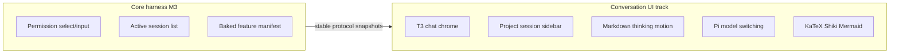

# Conversation UI track

## Status

Active / partially implemented. Milestone 3 is accepted; this independent track continues to own conversation chrome on Pi. It does not expand Milestone 4's settings scope.

Implemented slices: docs split, sanitized dense markdown, T3-faithful work-entry tool/thinking timeline (including ordered live `run.work` segments so think → tool → think stays interleaved while streaming), Cursor-inspired shell chrome (sidebar actions, soft panels, composer footer model/thinking selectors, user message chip, empty-session hero composer), collapsible project/session sidebar, `listWorkspaceSessions`, Pi model/thinking selectors, reduced-motion-safe working/streaming chrome, KaTeX math, Shiki code highlighting, and Mermaid diagrams. Permission select/confirm dock dialogs confirm with Enter.

Visual split: shell/sidebar/composer chrome is harness-owned Cursor-inspired language; the assistant timeline (thinking/tool rows, markdown density) remains T3-adapted.

## Relationship to the core harness

| Track | Owns |
| --- | --- |
| Accepted Milestone 3 ([implementation-plan.md](../implementation-plan.md)) | Baked feature manifest, permission `select`/`input`, dialog focus, no resource catalog, active session list correctness |
| Active Milestone 4 | Appearance and permission behavior settings; immutable feature composition |
| This plan | Project/session sidebar, markdown/thinking/motion, Pi model and thinking selectors, KaTeX, Shiki, Mermaid |

## Product shape

Steal T3’s chat timeline density for thinking/tool rows; shell chrome may follow Cursor-like soft panels and composer footer selectors. Steal neither product’s branding or out-of-scope features.

In scope:

- zinc/dark theme, hidden inset titlebar, sidebar/chat/composer chrome;
- collapsible recent projects with session rows and compact relative timestamps;
- sanitized markdown and code rendering (KaTeX, Shiki, Mermaid);
- compact thinking blocks and tool rows;
- light reduced-motion-safe enter/stream motion;
- Pi-backed model and thinking selectors (composer footer);
- centered empty-session composer with workspace and local-machine context chips.

Out of scope:

- T3 branding, Clerk/Connect, git commit/push;
- codebase-overview dashboard or changed-files as the main surface;
- attachments, marketplace, drag-and-drop project chrome, Plan/Multitask, git branch switching;
- copying `refs/t3code` ChatMarkdown wholesale (`rehype-raw`, file-link graph);
- MDX, Expressive Code, or arbitrary extension renderers.

References stay read-only. Record material adaptations in [references-and-attribution.md](../references-and-attribution.md). No runtime dependency on `refs/t3code`.

## Architecture constraints

- Renderer talks only to the protocol.
- One live `AgentSessionRuntime` at a time. Switching project/session replaces cwd/runtime.
- Inactive projects may list sessions via `SessionManager.list` without becoming live.
- Model/thinking changes use Pi public session APIs behind narrow protocol commands.
- Assistant markdown is untrusted: `react-markdown` + `remark-gfm` + `remark-math` + `rehype-sanitize` + `rehype-katex`. No `rehype-raw`, no MDX.
- Shiki and Mermaid run only after a message settles (`isStreaming`); while streaming, fenced code and Mermaid stay plain source.
- External links leave through the main-process `http:`/`https:` gate.
- Respect `prefers-reduced-motion`.

## Slices

### 1. Docs split

Write this file; retarget Milestone 3 so markdown/model/motion polish are not core harness exit gates; point product/AGENTS/development at this plan.

### 2. Chat readability

Render assistant/user text with sanitized markdown/code. Collapse thinking when settled. Keep tool rows compact. Auto-scroll to latest. Hide Protocol/runtime chrome from permanent sidebar chrome (About/diagnostics only, collapsed).

### 3. Motion

Small CSS enter/expand for thinking and a streaming caret. Use `motion-reduce:transition-none` / reduced-motion media rules. Do not add `@formkit/auto-animate` or dnd-kit.

### 4. Project sidebar

Collapsible recent workspaces (app metadata, max 8) with session rows. Active project expanded. Add project uses the native directory picker. `listWorkspaceSessions` loads inactive project sessions without replacing the live runtime until the user opens a session.

### 5. Pi model and thinking selectors

Header/composer selectors wired through `setSessionModel` / `setThinkingLevel` and Pi `AgentSession` APIs. Snapshot projects current model, thinking level, and available levels.

### 6. LaTeX / KaTeX

`remark-math` + `rehype-katex` after sanitize (official safe order). Keep `http`/`https` links only; no images; no `rehype-raw`.

### 7. Shiki highlighting

Settled fenced code blocks highlight with Shiki (`github-light` / `github-dark` from `prefers-color-scheme`). Skip while streaming. Keep existing codeblock header chrome. Adapted lightly from T3’s cache/skip-streaming pattern—not wholesale ChatMarkdown.

### 8. Mermaid diagrams

Fenced `mermaid` blocks auto-render when settled with `securityLevel: "strict"` and dynamic `import("mermaid")`. While streaming or on render error, show escaped source in the plain codeblock chrome.

### 9. Empty-session hero

When a live session has no messages and no active run, center a hero composer with workspace and local-machine context chips. After the first prompt is admitted, return to the docked transcript and composer. Do not add Plan/Multitask, attachments, microphone, git branch switching, or Cursor branding.

## Verification

- Unit: markdown sanitization (no raw HTML), KaTeX output without scripts, Mermaid streaming vs settled wrappers, thinking collapse defaults, interleaved streaming `run.work` (think → tool → think), Enter confirm for select/confirm dialogs, sidebar grouping helpers when present, empty-session hero vs docked layout.
- Runtime/application: list sessions without runtime swap; model/thinking commands update snapshots.
- Desktop: new empty session shows the centered composer; open two recents, expand both, switch session, stream markdown; About remains collapsed; reduced-motion still usable.
- Attribution current.

## Exit evidence for this track

- Collapsible multi-project sidebar with sessions for active and inactive recents.
- Empty sessions open on a centered hero composer; the docked transcript layout returns after the first message.
- Sanitized markdown/code in the transcript with KaTeX, Shiki (settled), and Mermaid (settled).
- Thinking/tool hierarchy readable; light motion respects reduced-motion.
- Model and thinking selectors change the live Pi session.
- No MDX, Expressive Code, or `rehype-raw`.
- No runtime import of reference submodules.
