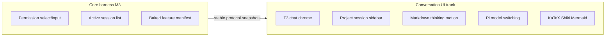

# Conversation UI track

## Status

Active / partially implemented. Personal-v1 Milestone 3 is accepted; this independent track continues to own conversation chrome on Pi. It does not expand personal-v1 Milestone 4's settings scope. V2 Milestone 3 is accepted for multi-session lifecycle, sidebar activity, right-click archive/remove, and the Settings archived list.

Implemented slices: docs split, sanitized dense markdown, T3-faithful work-entry tool/thinking timeline (including ordered live `run.work` segments so think → tool → think stays interleaved while streaming), Codex-inspired turn-level “Worked for …” collapse (one disclosure for thinking, tools, and pre-tool narration across consecutive assistant messages in a user→assistant turn; text after the last tool stays outside), Cursor-inspired shell chrome (sidebar actions, soft panels, composer footer model/thinking selectors, user message chip, empty-session hero composer, inline `@` reference chips in composer and user messages), wider collapsible shell sidebar with denser project rows (path, count, `+`), stable manual project order with project-folder DnD (`reorderRecentWorkspaces`; session switch does not bump folders), `listWorkspaceSessions`, Pi model/thinking selectors, KaTeX math, Shiki code highlighting, Mermaid diagrams, dense sanitized markdown in expanded thinking rows, polished tool expand panels (parsed command/path input, labeled Input/Output, no raw JSON dump for simple shell calls), composer usage chrome (linear reddening context bar, ↑↓ tokens, cache R/W, session $, custom model picker with provider icons, provider groups, filter, and $/M rates from Pi), clipboard copy for settled assistant output plus fenced code blocks, owner rewrite of settled assistant markdown as a display overlay, static working chrome while the agent is waiting, compositor-only caret/enter/pulse motion, tool-chip collapsed tool rows, prompt-bar highlight rings for max thinking, `@` mentions, and a `/` skill stub, and a compact Beautiful UI approval card for permission select/confirm/input docks. Permission select/confirm dock dialogs confirm with Enter. Live assistant output streams as sanitized GFM markdown (no KaTeX/Shiki/Mermaid on the token path); live thinking stays plaintext; KaTeX/Shiki/Mermaid run after a turn settles, with KaTeX only when the settled text looks like math. Streaming deltas update a per-chat live-run store so sidebar/composer/settled turns do not re-render per token, and switching away from a live run keeps thinking/text/tool deltas until you return.

Visual split: shell/sidebar chrome is harness-owned Cursor-inspired language; composer highlight, tool-chip density, and permission-dock approval cards are Beautiful UI–adapted; assistant tool rows remain T3-adapted headings with Beautiful UI chips; turn collapse is Codex-inspired.

## Relationship to the core harness

| Track | Owns |
| --- | --- |
| Accepted v1 Milestone 3 ([archived implementation plan](../archive/v1/implementation-plan.md)) | Baked feature manifest, permission `select`/`input`, dialog focus, no resource catalog, active session list correctness |
| Accepted v1 Milestone 4 | Appearance and permission behavior settings; immutable feature composition |
| Accepted v2 Milestone 3 | Independent background session controllers, scoped activity/attention, archive/restore, recoverable chat removal |
| This plan | Project/session sidebar, markdown/thinking/motion, Pi model and thinking selectors, KaTeX, Shiki, Mermaid |

## Product shape

Steal T3’s chat timeline density for thinking/tool rows; shell chrome may follow Cursor-like soft panels and composer footer selectors. Steal neither product’s branding or out-of-scope features.

In scope:

- Default plus named palettes (Gruvbox, Catppuccin, Flexoki, GitHub, One Dark) with light/dark/system mode, optional frosted glass, hidden inset titlebar, sidebar/chat/composer chrome;
- collapsible shell sidebar and collapsible recent projects with session rows and compact relative timestamps;
- stable project order (no MRU bump on session switch) plus drag-and-drop reorder of project folders only;
- sanitized markdown and code rendering (KaTeX, Shiki, Mermaid, http(s)/data image lightbox);
- copy whole settled assistant output and copy fenced code blocks;
- owner rewrite of settled assistant markdown (display overlay; Pi JSONL messages stay unchanged);
- compact thinking blocks and tool rows;
- Pi-backed model and thinking selectors (composer footer);
- centered empty-session composer with workspace and local-machine context chips;
- project-permission trust dialog after adding or opening a workspace that has an untrusted override, plus a banner to trust later. The persistence contract remains Settings/application metadata, not Pi `trust.json`.

Out of scope:

- T3 branding, Clerk/Connect, git commit/push;
- codebase-overview dashboard or changed-files as the main surface;
- attachments, marketplace, session-row drag reorder, Plan/Multitask, git branch switching;
- Skills/Extensions sidebar nav, worktrees, pinned sessions, sidebar width resize handle;
- copying `refs/t3code` ChatMarkdown wholesale (`rehype-raw`, file-link graph);
- MDX, Expressive Code, or arbitrary extension renderers.

References stay read-only. Record material adaptations in [references-and-attribution.md](../references-and-attribution.md). No runtime dependency on `refs/t3code`.

## Architecture constraints

- Renderer talks only to the protocol.
- Current implementation: a bounded registry of session controllers in the runtime. Switching project/session selects a controller; it does not abort or dispose an unrelated live run. The renderer keeps a keyed conversation cache, a per-chat live-run store for in-flight thinking/text/tools, per-chat drafts, and sidebar activity rows. Archive chat / Move chat to Trash from the session actions menu; archived chats live in Settings, grouped by project. Recoverable OS-Trash removal is accepted.
- Inactive projects may list sessions via `SessionManager.list` without becoming live.
- Model/thinking changes use Pi public session APIs behind narrow protocol commands.
- Assistant markdown is untrusted: `react-markdown` + `remark-gfm` + `rehype-sanitize`, plus `remark-math` + `rehype-katex` after sanitize when settled text looks like math. Markdown images are gated to credential-less `http`/`https`/`data:` only. No `rehype-raw`, no MDX.
- Live `run.streamingText` uses `ConservativeMarkdown` with GFM + sanitize only. KaTeX, Shiki, and Mermaid run after a message settles. Settled KaTeX (`remark-math` + `rehype-katex`) runs only when the text looks like math; KaTeX CSS loads on that path. Live thinking stays plaintext.
- External links leave through the main-process `http:`/`https:` gate.
- Respect `prefers-reduced-motion`.

## Slices

### 1. Docs split

Write this file; retarget personal-v1 Milestone 3 so markdown/model/motion polish are not core harness exit gates; point product/AGENTS/development at this plan.

### 2. Chat readability

Render assistant/user text with sanitized markdown/code. Collapse thinking, tools, and pre-tool narration when settled; keep only text after the last tool outside the work log. Keep tool rows compact. Auto-scroll to latest. Hide Protocol/runtime chrome from permanent sidebar chrome (About/diagnostics only, collapsed).

### 3. Motion (cheap compositor)

Keep opacity/transform motion for smoother session and stream chrome: streaming caret blink, session-pane enter, thinking-body fade, project-session list enter, opacity-only session-switch pulse, empty-session glow, and a live thinking pulse dot. Do not restore Beautiful UI pixel-grid loading-state, word-level blur-in, or the 100ms tenths elapsed clock. Waiting chrome stays static “Working” / “Working for …” text. `prefers-reduced-motion` disables these animations (caret stays visible). Session open/create stays in-shell: optimistic sidebar selection and a dimmed pane—never the full-app Loading screen.

### 4. Project sidebar

Wider collapsible shell sidebar (localStorage chrome) with denser project rows (name, path, session count, inline new-session). Collapsible recent workspaces (app metadata, max 8) with ordinary session rows. Right-click a chat for Archive chat and Move chat to Trash. Archived chats live in Settings, grouped by project, not in a sidebar Archived section. Active project expanded. Manual order: `rememberWorkspace` updates in place / appends new folders; `reorderRecentWorkspaces` persists DnD order; switching sessions must not bump a folder to the top. Add project uses the native directory picker. `listWorkspaceSessions` loads inactive project sessions without replacing the live runtime until the user opens a session.

### 5. Pi model and thinking selectors

Header/composer selectors wired through `setSessionModel` / `setThinkingLevel` and Pi `AgentSession` APIs. Snapshot projects current model, thinking level, and available levels. Mid-turn model/thinking changes stay blocked while a run is active. After a chat already has messages, choosing another model shows a confirm dialog before applying.

### 6. LaTeX / KaTeX

`remark-math` + `rehype-katex` after sanitize (official safe order), only when settled text looks like math. KaTeX CSS loads on that path. Keep `http`/`https` links only; allow markdown images for credential-less `http`/`https`/`data:` image URLs with an inline preview + lightbox; reject `file:`, relative workspace paths, and other schemes (show alt/fallback). Composer image attachments (picker and clipboard paste) are Milestone 1 Slice 4. Workspace file serving remains out of scope. No `rehype-raw`.

### 7. Shiki highlighting

Settled fenced code blocks highlight with Shiki (`github-light` / `github-dark` from `prefers-color-scheme`). The highlighter starts with `text` and `loadLanguage`s on demand. While streaming, fenced code stays a plain `<pre>` in the codeblock chrome. Adapted lightly from T3’s cache/skip-streaming pattern—not wholesale ChatMarkdown.

### 8. Mermaid diagrams

Fenced `mermaid` blocks auto-render when settled with `securityLevel: "strict"` and dynamic `import("mermaid")`. While streaming or on render error, show escaped source in the plain codeblock chrome.

### 9. Empty-session hero

When a live session has no messages and no active run, center a hero composer with workspace and local-machine context chips. After the first prompt is admitted, return to the docked transcript and composer. Image attachments are Milestone 1 Slice 4 (paperclip on vision-capable models). Do not add Plan/Multitask, microphone, git branch switching, or Cursor branding.

### 10. Usage chrome and model picker

Project Pi `getSessionStats()` / `getContextUsage()` and model `cost` / `contextWindow` into the protocol. Show a Pi-inspired composer usage strip: linear context bar (fill + color shifting toward red as usage rises), ↑ input / ↓ output, R/W cache when non-zero, and session `$` cost. Detail breakdown opens on click. Replace the native model `<select>` with a custom picker that shows provider icons and `$in/$out per 1M` rates, groups models by provider, and offers an autofocused filter over name/id/provider. UX reference only: [AI Elements Context](https://elements.ai-sdk.dev/components/context) (bar instead of circle); do not depend on AI Elements or tokenlens—costs come from Pi.

### 11. Owner rewrite of assistant output

Settled assistant markdown can be edited in place from the turn action row (Edit next to Copy). Save stores a display overlay as a Pi custom session entry (`pho-code.assistant-rewrite`) keyed by the projected message id. Pi JSONL assistant messages stay unchanged, so later model turns still see the original text. Restore writes a null overlay and shows the Pi original again. No agent tool.

## Verification

- Unit: markdown sanitization (no raw HTML), safe markdown image src gate (http(s)/data only), KaTeX output without scripts, KaTeX skipped for settled prose without math, Mermaid streaming vs settled wrappers, live streaming GFM without KaTeX, code-block and assistant-output copy controls, assistant-output rewrite overlay plus Edit/Edited chrome, thinking collapse defaults, interleaved streaming `run.work` (think → tool → think), turn-level “Worked for …” collapse across consecutive assistant messages with pre-tool narration inside the work log, compact approval-card host dialog plus Enter confirm for select/confirm, sidebar grouping helpers when present, empty-session hero vs docked layout, usage strip markup, token/cost formatters, context-bar color scale, model picker filter/group helpers, static working chrome plus compositor caret, keyed live-run store isolation (background thinking survives switch-back), tool-chip preview, composer highlight helpers, `/` token detection.
- Runtime/application: list sessions without runtime swap; model/thinking commands update snapshots; snapshots include usage/contextUsage and model cost/window; owner rewrite overlays persist as Pi custom session entries and reconstruct on reopen without mutating JSONL messages.
- Desktop: new empty session shows the centered composer; open two recents, expand both, switch session without reordering projects, stream markdown; shell sidebar collapse toggle works; About remains collapsed; reduced-motion still usable; after a turn the usage strip shows ↑↓ and $.
- Attribution current.

## Exit evidence for this track

- Wider collapsible multi-project sidebar with sessions for active and inactive recents; project order is manual (DnD) and stable across session switches.
- Empty sessions open on a centered hero composer; the docked transcript layout returns after the first message.
- Sanitized markdown/code in the transcript with KaTeX, Shiki (settled), Mermaid (settled), and http(s)/data image lightbox.
- Owner can rewrite settled assistant markdown in place; Copy uses the visible text; Restore returns the Pi original. Pi JSONL messages stay unchanged.
- Thinking/tool hierarchy readable, with pre-tool assistant narration inside the settled work log; compositor-only enter/caret/pulse motion (opacity/transform); no blur-in, pixel-grid, or 100ms tenths clock.
- Model and thinking selectors change the live Pi session.
- Composer usage strip shows context bar, ↑↓ tokens, cache, and session cost from Pi-projected snapshot fields.
- Model picker shows provider icons and catalog $/M rates, groups by provider, and filters by name/id/provider.
- Thinking level uses the composer select over Pi available levels, with a purple accent and prompt-bar ring when the top level is selected. `@` mention and `/` skill tokens use teal and amber rings respectively. `/` lists skills from enabled sources and inserts a source-qualified token; the runtime expands it on send. Limited or incompatible skills show a small confirmation popup. Mention autocomplete stays open across spaces until Enter/Tab or Escape.
- Live tokens render as sanitized GFM markdown; KaTeX, Shiki, and Mermaid wait until settle. Settled KaTeX runs only when the text looks like math.
- Static “Working” / “Working for …” text while a run is live; no pixel-grid loader. Streaming caret and session/thinking enter motion stay compositor-only.
- Permission docks use a compact Beautiful UI approval card (radio rows, dismiss, footer send) without becoming a full-screen modal.
- Project permission-rule trust uses an owner confirmation dialog and a later-trust banner; it does not write Pi `trust.json`.
- No MDX, Expressive Code, or `rehype-raw`.
- No runtime import of reference submodules.
