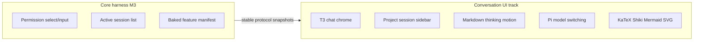

# Conversation UI track

## Status

Active / partially implemented. Personal-v1 Milestone 3 is accepted; this independent track continues to own conversation chrome on Pi. It does not expand personal-v1 Milestone 4's settings scope. V2 Milestone 3 is accepted for multi-session lifecycle, sidebar activity, right-click archive/remove, and the Settings archived list.

Implemented slices: docs split, sanitized dense markdown, T3-faithful work-entry tool/thinking timeline (including ordered live `run.work` segments so think → tool → think stays interleaved while streaming), narrative work phases (each pre-tool narration text heads a phase as ordinary prose with a terse tool-derived summary label — `editing theme.css`, `running 2 commands` — above its indented think/tool entries, plus the contiguous thinking that produced the narration; live, streaming text commits as a narration work entry when a new tool starts and the post-last-tool tail stays in `streamingText`), Codex-inspired turn-level “Worked for …” collapse (one disclosure for the phases across consecutive assistant messages in a user→assistant turn; text after the last tool stays outside), Cursor-inspired shell chrome (sidebar actions, soft panels, composer footer model/thinking selectors plus Plan/Agent on the composer mode icon from the archived plan-agent add-on, user message chip, empty-session hero composer, inline `@` reference chips in composer and user messages, composer and transcript `/` skill chips that show a book kind glyph plus the skill name (no source mark), as a visible orange pill aligned with `@` chips), a Claude Code-inspired composer relayout (empty-session machine/workspace chip rail above the field, prepared image thumbs above the prompt, prompt-only field with an inline `↵` send, flat mode/model/usage toolbar below), a Warp-inspired empty-session hero greeting (“What would you like to work on?”) with round starter-task pills under the composer (Lucide icon + label; a click fills the draft and focuses the field, never auto-sends), wider collapsible shell sidebar with mouse-resizable width, platform-ordered collapse control, a no-session welcome launcher, and single-line compact project/session rows (open/closed folder glyph; project right-click: New session, Copy pathname, Remove project; flat context menus; session titles are a short summary — Pi `sessionName` when set, otherwise a humanized first-prompt fallback that never includes expanded skill bodies; after the first settled turn the current model may persist a 3–8 word title through Pi `setSessionName`), stable manual project order with project-folder DnD (`reorderRecentWorkspaces`; session switch does not bump folders), `listWorkspaceSessions`, Pi model/thinking selectors, KaTeX math, Shiki code highlighting, Mermaid diagrams, fenced SVG previews, dense sanitized markdown in expanded thinking rows, polished tool expand panels (parsed command/path input, labeled Input/Output, no raw JSON dump for simple shell calls; web search lists a query row plus colorful site results, and fetch uses a site web icon), composer usage chrome (flat toolbar under the field: clickable circular meter and bold quiet percent; ↑↓ tokens, cache R/W, and session $ in the detail popover; custom model picker with Lobe Icons provider and model-type marks, provider groups, filter, and $/M rates from Pi), clipboard copy for settled assistant output plus fenced code blocks, owner rewrite of settled assistant markdown as a display overlay, per-session context prompt editor (empty chats customize preamble + on/off chips; after the first message the same panel is inspect-only; the runtime re-injects compiled string A each turn), live Working/Thinking labels with a moving text highlight (sparkle on the live Thinking row only), the same sweep tuned slower on the live streaming tail (plain text under reduced motion), compositor-only caret/enter motion, live thinking/assistant text without a synthetic caret or leading-edge blur, collapsed thought/tool rows with small quiet CSS-ellipsis preview text (Seatbelt-wrapped bash shows a shield; web search/fetch omit that preview because site icons identify the work), prompt-bar highlight rings for `@` mentions and a `/` skill stub, gliding `@` / `/` picker menus with a type-to-search footer, and a compact Beautiful UI approval card for permission select/confirm/input docks. Ask-back questionnaires use a sibling Beautiful UI–inspired card on the same dock (`kind: "questionnaire"`) owned by [`archive/features/plan-agent`](../../archive/features/plan-agent/README.md). Letter/digit option shortcuts do not fire while Type something or the note field is focused. Permission prompts use a short action title and the command or path, with the raw agent request behind View request. Permission select options are **Allow once**, **Allow for this session**, and **No, provide reason** (reason optional on the same card). Permission select/confirm dock dialogs confirm with Enter. Live assistant output streams as sanitized GFM markdown (no KaTeX/Shiki/Mermaid/SVG on the token path); live thinking stays plaintext; KaTeX/Shiki/Mermaid/SVG run after a turn settles, with KaTeX only when the settled text looks like math. Streaming deltas update a per-chat live-run store; the live transcript tail is the only transcript subscriber, so sidebar, composer, and settled turns do not re-render per token. Switching away from a live run keeps thinking/text/tool deltas until you return. Collapse swaps the project panel for a compact overlay pill (open folder, new session, settings) without unmounting sidebar state; when the right sidebar is also expanded, those actions move into the chat header. The conversation column keeps its centered 48rem cap in every state — the side gap shrinks to the base padding when space is tight but never disappears. Session open/create patches the sidebar catalog from the snapshot instead of listing on every settle. The right sidebar is a tiling tab host: each surface opens as a tab that tiles beside one other visible tab (stacked, or side by side when the panel is wide), with a draggable divider, a minimized tray beyond the two-tile cap, and rail re-click closing a tile. The main chat region is a Claude-style flat tab strip in the topbar row over a single edge-to-edge chat: every open chat is a tab, the active tab is the selected conversation, and closing a tab is view-only.

Visual split: shell/sidebar chrome is harness-owned Cursor-inspired language, including the compact 3×3 running mark while a session is live; composer highlight and permission-dock approval cards are Beautiful UI–adapted; assistant tool rows remain T3-adapted headings with owner-facing titles (`ls` → Browse, `bash` → Run; the protocol block keeps the Pi id) and small quiet preview text (sandboxed bash shows a shield; web search/fetch use site icons only); work-entry glyphs default to Lucide (Settings Appearance can switch to Pho, CodeX, or colorful Meteocons cropped to the same 14px slot); provider/backend/model marks default to mono Lobe and can switch to Color on a light contrast plate; settled Thought uses the same 16px icon slot as tools; turn collapse is Codex-inspired. This track owns the persistent right-sidebar host: chat-header launcher icons, a resizable tiling tab host for Changes, Context prompt, and Plan, Changes as the review window filling its tile, focus, exhaustive surface handling, and ⌘R / Ctrl+R to toggle. The host is a tiling tab host (slice 15): each surface is a tab, open tabs tile instead of switching, and re-clicking an open surface's launcher icon closes its tile. Archived V3 owns accepted Changes, Approve, and Undo semantics ([`archive/v3`](../../archive/v3/README.md)); the terminal add-on owns Terminal product and PTY behavior ([`features/terminal`](../../features/terminal/README.md)); the plan-agent add-on owns Plan/Agent, ask-user, and the Plan document ([`archive/features/plan-agent`](../../archive/features/plan-agent/README.md)); bounded Stop of a stuck run is owned by [`archive/urgent/agent-stop`](../../archive/urgent/agent-stop/README.md). See the shared [right-sidebar work log](../logs/2026-08-15-change-v3-right-sidebar.md), [surface-toggle log](../logs/2026-08-16-change-right-sidebar-surface-toggle.md), [Plan surface decision](../logs/2026-08-16-decision-plan-sidebar-surface.md), [ask-user card log](../logs/2026-08-16-change-ask-user-card.md), [sidebar divider log](../logs/2026-08-16-change-sidebar-dividers.md), [shortcut/scrollbar log](../logs/2026-08-16-change-sidebar-shortcuts-scrollbar.md), [split-pane fill log](../logs/2026-08-16-change-split-pane-chat-fill.md), [session archive button log](../logs/2026-08-16-change-session-archive-button.md), [verbose pane copy log](../logs/2026-08-16-change-verbose-pane-copy.md), [permission-dialog options log](../logs/2026-08-16-feedback-permission-dialog-options.md), [permission-dialog chrome log](../logs/2026-08-16-feedback-permission-dialog-chrome.md), [Plan/Agent composer chrome log](../logs/2026-08-18-change-plan-agent-composer-chrome.md), [layered glass chrome log](../logs/2026-08-19-change-glass-composer-right-bar.md), [settings glass and composer center log](../logs/2026-08-20-change-glass-settings-composer-center.md), [Settings frost revert](../logs/2026-08-20-change-revert-settings-glass.md), and [sandbox bash shield](../logs/2026-08-20-change-sandbox-bash-shield.md), and [concise tool chips](../logs/2026-08-21-change-concise-tool-chips.md), [composer relayout](../logs/2026-08-21-change-composer-claude-code-layout.md), [empty-session-only context chips](../logs/2026-08-22-change-composer-context-chips-empty-only.md), [composer radius and border](../logs/2026-08-22-change-composer-radius-border.md), [composer glass frost](../logs/2026-08-22-change-composer-glass-frost.md), and [composer image thumbs above the prompt](../logs/2026-08-22-change-composer-image-above-prompt.md), and [composer skill chip without type glyph](../logs/2026-08-22-change-composer-skill-chip-glyph.md), [transcript skill chip without source mark](../logs/2026-08-22-change-transcript-skill-chip-icon.md), and [thinking shimmer plus prompt-bar picker](../logs/2026-08-22-change-thinking-shimmer-prompt-bar.md), [composer picker overlap](../logs/2026-08-22-feedback-composer-picker-overlap.md), [thinking sparkle plus stream-text](../logs/2026-08-22-change-thinking-sparkle-stream-text.md), [stream-text blur rejected](../logs/2026-08-22-feedback-stream-text-blur.md), and [session summary titles](../logs/2026-08-22-change-session-summary-titles.md), [web search/fetch site icons](../logs/2026-08-22-change-web-tool-site-icons.md), [quiet tool preview text](../logs/2026-08-22-change-quiet-tool-preview.md), [image-model warning dismiss](../logs/2026-08-22-bug-image-model-warning-stale.md), [owner-facing tool titles plus Thought slot](../logs/2026-08-22-change-tool-display-headings.md), and [Lucide as the default work-entry icon pack](../logs/2026-08-22-change-lucide-default-work-icons.md), and [blank window from a post-bootstrap `useEffect`](../logs/2026-08-22-bug-blank-ui-hooks-order.md), and [Claude-style Changes overlay](../logs/2026-08-22-change-claude-changes-overlay.md), and [stacked Changes in the sidebar](../logs/2026-08-22-change-sidebar-stacked-changes.md), and [unified Appearance typography rows](../logs/2026-08-22-change-appearance-typography-rows.md), and [skill chip orange pill](../logs/2026-08-27-change-skill-chip-contrast.md), and [skill chip book glyph](../logs/2026-08-27-change-skill-chip-kind-icon.md), and [unified surface color](../logs/2026-08-27-change-unified-surface-color.md), the [right-sidebar tiling tabs decision](../logs/2026-08-27-decision-right-sidebar-tiling-tabs.md), and the [tiling tabs change](../logs/2026-08-27-change-right-sidebar-tiling-tabs.md), the [floating tiles change](../logs/2026-08-27-change-right-sidebar-floating-tiles.md), the [Changes tile window merge](../logs/2026-08-27-change-changes-tile-window.md), the [chat tab host decision](../logs/2026-08-27-decision-chat-tab-host.md), the [chat tab host change](../logs/2026-08-27-change-chat-tab-host.md), and the [composer max-thinking ring removal](../logs/2026-08-27-change-composer-max-highlight.md), and the [composer toolbar sidebar overlap](../logs/2026-08-27-change-composer-toolbar-sidebar-overlap.md), and the [Lobe brand icons change](../logs/2026-08-27-change-lobe-brand-icons.md), and the [Lobe color / OpenRouter mark change](../logs/2026-08-27-change-lobe-color-openrouter.md), and the [theme-following Lobe marks](../logs/2026-08-27-change-lobe-theme-marks.md), and [hide Cursor models until sign-in](../logs/2026-08-27-change-hide-unauthenticated-cursor.md), and the [Lobe catalog marks](../logs/2026-08-27-change-lobe-catalog-marks.md), and the [CodeX / Meteocons work-entry packs](../logs/2026-08-27-change-work-entry-icon-packs.md), and the [brand Color/Mono plus colorful Meteocons](../logs/2026-08-27-change-brand-icon-style.md), and the [hero greeting plus starter-task chips](../logs/2026-08-31-change-hero-starter-chips.md).

## Relationship to the core harness

| Track | Owns |
| --- | --- |
| Accepted v1 Milestone 3 ([archived implementation plan](../../archive/v1/implementation-plan.md)) | Baked feature manifest, permission `select`/`input`, dialog focus, no resource catalog, active session list correctness |
| Accepted v1 Milestone 4 | Appearance and permission behavior settings; immutable feature composition |
| Accepted v2 Milestone 3 | Independent background session controllers, scoped activity/attention, archive/restore, recoverable chat removal |
| This plan | Project/session sidebar, markdown/thinking/motion, Pi model and thinking selectors, KaTeX, Shiki, Mermaid, SVG |

## Product shape

Steal T3’s chat timeline density for thinking/tool rows; shell chrome may follow Cursor-like soft panels and composer footer selectors. Steal neither product’s branding or out-of-scope features.

In scope:

- Default plus named palettes (Gruvbox, Catppuccin, Flexoki, GitHub, One Dark) with light/dark/system mode, one shared surface color across left sidebar, chat, and right rail (`--sidebar` tracks `--background`; glass fills use one opacity for sidebar, pane, and composer), optional frosted glass (macOS vibrancy plus translucent pane/sidebar fills; composer gets CSS frost when glass is on, a solid pane-paper field when it is off; right bar tints without extra CSS blur), hidden inset titlebar, sidebar/chat/composer chrome, installed UI and code font families (system default or a single OS-installed face, with a live code preview) plus a font-smoothing toggle (typography rows share title + description on the left and a compact control on the right);
- collapsible shell sidebar and collapsible recent projects with session rows and compact relative timestamps;
- mouse-resizable sidebar width (persisted), with the collapse control on the macOS traffic-light inset’s right and leading on Linux;
- welcome launcher when no session is live (greeting, open project, jump back in); the empty-session hero composer stays the live-session empty state;
- stable project order (no MRU bump on session switch) plus drag-and-drop reorder of project folders only;
- sanitized markdown and code rendering (KaTeX, Shiki, Mermaid, fenced SVG as ``, http(s)/data image lightbox);
- copy whole settled assistant output and copy fenced code blocks;
- owner rewrite of settled assistant markdown (display overlay; Pi JSONL messages stay unchanged);
- per-session context prompt (empty-chat edit of preamble + section checkboxes; inspect-only after the first message; compiled string A re-injected each turn);
- compact thinking blocks and tool rows;
- Pi-backed model and thinking selectors plus the Plan/Agent mode icon (composer footer);
- centered empty-session composer, with workspace and local-machine context chips on the composer rail (empty sessions only; the docked chat hides those chips);
- project-permission trust dialog after adding or opening a workspace that has an untrusted override, plus a banner to trust later. The persistence contract remains Settings/application metadata, not Pi `trust.json`.

Out of scope:

- T3 branding, Clerk/Connect, git commit/push;
- codebase-overview dashboard or changed-files as the main surface (a read-only Changes window docks as the Changes tile from a write/edit tool card or the FileDiff icon; the conversation stays primary; Terminal on the docked rail is the [terminal add-on](../../features/terminal/README.md), not this track’s exit gate);
- marketplace, session-row drag reorder, git branch switching;
- Plan/Agent, ask-user, and the Plan document surface (owned by the [`plan-agent`](../../archive/features/plan-agent/README.md) add-on, not this track’s exit gate);
- Skills/Extensions sidebar nav, worktrees, pinned sessions;
- copying `refs/t3code` ChatMarkdown wholesale (`rehype-raw`, file-link graph);
- MDX, Expressive Code, or arbitrary extension renderers.

References stay read-only. Record material adaptations in [references-and-attribution.md](../../references-and-attribution.md). No runtime dependency on `refs/t3code`.

## Architecture constraints

- Renderer talks only to the protocol.
- Current implementation: a bounded registry of session controllers in the runtime. Switching project/session selects a controller; it does not abort or dispose an unrelated live run. The renderer keeps a keyed conversation cache, a per-chat live-run store for in-flight thinking/text/tools, per-chat drafts, and sidebar activity rows. Archive chat from the session-row archive button or the right-click menu; Move chat to Trash from that same menu; archived chats live in Settings, grouped by project. Recoverable OS-Trash removal is accepted.
- Inactive projects may list sessions via `SessionManager.list` without becoming live.
- Model/thinking changes use Pi public session APIs behind narrow protocol commands.
- Assistant markdown is untrusted: `react-markdown` + `remark-gfm` + `rehype-sanitize`, plus `remark-math` + `rehype-katex` after sanitize when settled text looks like math. Markdown images are gated to credential-less `http`/`https`/`data:` only. No `rehype-raw`, no MDX.
- Live `run.streamingText` uses `ConservativeMarkdown` with GFM + sanitize only. KaTeX, Shiki, Mermaid, and fenced SVG run after a message settles. Settled KaTeX (`remark-math` + `rehype-katex`) runs only when the text looks like math; KaTeX CSS loads on that path. Live thinking stays plaintext. Live thinking and assistant tokens remain sharp without a synthetic streaming caret. SVG is a data-URL `` (scripts do not run); not a Claude artifact dock.
- External links leave through the main-process `http:`/`https:` gate.
- Respect `prefers-reduced-motion`.

## Slices

### 1. Docs split

Write this file; retarget personal-v1 Milestone 3 so markdown/model/motion polish are not core harness exit gates; point product/AGENTS/development at this plan.

### 2. Chat readability

Render assistant/user text with sanitized markdown/code. Collapse thinking, tools, and pre-tool narration when settled; keep only text after the last tool outside the work log. Inside the log, work reads as narrative phases: each pre-tool narration block is a full-prose phase heading (not a bordered quote), the think/tool entries that follow it indent under a hairline guide, and the contiguous thinking tail that produced a narration moves under that narration; work before the first narration keeps an unlabeled phase. Live, a `toolEvent` for a new callId commits pending `streamingText` as a narration work entry (`RunWorkEntry` text variant) so phases form in real time; tool updates never commit, and the external-backend projection splits pre-tool text into narration the same way. Keep tool rows compact: collapsed thought and tool rows are the heading only (plus a shield when bash was Seatbelt-wrapped); paths, commands, and thought text live in the expanded detail. Auto-scroll to latest. The scroller owns settled turns plus a live-run tail; token deltas must not walk the settled message list. Hide Protocol/runtime chrome from permanent sidebar chrome (About/diagnostics only, collapsed).

Transcript type scale: `--font-size-chat` defaults to 15px (Settings clamp 12–20 unchanged) at leading 1.65, and `body` sets grayscale font smoothing so Electron does not inherit Chromium's subpixel default. Body prose renders at full `--foreground`; gray (`--secondary-label` / `--muted-foreground`) is reserved for metadata — tool rows, collapsed summaries, timestamps, and the dense thinking variant. Markdown block gap (0.9rem) must stay above intra-paragraph leading, or paragraphs read as one block; headings carry a real size delta (`h2` 1.2em, `h3` 1.05em) to justify their 1.6rem lead-in. Inline code is a borderless `--code-chip-bg` chip mixed against `transparent`, not `--background`, so it keeps its weight inside the user bubble and tool rows; code blocks run 0.875em at leading 1.55. The composer prompt matches transcript body size — never a step under it — and `.composer-send` stays sized to one prompt line box. `chat-column` stays at `48rem`: measure was measured against the reference and is not the lever. Composer radius, outline, glass, and one-line minimum height are owned by the composer logs and are not part of this scale.

### 3. Motion (cheap compositor)

Keep opacity/transform motion for smoother session and stream chrome: thinking-body fade, project-session list enter, empty-session glow, and a live Working/Thinking text shimmer (sparkle on the live Thinking row only). Do not restore Beautiful UI pixel-grid loading-state, word-by-word timer reveal, leading-edge stream-tail blur, or the 100ms tenths elapsed clock. `prefers-reduced-motion` disables these animations (Working/Thinking labels stay solid). Session open/create stays in-shell: optimistic sidebar selection and a chat-pane loading slot (header stays; 3×3 running mark in the transcript area)—never a keyed remount of the shell or the full-app Loading screen.

### 4. Project sidebar

Wider collapsible shell sidebar (localStorage chrome) with a mouse-resizable width (`pho-code.sidebarWidth`, clamp 264–420px, double-click resets; drag does not collapse), a visible 1px shell divider mixed from `--foreground` between the expanded left bar and the main pane (and the same hairline on the expanded right-sidebar host), a visible Projects heading at project-row type size left-aligned with the folder glyphs, and single-line compact project rows (open/closed folder glyph, name, session count; no chevron) and single-line session rows (chat icon or 3×3 running mark while running, title, relative time; preview on hover). Session titles prefer Pi `sessionName`, else a short humanized first-prompt fallback; expanded `<<<pho-skill` bodies never become the title. After the first settled turn, an unnamed session may receive a 3–8 word model summary persisted with Pi `setSessionName` (skipped for the deterministic test model). Session count and relative time stay visible while the sidebar is open. New session remains a one-click Pi action. The active composer begins its lower toolbar with the selected backend; opening it lists the advertised backends, labels external choices Experimental, and places the longer disclosure behind a small info button. Backend identity is part of the selected session key, so changing the composer selection creates a distinct session rather than changing an existing transcript. Collapse is the header button (or ⌘B / Ctrl+B); the panel stays mounted as state and is replaced by a compact overlay pill (Home, Open folder, New session, Settings) matching the right-rail pill chrome, so expanded folders and width survive. When the left bar is collapsed and the right sidebar is expanded, that overlay pill hides and the same actions sit in the chat header so the conversation occupies the whole remaining left pane; transcript and composer drop the `48rem` column cap (`data-chat-fill`). The expanded right host stays mouse-resizable (`pho-code.reviewSidebarWidth`, default 520px, clamp 360–1100px or 62% of the window). ⌘R / Ctrl+R toggles the right sidebar the same way; ⌘⇧R / Ctrl+Shift+R reloads the window. The transcript scroller keeps overflow scroll but hides the native scrollbar. Home deselects the live chat and returns to the welcome launcher without disposing background sessions. Expanded footer Settings and About are icon-only and start-aligned. Collapse control sits to the right of the macOS traffic-light inset and leads on Linux. Right-click a project for New session, Copy pathname (compact path subtitle, copies the full path), and Remove project. Project and chat context menus are opaque sidebar-colored popovers with a dark drop shadow (no light glow), a hairline between each action, and a leading icon. `Remove project` warns, then forgets the folder from recents and moves every chat in it (including archived) to OS Trash; the workspace directory on disk is not deleted. A running chat still blocks Trash. Collapsible recent workspaces (app metadata, max 8). Right-click a chat for Archive chat and Move chat to Trash; hovering a chat row shows an archive button that archives immediately. Archived chats live in Settings, grouped by project, not in a sidebar Archived section. Active project expanded. Manual order: `rememberWorkspace` updates in place / appends new folders; `reorderRecentWorkspaces` persists DnD order; switching sessions must not bump a folder to the top. Add project uses the native directory picker. `listWorkspaceSessions` loads inactive project sessions without replacing the live runtime until the user opens a session. When no session is live, the main pane is a welcome launcher (time-of-day greeting, Open a project, New session in the last folder, recent projects, jump-back sessions) rather than a bare picker; the empty-session hero composer remains the live empty-chat state. While any run is live (working or attention, including a background chat stuck on a permission/ask-user card), a conditional Stop-all row (filled-square glyph, destructive color, live count when more than one, never `busy`-disabled) sits under Open folder and loops the existing `abortRun` over every live row; owned by [`archive/urgent/agent-stop`](../../archive/urgent/agent-stop/README.md), logged in [`../logs/2026-08-19-change-sidebar-stop-all.md`](../logs/2026-08-19-change-sidebar-stop-all.md).

### 5. Model and thinking selectors

Composer selectors are wired through `setSessionModel` / `setThinkingLevel`. Pi snapshots project their model catalog, current model, thinking level, and available levels through Pi `AgentSession` APIs. Codex snapshots project the App Server `model/list` catalog; ACP snapshots project the session's stable select configuration option in the `model` category. Mid-turn model/thinking changes stay blocked while a run is active. After a chat already has messages, choosing another model shows a confirm dialog before applying. External catalogs do not invent unavailable cost or context metadata.

### 6. LaTeX / KaTeX

`remark-math` + `rehype-katex` after sanitize (official safe order), only when settled text looks like math. KaTeX CSS loads on that path. Keep `http`/`https` links only; allow markdown images for credential-less `http`/`https`/`data:` image URLs with an inline preview + lightbox; reject `file:`, relative workspace paths, and other schemes (show alt/fallback). Composer image attachments (picker and clipboard paste) are Milestone 1 Slice 4. Workspace file serving remains out of scope. No `rehype-raw`.

### 7. Shiki highlighting

Settled fenced code blocks highlight with Shiki. The theme follows the active palette (`github-light`/`github-dark`, Gruvbox medium, Catppuccin Latte/Mocha, Solarized for Flexoki, One Dark Pro), loaded on demand from `html[data-palette]` + `html[data-appearance]`. The highlighter starts with `text` and `loadLanguage`s on demand. While streaming, fenced code stays a plain `<pre>` in the codeblock chrome. Chrome uses the palette `--background` fill, a hairline mixed from `--foreground` (so dark palettes stay visible), a matching header divider, compact padding, tight code line-height (`1.2`), and an icon-only copy control. Inline `code` uses the same hairline on a light foreground mix over `--background`, with tight padding so it does not inflate line height. Adapted lightly from T3’s cache/skip-streaming pattern—not wholesale ChatMarkdown.

### 8. Mermaid diagrams

Fenced `mermaid` blocks auto-render when settled with `securityLevel: "strict"` and dynamic `import("mermaid")`. While streaming or on render error, show escaped source in the plain codeblock chrome.

### 8b. SVG diagrams

Fenced `svg` blocks auto-render when settled as a data-URL `` (SVG-as-image: no script execution, no innerHTML). Click opens the existing image lightbox. Copy keeps the source. Reject DOCTYPE/ENTITY, `xml-stylesheet`, non-`<svg>` roots, and oversized payloads; on failure or while streaming, show escaped source in the plain codeblock chrome. Not a persistent Claude-style artifact side panel.

### 9. Empty-session hero

When a live session has no messages and no active run, center a hero composer; the workspace and local-machine context chips ride the composer rail above the field. A static greeting (“What would you like to work on?”) heads the hero, and a wrapping row of round starter-task pills (Lucide icon + label: Explain this codebase, Fix a bug, Write tests, Refactor code, Add a feature) sits under the composer; a chip click fills the composer draft and focuses the field with the caret at the end — it never auto-sends. After the first prompt is admitted, return to the docked transcript and composer and hide the greeting, starter chips, and context chips. Image attachments are Milestone 1 Slice 4 (`Images…` in the composer mode menu on vision-capable models); prepared thumbs sit above the prompt field with no inline transmission caption. Do not add microphone, git branch switching, or Cursor branding. Plan/Agent chrome is the [`plan-agent`](../../archive/features/plan-agent/README.md) add-on, not this slice.

### 10. Usage chrome and model picker

Project Pi `getSessionStats()` / `getContextUsage()` and model `cost` / `contextWindow` into the protocol. The flat composer toolbar under the field shows a Pi-inspired usage control: circular context meter and bold quiet percent (fill + color shifting toward red as usage rises). Clicking the meter opens the detail breakdown (↑ input / ↓ output, R/W cache, session `$` cost). Todos are not in this strip. Replace the native model `<select>` with a custom picker that shows Lobe Icons provider marks on groups and rows (Settings Appearance Brand marks: Mono paints `currentColor`; Color uses Lobe color SVGs on a light plate). OpenRouter catalog ids always use the OpenRouter mark; other catalogs may use a model-type mark such as Claude or Kimi. `$in/$out per 1M` rates, groups models by provider, and offers an autofocused filter over name/id/provider. UX reference only: [AI Elements Context](https://elements.ai-sdk.dev/components/context); do not depend on AI Elements or tokenlens—costs come from Pi.

### 11. Owner rewrite of assistant output

Settled assistant markdown can be edited in place from the turn action row (icon-only Copy and Edit). Save stores a display overlay as a Pi custom session entry (`pho-code.assistant-rewrite`) keyed by the projected message id. Pi JSONL assistant messages stay unchanged, so later model turns still see the original text. Restore writes a null overlay and shows the Pi original again. No agent tool.

### 12. Per-session context prompt

Empty chats can customize the composed system prompt from the right-sidebar **Context prompt** surface: preamble plus grouped on/off checkboxes for context files (`AGENTS.md` and other loaded markdown), tools, and the optional Pi docs block. Chips and group headings show compact character counts (enabled payload on the group, each chip’s body on the row). Pi docs is **off** by default: uncustomized chats strip Pi’s baked documentation block from compiled A so the model does not receive it unless the owner enables the chip and Saves. The Windows `powershell` tool is omitted from the Tools group and the active set (macOS-first; Windows is out of product scope). Cursor SDK tools (`cursor_ask_question`, `cursor_activate_skill`, and `cursor`) appear in that Tools group, in compiled string **A**, and in the active tool set only while the live session model is a Cursor model; switching the picker re-applies the policy. Save compiles one string **A** and persists a Pi custom session entry (`pho-code.context-prompt`). Tool checkboxes that are off call `setActiveToolsByName` so those schemas are not sent; context-file checkboxes that are off omit that file from A only (the file on disk is unchanged). After the first message the same panel stays open for inspection; Save/Reset are refused. Pi clears its system-prompt override after each run. The context-prompt factory always registers `before_agent_start` when the resource loader loads it (before `bindExtensions`), then looks up compiled A from the live session id/cwd at run start. Uncustomized sessions write no JSONL entry; they still inject a Pi-docs-stripped copy of the live system prompt when that block was present. Reset while still empty nulls the custom entry.

### 13. Terminal rail (owned by the terminal add-on)

The right sidebar may gain a Terminal icon and panel. Product, PTY ownership, ghostty-web, CSP, and packaging are specified in [`features/terminal`](../../features/terminal/README.md), not here. This track only keeps the tile host consistent (chat-header launcher icons, resize, tiling tabs with exhaustive surface handling, region hide, ⌘R / Ctrl+R toggle, conversation-primary). Changes fills its tile as the review window. Do not treat Terminal as a conversation-UI exit gate.

### 14. Plan rail (owned by the plan-agent add-on)

The right sidebar may gain a Plan document surface, and the composer may gain a Plan/Agent control. Product, ask-user, todos, and Execute semantics are specified in [`archive/features/plan-agent`](../../archive/features/plan-agent/README.md), not here. `"plan"` is now on `RightSidebarSurface`; composer shows a mode-colored Bot/ListTree button whose menu is Agent/Plan plus `Images…` (Plan option title carries honesty). This track only keeps the rail host consistent. Do not treat Plan as a conversation-UI exit gate.

Changes follows the same ownership rule: this track owns its rail host behavior, while accepted diff, Approve, conflict, and Undo contracts live in [`archive/v3`](../../archive/v3/README.md).

### 15. Tiling tab host

The right-sidebar host is a tiling tab host inspired by Claude desktop, decided in the [tiling tabs decision](../logs/2026-08-27-decision-right-sidebar-tiling-tabs.md), implemented in the [tiling tabs change log](../logs/2026-08-27-change-right-sidebar-tiling-tabs.md), revised to floating i3-style tiles with chat-embedded icons in the [floating tiles change log](../logs/2026-08-27-change-right-sidebar-floating-tiles.md), and with tile drop shadows removed in the [tile no-shadow change log](../logs/2026-08-27-change-right-sidebar-tile-no-shadow.md):

- Each surface (Changes, Context prompt, Plan, Terminal when it lands) is a tab. Opening a tab tiles it beside the already-open tab instead of replacing it; host state is an ordered open-tile set plus a per-pair split ratio.
- There is no collapsed pill. The surface icons live at the top-right edge of the chat (the conversation header trailing slot) and are always visible; the right region exists only while at least one tile is open, and the chat fills the full width otherwise.
- Tiles are floating rounded cards with i3-style gaps and a border only (no drop shadow): padding around the region, an 8px gap between cards that carries the draggable divider (keyboard-operable separator, arrows ±5%), and tray chips for parked tiles at the region's bottom edge.
- One tile fills the region; a second tile splits it as a vertical stack, flipping to side-by-side columns once the region is at least 880px wide. Orientation is derived from width, never persisted.
- Icon clicks toggle tiles: click a closed surface to open its tile, click an open surface to close its tile. At most two tiles are visible; a third opens parked as a tray chip, and clicking a chip swaps it in for the least-recently-used visible tile. Closing or minimizing a visible tile promotes the most recently parked tile into the freed slot.
- Each visible tile except Changes has a slim header (icon, title, minimize, close). Changes fills its tile with the review window chrome (`working tree → basename`, search/whitespace/context, minimize, close) using the same `rounded-xl border-foreground/20` outline and glass fill as Plan and Context prompt (inner solids clear when Frosted glass is on). The sticky per-file row stays opaque `--background` so scrolled hunks do not show through. There is no Expand overlay.
- ⌘R / Ctrl+R and Escape hide the whole region session-only (tiles stay mounted); any tile open reveals it again.
- Open set, minimized set, tile order, and split ratio persist to localStorage beside `pho-code.reviewSidebarWidth`. The region width clamp is unchanged; the collapsed-host preference key is retired.
- Ownership is unchanged: this track owns the host; V3 owns Changes semantics, the terminal add-on owns Terminal, plan-agent owns Plan. Hidden-but-open tiles stay mounted so Terminal's PTY and the Changes diff cache survive minimize and orientation flips.

### 16. Chat tab host

The main chat region is a browser-style tab strip over a single floating chat window, decided in the [chat tab host decision](../logs/2026-08-27-decision-chat-tab-host.md) and implemented in the [chat tab host change log](../logs/2026-08-27-change-chat-tab-host.md):

- Each open chat is a tab keyed by the session key. Host state is an ordered tab list plus an active key — no visible cap, no split, no parked tray. Claude-desktop-style flat text tabs live in the region topbar's middle slot: running tabs show the 3×3 dots, the close × shows on hover, a leading `+` starts a new session in the active workspace, and ArrowLeft/ArrowRight move activation.
- The active chat fills the region flat and edge-to-edge — no floating card, no duplicate title bar. The topbar row keeps the global chrome: sidebar toggle, collapsed-sidebar actions, the active chat's yolo badge and model error, and the right-surface launcher icons scoped to the active tab.
- Sidebar clicks are open-or-focus: a known tab activates, a new session appends and activates. The active tab is `selectedKey`, so the sidebar selection, right-sidebar surfaces, and the Changes tile follow it; background chats keep running on V2's independent session controllers.
- Closing a tab is view-only (the session stays in the sidebar); closing the active tab activates its right neighbor, else the left one; closing the last tab returns to the welcome launcher. Archive/Trash closes the session's tab. Inactive tabs unmount — snapshots, live runs, and composer drafts survive in the keyed cache, live-run store, and per-tab composer map.
- The tab list and active key persist to localStorage as `pho-code.chatTabs`; relaunch restores the strip, loads the active tab, and loads background tabs lazily on first activation.
- Ownership is unchanged: this track owns the host; session lifecycle stays with archived V2 Milestone 3. The right sidebar keeps its own tiling model (slice 15).

## Verification

- Unit: markdown sanitization (no raw HTML), safe markdown image src gate (http(s)/data only), KaTeX output without scripts, KaTeX skipped for settled prose without math, Mermaid streaming vs settled wrappers, SVG streaming vs settled data-URL image (no injected markup), live streaming GFM without KaTeX, code-block and assistant-output copy controls, assistant-output rewrite overlay plus Edit/Edited chrome, context-prompt panel edit vs inspect plus right-sidebar pill chrome, thinking collapse defaults, interleaved streaming `run.work` (think → tool → think), turn-level “Worked for …” collapse across consecutive assistant messages with pre-tool narration inside the work log, narrative phase grouping (thinking-tail absorption under the following narration, unlabeled first phase, consecutive narrations, live text-is-always-narration), narration commit reducers (a new tool commits pending streaming text as a `RunWorkEntry` narration; tool updates and blank text never commit) plus the matching external-backend projection split, live phase markup (prose narration heading above indented entries, streaming tail below), tool-derived phase summary labels (single target, family counts, dominant-activity ties, targetless gerunds, thinking-only phases) and the streaming-tail shimmer class only while live, compact approval-card host dialog plus Enter confirm for select/confirm, questionnaire card chrome distinct from pending-approval copy, permission-prompt summary with collapsed raw request, permission-choice remapping (Allow once / Allow for this session / No, provide reason), sidebar grouping helpers when present, open/closed project folder glyphs, Projects heading alignment, icon-only Settings/About plus collapsed left-sidebar pill, collapsed header actions when the right sidebar is expanded, always-capped chat column (`.chat-column`, no fill override), sidebar Home returning to the welcome launcher, foreground-mix shell dividers on expanded left/right bars, ⌘B/⌘R sidebar shortcuts plus hidden transcript scrollbar, empty-session hero vs docked layout (machine/workspace chips, greeting, and starter-task chips on empty sessions only), welcome recents helpers, usage strip markup, token/cost formatters, context-bar color scale, model picker filter/group helpers, shimmer working chrome plus compositor caret, keyed live-run store isolation (background thinking survives switch-back), local catalog upsert/remove without a list refetch on settle, chat-pane loading without remounting sidebar chrome, concise collapsed tool/thought chips with CSS ellipsis, sandboxed-bash shield, colorful web search/fetch site icons plus a search query row, composer highlight helpers, gliding `@` / `/` picker menus, `/` token detection, right-sidebar surface re-click collapse, session titles that strip expanded skill bodies and humanize leftover skill tokens, right-sidebar tiling tab helpers (open/close/minimize/tray-swap with least-recently-used eviction, split clamp, orientation threshold, persistence round-trip) plus tile frame, tray, and divider chrome, chat tab strip helpers (open-or-focus, neighbor activation on close, pending-key replacement, persistence round-trip with unknown-session revalidation and legacy tiling migration) plus per-key live-run subscriptions.
- Runtime/application: list sessions without runtime swap; model/thinking commands update snapshots; snapshots include usage/contextUsage and model cost/window; owner rewrite overlays persist as Pi custom session entries and reconstruct on reopen without mutating JSONL messages; sandboxed bash call ids persist as Pi custom session entries and reconstruct a shield on reopen; context-prompt save on an empty session persists compiled A and active tools, refuses after the first prompt, and the factory injects A on `before_agent_start` from the live session rather than bind-time state.
- Desktop: new empty session shows the centered composer with the greeting and starter-task chips (click and keyboard Enter fill the draft; the chips unmount once the composer docks); no-session landing shows the welcome launcher; open two recents, expand both, switch session without reordering projects or remounting the shell, stream markdown; shell sidebar collapse toggle, left overlay pill, and width resize handle work; About remains collapsed; reduced-motion still usable; after a turn the usage meter opens ↑↓ and $ in the popover; empty session Context prompt panel is editable from the right-sidebar pill, Save persists, and the same panel is read-only after send; two right-sidebar surfaces tile with a divider, a third parks in the tray and swaps in for the least-recently-used tile, minimizing promotes a parked tile, and closing the last tile collapses the host; opening two chats shows a tab strip over one active chat window, sidebar clicks open-or-focus tabs, closing the active tab activates its neighbor, and closing the last tab returns to the welcome launcher.
- Attribution current.

## Exit evidence for this track

- Wider collapsible multi-project sidebar with sessions for active and inactive recents; project order is manual (DnD) and stable across session switches. Sidebar width is mouse-resizable and persisted. Collapse shows a compact overlay pill (Home, Open folder, New session, Settings); when the right sidebar is also expanded, those actions move into the chat header while the conversation keeps its capped, centered column. Home returns to the welcome launcher without disposing background sessions. The no-session landing is the welcome launcher.
- Empty sessions open on a centered hero composer headed by a greeting, with round starter-task pills under the composer that fill the draft on click or keyboard; the docked transcript layout returns after the first message.
- Sanitized markdown/code in the transcript with KaTeX, Shiki (settled), Mermaid (settled), fenced SVG as a data-URL image (settled, lightbox), and http(s)/data image lightbox.
- Owner can rewrite settled assistant markdown in place; Copy uses the visible text; Restore returns the Pi original. Pi JSONL messages stay unchanged.
- Empty chats can customize the session context prompt (preamble + checkboxes); after the first message the same panel is inspect-only. Customized sessions persist compiled A and re-inject it each turn.
- Thinking/tool hierarchy readable, with pre-tool assistant narration inside the settled work log; live thinking/assistant text stays sharp without leading-edge blur or a synthetic caret; no pixel-grid or 100ms tenths clock.
- Model and thinking selectors change the owning backend session; a separate Fast toggle appears only when that backend/model advertises a fast service tier.
- Empty-session composer rail shows the workspace folder and local machine above the field; those chips hide after the first message. The toolbar under the field shows a context percent+ring, and clicking it opens ↑↓ tokens, cache, and session cost from Pi-projected snapshot fields.
- Model picker shows Lobe Icons marks and catalog $/M rates, groups by provider, and filters by name/id/provider. Settings Appearance **Brand marks** defaults to Mono (`currentColor` masks) and can switch to Color (Lobe `-color.svg` on a light plate so lime/white logos stay visible). OpenRouter rows always use the OpenRouter mark. Pi providers such as Baseten and Cloudflare use their Lobe marks. Backend chips use the same set (Pi, Codex, Claude).
- Settings Appearance Icons lists Lucide (default), Pho, CodeX, and colorful Meteocons (fill set, cropped to the Lucide 14px slot) for transcript tool/thought glyphs.
- Thinking level uses the composer select over Pi available levels, with a purple accent on the top-level label. When the right sidebar squeezes the chat column, the model name truncates and model/thinking/usage menus open left into the composer instead of overlapping the sidebar. `@` mention and `/` skill tokens use teal and orange rings respectively. The composer outline stays the default hairline when max thinking is selected. `/` lists skills from enabled sources and inserts a source-qualified token; the runtime expands it on send. Limited or incompatible skills show a small confirmation popup. Mention autocomplete stays open across spaces until Enter/Tab or Escape.
- Live tokens render as sanitized GFM markdown; KaTeX, Shiki, Mermaid, and SVG wait until settle. Settled KaTeX runs only when the text looks like math.
- Live “Working” / “Working for …” labels shimmer without a sparkle. The live Thinking row keeps the sparkle. No pixel-grid loader. Live thinking and assistant tokens stay sharp without a synthetic caret (no stream-tail blur). `prefers-reduced-motion` keeps labels solid.
- Permission docks use a compact Beautiful UI approval card (radio rows, dismiss, footer send) without becoming a full-screen modal. Permission asks use a short action title and the command or path, without “Pending approval” / “Permission Required” stacking, and keep the raw agent request behind View request. Permission select options are Allow once, Allow for this session, and No, provide reason (optional reason on the same card).
- Project permission-rule trust uses an owner confirmation dialog and a later-trust banner; it does not write Pi `trust.json`.
- No MDX, Expressive Code, or `rehype-raw`.
- No runtime import of reference submodules.
