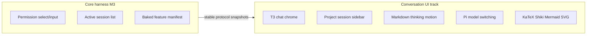

# Conversation UI track

## Status

Active / partially implemented. Personal-v1 Milestone 3 is accepted; this independent track continues to own conversation chrome on Pi. It does not expand personal-v1 Milestone 4's settings scope. V2 Milestone 3 is accepted for multi-session lifecycle, sidebar activity, right-click archive/remove, and the Settings archived list.

Implemented slices: docs split, sanitized dense markdown, T3-faithful work-entry tool/thinking timeline (including ordered live `run.work` segments so think → tool → think stays interleaved while streaming), Codex-inspired turn-level “Worked for …” collapse (one disclosure for thinking, tools, and pre-tool narration across consecutive assistant messages in a user→assistant turn; text after the last tool stays outside), Cursor-inspired shell chrome (sidebar actions, soft panels, composer footer model/thinking selectors plus Plan/Agent on the composer mode icon from the archived plan-agent add-on, user message chip, empty-session hero composer, inline `@` reference chips in composer and user messages), wider collapsible shell sidebar with mouse-resizable width, platform-ordered collapse control, a no-session welcome launcher, and single-line compact project/session rows (open/closed folder glyph; project right-click: New session, Copy pathname, Remove project; flat context menus), stable manual project order with project-folder DnD (`reorderRecentWorkspaces`; session switch does not bump folders), `listWorkspaceSessions`, Pi model/thinking selectors, KaTeX math, Shiki code highlighting, Mermaid diagrams, fenced SVG previews, dense sanitized markdown in expanded thinking rows, polished tool expand panels (parsed command/path input, labeled Input/Output, no raw JSON dump for simple shell calls), composer usage chrome (meta strip: workspace folder plus clickable circular meter and bold quiet percent; ↑↓ tokens, cache R/W, and session $ in the detail popover; custom model picker with provider icons, provider groups, filter, and $/M rates from Pi), clipboard copy for settled assistant output plus fenced code blocks, owner rewrite of settled assistant markdown as a display overlay, per-session context prompt editor (empty chats customize preamble + on/off chips; after the first message the same panel is inspect-only; the runtime re-injects compiled string A each turn), static working chrome while the agent is waiting, compositor-only caret/enter/pulse motion, tool-chip collapsed tool rows, prompt-bar highlight rings for max thinking, `@` mentions, and a `/` skill stub, and a compact Beautiful UI approval card for permission select/confirm/input docks. Ask-back questionnaires use a sibling Beautiful UI–inspired card on the same dock (`kind: "questionnaire"`) owned by [`archive/features/plan-agent`](../../archive/features/plan-agent/README.md). Letter/digit option shortcuts do not fire while Type something or the note field is focused. Permission prompts use a short action title and the command or path, with the raw agent request behind View request. Permission select options are **Allow once**, **Allow for this session**, and **No, provide reason** (reason optional on the same card). Permission select/confirm dock dialogs confirm with Enter. Live assistant output streams as sanitized GFM markdown (no KaTeX/Shiki/Mermaid/SVG on the token path); live thinking stays plaintext; KaTeX/Shiki/Mermaid/SVG run after a turn settles, with KaTeX only when the settled text looks like math. Streaming deltas update a per-chat live-run store; the live transcript tail is the only transcript subscriber, so sidebar, composer, and settled turns do not re-render per token. Switching away from a live run keeps thinking/text/tool deltas until you return. Collapse swaps the project panel for a compact overlay pill (open folder, new session, settings) without unmounting sidebar state; when the right sidebar is also expanded, those actions move into the chat header and the conversation fills the left pane. Session open/create patches the sidebar catalog from the snapshot instead of listing on every settle.

Visual split: shell/sidebar chrome is harness-owned Cursor-inspired language, including the compact 3×3 running mark while a session is live; composer highlight, tool-chip density, and permission-dock approval cards are Beautiful UI–adapted; assistant tool rows remain T3-adapted headings with Beautiful UI chips; turn collapse is Codex-inspired. This track owns the persistent right-sidebar host: collapsed pill, expanded/resizable panel, focus, exhaustive surface selection, re-click of the active surface to collapse, and ⌘R / Ctrl+R to toggle. Archived V3 owns accepted Changes, Approve, and Undo semantics ([`archive/v3`](../../archive/v3/README.md)); the terminal add-on owns Terminal product and PTY behavior ([`features/terminal`](../../features/terminal/README.md)); the plan-agent add-on owns Plan/Agent, ask-user, and the Plan document ([`archive/features/plan-agent`](../../archive/features/plan-agent/README.md)); bounded Stop of a stuck run is owned by [`urgent/agent-stop`](../../urgent/agent-stop/README.md). See the shared [right-sidebar work log](../logs/2026-08-15-change-v3-right-sidebar.md), [surface-toggle log](../logs/2026-08-16-change-right-sidebar-surface-toggle.md), [Plan surface decision](../logs/2026-08-16-decision-plan-sidebar-surface.md), [ask-user card log](../logs/2026-08-16-change-ask-user-card.md), [sidebar divider log](../logs/2026-08-16-change-sidebar-dividers.md), [shortcut/scrollbar log](../logs/2026-08-16-change-sidebar-shortcuts-scrollbar.md), [split-pane fill log](../logs/2026-08-16-change-split-pane-chat-fill.md), [session archive button log](../logs/2026-08-16-change-session-archive-button.md), [verbose pane copy log](../logs/2026-08-16-change-verbose-pane-copy.md), [permission-dialog options log](../logs/2026-08-16-feedback-permission-dialog-options.md), [permission-dialog chrome log](../logs/2026-08-16-feedback-permission-dialog-chrome.md), and [Plan/Agent composer chrome log](../logs/2026-08-18-change-plan-agent-composer-chrome.md).

## Relationship to the core harness

| Track | Owns |
| --- | --- |
| Accepted v1 Milestone 3 ([archived implementation plan](../../archive/v1/implementation-plan.md)) | Baked feature manifest, permission `select`/`input`, dialog focus, no resource catalog, active session list correctness |
| Accepted v1 Milestone 4 | Appearance and permission behavior settings; immutable feature composition |
| Accepted v2 Milestone 3 | Independent background session controllers, scoped activity/attention, archive/restore, recoverable chat removal |
| This plan | Project/session sidebar, markdown/thinking/motion, Pi model and thinking selectors, KaTeX, Shiki, Mermaid, SVG |

## Product shape

Steal T3’s chat timeline density for thinking/tool rows; shell chrome may follow Cursor-like soft panels and composer footer selectors. Steal neither product’s branding or out-of-scope features.

In scope:

- Default plus named palettes (Gruvbox, Catppuccin, Flexoki, GitHub, One Dark) with light/dark/system mode, optional frosted glass, hidden inset titlebar, sidebar/chat/composer chrome;
- collapsible shell sidebar and collapsible recent projects with session rows and compact relative timestamps;
- mouse-resizable sidebar width (persisted), with the collapse control on the macOS traffic-light inset’s right and leading on Linux;
- welcome launcher when no session is live (greeting, open project, jump back in); the empty-session hero composer stays the live-session empty state;
- stable project order (no MRU bump on session switch) plus drag-and-drop reorder of project folders only;
- sanitized markdown and code rendering (KaTeX, Shiki, Mermaid, fenced SVG as ``, http(s)/data image lightbox);
- copy whole settled assistant output and copy fenced code blocks;
- owner rewrite of settled assistant markdown (display overlay; Pi JSONL messages stay unchanged);
- per-session context prompt (empty-chat edit of preamble + section checkboxes; inspect-only after the first message; compiled string A re-injected each turn);
- compact thinking blocks and tool rows;
- Pi-backed model and thinking selectors plus the Plan/Agent mode icon (composer footer);
- centered empty-session composer with workspace and local-machine context chips;
- project-permission trust dialog after adding or opening a workspace that has an untrusted override, plus a banner to trust later. The persistence contract remains Settings/application metadata, not Pi `trust.json`.

Out of scope:

- T3 branding, Clerk/Connect, git commit/push;
- codebase-overview dashboard or changed-files as the main surface (a read-only Changes surface lives in the persistent right sidebar, opened from a write/edit tool card or the FileDiff pill icon; the conversation stays primary; Terminal on that rail is the [terminal add-on](../../features/terminal/README.md), not this track’s exit gate);
- marketplace, session-row drag reorder, git branch switching;
- Plan/Agent, ask-user, and the Plan document surface (owned by the [`plan-agent`](../../archive/features/plan-agent/README.md) add-on, not this track’s exit gate);
- Skills/Extensions sidebar nav, worktrees, pinned sessions;
- copying `refs/t3code` ChatMarkdown wholesale (`rehype-raw`, file-link graph);
- MDX, Expressive Code, or arbitrary extension renderers.

References stay read-only. Record material adaptations in [references-and-attribution.md](../../references-and-attribution.md). No runtime dependency on `refs/t3code`.

## Architecture constraints

- Renderer talks only to the protocol.
- Current implementation: a bounded registry of session controllers in the runtime. Switching project/session selects a controller; it does not abort or dispose an unrelated live run. The renderer keeps a keyed conversation cache, a per-chat live-run store for in-flight thinking/text/tools, per-chat drafts, and sidebar activity rows. Archive chat from the session-row archive button or the right-click menu; Move chat to Trash from that same menu; archived chats live in Settings, grouped by project. Recoverable OS-Trash removal is accepted.
- Inactive projects may list sessions via `SessionManager.list` without becoming live.
- Model/thinking changes use Pi public session APIs behind narrow protocol commands.
- Assistant markdown is untrusted: `react-markdown` + `remark-gfm` + `rehype-sanitize`, plus `remark-math` + `rehype-katex` after sanitize when settled text looks like math. Markdown images are gated to credential-less `http`/`https`/`data:` only. No `rehype-raw`, no MDX.
- Live `run.streamingText` uses `ConservativeMarkdown` with GFM + sanitize only. KaTeX, Shiki, Mermaid, and fenced SVG run after a message settles. Settled KaTeX (`remark-math` + `rehype-katex`) runs only when the text looks like math; KaTeX CSS loads on that path. Live thinking stays plaintext. SVG is a data-URL `` (scripts do not run); not a Claude artifact dock.
- External links leave through the main-process `http:`/`https:` gate.
- Respect `prefers-reduced-motion`.

## Slices

### 1. Docs split

Write this file; retarget personal-v1 Milestone 3 so markdown/model/motion polish are not core harness exit gates; point product/AGENTS/development at this plan.

### 2. Chat readability

Render assistant/user text with sanitized markdown/code. Collapse thinking, tools, and pre-tool narration when settled; keep only text after the last tool outside the work log. Keep tool rows compact. Auto-scroll to latest. The scroller owns settled turns plus a live-run tail; token deltas must not walk the settled message list. Hide Protocol/runtime chrome from permanent sidebar chrome (About/diagnostics only, collapsed).

### 3. Motion (cheap compositor)

Keep opacity/transform motion for smoother session and stream chrome: streaming caret blink, thinking-body fade, project-session list enter, empty-session glow, and a live thinking pulse dot. Do not restore Beautiful UI pixel-grid loading-state, word-level blur-in, or the 100ms tenths elapsed clock. Waiting chrome stays static “Working” / “Working for …” text. `prefers-reduced-motion` disables these animations (caret stays visible). Session open/create stays in-shell: optimistic sidebar selection and a chat-pane loading slot (header stays; 3×3 running mark in the transcript area)—never a keyed remount of the shell or the full-app Loading screen.

### 4. Project sidebar

Wider collapsible shell sidebar (localStorage chrome) with a mouse-resizable width (`pho-code.sidebarWidth`, clamp 264–420px, double-click resets; drag does not collapse), a visible 1px shell divider mixed from `--foreground` between the expanded left bar and the main pane (and the same hairline on the expanded right-sidebar host), a visible Projects heading at project-row type size left-aligned with the folder glyphs, and single-line compact project rows (open/closed folder glyph, name, session count; no chevron) and single-line session rows (chat icon or 3×3 running mark while running, title, relative time; preview on hover). Session count and relative time stay visible while the sidebar is open. Collapse is the header button (or ⌘B / Ctrl+B); the panel stays mounted as state and is replaced by a compact overlay pill (Home, Open folder, New session, Settings) matching the right-rail pill chrome, so expanded folders and width survive. When the left bar is collapsed and the right sidebar is expanded, that overlay pill hides and the same actions sit in the chat header so the conversation occupies the whole remaining left pane; transcript and composer drop the `48rem` column cap (`data-chat-fill`). The expanded right host stays mouse-resizable (`pho-code.reviewSidebarWidth`, default 520px, clamp 360–1100px or 62% of the window). ⌘R / Ctrl+R toggles the right sidebar the same way; ⌘⇧R / Ctrl+Shift+R reloads the window. The transcript scroller keeps overflow scroll but hides the native scrollbar. Home deselects the live chat and returns to the welcome launcher without disposing background sessions. Expanded footer Settings and About are icon-only and start-aligned. Collapse control sits to the right of the macOS traffic-light inset and leads on Linux. Right-click a project for New session, Copy pathname (compact path subtitle, copies the full path), and Remove project. Project and chat context menus are opaque sidebar-colored popovers with a dark drop shadow (no light glow), a hairline between each action, and a leading icon. `Remove project` warns, then forgets the folder from recents and moves every chat in it (including archived) to OS Trash; the workspace directory on disk is not deleted. A running chat still blocks Trash. Collapsible recent workspaces (app metadata, max 8). Right-click a chat for Archive chat and Move chat to Trash; hovering a chat row shows an archive button that archives immediately. Archived chats live in Settings, grouped by project, not in a sidebar Archived section. Active project expanded. Manual order: `rememberWorkspace` updates in place / appends new folders; `reorderRecentWorkspaces` persists DnD order; switching sessions must not bump a folder to the top. Add project uses the native directory picker. `listWorkspaceSessions` loads inactive project sessions without replacing the live runtime until the user opens a session. When no session is live, the main pane is a welcome launcher (time-of-day greeting, Open a project, New session in the last folder, recent projects, jump-back sessions) rather than a bare picker; the empty-session hero composer remains the live empty-chat state. While any run is live (working or attention, including a background chat stuck on a permission/ask-user card), a conditional Stop-all row (filled-square glyph, destructive color, live count when more than one, never `busy`-disabled) sits under Open folder and loops the existing `abortRun` over every live row; owned by [`urgent/agent-stop`](../../urgent/agent-stop/README.md), logged in [`../logs/2026-08-19-change-sidebar-stop-all.md`](../logs/2026-08-19-change-sidebar-stop-all.md).

### 5. Pi model and thinking selectors

Header/composer selectors wired through `setSessionModel` / `setThinkingLevel` and Pi `AgentSession` APIs. Snapshot projects current model, thinking level, and available levels. Mid-turn model/thinking changes stay blocked while a run is active. After a chat already has messages, choosing another model shows a confirm dialog before applying.

### 6. LaTeX / KaTeX

`remark-math` + `rehype-katex` after sanitize (official safe order), only when settled text looks like math. KaTeX CSS loads on that path. Keep `http`/`https` links only; allow markdown images for credential-less `http`/`https`/`data:` image URLs with an inline preview + lightbox; reject `file:`, relative workspace paths, and other schemes (show alt/fallback). Composer image attachments (picker and clipboard paste) are Milestone 1 Slice 4. Workspace file serving remains out of scope. No `rehype-raw`.

### 7. Shiki highlighting

Settled fenced code blocks highlight with Shiki. The theme follows the active palette (`github-light`/`github-dark`, Gruvbox medium, Catppuccin Latte/Mocha, Solarized for Flexoki, One Dark Pro), loaded on demand from `html[data-palette]` + `html[data-appearance]`. The highlighter starts with `text` and `loadLanguage`s on demand. While streaming, fenced code stays a plain `<pre>` in the codeblock chrome. Chrome uses the palette `--background` fill, a hairline mixed from `--foreground` (so dark palettes stay visible), a matching header divider, compact padding, tight code line-height (`1.2`), and an icon-only copy control. Inline `code` uses the same hairline on a light foreground mix over `--background`, with tight padding so it does not inflate line height. Adapted lightly from T3’s cache/skip-streaming pattern—not wholesale ChatMarkdown.

### 8. Mermaid diagrams

Fenced `mermaid` blocks auto-render when settled with `securityLevel: "strict"` and dynamic `import("mermaid")`. While streaming or on render error, show escaped source in the plain codeblock chrome.

### 8b. SVG diagrams

Fenced `svg` blocks auto-render when settled as a data-URL `` (SVG-as-image: no script execution, no innerHTML). Click opens the existing image lightbox. Copy keeps the source. Reject DOCTYPE/ENTITY, `xml-stylesheet`, non-`<svg>` roots, and oversized payloads; on failure or while streaming, show escaped source in the plain codeblock chrome. Not a persistent Claude-style artifact side panel.

### 9. Empty-session hero

When a live session has no messages and no active run, center a hero composer with workspace and local-machine context chips. After the first prompt is admitted, return to the docked transcript and composer. Image attachments are Milestone 1 Slice 4 (`Images…` in the composer mode menu on vision-capable models). Do not add microphone, git branch switching, or Cursor branding. Plan/Agent chrome is the [`plan-agent`](../../archive/features/plan-agent/README.md) add-on, not this slice.

### 10. Usage chrome and model picker

Project Pi `getSessionStats()` / `getContextUsage()` and model `cost` / `contextWindow` into the protocol. Docked composer meta strip shows the workspace folder plus a Pi-inspired usage control: circular context meter and bold quiet percent (fill + color shifting toward red as usage rises). Clicking the meter opens the detail breakdown (↑ input / ↓ output, R/W cache, session `$` cost). Todos are not in this strip. Replace the native model `<select>` with a custom picker that shows provider icons and `$in/$out per 1M` rates, groups models by provider, and offers an autofocused filter over name/id/provider. UX reference only: [AI Elements Context](https://elements.ai-sdk.dev/components/context); do not depend on AI Elements or tokenlens—costs come from Pi.

### 11. Owner rewrite of assistant output

Settled assistant markdown can be edited in place from the turn action row (icon-only Copy and Edit). Save stores a display overlay as a Pi custom session entry (`pho-code.assistant-rewrite`) keyed by the projected message id. Pi JSONL assistant messages stay unchanged, so later model turns still see the original text. Restore writes a null overlay and shows the Pi original again. No agent tool.

### 12. Per-session context prompt

Empty chats can customize the composed system prompt from the right-sidebar **Context prompt** surface: preamble plus grouped on/off checkboxes for context files (`AGENTS.md` and other loaded markdown), tools, and the optional Pi docs block. Save compiles one string **A** and persists a Pi custom session entry (`pho-code.context-prompt`). Tool checkboxes that are off call `setActiveToolsByName` so those schemas are not sent; context-file checkboxes that are off omit that file from A only (the file on disk is unchanged). After the first message the same panel stays open for inspection; Save/Reset are refused. Pi clears its system-prompt override after each run. The context-prompt factory always registers `before_agent_start` when the resource loader loads it (before `bindExtensions`), then looks up compiled A from the live session id/cwd at run start. Uncustomized sessions keep Pi’s live default and write no JSONL entry. Reset while still empty nulls the custom entry.

### 13. Terminal rail (owned by the terminal add-on)

The right sidebar may gain a Terminal icon and panel. Product, PTY ownership, ghostty-web, CSP, and packaging are specified in [`features/terminal`](../../features/terminal/README.md), not here. This track only keeps the rail host consistent (pill, resize, exhaustive surface switch, re-click collapse, ⌘R / Ctrl+R toggle, conversation-primary). Do not treat Terminal as a conversation-UI exit gate.

### 14. Plan rail (owned by the plan-agent add-on)

The right sidebar may gain a Plan document surface, and the composer may gain a Plan/Agent control. Product, ask-user, todos, and Execute semantics are specified in [`archive/features/plan-agent`](../../archive/features/plan-agent/README.md), not here. `"plan"` is now on `RightSidebarSurface`; composer shows a mode-colored Bot/ListTree button whose menu is Agent/Plan plus `Images…` (Plan option title carries honesty). This track only keeps the rail host consistent. Do not treat Plan as a conversation-UI exit gate.

Changes follows the same ownership rule: this track owns its rail host behavior, while accepted diff, Approve, conflict, and Undo contracts live in [`archive/v3`](../../archive/v3/README.md).

## Verification

- Unit: markdown sanitization (no raw HTML), safe markdown image src gate (http(s)/data only), KaTeX output without scripts, KaTeX skipped for settled prose without math, Mermaid streaming vs settled wrappers, SVG streaming vs settled data-URL image (no injected markup), live streaming GFM without KaTeX, code-block and assistant-output copy controls, assistant-output rewrite overlay plus Edit/Edited chrome, context-prompt panel edit vs inspect plus right-sidebar pill chrome, thinking collapse defaults, interleaved streaming `run.work` (think → tool → think), turn-level “Worked for …” collapse across consecutive assistant messages with pre-tool narration inside the work log, compact approval-card host dialog plus Enter confirm for select/confirm, questionnaire card chrome distinct from pending-approval copy, permission-prompt summary with collapsed raw request, permission-choice remapping (Allow once / Allow for this session / No, provide reason), sidebar grouping helpers when present, open/closed project folder glyphs, Projects heading alignment, icon-only Settings/About plus collapsed left-sidebar pill, collapsed header actions when the right sidebar is expanded, pane-fill chat column (`data-chat-fill` / `.chat-column`), sidebar Home returning to the welcome launcher, foreground-mix shell dividers on expanded left/right bars, ⌘B/⌘R sidebar shortcuts plus hidden transcript scrollbar, empty-session hero vs docked layout, welcome recents helpers, usage strip markup, token/cost formatters, context-bar color scale, model picker filter/group helpers, static working chrome plus compositor caret, keyed live-run store isolation (background thinking survives switch-back), local catalog upsert/remove without a list refetch on settle, chat-pane loading without remounting sidebar chrome, tool-chip preview, composer highlight helpers, `/` token detection, right-sidebar surface re-click collapse.
- Runtime/application: list sessions without runtime swap; model/thinking commands update snapshots; snapshots include usage/contextUsage and model cost/window; owner rewrite overlays persist as Pi custom session entries and reconstruct on reopen without mutating JSONL messages; context-prompt save on an empty session persists compiled A and active tools, refuses after the first prompt, and the factory injects A on `before_agent_start` from the live session rather than bind-time state.
- Desktop: new empty session shows the centered composer; no-session landing shows the welcome launcher; open two recents, expand both, switch session without reordering projects or remounting the shell, stream markdown; shell sidebar collapse toggle, left overlay pill, and width resize handle work; About remains collapsed; reduced-motion still usable; after a turn the usage meter opens ↑↓ and $ in the popover; empty session Context prompt panel is editable from the right-sidebar pill, Save persists, and the same panel is read-only after send.
- Attribution current.

## Exit evidence for this track

- Wider collapsible multi-project sidebar with sessions for active and inactive recents; project order is manual (DnD) and stable across session switches. Sidebar width is mouse-resizable and persisted. Collapse shows a compact overlay pill (Home, Open folder, New session, Settings); when the right sidebar is also expanded, those actions move into the chat header and the conversation fills the left pane. Home returns to the welcome launcher without disposing background sessions. The no-session landing is the welcome launcher.
- Empty sessions open on a centered hero composer; the docked transcript layout returns after the first message.
- Sanitized markdown/code in the transcript with KaTeX, Shiki (settled), Mermaid (settled), fenced SVG as a data-URL image (settled, lightbox), and http(s)/data image lightbox.
- Owner can rewrite settled assistant markdown in place; Copy uses the visible text; Restore returns the Pi original. Pi JSONL messages stay unchanged.
- Empty chats can customize the session context prompt (preamble + checkboxes); after the first message the same panel is inspect-only. Customized sessions persist compiled A and re-inject it each turn.
- Thinking/tool hierarchy readable, with pre-tool assistant narration inside the settled work log; compositor-only caret/pulse motion (opacity/transform); no blur-in, pixel-grid, or 100ms tenths clock.
- Model and thinking selectors change the live Pi session.
- Composer meta strip shows the workspace folder and a context percent+ring; clicking it opens ↑↓ tokens, cache, and session cost from Pi-projected snapshot fields.
- Model picker shows provider icons and catalog $/M rates, groups by provider, and filters by name/id/provider.
- Thinking level uses the composer select over Pi available levels, with a purple accent and prompt-bar ring when the top level is selected. `@` mention and `/` skill tokens use teal and amber rings respectively. `/` lists skills from enabled sources and inserts a source-qualified token; the runtime expands it on send. Limited or incompatible skills show a small confirmation popup. Mention autocomplete stays open across spaces until Enter/Tab or Escape.
- Live tokens render as sanitized GFM markdown; KaTeX, Shiki, Mermaid, and SVG wait until settle. Settled KaTeX runs only when the text looks like math.
- Static “Working” / “Working for …” text while a run is live; no pixel-grid loader. Streaming caret and session/thinking enter motion stay compositor-only.
- Permission docks use a compact Beautiful UI approval card (radio rows, dismiss, footer send) without becoming a full-screen modal. Permission asks use a short action title and the command or path, without “Pending approval” / “Permission Required” stacking, and keep the raw agent request behind View request. Permission select options are Allow once, Allow for this session, and No, provide reason (optional reason on the same card).
- Project permission-rule trust uses an owner confirmation dialog and a later-trust banner; it does not write Pi `trust.json`.
- No MDX, Expressive Code, or `rehype-raw`.
- No runtime import of reference submodules.
