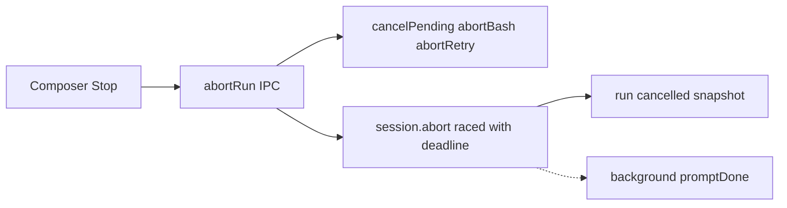

# Implementation plan: agent stop

## Status and use

Proposed urgent-track plan, queued 2026-08-16. This is the implementation contract **after** the owner promotes a milestone. It is not acceptance evidence. No milestone is accepted until its stated evidence exists.

Read [`product.md`](./product.md), [`../../architecture/runtime-and-data.md`](../../architecture/runtime-and-data.md), [`../../architecture/protocol-and-ipc.md`](../../architecture/protocol-and-ipc.md), and [`../../ui/implementation/conversation-ui.md`](../../ui/implementation/conversation-ui.md) before editing `abortRun` or the composer Stop control.

Do not put this work in `archive/v3/`, `archive/features/sandbox/`, or [`window-first-pi-core`](../window-first-pi-core/README.md) source ownership. Do not treat `utilityProcess` as in scope.

## Global acceptance rules

Every milestone must:

- preserve `renderer -> protocol <- shell adapter -> application -> runtime -> Pi SDK`;
- keep Pi `0.84.1` as the agent/session authority;
- keep the renderer free of `electron`, `node:*`, Pi SDK, MCP SDKs, and PTY libraries;
- keep protocol values JSON-safe; no process handles or Pi objects cross the bridge;
- return `abortRun` without waiting unbounded on `waitForIdle` / `promptDone` once Milestone 1 is in source;
- cancel pending host dialogs for that session on Stop;
- leave crash isolation of a dead Pi to [`window-first-pi-core`](../window-first-pi-core/implementation-plan.md) Milestone 3;
- distinguish unit, integration, desktop, packaged, and unverified evidence;
- update architecture, development, current-state, and attribution only when the corresponding milestone lands, and mark accepted behavior only after the gate.

## Architecture

### Today (accepted)


Pi and Electron main are one OS process. If idle never comes, Stop IPC never returns.

### Milestone 1 (proposed)



Same process. Stop signals cancel, cancels host UI, races idle against a deadline, publishes `cancelled`, and returns. Settlement of the abandoned `prompt()` is observed, not awaited on the IPC path. Pi already documents this shape as `raceWithAbortSignal`.

A main-process busy-loop still freezes this graph. That remaining case is window-first Milestone 3.

## Protocol

Prefer the existing `abortRun` command. Add only what bounded cancel requires.

Likely changes (names may tighten in Milestone 1):

- Keep `AbortRunInput` (`sessionId`, `workspaceId`, `runId`). Do not add a generic kill channel.
- `abortRun` must remain JSON-safe and return promptly (void / existing result envelope).
- If the deadline fires before Pi idles, still emit `runSettled` with `status: "cancelled"` and an authoritative snapshot so the reducer can show Send.
- Optional: a bounded `details` flag that abort was forced after deadline. Do not send stacks or child PIDs to the renderer.
- Do not invent `forceKillRuntime` in Milestone 1. Hard-kill of Pi is a child-process operation on window-first Milestone 3.

Validate names against `packages/protocol/src/version.ts` during Milestone 1.

## File ownership

| Layer | Milestone 1 |
| --- | --- |
| `packages/runtime/src/pi-runtime.ts` | Bounded `abortRun`; `cancelPending`; `abortBash` when running; do not await `promptDone` on the command path; dispose/reopen controller only if the deadline plus abort still leaves the session unusable |
| `packages/runtime/src/extension-host.ts` | Already abort-signal aware; ensure `cancelPending` is invoked from `abortRun` |
| `packages/application` | Unchanged validation of `abortRun` identity |
| `packages/protocol` | Only if a cancelled-after-deadline detail is added |
| `packages/ui` + `apps/desktop/src` | `onStop` with `{ busy: false }`; optional Escape-to-Stop; Stop stays enabled |
| `apps/desktop/tests` | Click Stop on `ABORT_ME` and on a hung fixture (pending dialog or sleep bash) |
| `packages/runtime/test` | Abort still allows a second prompt; new case: abort while a host dialog is pending |

## Milestones

### Milestone 0 — Characterize the hang (this research)

**Intent:** Replace anecdote with a written contract.

Already recorded in [`logs/2026-08-16-research-handoff.md`](./logs/2026-08-16-research-handoff.md) and [`../../ui/logs/2026-08-16-bug-stop-does-not-cancel-stuck-run.md`](../../ui/logs/2026-08-16-bug-stop-does-not-cancel-stuck-run.md).

**Acceptance:** those logs exist. No source change required.

**Verification:** not a product test lane. The logs are the artifact.

### Milestone 1 — Bounded Stop

**Intent:** Stop returns the chat to Send within a deadline.

Sequence:

1. `abortRun`: set `abortRequested`, `clearQueue()`, `extensionHost.cancelPending()`, `abortBash()` if `isBashRunning`, `abortRetry()` / `abortCompaction()` if the pinned SDK exposes them on the live session, then `session.abort()` raced against a short deadline (start at 1s; record the chosen value in the milestone log).
2. Do not `await promptDone` on the IPC path. Attach a background observer that still calls `finishRun` if Pi later idles.
3. If the deadline fires: publish `cancelled` + snapshot anyway. If the session remains `sessionBusy` after that, dispose that **controller** and reopen from Pi JSONL (same session id). Do not delete session files.
4. Renderer: `onStop` uses `{ busy: false }`. Stop remains clickable during abort.
5. Optional in the same slice: Escape stops a live run when the composer is focused and no host dialog or menu is open.
6. Tests: runtime abort-with-pending-dialog; Electron clicks Stop on `ABORT_ME` before `END_ABORT_STREAM`; Electron clicks Stop while a permission or ask-user card is showing (deterministic test model).

**Acceptance:**

- unit/integration: abort with a pending host dialog settles `cancelled` and admits a second prompt;
- integration: existing `ABORT_ME` abort test still passes;
- desktop: Stop click during `ABORT_ME` shows Send before the long stream ends;
- desktop: Stop click with a visible permission or ask-user card dismisses the card and shows Send;
- desktop: `busy` does not disable sidebar New session for the duration of a hung abort (or abort no longer hangs);
- packaged: not required unless abort protocol fields change.

**Verification:** focused `bun test` on runtime abort/host-dialog tests, then `bunx playwright test tests/session-lifecycle.spec.ts` (or a new `tests/abort.spec.ts`) plus the ask-user/permission spec that covers the dialog case. Record only checks that ran.

### Milestone 2 — Stop-all and test teardown (optional)

**Intent:** Owner can cancel every live run, and Playwright close does not wait on a stuck abort.

Only start if Milestone 1 still leaves background chats or test close hanging.

- Protocol: either loop `abortRun` per live activity row from the renderer, or one named `abortAllRuns` that the application already can implement from `listSessionActivity()`. Prefer the loop unless a single command is clearly smaller.
- Playwright helper: click Stop on the selected chat, wait for Send, then close. If abort deadline exceeded, fail with “run did not cancel.”
- No renderer-exposed process kill.

**Acceptance:** desktop: two live chats; Stop on the selected one; a documented way to cancel the background one; harness `close()` after Stop does not exceed the existing Playwright timeout because of `waitForIdle`.

## Deferred on this track

- `utilityProcess` / hard-kill of Pi: [`window-first-pi-core`](../window-first-pi-core/implementation-plan.md) Milestone 3.
- OS Seatbelt for agent `bash`: [`archive/features/sandbox`](../../archive/features/sandbox/README.md).
- Switching the product to `pi --mode rpc`.

## Pins and packaging

No new runtime pin. Use Pi `0.84.1` `abort()`, `abortBash()`, `abortRetry()`, `abortCompaction()`, and `raceWithAbortSignal` as exposed on the installed typings. Verify call shape against `node_modules` before coding. Electron quit timeout stays 5s and is not this track’s abort deadline.

## Exit checks

Promote a milestone only after:

```bash
bun run typecheck
bun run lint
bun test
bun run test:desktop
```

Use [`.agents/skills/test-pho-code`](../../../.agents/skills/test-pho-code/SKILL.md). Record only checks that ran. Packaged lane only if protocol or preload abort shape changed.

## Acceptance gate for the track

The track may close or shrink when:

1. Milestone 1 is accepted (bounded Stop is current architecture); and
2. either Milestone 2 is accepted or explicitly deferred in a log; and
3. crash isolation remains owned by window-first Milestone 3 or is deferred back to Phase F with a log on that track.

Milestone 2 may merge into 1 if Stop-all is small.
