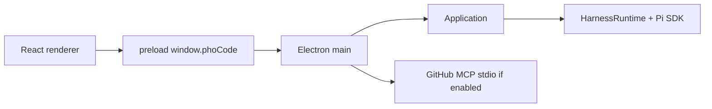
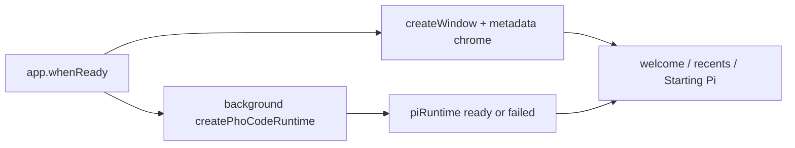
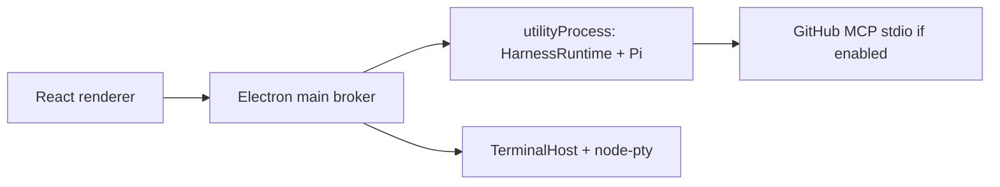

# Implementation plan: window-first Pi core

## Status and use

Proposed urgent-track plan, queued 2026-08-16. This is the implementation contract **after** the owner promotes a milestone. It is not acceptance evidence. No milestone is accepted until its stated evidence exists.

Read [`product.md`](./product.md), [`../../architecture/desktop-shell.md`](../../architecture/desktop-shell.md), [`../../architecture/overview.md`](../../architecture/overview.md), and [`../../architecture/protocol-and-ipc.md`](../../architecture/protocol-and-ipc.md) before editing Electron main or runtime construction.

Do not put this work in `archive/v3/`, `features/sandbox/`, or `features/terminal/` source ownership. Do not treat a shell rewrite as in scope.

## Global acceptance rules

Every milestone must:

- preserve `renderer -> protocol <- shell adapter -> application -> runtime -> Pi SDK`;
- keep Pi `0.84.1` as the agent/session authority;
- keep the renderer free of `electron`, `node:*`, Pi SDK, MCP SDKs, and PTY libraries;
- keep protocol values JSON-safe; no `utilityProcess` handles, Node streams, or Pi objects cross the bridge;
- show a window without waiting on `ModelRuntime.create` once Milestone 1 is in source;
- fail honestly if Pi boot fails; never delete sessions as recovery;
- leave `node-pty` / `TerminalHost` in the Electron adapter even if Pi moves to a child;
- leave agent-tool Seatbelt work to [`features/sandbox`](../../features/sandbox/README.md);
- distinguish unit, integration, desktop, packaged, and unverified evidence;
- update architecture, development, current-state, and attribution only when the corresponding milestone lands, and mark accepted behavior only after the gate.

## Architecture

### Today (accepted)



Pi and Electron main are one OS process. `createWindow()` runs after `createPhoCodeRuntime()`.

### Milestone 1 (proposed)



Same process. Different **order**. Application metadata and appearance apply without Pi. Commands that need the SDK return a stable “runtime not ready” error until boot finishes.

### Milestone 3 (proposed)



Same JSON protocol. Main owns the window, pickers, quit, and PTY. The child owns Pi. Crash of the child must not destroy the `BrowserWindow`. This is still not a sandbox.

## Protocol

Prefer existing bootstrap fields. Add only what first paint requires.

Likely additions (names may tighten in Milestone 1):

- `capabilities.piRuntime` already exists; use it as the ready flag rather than inventing a second boolean if it already means “SDK constructed.”
- If the renderer can paint before the runtime exists, `getBootstrapState` must succeed from metadata alone (`recentWorkspaces`, appearance, versions) with `capabilities.piRuntime: false`.
- A sequenced event when the runtime becomes ready or fails (`runtimeReady` / `runtimeFailed`, or reuse an existing snapshot event if one already covers it). Do not add a generic `invoke`.

Validate the exact names against `packages/protocol/src/version.ts` during Milestone 1. Do not collapse this into a key/value channel.

## File ownership

| Layer | Milestone 1 | Milestone 3 |
| --- | --- | --- |
| `apps/desktop/electron/main.ts` | Create the window before or in parallel with runtime construction; publish ready/failed | Spawn/broker `utilityProcess`; keep pickers, quit, PTY |
| `packages/application` | Bootstrap from metadata when runtime is absent; map not-ready errors | Unchanged use cases; still no Electron import |
| `packages/runtime` | Safe to construct later; no Electron import | Runs in the child; same `HarnessRuntime` |
| `packages/protocol` | Metadata-only bootstrap + ready/failed event if missing | Same commands/events over the child pipe |
| `packages/ui` + `apps/desktop/src` | Welcome chrome without a full-window block on Pi; honest Starting Pi status | Surface child-crash / restart copy without claiming a sandbox |
| `apps/desktop/tests` | Smoke: window visible while runtime still booting (or a test seam that delays boot) | Desktop: kill/hang the child; window remains |

## Milestones

### Milestone 0 — Measure the two clocks

**Intent:** Replace anecdote with numbers.

Record, on macOS, for `bun run dev` (warm and cold) and for the unsigned `.app` if one is already built:

1. time to Electron process start;
2. time to `createWindow` / `ready-to-show`;
3. time to first recents/welcome paint;
4. time until `capabilities.piRuntime` is true;
5. time until a prompt can be admitted in an empty session.

Do not change behavior. Write numbers in a new dated log. If no packaged artifact is present, mark packaged timing **not verified** and still record dev timings.

**Acceptance:** a log exists with the five timestamps or an explicit not-verified reason per clock. No source change required.

**Verification:** not a product test lane. The log is the artifact.

### Milestone 1 — Window first

**Intent:** First paint does not wait on `ModelRuntime.create`.

Sequence:

1. `app.whenReady`: menu, CSP, metadata store, `createWindow()`, apply appearance from metadata.
2. Start `createPhoCodeRuntime` without awaiting it before `loadURL` / `loadFile`.
3. Renderer shows welcome/recents from metadata-only bootstrap. No full-window “Loading…” that hides chrome.
4. Disable prompt/session/model commands until the runtime is ready. Show bounded “Starting Pi…” (or failure) in existing chrome — sidebar footer or welcome status — not a second app.
5. Stop awaiting GitHub MCP token-store work as a prerequisite for first paint. `startIfEnabled()` may run after the window is up, and must not run a secret-store read on the critical path when GitHub MCP is off.
6. Optional in the same slice if cheap: dynamic-import the runtime module so main does not parse the Pi graph before `createWindow`.

**Acceptance:**

- desktop: window `ready-to-show` occurs before `createPhoCodeRuntime` resolves (test seam or trace);
- desktop: welcome/recents visible while `capabilities.piRuntime` is still false;
- desktop: sending a prompt while not ready returns a stable harness error, not a hang;
- desktop: after ready, smoke chat still works;
- unit: metadata-only bootstrap is JSON-safe and does not require a live `HarnessRuntime`;
- packaged: unsigned `.app` shows chrome without a Pi CLI (existing packaged lane plus the window-first assertion).

**Verification:** `bun run test:desktop` for the smoke/security/session specs that still apply, plus a new desktop spec for window-before-runtime. Packaged lane when the desktop slice is green.

### Milestone 2 — Cut remaining boot work on the critical path

**Intent:** After window-first, shrink time-to-Pi-ready without a process split.

Candidates (keep only those Milestone 0/1 measurements still justify):

- do not call the GitHub token store at all when `githubMcpEnabled` is false;
- defer skill-source filesystem walks that are not needed for welcome;
- keep `refreshOnCreate: false` / `allowModelNetwork: false` (already true);
- do not instantiate session controllers at launch (already true: no auto-open session).

**Acceptance:** time-to-Pi-ready is lower than the Milestone 0 baseline on the same machine, recorded in a log, **or** the log explains why a candidate was skipped. No behavior change for an enabled GitHub MCP row: turning it on still starts the child as today.

### Milestone 3 — `utilityProcess` for Pi

**Intent:** Crash isolation. Window and Pi boot in parallel. Same protocol.

Sequence:

1. Electron main keeps window, IPC broker, metadata store, native pickers, appearance, quit, and `TerminalHost`.
2. A Node `utilityProcess` (or equivalent Node child) constructs `createPhoCodeRuntime` and runs `ApplicationService` **or** main keeps application and only the runtime moves — pick one in the Milestone 3 log before coding. Prefer: **application stays in main, runtime in the child**, matching “application does not know Electron; runtime does not know Electron.”
3. Commands/events are the existing JSON envelopes. No Structured Clone-only values.
4. Child crash: renderer gets a recoverable error; window stays; owner can retry boot. Sessions on disk are untouched.
5. Shutdown: existing bounded quit must dispose the child; do not hang forever.
6. Packaged: the child must resolve baked features via `ResourceLocator` with no user Pi CLI.

**Acceptance:**

- desktop: killing the child leaves the `BrowserWindow` alive;
- desktop: permission confirm/select/input still round-trip;
- desktop: GitHub MCP off stays off; when on, stdio still works from the child;
- packaged: `test:packaged` still launches without `pi` on `PATH`;
- unit/integration: runtime tests still run without Electron.

**Honesty:** docs and UI must not call this a sandbox.

**Out of scope for Milestone 3:** Deno, Tauri, Seatbelt for the Pi process, signing.

## Deferred on this track

- Deno sidecar (see product). Requires Milestone 3 plus a real-session prototype.
- Tauri/GPUI shell change (see [`desktop-shell.md`](../../architecture/desktop-shell.md) “When to revisit”).
- OS/container jail for the whole Pi process (roadmap Phase F; distinct from [`features/sandbox`](../../features/sandbox/README.md)).

## Pins and packaging

No new runtime pin in Milestones 0–2. Milestone 3 uses Electron’s existing `utilityProcess` on pinned Electron `43.4.0`. Do not add Deno, Tauri, or a second Node distribution.

Native modules used by Pi stay rebuilt for Electron’s ABI while they load in an Electron Node process (main today, `utilityProcess` after Milestone 3 — same ABI). `node-pty` stays in main with that same ABI.

## Exit checks

Promote a milestone only after:

```bash
bun run typecheck
bun run lint
bun test
bun run test:desktop
```

and, for Milestones 1 and 3:

```bash
bun run build
bun run package:mac
bun run test:packaged
```

Use [`.agents/skills/test-pho-code`](../../../.agents/skills/test-pho-code/SKILL.md). Record only checks that ran.

## Acceptance gate for the track

The track may close or shrink when:

1. Milestone 1 is accepted (window-first is current architecture); and
2. either Milestone 3 is accepted, or the owner explicitly defers process isolation back to Phase F with a log.

Milestone 2 may merge into 1 if the critical-path cuts are small. Deno never blocks closure.
