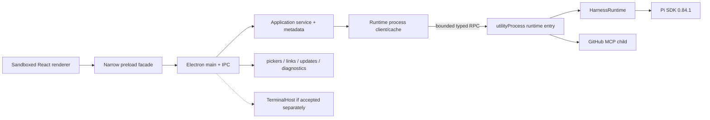

# Pho Code V4 implementation plan

## Status and use

Owner-approved implementation contract for **V4 — Public Beta Foundation**, promoted 2026-08-20. Status: **Pending** as of 2026-08-20. No milestone is accepted merely because this plan exists. Record implementation and verification in one new dated file under [`logs/`](./logs/README.md) per bounded slice.

The owner cannot enroll in the Apple Developer Program, so Developer ID signing and notarization cannot be completed. Hold remaining Milestone 0 owner evidence and Milestones 1–6. Do not implement those slices, and do not emit an unsigned public artifact, until Developer ID Application and notarization credentials exist. A later numbered version may be promoted from the [roadmap](../roadmap-vnext.md) without archiving V4; it must not take over signing, notarization, public updates, public-beta diagnostics/privacy, or `HarnessRuntime` utility-process extraction. Hold record: [`logs/2026-08-20-hold-pending-apple-developer.md`](./logs/2026-08-20-hold-pending-apple-developer.md).

Read the [V4 product contract](./product.md), current [architecture](../../architecture/README.md), [development runbook](../../development.md), accepted [V3 recovery contract](../../archive/v3/product.md), archived [window-first process research](../../archive/urgent/window-first-pi-core/product.md), and [future roadmap](../roadmap-vnext.md) before implementation.

Implement milestones in order when the hold lifts. Milestone 0 is a stop gate: do not create a public release candidate until public identity, distribution rights, Apple signing authority, platform floor, and fixed release origins are recorded. A private implementation may continue without publishing, but it must not weaken or bypass that gate.

## Global acceptance rules

Every V4 milestone must:

- preserve `renderer -> protocol <- shell adapter -> application -> runtime -> Pi SDK`;
- keep the renderer free of Electron, Node, Pi, MCP, filesystem, process, credential, signing, update, and release-feed authority;
- keep Pi `0.84.1` and Electron `43.4.0` pinned unless a separate reviewed upgrade slice changes one pin and reruns its complete compatibility surface;
- keep Pi JSONL authoritative for transcripts and preserve accepted V3 ledger/Undo semantics across runtime generations;
- retain immutable source-selected feature composition and refuse runtime downloads, ambient Pi packages, project extensions, arbitrary MCP, and generic settings;
- use explicit JSON-safe bounded messages across renderer IPC and the new main/utility-process boundary;
- keep native pickers, external-link validation, release updates, appearance, windows, and any owner PTY in Electron main;
- move the complete `HarnessRuntime` graph—not a partial duplicate—into one Electron utility process;
- describe utility-process separation as crash isolation, never as a sandbox;
- preserve unrelated user changes, the owner's concurrent feature work, and read-only reference submodules;
- never erase or reset unknown/corrupt application state as recovery;
- keep credentials and secret-bearing provider state out of renderer snapshots, diagnostics, release manifests, build logs, and migration copies;
- require exact versions, hashes, licenses, provenance, packaging, and lifecycle verification for every shipped executable/native resource;
- build public artifacts only from a clean, identified source revision and fail rather than emit an unsigned or partially signed release;
- distinguish unit, integration, desktop, packaged, release-artifact, owner, external-machine, and unverified evidence;
- update accepted architecture/current-state/development/attribution only when the corresponding milestone is accepted;
- use [`.agents/skills/test-pho-code`](../../../.agents/skills/test-pho-code/SKILL.md) to select isolated verification during implementation.

## Baseline and release gaps

The plan starts from accepted personal V1–V3 plus accepted Plan/Agent, sandbox, bounded Stop, and window-first startup. It does not reinterpret planned add-ons as implemented.

| Area | Current source | Required V4 boundary |
| --- | --- | --- |
| App version | root and desktop manifests are `0.0.0` | one authoritative `4.0.0-beta.N` version plus numeric build number/channel |
| macOS target | unsigned Apple Silicon `.app` directory | signed, hardened, notarized, stapled arm64 DMG plus signed ZIP/update payload |
| Signing config | `identity: null`, hardened runtime and Gatekeeper assessment disabled | release build requires Developer ID, minimal entitlements, notarization, Gatekeeper checks |
| Runtime process | Pi and Electron main share one process after window-first boot | `HarnessRuntime` in one restartable `utilityProcess`; window remains alive on child failure |
| App metadata | schema v6; unknown/unreadable input silently becomes empty | explicit healthy/migrated/corrupt/unsupported state with atomic migration and recovery record |
| Test hooks | packaged code honors several `PHO_CODE_TEST_*` paths | public build removes or rejects every test seam; separate internal test artifact remains possible |
| Diagnostics | feature summaries plus console output | bounded local redacted event state and explicit inspectable JSON export |
| Updates | none | fixed HTTPS beta feed, signed payload, explicit status/check/install, bounded shutdown/failure behavior |
| Release provenance | pins/hashes exist for selected resources; notices are incomplete recursively | complete shipped inventory, artifact/resource hashes, source/build identity, app license/EULA |
| Public policy | personal trust statements only | public beta trust/limitations, privacy, security contact, known limitations, support path |
| Website | outside repository | fixed reviewed URL/feed handoff; website implementation remains outside V4 |

## Selected release model

### Platform and channel

- Product line: `4.0.0-beta.N`.
- macOS `CFBundleVersion`: a monotonically increasing positive integer supplied by the release build.
- Architecture: Apple Silicon `arm64` only.
- Minimum system: macOS 14+ unless Milestone 0 records a different owner decision with native-dependency evidence.
- Channel: one `beta` channel. No stable/nightly matrix in V4.
- Distribution: direct Developer ID download; no Mac App Store.
- Human artifact: DMG.
- Update payload: signed ZIP and the exact feed metadata required by the selected Electron updater path.

The package version, build number, channel, source revision, and release origin must be available to main/application bootstrap and visible in About. Protocol version remains independently versioned; do not rename the existing `pho-code:v1:*` IPC namespace merely because the application becomes V4.

### Release build flavors

Use two explicit build flavors:

1. **Internal test artifact** — may include deterministic providers and Playwright-only seams; never signed/published under the public bundle identity and never accepted as public-artifact evidence.
2. **Public release artifact** — compile-time release flavor; rejects all `PHO_CODE_TEST_*` behavior, test providers, injected workspaces, runtime gates, fake OAuth, and test feature overrides.

Do not rely on “the environment variable is unlikely to be set.” A structural test must inspect the public bundle/configuration and prove the hooks are unavailable. Keep legitimate documented interoperability overrides (`PHO_CODE_AGENT_DIR`, and any retained user-data override) separate from test seams and disclose their effect.

### Website/release-host handoff

The website is a parallel owner project. V4 consumes only a source-reviewed release configuration containing exact HTTPS origins/URLs for:

- download/product page;
- release notes/known limitations;
- privacy policy;
- security reporting;
- beta feed and update payload host.

The renderer cannot edit these values. External pages open only through the existing validated `http:`/`https:` system-browser path. Update traffic is main-owned and must match the exact configured origin. If the website redirects to a distinct artifact/CDN host, both origins and redirect behavior are recorded and tested; no wildcard host policy is introduced.

## Target architecture



Electron main remains the only composition root that imports Electron. `apps/desktop/electron/runtime-child.ts` (name may tighten) is an Electron adapter entry that can access `process.parentPort`; it constructs `@pho-code/runtime` but contains no product policy beyond transport, startup configuration, and lifecycle. Runtime code itself continues not to import Electron.

### Runtime process protocol

Add a distinct internal broker contract; do not expose it to `window.phoCode` and do not add generic renderer `invoke`.

Representative envelope:

```ts
type RuntimeGeneration = string;

type RuntimeProcessMessage =
  | {
      type: "request";
      protocolVersion: 1;
      generation: RuntimeGeneration;
      requestId: string;
      method: RuntimeProcessMethod;
      input: JsonValue;
    }
  | {
      type: "response";
      protocolVersion: 1;
      generation: RuntimeGeneration;
      requestId: string;
      result: CommandResult<JsonValue>;
    }
  | {
      type: "event";
      protocolVersion: 1;
      generation: RuntimeGeneration;
      event: RuntimeEvent;
    }
  | {
      type: "lifecycle";
      protocolVersion: 1;
      generation: RuntimeGeneration;
      state: "starting" | "ready" | "failed" | "stopping";
      error?: HarnessError;
    };
```

Exact types must use runtime validators. `RuntimeProcessMethod` is a source-owned enum/union with one validated input/output contract per callable runtime operation. It is not an arbitrary string, module name, path, function, channel, or JSON-RPC escape hatch.

Initial bounds:

| Bound | V4 rule |
| --- | --- |
| encoded message | 4 MiB maximum; existing lower command/file/diff limits still win |
| in-flight requests | 128 per runtime generation |
| request id | 128 characters, generated by main |
| generation id | opaque UUID generated by main; never accepted from renderer |
| request timeout | operation-specific; no unbounded default |
| stderr capture | 256 KiB redacted ring per generation; never forwarded raw |
| lifecycle restarts | owner-triggered; at most one startup attempt at a time |
| stale response/event | ignored after generation replacement |

The protocol must round-trip through JSON serialization in tests even though Electron message ports can carry richer values. No `Buffer`, `ArrayBuffer`, class instance, stream, filesystem handle, AbortSignal, Electron object, Pi object, or Error crosses.

### Resolving synchronous runtime methods

`HarnessRuntime` currently includes synchronous getters such as settings snapshots, activity, agent directory, capabilities, and dispose count. Synchronous cross-process calls are forbidden.

Implement an explicit `RuntimeProcessClient` in main that:

- owns authoritative cached projections supplied in the child's ready snapshot and later events;
- answers existing synchronous application reads only from that cache;
- routes mutating/refresh operations asynchronously to the child;
- treats cache as unavailable after a generation crash until a new ready snapshot replaces it;
- never fabricates success while the child is starting or failed.

If a getter cannot be made cache-correct, change the application/runtime interface to async in the same milestone and update every caller/test. Do not use synchronous IPC, shared memory, Atomics, busy waiting, or a nested event loop.

### Child startup configuration

Main sends a validated startup record after spawn containing only required paths/flags and selected metadata state:

- app-owned user-data and Pi-agent roots;
- packaged resource root and immutable release/resource identity;
- enabled fixed skill-source ids and GitHub MCP enabled/account summary;
- production/test flavor determined at build time;
- explicit external-agent-directory disclosure state;
- paths to packaged GitHub MCP, sandbox engine, and `rg` only after main/resource validation.

The child process receives an intentional environment. Start from locale, temp, home/user identity, and a reviewed executable search path; set `PI_CODING_AGENT_DIR` explicitly. Inventory provider behavior before retaining any API-key environment variable. Do not copy the whole parent environment, shell startup files, updater secrets, signing credentials, CI variables, or arbitrary `PHO_CODE_*` / `PI_*` values.

Use `allowLoadingUnsignedLibraries: false`. All native libraries and nested executables in a public artifact must be signed. Keep `disclaim: false` for the first beta unless a separate TCC study proves a user-visible need. Do not add `disable-library-validation` merely to make an unsigned dependency load; identify and sign the nested code or stop the release.

### Runtime failure and restart

Main observes spawn, error, exit, and a bounded heartbeat/status message. The UI may distinguish:

- starting;
- ready;
- stopped by owner;
- crashed;
- startup failed;
- unresponsive.

A crash or heartbeat failure does not auto-spawn indefinitely. The owner can choose **Restart agent**. When a live run or unresolved host dialog existed, copy explains that the process ended and V3 may need reconciliation. Main cancels all in-flight broker requests with one stable `runtime_unavailable` error, drops stale-generation events, retains metadata UI, and starts a new generation only after the prior process exit is observed or force termination is bounded.

The existing Stop control remains per-run cooperative cancellation. A force restart is a separate action available only in runtime recovery UI. Do not silently map Stop to process kill.

### Update boundary

Use Electron main's updater boundary rather than a renderer networking client. Prefer the built-in `autoUpdater` unless Milestone 5 demonstrates that its Squirrel.Mac behavior cannot satisfy the selected manual-check/install UX; adding `electron-updater` would require a separate exact pin, license, packaged proof, and documented reason.

Protocol additions are explicit:

```ts
type UpdateStatus =
  | "disabled"
  | "idle"
  | "checking"
  | "available"
  | "downloading"
  | "downloaded"
  | "not_available"
  | "failed";

interface UpdateSnapshot {
  status: UpdateStatus;
  channel: "beta";
  currentVersion: string;
  availableVersion?: string;
  releaseDate?: string;
  progressPercent?: number;
  error?: HarnessError;
}
```

Commands are `getUpdateState`, `checkForUpdate`, and `installDownloadedUpdate` (names may tighten). The renderer never supplies a URL, channel, headers, file path, executable, or release payload. Release notes are bounded plain text or sanitized Markdown; remote HTML is not injected.

Installation is disabled while any session is working/attention, a host dialog is unresolved, a terminal process would be killed contrary to its accepted contract, a migration is incomplete, or V3 has an active recovery operation. The owner may Stop work first. Electron's `before-quit-for-update` path must run the same bounded application/runtime/terminal shutdown contract rather than bypassing cleanup.

### Data and release state

Introduce a release-state store separate from general metadata, for example:

```text
userData/
├── app-metadata.json
├── release-state.json
├── migration-recovery/
├── diagnostics/
├── sandbox-settings.json
├── pi-agent/
├── retrieval/
└── change-ledger/v1/
```

`release-state.json` owns installed/last-successful version, build, channel, last migration result, update status needed across restart, and last runtime crash summary. It never owns transcripts, tokens, feature code, update URLs, or signing material.

Replace silent metadata fallback with a typed load result. Writes use a sibling temporary file, file sync, atomic rename, and best-effort parent sync. Before a schema-changing migration, preserve only the small app-owned files actually changed plus a manifest/hashes. Do not copy provider credentials, secret-store material, Pi JSONL, retrieval databases, prepared images, V3 blobs, or workspaces into a migration backup.

Recovery records are private (`0600` files where supported), bounded, and visible in diagnostics. Unknown future schemas remain untouched and block mutation with recovery guidance. Corrupt input is preserved byte-for-byte; the app may offer an explicit owner-approved reset later, but V4 does not silently create a new empty store over it.

### Diagnostics boundary

Maintain a bounded redacted event ring in main covering process/release operations, plus bounded child health events. A source-owned event schema permits only identifiers, versions, status enums, durations, sizes, and redacted error codes/messages. Raw console forwarding is not the diagnostic API.

`exportDiagnostics` uses a native save dialog and writes one human-inspectable JSON file. The owner can inspect it before sharing. The renderer receives completion/cancel status, not an arbitrary destination path or filesystem handle. Automated upload is absent.

Source-owned initial limits:

| Item | Limit |
| --- | --- |
| in-memory events | 500 |
| persisted last-crash/update/migration summaries | 50 records total |
| exported JSON | 2 MiB maximum |
| individual message | 2 KiB after redaction |
| workspace identity | stable salted digest plus display name only; no absolute path |
| retention | current and immediately previous app version summaries; no transcript retention |

If persistent event history beyond the small release-state summary proves necessary, promote an explicit retention/cleanup design. Do not grow an unbounded log directory or invent telemetry in this milestone.

## Intended file ownership

Names may tighten, but boundaries may not.

| Area | Intended paths/responsibility |
| --- | --- |
| Release identity | root/desktop manifests plus one source-owned release metadata module/script; no duplicated hand-edited version strings |
| Broker protocol | `packages/protocol/src/runtime-process.ts`, update/diagnostic contracts, validators, JSON tests |
| Runtime client/cache | `packages/application/src/runtime-process-client.ts` or an application port implemented by Electron main |
| Utility entry/host | `apps/desktop/electron/runtime-child.ts`, `runtime-process-host.ts`; Electron transport only |
| Electron composition | `apps/desktop/electron/main.ts`, preload, IPC, security, bounded shutdown |
| Data migration | `packages/application` versioned store interfaces plus Electron atomic file adapters |
| Release state/diagnostics | Electron/application adapters under app-owned user data; typed snapshots in protocol |
| Packaging | `scripts/package-mac.ts`, release-manifest/signature verification scripts, entitlements under `apps/desktop/resources` or `build` |
| Update | Electron-main service behind an application port; About/Settings presentation in UI |
| Tests | protocol/application/runtime unit tests; Electron crash/restart/security/update specs; release-artifact smoke lane |
| Docs | V4 logs until acceptance; then architecture/current-state/development/attribution/notices |

Do not put update, signing, notarization, DMG, website, or Developer ID logic in `packages/runtime`. Do not put Pi in Electron main after Milestone 2. Do not put owner terminal PTY in the Pi child.

## Milestone 0 — Release preflight and hardened-runtime proof

### Outcome

Close the decisions and external prerequisites that would otherwise make later release work speculative, then prove the existing packaged native/executable surface can survive Developer ID signing, hardened runtime, and notarization before process extraction expands it.

### Required implementation order

1. Record the final public product name, technical slug, bundle identifier, public version convention, numeric build-number source, beta channel, arm64/macOS floor, and application-data/Keychain identity.
2. Complete an actual public-name/trademark/domain review. If `Pho Code` or the bundle id changes, write a separate identity/data migration log before modifying source.
3. Add the owner-selected project license/EULA and document distribution rights for bundled assets, source adaptations, dependencies, native binaries, fonts/icons, and product/provider marks.
4. Record Apple Developer Team ownership, Developer ID Application certificate path through the release environment, and notarization credential mechanism. Secrets remain outside source and logs.
5. Record exact website/release origins or named placeholders owned by the website work, plus who controls TLS, feed publication, artifact replacement, and revocation.
6. Add a release-only packaging proof configuration: `forceCodeSigning`, hardened runtime, minimal entitlements, DMG/ZIP candidates, notarization, stapling, and release-build failure on missing credentials.
7. Sign every nested `.node`, `.dylib`, helper, sandbox executable, bundled `rg`, Cursor binary, and GitHub MCP binary in the correct order. Keep library validation enabled unless a specific signed component proves impossible and the owner accepts the documented exception.
8. Produce one non-published signed/notarized proof artifact from a clean identified revision. Do not call it V4 beta.
9. Exercise feature/resource loading, FFF native search, sandbox `rg`/engine, Cursor package load, GitHub MCP startup, provider login surface, V3 write/Undo, and bounded quit under hardened runtime.
10. Record entitlements and notarization output, but redact team-private credential material.

### Acceptance criteria

- name, license/EULA, Apple signing authority, platform floor, version policy, and release origins are explicit;
- public release packaging cannot silently fall back to unsigned output;
- `codesign --verify --deep --strict --verbose=2` succeeds for the app;
- `spctl --assess --type execute --verbose` accepts the app/artifact;
- `xcrun stapler validate` succeeds after notarization;
- every nested native/executable resource is signed and still loads/executes as intended;
- hardened runtime is enabled with the smallest evidenced entitlement set;
- no `get-task-allow`, DYLD environment, unsigned-library, or broad library-validation exception enters by convenience;
- the artifact launches from a quarantined download path on a clean macOS user profile;
- failure to access signing/notarization credentials produces no artifact labeled releasable.

### Proportional verification

- packaging-script unit tests for release-vs-local configuration and missing-credential failure;
- existing focused packaged journeys against the hardened proof artifact;
- manual codesign/Gatekeeper/stapler inspection recorded verbatim in a V4 log;
- owner verification of the clean-user launch and public identity presentation.

### Stop conditions

Stop before a public candidate if the owner cannot establish distribution rights, Apple Developer authority, a safe name/bundle identity, or control of the release/update origin. Stop and audit rather than enabling unsigned-library loading when a nested native component fails under hardened runtime.

## Milestone 1 — Versioned release and migration-safe data

### Outcome

The application has one trustworthy release identity, public/test build separation, explicit first-run beta trust disclosure, and data stores that never silently reset unknown or corrupt state.

### Implementation sequence

1. Make one release metadata source generate/inject app version, numeric build number, channel, commit, target, and build timestamp into packaging and bootstrap. Remove `0.0.0` from public artifacts.
2. Keep protocol version independent. Add release metadata to About and diagnostic snapshots without exposing build-machine paths.
3. Implement compile-time internal/public build flavors. Public startup rejects every `PHO_CODE_TEST_*` hook and fake provider/feature path.
4. Refactor metadata loading to return `healthy`, `migrated`, `unsupported`, or `corrupt`; preserve unknown/corrupt bytes and show bounded recovery UI.
5. Implement atomic save and an idempotent migration transaction with release-state journal and bounded recovery copies for changed small config files only.
6. Inventory `app-metadata.json`, sandbox settings, permission config, Pi operational state, retrieval indexes, V3 ledger, and OS secrets. Explicitly mark which are migrated, validated, rebuilt, or left authoritative.
7. Add first-run public-beta trust disclosure before the first workspace is authorized. Explain trusted workspaces, agent/user authority, sandbox scope, remote services, recovery limits, and where to find privacy/security/known limitations. Persist only the disclosure version acknowledged.
8. Verify the existing `PHO_CODE_AGENT_DIR` interoperability override remains honest and does not change feature composition. Decide whether the full user-data override remains public, development-only, or CLI-documented; do not leave it accidental.
9. Add upgrade fixtures for every metadata version currently accepted plus corrupt, truncated, permission-denied, and future-version files.

### Acceptance criteria

- About shows `4.0.0-beta.N`, build number, channel, architecture, commit, Electron/Node/Pi pins;
- public bundle identity and app-owned data roots are stable and documented;
- unknown future metadata is preserved and blocks mutation rather than becoming empty;
- corrupt metadata is preserved with a recovery status; recents/sessions are never falsely described as deleted;
- every migration is deterministic, idempotent, atomic, and reversible on pre-commit failure;
- no migration copies provider/GitHub secrets, Pi JSONL, V3 snapshot blobs, workspace files, images, or raw diagnostic payloads;
- public build cannot enable test mode through environment variables;
- beta disclosure is keyboard-accessible, understandable, versioned, and appears before first workspace authority;
- current personal data upgrades without losing settings, recents, archives, trust records, skill sources, GitHub state, sandbox state, sessions, or V3 pending review.

### Proportional verification

- unit tests for release metadata, schema results, all migrations, crash points, permissions, and redaction;
- application tests for recovery-mode command refusal and disclosure state;
- desktop tests for first-run disclosure and future/corrupt metadata presentation;
- separate internal/public packaged inspection proving test-hook absence in public flavor;
- one owner copy of real pre-V4 app data tested from a recoverable duplicate, never the live default root.

## Milestone 2 — Pi utility-process extraction and recovery

### Outcome

The complete Pi runtime graph runs in a restartable Electron utility process. A crash or forced runtime restart does not destroy the BrowserWindow, metadata UI, or persisted state.

### Implementation sequence

1. Add runtime-process envelopes, method allowlist, validators, generation/request identities, bounds, serialization tests, and normalized error mapping.
2. Add a fake transport and `RuntimeProcessClient` with authoritative caches for current synchronous projections. Characterize or convert any getter that cannot be cached correctly.
3. Add the utility-process entry and parent host. Spawn only after `app.whenReady`; use an intentional environment, fixed service name, piped/redacted stderr, `allowLoadingUnsignedLibraries: false`, and `disclaim: false`.
4. Move `createPhoCodeRuntime` and all runtime-owned services into the child. Electron main must no longer load Pi or broad runtime value code on the eager path.
5. Marshal startup configuration and ready snapshot; forward runtime events through the existing renderer event path without sequence collisions.
6. Preserve main-owned native image pick/paste. Transfer only the already bounded JSON-safe prepared input to the child.
7. Re-prove permissions, `select`/`confirm`/`input`/questionnaire host UI, notifications, provider OAuth link handles, GitHub MCP, skills, retrieval, web tools, Plan/Agent, sandbox, V3 change review, and independent sessions over the process boundary.
8. Add crash/exit/unresponsive state and explicit **Restart agent** UI. Cancel all in-flight requests from a dead generation; ignore late messages.
9. On restart, reconstruct from Pi JSONL/application metadata and run V3 reconciliation before enabling pending recovery actions. Never replay renderer guesses.
10. Integrate child dispose/kill with existing bounded shutdown and updater shutdown. Observe actual exit and exact PID; never use broad kill patterns.
11. Package the utility entry and native resources, then rerun hardened-runtime signing proof. Do not assume main-process native success proves utility-process success.

### Acceptance criteria

- killing the utility process leaves the BrowserWindow responsive with recents/appearance/About available;
- a stable bounded error replaces all in-flight requests from the dead generation;
- owner-triggered restart creates exactly one new generation and ordinary chat resumes from persisted Pi state;
- stale responses/events from an old generation cannot mutate application or renderer state;
- a runtime crash during write/edit leaves V3 state pending/indeterminate and reconciliation remains conflict-safe;
- Stop/Stop-all behavior remains accepted and distinct from process restart;
- OAuth URLs/tokens, GitHub PATs, secrets, Errors, streams, handles, and native objects never cross the broker;
- main no longer imports/constructs Pi or runtime services beyond types/pure validation helpers;
- GitHub MCP and agent child processes belong to and die with the runtime generation; owner PTY stays main-owned;
- packaged public-flavor app resolves all features from `process.resourcesPath` with no Pi on `PATH`;
- process separation is described as crash isolation, not hostile-code containment.

### Proportional verification

- protocol serialization/fuzz/bound tests for every broker envelope and validator;
- application tests with fake transport for cache replacement, timeout, crash, stale generation, and restart;
- runtime integration tests remain Electron-free and pass unchanged where behavior is preserved;
- Electron tests: held boot, startup failure, kill while idle, kill during streaming, kill during host dialog, kill during V3 write, restart, second prompt, and bounded quit;
- packaged hardened-runtime tests for native FFF, sandbox, GitHub MCP, V3, Plan/Agent, and provider surface from the utility process;
- manual activity inspection confirming one utility process/generation and no orphaned children after quit.

### Stop conditions

Stop if the broker requires raw filesystem/process handles, synchronous IPC, generic method names, unbounded messages, duplicated Pi state in main, or disabled library validation. Propose a narrower contract change rather than weakening the renderer/application/runtime boundaries.

## Milestone 3 — Public diagnostics, privacy, and security hardening

### Outcome

External beta failures can be explained without collecting user conversations or secrets, and the production Electron surface has an explicit public threat model and release-flavor hardening.

### Implementation sequence

1. Write the V4 public-beta threat model from actual code/process/data ownership. Cover trusted workspace content, prompt injection, baked features, Pi, MCP, web retrieval, Cursor provider, sandbox scope, update origin, signing keys, and local attackers.
2. Add a typed redacted event schema and bounded main/child rings. Replace release-relevant raw console paths with structured events while retaining development stacks locally.
3. Add `getDiagnosticsState` and native `exportDiagnostics` with the product exclusions and size limits. Generate canonical/sorted JSON so owners can inspect and diff it.
4. Add About/Settings links for privacy, security, release notes, and known limitations through validated fixed URLs. No embedded remote webview.
5. Add release-build Electron fuses after testing: disable `RunAsNode`, enable cookie encryption and ASAR integrity/only-load-from-ASAR where compatible, and record each selected fuse. Do not flip a fuse whose native/utility/update consequence is unverified.
6. Re-audit BrowserWindow preferences, CSP, navigation/new-window handlers, permission handlers, IPC sender/frame validation, external URL validation, and remote content sanitization.
7. Audit public environment overrides, deep links/protocol handlers (none unless explicitly added), file associations (none), command-line parsing, and single-instance behavior. Do not add a custom URL scheme merely for the website.
8. Complete recursive shipped dependency/binary/license/asset inventory and record known CVEs or accepted residual risk against exact pins. Do not opportunistically upgrade unrelated packages during the audit.
9. Verify no telemetry, crash upload, analytics identifier, transcript upload, or hidden remote logging exists. Public privacy copy must match source behavior.
10. Add a security contact and response procedure: report intake, severity triage, signing/update revocation, patched beta publication, and user notification ownership.

### Acceptance criteria

- one bounded diagnostic JSON export explains versions, resources, schemas, runtime generations, updates, feature health, sandbox, and redacted failures;
- canary prompts, file contents/paths, tokens, PATs, OAuth URLs, cookies, environment secrets, V3 blobs, and full tool data are absent;
- export is explicit and local; no automatic network request occurs;
- public threat model states trusted-workspace and non-sandbox limits without marketing ambiguity;
- production fuses/preferences/CSP/IPC/navigation policies are asserted by tests and compatible with utility process/native resources;
- test hooks and developer URLs are unavailable in the public flavor;
- complete notices and project license/EULA are staged in the artifact and accessible to beta users;
- security/privacy/release links use exact HTTPS destinations and open outside the app;
- a documented signing-key/update-feed incident can halt publication and tell users what to do.

### Proportional verification

- protocol/unit redaction tests with secret, URL, path, transcript, environment, and binary canaries;
- desktop export/save/cancel and external-link tests;
- security specs for fuses, BrowserWindow, CSP, IPC, navigation, permissions, and public-flavor rejection;
- packaged scan for test strings/seams, unexpected executables, missing notices, world-readable sensitive files, and mutable code outside expected resources;
- independent review of the threat model against actual source/process ownership.

## Milestone 4 — Reproducible signed and notarized beta artifacts

### Outcome

One source-controlled release procedure produces the exact distributable arm64 artifacts, provenance, notices, and verification records without unsigned fallback or runtime downloads.

### Planned command contract

These commands do not exist until implemented and must not be added to `docs/development.md` as current behavior beforehand:

```bash
bun run package:mac:release
bun run verify:release:mac
bun run test:release:packaged
```

- `package:mac:release` builds, stages, signs, notarizes, staples, and emits DMG/ZIP plus manifests from an identified clean source revision.
- `verify:release:mac` performs offline structure/hash/signature/staple/Gatekeeper checks and refuses test flavor.
- `test:release:packaged` launches the actual release artifact without deterministic test hooks for startup, resource, recovery, and owner/manual real-provider checks appropriate to a production build.

Keep existing `package:mac` / `test:packaged` as local/internal contracts unless a deliberate command migration updates all documentation and tests.

### Implementation sequence

1. Refactor packaging so local/internal and release paths share staging/resource inventory but have separate explicit signing/target/test-flavor policy.
2. Build arm64 DMG and ZIP. Set deployment target, bundle identity, category, icons, copyright, descriptions, and version/build metadata.
3. Generate a packaged resource manifest with relative path, byte size, SHA-256, package/binary identity, version, license, origin, and executable/native classification.
4. Generate complete third-party notices from the actual shipped closure plus attribution records. Fail on missing license/provenance; do not call the current partial notice file complete.
5. Flip the accepted Electron fuses before signing, sign nested code and app in correct order, notarize through current `notarytool`-backed tooling, and staple.
6. Emit artifact SHA-256, source commit, lockfile hash, build metadata, resource manifest hash, notarization result identifier, and verification summary as release provenance.
7. Ensure build logs redact certificate material, notarization secrets, provider tokens, PATs, and broad environment values.
8. Verify from a clean macOS account/machine with no Pi CLI, no repository, no Homebrew `rg`, no global feature packages, and no developer certificates required at runtime.
9. Copy artifacts to a non-public candidate location first. Publication is a separate explicit owner action after verification.

### Acceptance criteria

- release build begins from a clean source revision and frozen lockfile;
- version/build/channel/commit match across app, DMG/ZIP filenames, About, feed metadata, and provenance;
- every executable/native file is accounted for, signed, and hash-listed;
- the application signature inside the DMG/ZIP, notarization ticket, stapling, Gatekeeper, and resource manifest verify;
- release artifact contains no test flavor, fake provider, injected workspace, test runtime gate, or unsigned fallback;
- app launches and core accepted behavior works without repository/Pi/global resources/runtime downloads;
- licenses/notices cover the actual shipped closure and distributable assets;
- artifact publication is impossible before verification reports success;
- release can be reproduced operationally on a second clean owner-controlled runner, even if Apple signatures/timestamps prevent bit-for-bit identity.

### Proportional verification

- packaging/resource/notices/provenance unit tests;
- `bun run verify:release:mac` recorded with signature/Gatekeeper/stapler output;
- `bun run test:release:packaged` plus owner real-provider smoke;
- manual quarantined DMG install, Applications launch, logout/login, restart, and app relaunch;
- compare two clean-run manifests and explain expected nondeterministic signing/timestamp fields.

## Milestone 5 — Beta updates and bounded rollback

### Outcome

A V4 beta user can check for and install a signed beta update from the fixed feed without losing active work or application state, and a bad download/migration leaves a documented recovery path.

### Implementation sequence

1. Finalize the website/release host feed contract, HTTPS origin, redirect policy, retention of prior beta artifacts, and owner publication/revocation procedure.
2. Implement main-owned update service and explicit protocol/preload/application/UI commands. Default to manual **Check for updates** for the first beta; do not add a generic channel/URL setting.
3. Validate current/available SemVer, numeric build ordering, beta channel, feed schema, release-note size, and expected origin. Reject downgrade, same build, malformed dates, cross-channel payloads, redirects to unapproved hosts, and non-HTTPS URLs.
4. Present checking/downloading/downloaded/failure state in About or a compact existing settings surface. Keep conversation primary.
5. Refuse install while sessions/dialogs/recovery/terminal activity make shutdown unsafe. Offer guidance to Stop/settle, then call the same bounded shutdown path from `before-quit-for-update`.
6. Test signed update from beta N to N+1. On first launch, validate release state and run any app-data migration transaction before enabling Pi-backed controls.
7. Test corrupted feed, missing payload, interrupted download, invalid signature/notarization, offline start, updater process failure, child runtime crash during check, and shutdown timeout.
8. Keep the currently installed build usable when check/download fails. Keep previous signed beta artifacts available for manual reinstall and publish clear rollback limits.
9. Prove update does not mutate feature code in a running session, return URLs to the renderer, or bypass immutable packaged feature validation.

### Acceptance criteria

- Electron's macOS signed-app requirement is satisfied by the actual release artifact;
- update feed/payload origins are fixed and exact; the renderer cannot alter them;
- malformed/cross-channel/downgrade/unapproved-host data fails closed;
- update state is bounded/redacted and remote notes are sanitized;
- active work prevents install until settled or explicitly stopped;
- updater quit performs bounded runtime/MCP/terminal disposal and does not hang indefinitely;
- beta N → N+1 succeeds on a clean machine and preserves settings, sessions, credentials, V3 ledger, sandbox, skills, GitHub state, and archive metadata;
- failure before install leaves beta N running; failed migration preserves/reinstates its pre-migration recovery record;
- prior signed artifact and release notes remain available for manual rollback guidance;
- no silent auto-update or telemetry behavior is introduced.

### Proportional verification

- unit tests for feed/origin/version/state machine and release-note bounds;
- application tests for activity/install interlock and shutdown ordering;
- Electron tests against a local deterministic HTTPS/update fixture using internal certificates only in test flavor;
- two real signed/notarized artifacts for N → N+1 external-machine verification;
- offline, invalid-feed, interrupted-download, migration-failure, and manual-rollback records.

### Stop condition

If the built-in Electron updater cannot provide the selected bounded behavior, stop and record the gap before adding another updater package. Any replacement must be exactly pinned, licensed, source-reviewed, and tested against signing, delta/full payloads, shutdown, and feed compromise.

## Milestone 6 — Public-beta candidate and acceptance

### Outcome

Freeze the accepted capability bundle, verify one published candidate end to end, and produce the immutable record that distinguishes a public beta from a personal build.

### Required implementation order

1. Freeze the exact accepted feature/add-on set. Terminal or compaction enters only if its own acceptance already exists; otherwise it remains absent without blocking V4.
2. Resolve every P0/P1 release, data-loss, credential, sandbox-honesty, signing, update, startup, and child-lifecycle defect. Record accepted lower-severity residuals explicitly.
3. Run the full source, desktop, internal packaged, hardened release, update, and security gates from a clean revision.
4. Perform owner real-provider journeys: OAuth/API-key account, normal chat, image, web, permission dialog, sandboxed validation, V3 write/review/Undo, Plan/Agent, Stop/Stop-all, background session, archive/restore/Trash, quit/reopen, runtime crash/restart, diagnostics export, and update.
5. Install the quarantined DMG on at least one clean Apple Silicon macOS 14+ machine/account that has no repository or Pi CLI. Verify Gatekeeper publisher presentation, first-run disclosure, website policy links, update, and core chat.
6. Publish the candidate artifact, hashes/provenance, release notes, privacy policy, security contact, known limitations, and rollback instructions to the fixed website/release path.
7. Verify the public URLs and update feed from outside the development environment. Website implementation evidence stays in its own owner project; V4 records only the successful handoff.
8. Write an immutable V4 acceptance review, update current architecture/development/current-state, and archive V4 only when the owner accepts the beta boundary.

### Acceptance criteria

- every V4 completion condition in [`product.md`](./product.md) has direct evidence;
- no known issue undermines signing, provenance, update trust, credential secrecy, migration safety, crash recovery, V3 recovery, or stated platform support;
- public artifact and feed match recorded hashes/version/build/source;
- at least one clean external-machine install/update journey succeeds;
- website/release URLs expose the required download, notes, privacy, security, and rollback information;
- unsupported platforms/features and trusted-workspace limitations are explicit;
- acceptance review separates automated, owner, external-machine, and unverified evidence;
- all accepted architecture changes are promoted out of this plan into canonical architecture.

## V4 exit checks

Run focused checks during each milestone, then the complete gate from a clean release revision. Existing commands remain authoritative until the planned release commands land:

```bash
bun run typecheck
bun run lint
bun test
bun run test:desktop
bun run build
bun run package:mac
bun run test:packaged
```

After Milestone 4 implements them, also run:

```bash
bun run package:mac:release
bun run verify:release:mac
bun run test:release:packaged
```

The release log must additionally record:

- clean source revision and submodule revisions;
- exact dependency/lockfile state;
- codesign verification;
- notarization and stapler validation;
- Gatekeeper assessment;
- artifact/resource/provenance hashes;
- internal vs public build-flavor inspection;
- utility-process/native/executable packaged checks;
- beta N → N+1 update and failure recovery;
- owner real-provider journey;
- clean external-machine install/update;
- website/release-host handoff checks.

Do not claim release verification from a local unsigned `.app`, an internal test artifact, source tests alone, notarization alone, or a website download link that was not matched to the verified artifact.

## Acceptance and archive procedure

One integrator performs V4 acceptance:

1. inspect every milestone log and resolve contradictory evidence;
2. run the final exit gate from the exact candidate revision;
3. write `logs/YYYY-MM-DD-v4-acceptance-review.md` with hashes and verification classes;
4. update `docs/current-state.md` with the supported public-beta surface and explicit limitations;
5. promote process, data, update, diagnostics, security, packaging, and test boundaries into the relevant architecture pages;
6. update `docs/development.md` with implemented release commands, credentials-as-external-prerequisites, local/internal/release artifact differences, and troubleshooting;
7. update `docs/references-and-attribution.md`, complete `docs/third-party-notices.md`, and ship the same notices in the artifact;
8. move the closed V4 directory to `docs/archive/v4/` without rewriting execution logs;
9. update `docs/version/README.md` and the roadmap to identify the next unpromoted numbered-version candidate.

## Primary references

- [Electron `utilityProcess`](https://www.electronjs.org/docs/latest/api/utility-process)
- [Electron process model](https://www.electronjs.org/docs/latest/tutorial/process-model)
- [Electron security checklist](https://www.electronjs.org/docs/latest/tutorial/security)
- [Electron fuses](https://www.electronjs.org/docs/latest/tutorial/fuses)
- [Electron `autoUpdater`](https://www.electronjs.org/docs/latest/api/auto-updater/)
- [Apple: notarizing macOS software](https://developer.apple.com/documentation/security/notarizing-macos-software-before-distribution)
- [Apple: hardened runtime](https://developer.apple.com/documentation/security/hardened-runtime)
- [electron-builder: macOS code signing](https://www.electron.build/docs/features/code-signing/code-signing-mac/)
- [electron-builder: notarization](https://www.electron.build/docs/notarization/)
- [Pho Code desktop-shell architecture](../../architecture/desktop-shell.md)
- [Pho Code runtime/data architecture](../../architecture/runtime-and-data.md)
- [Archived window-first process plan](../../archive/urgent/window-first-pi-core/implementation-plan.md)
- [Archived V3 recovery plan](../../archive/v3/implementation-plan.md)
