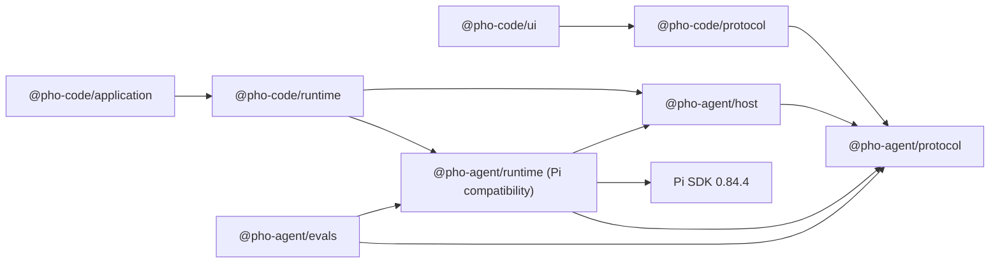

# V5 Pho Agent Foundation implementation plan

## Status and use

Owner-promoted implementation contract for **V5 — Pho Agent Foundation**, 2026-08-20; revised by owner direction 2026-08-26; held by owner direction 2026-08-28; explicitly resumed for grouped end-to-end Task implementation on 2026-09-01 because no real model is currently available. M1–M4 are implemented and machine-verified in the [dated record](./logs/2026-09-01-m1-m4-task-intelligence-implementation.md); the [owner handoff](./handoff.md) is the remaining Task acceptance gate. This resume supersedes the implementation hold for this slice only. V5 remains unaccepted, the earlier M0 acceptance remains reopened, external-backend gaps remain, and V4's independent hold is unchanged.

Read before implementation:

1. [`product.md`](./product.md);
2. [`../../current-state.md`](../../current-state.md);
3. [`../../architecture/README.md`](../../architecture/README.md), [`../../architecture/overview.md`](../../architecture/overview.md), [`../../architecture/codebase-map.md`](../../architecture/codebase-map.md), [`../../architecture/protocol-and-ipc.md`](../../architecture/protocol-and-ipc.md), [`../../architecture/runtime-and-data.md`](../../architecture/runtime-and-data.md), [`../../architecture/renderer-and-ui.md`](../../architecture/renderer-and-ui.md), and [`../../architecture/extension-model.md`](../../architecture/extension-model.md);
4. accepted Plan/Agent under [`../../archive/features/plan-agent/`](../../archive/features/plan-agent/README.md), accepted V3 under [`../../archive/v3/`](../../archive/v3/README.md), and accepted bounded Stop under [`../../archive/urgent/agent-stop/`](../../archive/urgent/agent-stop/README.md);
5. active context compaction under [`../../features/compaction/`](../../features/compaction/README.md) and the reciprocal [V5 relationship record](../../features/compaction/logs/2026-08-20-related-v5-pho-agent.md);
6. pending V4's [hold](../v4/logs/2026-08-20-hold-pending-apple-developer.md) before touching runtime composition;
7. [`../../development.md`](../../development.md) and the project `test-pho-code` skill before choosing verification lanes.

This plan is read-mostly. Each bounded implementation slice gets a new file under [`logs/`](./logs/README.md). Do not put PASS counts or evolving implementation journals here.

## 2026-08-27 backend-neutral direction

Pho Agent is the reusable host, not a synonym for the Pi runtime. Common code must not depend on Pi, Codex app-server, or ACP types. Each adapter owns translation between its backend and the JSON-safe Pho Agent protocol.

The first hard compatibility boundary is session identity:

```ts
interface AgentBackendScopeKey {
  backendId: string;
  scopeId: string;
  sessionId: string;
}
```

A session is pinned to one backend. Backend changes create or select another session; they do not reinterpret an existing transcript. Adapters publish explicit capability descriptors, and callers must not invoke an unsupported operation merely because another adapter supports it.

Foundation slices:

| Slice | Outcome | Status |
| --- | --- | --- |
| B0 | Backend identity, support-level capability descriptor, optional non-baseline operations, Pi-independent host package, and compatibility Pi adapter | In source; corrected after review; focused verification complete; not accepted |
| B1 | Move Pho Code session routing behind the host while preserving current Pi behavior and `workspaceId` compatibility | In source; integration and focused desktop verification complete; not accepted |
| B2a | Direct Codex app-server transport, lifecycle, streaming, cancellation, resume, model/reasoning/Fast discovery and selection, product developer instructions, curated dynamic tools, and normalized native item projection against one generated schema version | Experimental production composition, text/tool delta streaming, model/reasoning/Fast selection, one read-only Pho Code workspace-search tool, and focused desktop shell verification in source; not accepted |
| B2b | Backend-neutral approvals/user input plus Codex command, file-change, MCP, web, image, plan, compaction, review, and auth presentation in Pho Code | Command/file/permission approvals and request-user-input use the existing dock in source; specialized surfaces remain incomplete |
| B3a | ACP v1 adapter through the pinned official TypeScript SDK, including initialize negotiation, session lifecycle, prompt/cancel, model/reasoning/Fast configuration, tool calls, plans, and permissions | Prototype plus backend-neutral permission/config interaction and text/tool delta streaming in source; ordinary Claude use owner-verified; not accepted |
| B3b | Validate one fixed external Claude-compatible ACP agent and project only negotiated capabilities into Pho Code | Lazy `claude-agent-acp` production registration and owner-verified provider-backed desktop use in source; permission/resume and packaged evidence pending |
| B4 | Capability-aware backend selection, cross-backend contract/evaluation fixtures, desktop verification, and acceptance review | Backend-pinned identity, metadata migration, composer Pi/Codex/Claude selection, focused automated desktop checks, and owner-verified ordinary Codex/Claude use in source; evaluations and acceptance pending |

The owner resumed M1–M4 on 2026-09-01 after their contracts were reviewed for backend-neutral state ownership. Pi is the first native Task adapter; Codex and ACP do not advertise the capability, so no Pi custom-entry assumption crosses into those sessions.

### Baseline adapter contract

Every adapter must implement only create/open/read session, prompt admission, abort, authoritative snapshots/events, subscription, and disposal. Model selection, reasoning selection, Fast mode, steering, queued follow-up, images, approvals, manual compaction, session fork, plans, goals, native review, subagents, skills, MCP, and structured file changes are optional. A descriptor maps each supported feature to `native`, `emulated`, or `experimental`; absence means unavailable. Host-emulated queued follow-up may submit a new turn after settlement, but it must never be advertised as native Codex steering.

### Codex boundary

Codex uses `codex app-server` over local stdio JSONL. The adapter owns JSON-RPC framing and narrow versioned wire types; generated schemas are development evidence rather than copied runtime source. B2a is characterized against Codex CLI `0.149.1`, but that build is evidence rather than a runtime requirement. Initialization accepts any installed Codex build that completes the app-server handshake; unsupported protocol behavior fails at the narrow requested operation instead of being guessed from the CLI user-agent string. By owner decision, Codex itself is an external prerequisite: Pho Code neither bundles it nor owns its installation, configuration, authentication, updates, MCP servers, skills, or provider usage. The adapter still fixes the per-turn `workspace-write` sandbox and `on-request` approval policy. The backend remains experimental while app-server compatibility and the external-command discovery path are not accepted. The [official App Server documentation](https://developers.openai.com/codex/app-server) describes the protocol surface as experimental and does not publish an exact CLI-version compatibility contract for clients.

The current experimental desktop composition is lazy: Pho Code advertises Codex without starting a subprocess, then launches the installed `codex app-server` only when the owner chooses Codex for a new or existing backend-pinned session. This is not a packaged-binary claim. Failure to find or initialize a compatible installed command remains a bounded session-creation failure.

After initialization the adapter uses `model/list` to discover the installed App Server's current model catalog, reasoning ladder, and service tiers. It applies the selected model, reasoning `effort`, and `fast` `serviceTier` as `turn/start` overrides. Catalog discovery is compatibility-tolerant: an older compatible server that lacks `model/list` can still use a source-configured model, but Pho Code does not invent a general catalog. Agent message and command-output deltas cross Pho Agent and Pho Code as bounded live events; the completed item/turn snapshot remains authoritative. Fast remains separate from reasoning depth.

The first projection recognizes agent text plus native command execution, structured file changes, MCP calls, web search, image view, review transitions, context compaction, dynamic tool calls, and native collaboration/subagent items. Codex uses its own built-in tools, workspace instruction loading, skills, MCP configuration, and agent loop; Pho Code does not pass Pi's compiled context prompt or Pi tool registry across this backend boundary. New and resumed Codex threads receive a bounded product-owned `developerInstructions` string that explains this ownership boundary. New threads also advertise one reviewed experimental dynamic tool, `pho_search_workspace_references`, which performs bounded read-only path search through Pho Code's workspace-scoped local index. The adapter validates the tool allowlist, binds calls to the open session and current turn, forwards an abort signal, bounds text results, and renders the native `dynamicToolCall` item through the ordinary tool row. This is not general Pi-tool parity. The adapter opts into the characterized experimental API and starts/resumes threads with `workspace-write` sandbox mode and `on-request` approval policy. Command, file-change, and additional-permission requests plus `request_user_input` are normalized into backend-neutral interactions and rendered through Pho Code's existing approval/questionnaire dock. Request IDs remain pinned to backend/session/run ownership; cancellation responds to app-server rather than leaving a turn waiting. Secret questions and unsupported server-request methods fail closed instead of being displayed or silently approved. MCP elicitation, auth-token refresh, attestation, and specialized native surfaces remain unavailable. Context-compaction and collaboration items can be observed, but manual compaction and subagents are not advertised capabilities because Pho Agent exposes neither `thread/compact/start` nor a spawn/delegate/nested-session operation.

### ACP boundary

ACP targets stable protocol v1 through exact `@agentclientprotocol/sdk` `1.4.0`; v2 draft APIs are out of scope. The adapter spawns only a fixed product-selected agent command, negotiates capabilities during initialize, supports new plus negotiated load/resume, starts prompt work asynchronously, cancels through `session/cancel`, and projects message, tool, plan, and compaction updates. Stable `session/request_permission` options become the same backend-neutral approval interaction used by Codex, and the selected opaque ACP option ID returns to the agent. Abort, prompt failure/settlement, and disposal resolve pending permission requests as `cancelled`, as required by the protocol; no prompt waits indefinitely for absent UI. Manual ACP compaction remains unavailable unless a negotiated stable operation exposes it—receiving compaction updates is not a manual compaction command.

When an ACP session advertises select configuration in the `model` or `thought_level` category, or the fixed Claude bridge's `fast` option, Pho Code projects the current value and choices into the composer and writes changes through `session/set_config_option`. Pho Code advertises the fixed bridge's terminal-output metadata capability; ACP message, tool, and terminal-output notifications cross the shared host as live deltas while final prompt settlement and session snapshots remain authoritative. Sessions without an option honestly expose no corresponding control.

By owner decision, Claude's ACP bridge is an external prerequisite rather than a Pho Code production dependency. The lazy production registration invokes the fixed `claude-agent-acp` executable over stdio only after the owner selects Claude. This process boundary isolates the bridge's Claude Agent SDK dependency graph from embedded Pi, so no Anthropic SDK version from the bridge enters Pho Code's lockfile or Electron bundle. Pho Code does not install, download, configure, authenticate, or update the bridge, and does not fall back to `npx` or parse Claude terminal output. The owner reported successful provider-backed Claude use in the Pho Code desktop on 2026-08-27. That verifies the ordinary installed-command initialization and prompt path at owner-verified level; it does not independently establish permission, resume, GUI `PATH` portability, or packaged behavior. Stable ACP v1 has no client-supplied developer-instruction or dynamic-tool operation comparable to Codex App Server; a future shared Pho tool for Claude requires a reviewed ACP MCP-server contract rather than protocol guessing. Sources: [official ACP registry entry](https://raw.githubusercontent.com/agentclientprotocol/registry/main/claude-acp/agent.json), [official bridge package manifest](https://raw.githubusercontent.com/agentclientprotocol/claude-agent-acp/main/package.json).

### Frontend native-activity contract

Pho Code keeps one transcript work-row component. Adapters project bounded `kind`, status, title/name, input, and output; the product bridge maps starts, output deltas, updates, and completion to the existing keyed live-tool event and settled block shapes. Known kinds are command, file change, MCP, web search, image, review, backend-owned subagent activity, and other. File-change activity may link to the accepted change-review surface, but Codex rollback/review state never acquires Pho Code V3 Approve/Undo meaning. Plans and compaction boundaries use their accepted native Pho Code surfaces where compatible. Approvals and request-user-input require named JSON-safe interactions with explicit choices and backend session/run ownership. The current subagent-shaped row is only a flattened display of activity emitted by a backend; Pho Agent has no subagent creation, routing, scheduling, nesting, or orchestration contract.

## Milestone map

| Milestone | Outcome | Depends on |
| --- | --- | --- |
| M0 | Historical extraction of the private headless `pho-agent` boundary and measurable Pi baseline; acceptance reopened by B0–B4 | Accepted current architecture |
| M1 | Branch-aware living Task Brief plus Pho Code Task surface | M0 |
| M2 | Product-supplied, bounded, inspectable evidence packs | M1 |
| M3 | Authoritative verification ledger with freshness and provenance | M1; M2 for UI integration, not record semantics |
| M4 | Criteria-to-evidence completion, final evaluation, packaging, documentation, and V5 acceptance | M0–M3 |

Milestones are sequential acceptance gates. A later milestone may begin only after the prior milestone's structural and deterministic gates pass. Owner real-provider evaluation can be grouped at M4, but M0 baseline thresholds must be frozen before M1 changes agent behavior.

## Global acceptance rules

Every milestone must:

- keep the selected backend authoritative for its inner loop, tool execution, streaming, session persistence, and backend-native features; keep Pi `0.84.4` authoritative within the Pi adapter and do not reproduce Codex or ACP agent loops;
- preserve the accepted Pho Code layers while adding one-way `@pho-code/* -> @pho-agent/host -> backend adapter`; no adapter may depend on Pho Code, Electron, React, or another adapter;
- keep `@pho-agent/protocol` and `@pho-agent/host` free of Node, backend SDKs, `@pho-code/*`, React, Electron, UI packages, Git, PTY libraries, and product filesystem policy; backend adapters may import only the process/SDK dependencies their protocol requires;
- keep the renderer free of Node, Pi, credentials, filesystem/process handles, evidence-provider authority, and raw tool/runtime objects;
- use named JSON-safe commands/events with runtime validation and bounded strings, arrays, details, errors, and projections;
- preserve composite ownership, stale run/event rejection, controller generation/lifecycle checks, and authoritative snapshot recovery;
- leave Pho Code's current `workspaceId` desktop contract compatible through its adapter while core uses opaque `{ backendId, scopeId, sessionId }`; do not rewrite Pi JSONL or metadata merely to rename identity;
- preserve accepted Plan/Agent, ask-user, todo, context-prompt, permissions, sandbox, V3 review/Undo, Stop/Stop-all, session archive/Trash, accounts, skills, GitHub MCP, retrieval, and web behavior unless a milestone explicitly names an adapter change;
- use isolated user-data, agent-data, and workspace fixtures; never evaluate or delete against owner data;
- record unit, integration, desktop, packaged, owner-verified, and not-verified evidence distinctly;
- keep evaluation fixtures and scoring frozen after M0 except through a dated correction record made before candidate results are scored;
- keep generic memory, Pho Research, PDFs/citations, quiz/Socratic policy, session navigation, Pho Agent-owned subagent orchestration, worktrees, browser automation, long-job scheduling, and persistent kernels out of scope; backend-native collaboration remains ordinary bounded activity projection;
- leave V4's utility-process, public diagnostics/privacy, migration, signing/notarization, release artifact, update, and website contracts untouched;
- update accepted architecture/current state only when the final V5 gate passes; until then, link proposed behavior back to this workstream.

## Current implementation and extraction gap

The repository already has useful layer separation, but the reusable and Pho Code-specific responsibilities are mixed:

- package names and public types are all `@pho-code/*`;
- `packages/protocol` combines product-neutral session/run/event shapes with workspace, GitHub, sandbox, skills, retrieval, Plan UI, and V3 review contracts;
- `packages/runtime/src/pi-runtime.ts` constructs Pi services and also composes Pho Code retrieval, web, GitHub, change review, sandbox, skills, images, and context behavior;
- product feature factories import Pi packages directly;
- `HarnessRuntime` exposes both general session operations and coding-product settings/review operations;
- identity uses canonical workspace path as `workspaceId` throughout application/runtime/protocol;
- tests prove Pho Code and the packaged app, but no consumer proves the reusable layer is independent of Pho Code;
- the resumed M1–M4 candidate now provides Task Brief, evidence-pack state, verification ledger, completion assessment, and deterministic development/holdout fixtures; real-provider quality remains unverified until the owner handoff.

M0 extracts the source/package boundary and reusable harness capabilities already accepted through Pho Code. Electron main remains the composition root and Pi remains in the same process. The future V4 process broker should later carry the whole resulting runtime graph without having to undo V5.

## Target package architecture

```text
packages/
├── pho-agent/        pinned git submodule: https://github.com/vietfood/pho-agent.git
│   └── packages/
│       ├── protocol/ @pho-agent/protocol: backend-neutral JSON-safe contracts
│       ├── host/     @pho-agent/host: routing, lifecycle, and capability dispatch
│       ├── runtime/  @pho-agent/runtime: current Pi implementation and compatibility facade
│       ├── backend-pi/    target adapter package after compatibility migration
│       ├── backend-codex/ target direct Codex app-server adapter
│       ├── backend-acp/   target ACP adapter
│       └── evals/    @pho-agent/evals: deterministic fixtures, runner, scoring
├── protocol/         @pho-code/protocol: Pho Code bridge + re-exported agent contracts
├── runtime/          @pho-code/runtime: coding product profile and feature adapters
├── application/      @pho-code/application: desktop coding use cases and metadata
└── ui/               @pho-code/ui: Pho Code presentation only
```

### Dependency direction



Enforce in ESLint and package-boundary tests:

- `@pho-agent/protocol` imports no Node, Pi, React, Electron, or product package;
- `@pho-agent/host` imports only `@pho-agent/protocol` and no Node, backend SDK, React, Electron, or product package;
- `@pho-agent/runtime` imports Node and Pi as required, but no Electron/React/`@pho-code/*`;
- `@pho-agent/evals` imports only agent packages plus test-only libraries and owned fixtures;
- Pho Code packages may depend on agent packages;
- agent packages may never depend back on Pho Code;
- renderer/UI continue to import protocol only, never agent runtime directly.

### Pi feature seam

Do not invent a second extension system. `@pho-agent/runtime` exposes a reviewed `feature-api` subpath that is a thin, versioned facade over only the Pi extension/tool types needed by baked product features. It may re-export or narrowly wrap:

- `InlineExtension` and extension lifecycle registration;
- `defineTool` and the selected JSON-schema builder/types;
- bounded tool-result types;
- named session/custom-entry helpers required by Pho Agent features.

Only `@pho-agent/runtime` constructs `ModelRuntime`, `AgentSessionRuntime`, `SessionManager`, resource loaders, or provider services. Pho Code feature factories migrate from direct Pi imports to `@pho-agent/runtime/feature-api`. If the facade would need to mirror a broad Pi API, stop and keep that feature inside the agent runtime instead of recreating Pi.

### Runtime interfaces

`AgentRuntime` owns product-neutral session capabilities. Optional Pho Agent feature modules own reusable Plan/ask-user/todo, skills, MCP, and related harness behavior without widening the core runtime interface:

```ts
interface AgentScopeKey {
  scopeId: string;
  sessionId: string;
}

interface AgentRuntime {
  getSessionSnapshot(key: AgentScopeKey): Promise<AgentSessionSnapshot>;
  createSession(scopeId: string): Promise<AgentSessionSnapshot>;
  openSession(key: AgentScopeKey): Promise<AgentSessionSnapshot>;
  sendPrompt(input: AgentPromptInput): Promise<AgentPromptAdmission>;
  steerRun(input: AgentSteerInput): Promise<AgentQueueAdmission>;
  queueFollowUp(input: AgentFollowUpInput): Promise<AgentQueueAdmission>;
  abortRun(input: AgentAbortInput): Promise<void>;
  subscribe(listener: (event: AgentRuntimeEvent) => void): Unsubscribe;
  dispose(): Promise<void>;
}
```

The exact interface also carries model/thinking, prepared-input, host-interaction, Task Brief, evidence, verification, and completion methods as milestones land. Core does not expose workspaces, V3 diffs, terminal, product settings, or Electron. A concrete reviewed integration such as GitHub remains an optional feature module composed by the product, not a method added to core `AgentRuntime` and not a generic MCP manager.

Pho Code retains a `HarnessRuntime` adapter during V5. It maps:

- canonical `workspaceId` to opaque `scopeId` without changing persisted session ownership;
- agent session/run/model operations to `AgentRuntime`;
- Pho Code-specific operations to coding services;
- agent events back into the existing Pho Code bridge envelope until a compatible protocol migration is deliberately accepted.

Do not rename environment variables, app data, bundle identity, or user-facing Pho Code state in M0. A future Pho Research product supplies independent roots and identity; V5 does not share credentials or sessions automatically.

### Product adapter

The construction seam is source-owned:

```ts
interface AgentProductAdapter {
  id: string;
  scope: AgentScopeAdapter;
  features: readonly AgentFeature[];
  evidenceProviders: readonly EvidenceProvider[];
  verificationAdapters: readonly VerificationAdapter[];
}
```

`AgentScopeAdapter` resolves and validates opaque scope ownership in privileged code. The renderer cannot submit an arbitrary path and call it `scopeId`. Product adapters are compiled composition, not user settings or plugins.

M0 includes a deterministic non-code adapter fixture with an in-memory opaque scope and no workspace/Git/change/terminal features. It proves package independence; it is not Pho Research scaffolding.

## Sources of truth

| State | Authority | Projection |
| --- | --- | --- |
| Providers, inner loop, messages, tool entries, session tree, compaction | Pi | Agent runtime snapshot/event adapters |
| Task Brief revisions | Latest valid `pho-agent.task-brief` custom entry on active branch | Optional `task.brief` snapshot |
| Evidence pack used by a run | Persisted hidden `pho-agent.evidence-pack` custom message plus bounded manifest | Latest/run-addressable Task Evidence state |
| Verification observation | Referenced Pi tool/custom entry or explicit owner confirmation plus normalized `pho-agent.verification` record | Task Verification ledger |
| Completion assessment | Latest valid `pho-agent.completion` custom entry for current brief revision | Task completion snapshot |
| Product metadata/settings | Product application | Separate from agent task state |
| Evaluation definitions | Source-controlled fixtures | Runner output and immutable dated V5 logs |

Do not copy the Pi transcript into application metadata. Do not treat renderer caches, model narration, system prompts, context-compaction summaries, or evaluation judge prose as authoritative task state.

## Product-neutral identity and compatibility

Core identity is an opaque non-empty `backendId`, `scopeId`, and backend-native `sessionId`. Bounds match existing protocol ID limits. The host cannot assume that a scope is a filesystem path or that session IDs are globally unique across backends.

During V5:

- Pho Code's bridge and product metadata may continue to say `workspaceId`;
- the Pho Code application validates current ownership, then maps to `scopeId` at the runtime adapter;
- agent events carry `{ backendId, scopeId, sessionId }`; the Pho Code adapter emits compatible events and retains backend ownership in privileged state until the desktop protocol deliberately exposes it;
- no path derivation occurs from renderer-controlled IDs;
- Pi session headers/files are not rewritten;
- archive/restore/Trash continue to use Pho Code's accepted exact-artifact path.

If maintaining both identifiers creates an ambiguous command or stale-event path, stop the slice and add an explicit compatibility record. Do not silently widen IPC or reinterpret an existing field.

## Protocol contract

Exact exported locations may adjust during implementation, but semantic ownership, bounds, and named operations below are fixed by this plan.

### Shared task snapshot

```ts
interface AgentTaskSnapshot {
  brief?: TaskBriefSnapshot;
  evidence?: EvidencePackSummary;
  verification: VerificationLedgerSnapshot;
  completion?: CompletionAssessment;
}
```

`AgentSessionSnapshot.task` is optional until the M1 feature binds. A failed optional feature omits task state and reports diagnostics rather than fabricating an empty healthy snapshot. Pho Code's `SessionSnapshot` re-exports or projects the same JSON-safe value.

### M1 Task Brief

```ts
type TaskBriefStatus = "draft" | "active" | "completed" | "cancelled";

interface TaskAcceptanceCriterion {
  id: string;
  text: string;
}

interface TaskBriefContent {
  objective: string;
  constraints: string[];
  acceptanceCriteria: TaskAcceptanceCriterion[];
  assumptions: string[];
  openQuestions: string[];
  nonGoals: string[];
}

interface TaskBriefSnapshot extends TaskBriefContent {
  revision: string;
  status: TaskBriefStatus;
  updatedAt: string;
  updatedBy: "agent" | "owner";
}
```

Named host commands:

| Command | Purpose |
| --- | --- |
| `updateTaskBrief` | Idle-only owner replace/update with expected revision |
| `resetTaskBrief` | Idle-only owner append of an explicit reset/tombstone entry |
| `reopenTask` | Return a completed/cancelled brief to active with a new revision |

Baked agent tool: `update_task_brief`. It replaces the whole normalized content under controller serialization and returns revision/status. It is available in Agent and Plan, permission-allow-listed as session-state mutation, and cannot write workspace files. Plan tool intersection must include it without enabling any Plan-forbidden mutation tool.

Selected hard bounds:

- objective: 4,096 UTF-16 code units;
- criteria: 32, each id 64 and text 1,024 code units;
- constraints, assumptions, and non-goals: 32 each, 1,024 code units per item;
- open questions: 16, 1,024 code units per item;
- total normalized serialized content: 64 KiB;
- duplicate criterion IDs and duplicate normalized criterion text are rejected;
- empty objective or empty criteria text is rejected; an empty criteria list is allowed only while status is `draft`.

Owner updates use compare-and-set `expectedRevision`. Agent updates are serialized inside the exact session controller and fail if the binding/generation changes. A content change increments revision and invalidates the prior completion assessment. Reset appends a tombstone; it does not rewrite JSONL.

### M2 evidence packs

```ts
type EvidenceFreshness = "current" | "stale" | "unknown";

interface EvidenceRequest {
  key: AgentScopeKey;
  runId: string;
  prompt: string;
  taskBrief?: TaskBriefSnapshot;
  signal: AbortSignal;
}

interface EvidenceCandidate {
  id: string;
  providerId: string;
  sourceId: string;
  title: string;
  content: string;
  displayLocator?: string;
  relevance: number;
  freshness: EvidenceFreshness;
  contentHash: string;
  mandatory?: boolean;
  sensitivity?: "ordinary" | "restricted";
}

interface EvidencePackItem {
  id: string;
  providerId: string;
  sourceId: string;
  title: string;
  excerpt: string;
  displayLocator?: string;
  relevance: number;
  freshness: EvidenceFreshness;
  contentHash: string;
  selectionReason: string;
}

interface EvidencePackSummary {
  id: string;
  runId: string;
  briefRevision?: string;
  generatedAt: string;
  items: EvidencePackItem[];
  omittedCount: number;
  failedProviders: string[];
  estimatedTokens: number;
  characterCount: number;
  truncated: boolean;
}
```

`EvidenceProvider.collect()` is runtime-only. Provider-specific locators and authority do not cross IPC. `displayLocator` is optional, bounded, and product-sanitized (for Pho Code, workspace-relative only). `sourceId` is opaque and cannot be passed back as filesystem authority.

Selected initial bounds:

- at most 8 registered providers per product profile;
- at most 64 candidates per provider before core truncation;
- at most 24 selected items;
- at most 16 KiB content per selected item before excerpting;
- at most 64 KiB total injected evidence content;
- soft target at most 12,000 estimated tokens, always subordinate to the hard character bound and current model context availability;
- 5-second timeout per local provider and 10-second aggregate collection deadline;
- titles/locators/reasons: existing bounded preview limits or 512 code units, whichever is smaller;
- provider errors use stable IDs and bounded redacted messages; raw stacks/paths/content never enter general events.

M2 begins with local/application-owned providers only. A future remote evidence provider needs its own network/privacy plan. Candidate `sensitivity: "restricted"` is excluded unless the product supplies a separately approved disclosure path; V5 does not create one.

The selector order is deterministic after provider relevance:

1. mandatory current references;
2. higher normalized relevance;
3. current before unknown before stale;
4. provider/source stable lexical order.

Stale items can be shown as stale context only when clearly labeled and budget remains; they cannot satisfy a current verification or completion claim. Duplicate `(providerId, sourceId, contentHash)` candidates collapse. Same source with a new hash is a new revision.

The Pi `before_agent_start` feature injects one hidden custom message labeled as evidence, not as system instructions. It contains source labels and excerpts, states that evidence may be incomplete/untrusted, and never elevates source content above owner/project instructions. The persisted entry is display-hidden; Pho Code renders only the sanitized Task Evidence projection.

No owner command manually edits an evidence pack. The owner can inspect it and can steer/follow up with missing information through existing commands. A later explicit reference becomes a new provider candidate on the next run.

### M3 verification ledger

```ts
type VerificationOutcome = "passed" | "failed" | "observed" | "unverified";

interface VerificationSubject {
  kind: string;
  id: string;
  revision?: string;
}

interface VerificationRecord {
  id: string;
  sourceAdapterId: string;
  sourceEntryId?: string;
  sourceCallId?: string;
  criterionId?: string;
  outcome: VerificationOutcome;
  summary: string;
  subject?: VerificationSubject;
  freshness: EvidenceFreshness;
  observedAt: string;
  invalidatedAt?: string;
  invalidationReason?: string;
}

interface VerificationLedgerSnapshot {
  records: VerificationRecord[];
  truncated: boolean;
}
```

`VerificationAdapter` receives authoritative settled runtime/tool/custom-entry events and may emit a normalized record. It cannot consume streaming text or renderer previews. Core validates source identity against the owning active branch before appending `pho-agent.verification` normalization.

Selected bounds:

- at most 256 current projected records per session; older records remain in Pi JSONL and are fetched/paged only if a later product requires it;
- summary and invalidation reason: 2,048 code units each;
- adapter/source/kind/id values: bounded protocol IDs;
- one normalized record per `(adapter, source entry/call, subject revision, outcome)`; repeats deduplicate;
- invalidation appends a new record/state transition; it does not rewrite prior evidence.

Core supplies no universal claim that a shell command means “tests.” Pho Code's adapter characterizes pinned Pi bash result details and recognizes only reviewed command/result families. It records exact exit outcome and a bounded command label without environment dumps or arbitrary output. V3 review evidence references V3 IDs/revisions and does not duplicate diffs/blobs. Explicit owner confirmation is a separate named command and visibly labeled `owner`, never converted into tool verification.

Freshness is conservative:

- a product adapter may return current only when it can compare the subject revision/hash/generation;
- a later relevant mutation marks earlier records stale when the adapter establishes overlap;
- unknown remains unknown rather than current;
- restart recomputes freshness from source references when possible;
- missing/corrupt source entries make the record stale or unavailable, not passed.

### M4 completion

```ts
type CompletionOutcome = "passed" | "failed" | "unverified";

interface CriterionAssessment {
  criterionId: string;
  outcome: CompletionOutcome;
  verificationIds: string[];
  note?: string;
}

interface CompletionAssessment {
  id: string;
  briefRevision: string;
  status: "incomplete" | "ready" | "accepted_with_gaps";
  criteria: CriterionAssessment[];
  createdAt: string;
  acceptedByOwnerAt?: string;
}
```

Baked agent tool: `complete_task`.

Validation rules:

- exactly one assessment for every current criterion; no unknown or duplicate criterion;
- `passed` requires at least one current `passed` verification record owned by the same session and compatible criterion/subject;
- `failed` requires current failed evidence or a bounded explicit explanation plus linked observed record; it can never become ready;
- `unverified` may have no record but requires an honest note;
- stale, unknown-as-current, cross-session, missing, or criterion-incompatible records cannot support `passed`;
- all criteria passed produces `ready` and can mark the Task Brief completed;
- any failed/unverified criterion produces `incomplete` until the owner explicitly accepts disclosed unverified gaps;
- failed criteria cannot be accepted as gaps; they require a new assessment or owner cancellation;
- `acceptTaskCompletionGaps` is a named owner command available only while idle and only when all non-passed criteria are `unverified`;
- a brief revision or relevant evidence invalidation makes the prior assessment incomplete/stale and reopens the task projection;
- `complete_task` does not end the Pi loop, stop a run, approve V3 changes, commit files, or suppress final narration.

Task surface rendering uses the authoritative assessment. The transcript may show the ordinary tool row and final explanation, but prose is not the completion source of truth.

### Commands and events

Add named agent-layer operations and Pho Code bridge adapters only as each milestone lands:

| Milestone | Commands/tools | Snapshot/events |
| --- | --- | --- |
| M1 | `updateTaskBrief`, `resetTaskBrief`, `reopenTask`; `update_task_brief` tool | `task.brief`; `taskStateChanged` invalidation/snapshot |
| M2 | no generic provider command; optional `getEvidencePackDetail` by validated pack/item ID | `task.evidence`; `evidencePackChanged` or authoritative session snapshot |
| M3 | `recordOwnerVerification` with constrained semantics; optional paged detail | `task.verification`; `verificationChanged` |
| M4 | `acceptTaskCompletionGaps`; `complete_task` tool | `task.completion`; `completionChanged` |

Prefer one session-scoped `taskStateChanged` event followed by an authoritative snapshot if separate incremental variants add reducer complexity without performance value. High-frequency live token events remain separate. Whichever shape is selected must be frozen in the milestone log, added to command registries/preload/main one-to-one, and tested for composite ownership and stale generation.

## Task state lifecycle

| Lifecycle event | Required behavior |
| --- | --- |
| New session | No brief, empty ledger, no completion; ordinary chat unchanged |
| Agent creates brief | Append valid brief entry; publish authoritative task state |
| Owner edits brief | Idle-only compare-and-set append; prior completion becomes stale |
| Plan/Agent switch | Same brief and ledger; only accepted tool intersection changes |
| Prompt admission | Evidence collection binds to exact scope/session/run/brief revision |
| Evidence provider timeout | Admit with bounded degraded pack unless a mandatory product provider explicitly fails closed |
| Tool settles | Registered verification adapters may append normalized records |
| Agent completes task | Validate full criterion assessment; publish completion state; Pi run continues normally |
| Owner accepts unverified gaps | Idle-only transition to `accepted_with_gaps`; failures remain unacceptable |
| Relevant later mutation | Product adapter marks affected verification stale; completion returns incomplete |
| Switch session/scope | State remains with owning controller; visible UI selects only matching key |
| Archive | Metadata-only; task state remains in Pi session |
| Move chat to Trash | Existing settled exact-artifact operation moves all Pi task entries with the session |
| Compaction | Current state remains reconstructable from full branch and is re-injected as needed; old packs need not remain in active context |
| Session replacement | Cancel collection, invalidate generation, rebind V5 features, rebuild active-branch task state |
| Renderer reload | Fetch authoritative snapshot; never rebuild from UI cache |
| Application restart | Reconstruct from Pi branch/source entries; no in-flight collection or optimistic completion survives |
| Stop/Stop-all | Abort the owning run and evidence collection signal; do not delete settled task state |
| Shutdown | Cancel providers/adapters and dispose within existing bounded aggregate deadline |

## Evaluation contract (M0 and M4)

### Evaluation classes

1. **Mechanics fixtures:** deterministic model/runtime cases for schemas, lifecycle, ownership, injection, ledger, completion, and failure handling.
2. **Task-quality fixtures:** synthetic repositories with known required/forbidden evidence and deterministic acceptance commands.
3. **Owner rubric cases:** representative investigation, bug diagnosis, scoped implementation, contradicted assumption, unrelated failing test, interruption/reopen, and insufficient-evidence tasks.
4. **Desktop journeys:** real Electron inspection of Task state, background-session routing, keyboard/focus, and relaunch.
5. **Packaged journey:** unsigned app-owned `pho-agent` features with isolated state and no Pi CLI/global features.

### Source-controlled case shape

```ts
interface AgentEvalCase {
  id: string;
  fixtureRevision: string;
  prompt: string;
  setup: EvalFixtureSetup;
  requiredEvidenceIds: string[];
  forbiddenEvidenceIds: string[];
  acceptanceChecks: EvalAcceptanceCheck[];
  rubric: EvalRubric;
}
```

Fixtures contain only synthetic or repository-owned data. No user sessions, credentials, arbitrary home-directory content, or private screenshots enter the corpus.

### Metrics

| Metric | Calculation/authority |
| --- | --- |
| Task success | Deterministic acceptance checks first; owner rubric for non-deterministic quality |
| Critical evidence recall | Required evidence selected / required evidence defined by fixture |
| Evidence precision | Selected items judged useful / selected items; deterministic labels where available |
| Forbidden-evidence rate | Forbidden items included or disclosed; must remain zero |
| Unsupported-claim count | Owner/source-grounded rubric; an LLM judge may flag candidates but cannot decide alone |
| Verification false-pass rate | Passed claims without valid current authoritative records; must remain zero |
| Criterion coverage | Current criteria with valid passed/failed/unverified assessment / total criteria |
| Recovery quality | Whether contradicted assumption/failure changes the plan or produces an honest blocker |
| Efficiency | Tool count, injected characters/estimated tokens, latency, provider usage/cost; reported, not optimized at expense of correctness |

### Baseline freeze

Before M1 source changes:

- record exact fixture commit, runner version, model/provider, thinking level, effective features, permission profile, context setting, repetition count, and scoring rubric;
- run the current harness baseline and keep raw machine-readable results outside docs if large, with checksums and a bounded summary in a dated V5 log;
- pre-register M4 acceptance thresholds in that log;
- require at minimum: no regression on deterministic task success, zero forbidden evidence, zero verification false passes, protocol/budget bounds always enforced, and no weakening of existing Pho Code desktop/package gates;
- define the desired improvement threshold for task/evidence quality from the observed baseline before candidate results exist;
- use at least three repeated real-provider runs per owner-rubric case when cost/credentials permit; if owner evidence is unavailable, mark V5 not owner-verified rather than substituting a judge model.

Do not tune prompts against hidden acceptance fixtures and then describe them as unseen evaluation. Separate development cases from final holdout cases at M0.

### Result integrity

- Runner output is append-only per run ID and includes configuration fingerprints.
- Failed/cancelled/time-limited runs remain in results.
- Changing a fixture, rubric, threshold, or model creates a new comparison cohort.
- General logs exclude prompts/source excerpts when they may contain sensitive data; source-controlled synthetic cases may be named directly.
- A model-generated score is advisory and stored separately from deterministic/owner scores.

## Security, privacy, and trust

- Evidence collection is information egress to the selected model/provider. The Task surface must disclose that selected excerpts enter the session/provider request.
- Providers run only from the compiled product adapter. There is no project/global provider discovery or Settings manager.
- Core validates provider IDs, timeouts, abort, output bounds, freshness values, hashes, and JSON safety.
- Pho Code evidence providers use existing trusted-workspace and sensitive-path policy. They do not bypass permission/sandbox rules through direct arbitrary filesystem/process APIs.
- Hidden evidence messages are untrusted context, not system instructions. They carry explicit delimiters and source labels; source content cannot close or replace those delimiters through raw interpolation.
- Tool/result adapters redact secrets, environment dumps, absolute sensitive paths, provider payloads, and raw errors before ledger persistence/projection.
- Task Brief content can be model-generated and wrong. Owner/project instructions and current repository evidence outrank it.
- Verification records prove only the represented observation at its subject revision. They do not prove global correctness or hostile-code safety.
- Future products receive separate data roots and product identity by default. Cross-product credential/session sharing requires a later explicit contract.

## Concurrency and failure semantics

| Condition | Required response |
| --- | --- |
| Brief update races owner/agent update | Compare revision/controller generation; reject loser with current revision |
| Prompt starts while owner edits brief | Serialize through controller admission; pack binds one exact brief revision |
| Provider returns after abort/session replacement | Ignore by run/controller generation; never append to successor session |
| Duplicate provider items | Deterministic dedupe before budget selection |
| Evidence exceeds bounds | Truncate/omit with summary; never send an oversized IPC/provider message |
| Provider throws/raw path in error | Redact to stable diagnostic; ordinary chat continues when optional |
| Pi hook cannot inject evidence | Mark degraded and do not claim the run used the pack |
| Tool preview resembles exit success | Ignore; only structured settled adapter input can create record |
| Source entry absent after restart | Mark record stale/unavailable; completion cannot use it as current |
| Criterion removed/renamed | New brief revision invalidates prior mapping; do not heuristically remap |
| Evidence becomes stale after completion | Completion returns incomplete on reconciliation |
| Cross-session verification ID | Reject without disclosing the other session's record |
| Feature bind fails | Report diagnostics, omit task capability, preserve ordinary Agent chat |
| Evaluation process fails | Record failed run; do not silently retry into a more favorable sample |

## Intended file ownership

Final file names may tighten during M0 extraction, but ownership must remain:

| Path | Intended responsibility |
| --- | --- |
| `packages/pho-agent/packages/protocol/src/{identity,session,events,task-brief,evidence,verification,completion}.ts` | Product-neutral JSON-safe contracts, bounds, validators, reducers |
| `packages/pho-agent/packages/runtime/src/{pi-adapter,session-registry,feature-api}.ts` | Pi construction, sessions, feature seam |
| `packages/pho-agent/packages/runtime/src/{task-brief,evidence-pack,verification-ledger,completion}.ts` | V5 active-branch projection and operations |
| `packages/pho-agent/packages/runtime/src/task-feature.ts` | Pi tool/hook binding and lifecycle |
| `packages/pho-agent/packages/evals/src/*`, `packages/pho-agent/packages/evals/fixtures/*` | Runner, scoring, synthetic fixtures, configuration fingerprints |
| `packages/protocol/src/*` | Pho Code bridge-specific contracts and compatibility re-exports/adapters |
| `packages/runtime/src/pho-code-runtime.ts` or existing composition successor | Pho Code `HarnessRuntime` adapter/product composition |
| `packages/runtime/src/*-evidence-provider.ts` | Pho Code evidence providers and verification adapters |
| `packages/application/src/bootstrap.ts` | Pho Code identity validation and named command delegation only |
| `apps/desktop/electron/{ipc,preload,main}.ts` | Fixed V5 commands/events; no intelligence policy |
| `packages/ui/src/task-surface.tsx` | Pho Code Brief/Evidence/Verification presentation |
| `apps/desktop/src/App.tsx` and reducer/hooks | Keyed task state routing and commands |
| `packages/agent-*/test/*` | Headless contracts, Pi integration, evaluation mechanics |
| `packages/{protocol,runtime,application,ui}/test/*` | Pho Code compatibility and adapters |
| `apps/desktop/tests/task-intelligence.spec.ts` | Real Electron Task journey and composite routing |
| `apps/desktop/tests/packaged.spec.ts` | App-owned packaged feature/resource journey |

Do not move code-specific change review, GitHub MCP, terminal, workspace retrieval UI, or settings into agent packages merely because they can produce evidence. Their small provider/adapter interfaces point inward; their domain implementation stays with Pho Code.

## Milestone 0: foundation extraction and measurable baseline

### Outcome

Private headless `@pho-agent/*` packages exist, Pho Code consumes them without observable regression, a deterministic non-code fixture proves independence, and the evaluation baseline/thresholds are frozen before intelligence behavior changes.

### Slice 0A: evaluation specification and baseline

1. Add source-controlled synthetic fixtures and typed case/result schema under `@pho-agent/evals`.
2. Implement deterministic checks and owner-rubric result capture without an LLM judge dependency.
3. Add configuration fingerprints and append-only result output into an owned temporary directory.
4. Split development and holdout cases.
5. Run current Pho Code baseline with the deterministic seam and, when credentials/cost permit, the selected real provider.
6. Write a dated M0 baseline log with checksums, bounded metrics, exact configuration, repetition count, and pre-registered M4 thresholds.

### Slice 0B: package boundary

1. Add `@pho-agent/protocol`, `@pho-agent/runtime`, and `@pho-agent/evals` package manifests/tsconfigs.
2. Move or introduce product-neutral types without changing existing wire values; temporarily re-export from `@pho-code/protocol` where needed.
3. Extract Pi model/session construction, registry, extension host, transcript projection, and generic lifecycle behind `AgentRuntime`.
4. Add the narrow `feature-api` and migrate Pho Code baked factories away from direct Pi imports where the facade covers them.
5. Keep Pho Code-specific services in `@pho-code/runtime` and implement the `HarnessRuntime` adapter.
6. Add opaque core scope identity with the current workspace adapter.
7. Add ESLint/package tests forbidding reverse dependencies.
8. Remove obsolete duplicate helpers only after callers/tests prove the new owner; preserve unrelated work.

### Slice 0D: reusable harness capability ownership

1. Move generic manifest flattening, JSON safety/errors, and the bounded opaque-scope session registry into `@pho-agent/*` while preserving Pho Code bridge names through adapters.
2. Move accepted Plan/ask-user/todo mechanics and the context-prompt Pi hook into Pho Agent; Pho Code retains its sidebar/dialog UI and current context-setting adapter.
3. Move skill discovery/invocation into Pho Agent while Pho Code retains curated built-in skill content, enabled-source metadata, Settings UI, and packaged path selection.
4. Move the fixed read-only GitHub MCP client, allowlist, Pi feature, artifact identity, and injected secret-store seam into an optional Pho Agent feature. Pho Code retains enablement metadata, Settings/account UI, application identity labels, and resource-root composition.
5. Keep coding-only workspace authority, retrieval/Git/change review/Undo, terminal, renderer/Electron, data-root, and packaging policy in Pho Code.
6. Preserve existing persisted identifiers, tool names, settings snapshots, and user-visible behavior; compatibility re-exports may remain until a later deliberate protocol migration.

### Slice 0C: parity and consumer proof

1. Add an in-memory non-code product adapter fixture with no workspace path, Git, retrieval, MCP, sandbox, change review, or Pho Code UI.
2. Exercise create/open/prompt/stream/settle/abort/reopen through `AgentRuntime` and isolated Pi JSONL.
3. Run the existing Pho Code integration/Desktop/package lanes unchanged.
4. Confirm packaged resources still resolve from the application bundle and no user Pi installation supplies missing features.
5. Inspect dependency graph and built chunks: eager Electron main remains Pi-free until current dynamic runtime load, and no new process boundary appears.

### M0 acceptance criteria

- Baseline fixtures, scoring, cohort identity, repetition count, and M4 thresholds are frozen in an immutable log before M1 implementation.
- `@pho-agent/*` has no `@pho-code/*`, Electron, React, UI, or product-service dependency.
- Non-code fixture builds and completes the headless deterministic lifecycle.
- Pho Code bridge values, session artifacts, app metadata, data roots, feature composition, and user-visible behavior remain compatible.
- Only agent runtime constructs Pi services; product features use the approved seam.
- Reusable Plan/ask-user/todo, skills, fixed GitHub MCP lifecycle, manifest flattening, and session-registry implementations have one owner under `@pho-agent/*`; Pho Code contains only explicit product adapters or compatibility re-exports for those capabilities.
- V4 utility-process/public-release files and contracts are unchanged except living cross-links.
- No Task Brief/evidence/verification/completion feature is exposed yet.

### M0 verification

- **Unit:** package boundaries, identity adapter, protocol compatibility/re-exports, eval scoring/fingerprints.
- **Integration:** real pinned Pi lifecycle through `AgentRuntime`, non-code consumer, existing Pho Code runtime suites with isolated roots.
- **Desktop:** full `bun run test:desktop`, emphasizing smoke/chat/sessions/settings/permissions/Plan/V3/Stop.
- **Packaged:** `bun run package:mac && bun run test:packaged` because dependency/resource composition changes.
- **Owner evaluation:** baseline real-provider cohort if credentials/cost are available; otherwise explicitly not owner-verified and M4 cannot make comparative real-provider claims.
- **Exit commands:** `bun run typecheck`, `bun run lint`, `bun test`, `bun run test:desktop`, `bun run build`, `bun run package:mac`, `bun run test:packaged`.

## Milestone 1: living Task Brief

### Outcome

Task Brief state is a product-neutral, branch-aware Pi-session feature. Pho Code exposes it through the Task surface without merging Plan/todo/context prompt authorities.

### Implementation sequence

1. Add M1 protocol types, validators, bounds, reducers, errors, and optional snapshot state.
2. Characterize pinned Pi custom-entry/active-branch behavior, including reset, compaction entries, session replacement, and malformed historical entries.
3. Implement append-only brief projector with revision compare-and-set and tombstone reset.
4. Register `update_task_brief` through the feature seam; add baked guidance for nontrivial tasks without a classifier/model side call.
5. Add Plan/Agent tool-intersection and permission allow-list updates without enabling workspace writes in Plan.
6. Add product-neutral runtime commands and Pho Code application/IPC/preload adapters.
7. Add the Pho Code Task rail/surface with Brief section, empty/draft/active/completed/cancelled states, idle-only editor/reset/reopen, focus restoration, and background-session routing.
8. Add diagnostics and fail-open ordinary chat behavior for a missing/failed task feature.
9. Record a V5 log and reciprocal UI implementation log.

### M1 acceptance criteria

- Valid owner/agent updates persist and restore from the active Pi branch.
- Concurrent/stale revision updates fail without overwriting newer state.
- Reset is append-only and does not edit session JSONL.
- Brief edits invalidate prior completion state shape even though M4 is not implemented.
- Agent and Plan both expose the task tool; Plan still blocks accepted mutation tools.
- Task Brief, Plan, todos, and context prompt remain separate and accurately labeled.
- Chat without a brief behaves exactly as before.
- Switching/reloading/reopening cannot show another session's brief.
- Oversized, malformed, duplicate, cross-session, late-generation, and corrupt-entry cases fail safely.

### M1 verification

- **Unit:** validators/bounds/revisions/reducers/tool intersection/UI helpers.
- **Integration:** pinned Pi custom entries, active-branch reconstruction, session replacement, abort/reopen, corrupt optional entry tolerance.
- **Desktop:** create/edit/reset/reopen brief; Plan/Agent; background session; live-run inspect-only; keyboard/focus/light/dark/reduced motion.
- **Packaged:** Task baked feature and Task surface work from app resources without Pi CLI/global packages.
- **Owner:** real-provider nontrivial task creates/updates a useful brief without forcing one on trivial chat.

## Milestone 2: bounded evidence packs

### Outcome

Each qualifying run can receive one bounded, inspectable evidence pack from registered product providers. The owner can see exactly what entered that run and what was omitted/degraded.

### Implementation sequence

1. Add evidence types, provider interface, bounds, selectors, hashes, timeouts, abort, and error normalization.
2. Implement deterministic selector/dedupe/budget logic independently of Pi.
3. Add the Pi `before_agent_start` adapter with explicit evidence delimiters and hidden custom-message persistence.
4. Bind pack creation to exact run/controller/brief revision and publish only after Pi accepted the injected message.
5. Implement initial Pho Code providers using existing approved services; do not add arbitrary reads or hidden shell.
6. Add on-demand bounded detail if summary excerpts are insufficient; validate pack/item/session ownership.
7. Add Evidence section to the Task surface with provider/source/freshness/reason/budget/omission/failure disclosure.
8. Add instrumentation for evaluation metrics without general prompt/source logging.
9. Cross-test with compaction projector/custom-entry behavior and record reciprocal logs when shared files change.

### M2 acceptance criteria

- Deterministic fixtures select every required current item within budget and never include forbidden/restricted items.
- Selector output is stable for identical candidates/configuration.
- Prompt admission cannot wait beyond the aggregate evidence bound.
- Abort/session replacement discards late provider results.
- Persisted pack corresponds to the exact run and brief revision; failed injection is never shown as used.
- Evidence content cannot escape delimiters or become system instructions.
- Existing AGENTS/context-prompt content is referenced/deduped rather than blindly duplicated.
- Missing optional providers degrade visibly while ordinary chat continues.
- Evidence packs do not become cross-session memory and old packs are not automatically re-injected.
- Pho Code Task Evidence projection contains no absolute sensitive paths, raw provider errors, or filesystem authority.

### M2 verification

- **Unit:** provider validation, timeout/abort, dedupe/ranking/bounds, delimiter escaping, source projection, reducer.
- **Integration:** pinned Pi `before_agent_start` message ordering/persistence, restart, compaction-compatible branch projection, FFF/reference provider.
- **Desktop:** evidence visible on correct foreground/background session; degraded/empty/truncated states; inspect/focus/accessibility.
- **Packaged:** app-owned evidence feature/providers work without ambient Pi/packages and fail closed if a required resource is missing.
- **Evaluation:** mechanics and task-quality development cases; do not score final holdout until M4.
- **Owner:** inspect a real-provider run and confirm displayed pack matches useful supplied context.

## Milestone 3: authoritative verification ledger

### Outcome

Known settled tool/runtime/user observations become bounded, source-linked verification records with conservative freshness. Assistant prose cannot manufacture a passed record.

### Implementation sequence

1. Add ledger types, source references, freshness/invalidation, validators, pagination/projection bounds, and reducers.
2. Characterize pinned Pi tool-result entry/details for known bash/test cases; record exact version-specific assumptions.
3. Implement adapter registry and core source/branch validation.
4. Add Pho Code adapters for reviewed command/test outcomes and bounded V3 review state; keep terminal owner I/O, arbitrary shell-looking text, and unknown tools unclassified.
5. Persist normalization entries referencing authoritative sources and reconstruct across restart.
6. Add conservative mutation invalidation and reconciliation on snapshot/reopen.
7. Add constrained owner verification command with explicit label and no impersonation of automated checks.
8. Add Verification section to Task surface, grouped by criterion when present, with current/stale/unknown states.
9. Add evaluation instrumentation for false passes and criterion coverage.

### M3 acceptance criteria

- Only registered adapters or explicit owner confirmation create records.
- Structured failed/passed results map correctly; preview/prose/lookalike text creates nothing.
- Cross-session/source/call IDs are rejected without disclosure.
- Restart validates source references and reconstructs the same bounded ledger.
- Relevant later mutation marks affected evidence stale conservatively; unknown never becomes current.
- V3 references do not duplicate diffs/blobs or change Approve/Undo behavior.
- Owner confirmation remains visibly owner-supplied.
- Record truncation is deterministic and does not change source JSONL.
- Evaluation false-pass rate is zero on deterministic adversarial cases.

### M3 verification

- **Unit:** adapters, source validation, dedupe, freshness, invalidation, bounds, reducers.
- **Integration:** pinned Pi settled tool results/custom entries, restart, source disappearance/corruption, later mutation.
- **Desktop:** passed/failed/stale/owner records, background routing, relaunch, inaccessible source detail.
- **Packaged:** known deterministic tool journey produces the same ledger without Pi CLI.
- **Owner:** inspect real test/failure/retry sequence and confirm ledger matches commands actually run.

## Milestone 4: evidence-backed completion and V5 acceptance

### Outcome

The agent maps every active criterion to current evidence or an honest gap; Pho Code presents the authoritative assessment; frozen evaluation and full product gates prove the V5 claim; accepted boundaries are documented and V5 is archived.

### Implementation sequence

1. Add completion types, validators, tool, commands, errors, persistence, invalidation, and reducer.
2. Register `complete_task` in Agent mode and permission allow-list; define Plan behavior without weakening Plan's execution boundary.
3. Validate full criterion coverage, evidence compatibility/freshness, brief revision, and owner gap acceptance.
4. Add completion summary/status and owner gap action to Task surface.
5. Add stale-after-completion reconciliation and task reopen behavior.
6. Run final development and frozen holdout evaluation with the M0 cohort/configuration.
7. Compare against pre-registered thresholds; do not change fixtures/scoring after candidate results.
8. Run complete root, desktop, package, and optional real-provider gates.
9. Inspect dependency graph, built artifacts, resource staging, data roots, JSONL compatibility, and actual diff.
10. Write immutable V5 acceptance review; update current state, development, architecture pages, version/archive indexes, UI documentation, and attribution/notices if needed; archive V5 only after every gate passes.

### M4 acceptance criteria

- Every current criterion receives exactly one passed/failed/unverified assessment.
- Passed requires valid current compatible verification; fabricated/stale/cross-session evidence is refused.
- Failed cannot be owner-accepted as a gap; unverified can only become `accepted_with_gaps` through explicit idle owner action.
- Brief/evidence invalidation rolls completion back to incomplete.
- Completion does not end Pi's loop, approve changes, commit, stop, or alter Plan/todo meaning.
- Tasks without briefs retain normal conversation and need no completion tool.
- Deterministic forbidden-evidence and verification-false-pass rates are zero.
- Frozen M0 task/evidence quality thresholds pass with no regression in accepted Pho Code behavior.
- Headless non-code consumer still passes and imports no Pho Code package.
- Electron and packaged Task journey passes with isolated data and no Pi CLI/global packages.
- All docs and final architecture describe actual accepted code, not planned shapes.

### M4 verification

- **Unit:** completion mapping, gap rules, invalidation, reducer, UI summary.
- **Integration:** tool call, Pi persistence/restart, stale source, branch ownership, Plan/Agent intersection.
- **Desktop:** full brief → evidence → verification → completion journey; failure/unverified/gap/reopen; background/relaunch/accessibility.
- **Packaged:** same deterministic journey from unsigned app-owned resources, PATH without Pi.
- **Evaluation:** deterministic mechanics, development cases, frozen holdout, configuration fingerprints, baseline comparison.
- **Owner:** selected real-provider cohort and Task surface review; if absent, mark not owner-verified and do not claim measured real-provider improvement.

## Full exit checks

Run from the repository root and record exact output in the final V5 log:

```bash
bun run typecheck
bun run lint
bun test
bun run test:desktop
bun run build
bun run package:mac
bun run test:packaged
```

Also run the named V5 evaluation command introduced in M0 for deterministic development and frozen holdout cohorts, plus the optional owner real-provider recipe with its exact configuration. The M0 log freezes the final command name before M1.

Inspect:

- `git diff --check` and the complete diff/status;
- `bun.lock` and exact Pi/dependency pins;
- package graph and ESLint boundary tests;
- app bundle resources/notices and PATH-without-Pi behavior;
- isolated Pi JSONL before/after Task state and restart;
- no real userData/agent/workspace/evaluation data touched;
- no V4 held contract implemented or weakened;
- no Pho Research, memory, subagent, browser, terminal, or session-tree scope slipped into V5.

## Acceptance and archive gate

V5 is accepted only when one integrator:

1. confirms every milestone gate and pre-registered evaluation threshold;
2. writes an immutable acceptance review under `logs/` with verification classes and remaining limitations;
3. updates `docs/current-state.md` and all affected accepted architecture/development/UI documents to actual code;
4. updates attribution and packaged notices for copied/adapted/new shipped resources;
5. confirms V4 remains pending with its full reserved scope;
6. moves this complete workstream to `docs/archive/v5/` without rewriting execution logs or hiding failed evaluations;
7. updates `docs/version/README.md`, roadmap, research backlog, and archive index.

Until then, V5 remains promoted and unaccepted, `pho-agent` is not a stable public SDK, and Pho Research may not treat the planned contracts as accepted dependencies.
