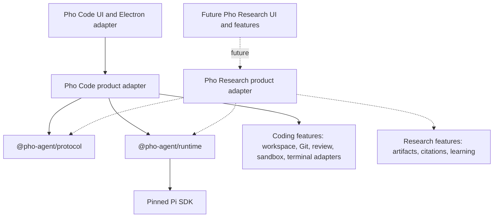

# Product definition: V5 Pho Agent Foundation

## Status

Owner-promoted numbered product boundary, 2026-08-20. Status: **Promoted; Milestone 0 implementation and permitted non-packaged verification complete, packaged acceptance gate deferred by owner direction**.

This document defines the V5 outcome. [`implementation-plan.md`](./implementation-plan.md) is the implementation contract. Planned package names, commands, state, and UI below are not current behavior until the owning milestone is implemented, verified, logged, and accepted.

## Outcome

V5 separates a reusable, headless **`pho-agent`** foundation from Pho Code's coding product and makes the foundation's intelligence measurable.

At V5 acceptance:

- Pi remains the embedded agent engine and authority for providers, the inner agent loop, tool execution, streaming, sessions, JSONL, compaction, and extension semantics;
- product-neutral protocol, Pi-session hosting, task state, evidence assembly, verification evidence, and completion assessment live behind `@pho-agent/*` packages that do not import Pho Code, React, or Electron;
- Pho Code consumes `pho-agent` through a pinned [`vietfood/pho-agent`](https://github.com/vietfood/pho-agent) submodule and source-controlled product adapter while preserving its accepted coding behavior;
- a non-code consumer fixture can construct and exercise `pho-agent` without importing Pho Code packages or coding features;
- nontrivial tasks may carry a branch-aware living Task Brief;
- each run may receive a bounded, inspectable evidence pack assembled from product-supplied evidence providers;
- verification claims refer to authoritative recorded observations instead of assistant prose;
- completion maps Task Brief acceptance criteria to current verification evidence and exposes gaps honestly;
- a frozen evaluation suite reports task outcome, evidence quality, unsupported claims, verification honesty, recovery, and efficiency before and after the V5 intelligence features.

V5 makes Pho Code the first product consuming `pho-agent`. Pho Research is a separate future product that may reuse `pho-agent` while owning all PDF, citation, paper-linking, quiz, Socratic-teaching, learner-model, research-job, and research UI behavior.

## Why this is a numbered core version

This work changes the reusable foundation and the semantics of task understanding and completion across future products. It is not a standalone add-on because:

- Task Brief, evidence, verification, and completion state follow the session/run lifecycle;
- product-neutral identity and feature composition affect protocol, runtime, packaging, and dependency enforcement;
- every downstream product must be able to supply evidence and render state without importing another product;
- evaluation gates become part of how foundational intelligence changes are accepted.

The product boundary remains deliberately narrower than a generic agent framework. It is a Pi-powered foundation for owner-selected Pho products, not an engine marketplace, public SDK promise, or alternative agent loop.

## Selected product decisions

| Decision | V5 selection |
| --- | --- |
| Foundation name | **`pho-agent`**. The concept may span several `@pho-agent/*` workspace packages; V5 does not force one monolithic package. |
| Relationship to Pi | **Build on pinned Pi SDK `0.84.1`; do not fork or reproduce Pi's loop, providers, JSONL, resource loader, compaction, or session tree.** |
| Consumer direction | `pho-code -> pho-agent -> Pi`. A future `pho-research -> pho-agent -> Pi`; `pho-research` must not depend on Pho Code. |
| Runtime process | Keep the accepted in-process Electron-main composition. Source/package extraction is not V4 `utilityProcess` extraction. |
| Initial distribution | Private workspace packages compiled into Pho Code. No npm publication or public compatibility guarantee in V5. |
| Product composition | Source-controlled product adapter and baked feature manifest. No user-installable plugins or ambient Pi composition. |
| Harness capability ownership | Reusable headless session, feature, Plan/ask-user/todo, skill, MCP, and future task-intelligence mechanics belong to `pho-agent`; products retain identity authority, selected capability/profile policy, UI, storage roots, packaging paths, and domain adapters. |
| Generic identity | Core uses opaque `{ scopeId, sessionId }`. Pho Code maps its existing canonical workspace identity at the adapter; V5 does not rewrite Pi session files or break current `workspaceId` IPC merely to rename it. |
| UI ownership | `pho-agent` is headless. Pho Code renders one **Task** right-sidebar surface; other products render the same contracts independently. |
| Task state | Branch-aware Pi custom entries, not application metadata and not parsed from assistant prose. |
| Evidence | Product-supplied providers; core validates, ranks, deduplicates, bounds, persists the per-run pack, and projects safe metadata. |
| Verification | Derived from authoritative tool/runtime/user observations with stable source references; never inferred from streaming or final prose. |
| Completion | Criteria-to-evidence assessment. Unverified is allowed and visible; missing evidence cannot become passed. |
| Memory | **Deferred.** No cross-session personal/workspace memory, ambient embeddings, or automatic fact promotion. |
| Pho Research | Separate product and plan. V5 supplies foundation contracts only; no PDF, citation, quiz, Socratic, or research-job implementation. |
| Compaction | Independent add-on. V5 state must be branch-aware and compaction-compatible, but V5 does not accept or replace that add-on. |
| Subagents/long jobs | Deferred. V5 must not smuggle in multi-agent orchestration, unattended loops, scheduler state, or worktrees. |

### Harness capability rule

A capability belongs in `pho-agent` when a headless non-code consumer can use it without knowing about Electron, React, workspace paths, Git, diffs, change review, or terminal panes. A product adapter may still select, configure, persist, package, or render that capability.

This rule places generic feature composition, session registry/lifecycle, Plan/ask-user/todo mechanics, skill discovery/invocation, host-neutral MCP lifecycle, JSON safety, and future task intelligence in `@pho-agent/*`. Pho Code retains canonical-workspace authority, coding-specific retrieval, Git/change review/Undo, terminal integration, coding prompts and curated skill selection, renderer/application state, Electron host UI, secret-store labels, data roots, and packaged-resource discovery. A reviewed concrete integration such as the fixed read-only GitHub MCP server may live as an optional Pho Agent feature without becoming ambient MCP discovery or a user-configurable server manager.

## Product architecture

The dashed Pho Research path is a consumer contract, not a V5 deliverable.

## Audience and trust model

V5 remains a personal, trusted-workspace foundation exercised through Pho Code on macOS first. It assumes:

- the owner selects workspaces trusted for ordinary coding work;
- baked feature code is source-reviewed and ships with the app;
- providers receive prompts and context selected for each request;
- evidence providers can read only through their approved product/runtime authority;
- Pi and baked extensions still execute with the host process's authority;
- renderer sandboxing and permission dialogs do not contain the Pi runtime or arbitrary extension code;
- the application is monitored, not an unattended research worker.

The new intelligence records improve legibility and correctness. They are not a security boundary, sandbox, formal proof, or guarantee that a model's reasoning is correct.

## Capability model

### M0: measurable intelligence

V5 treats intelligence as observable task performance, not feature count. A frozen evaluation corpus measures:

- task outcome against deterministic checks or an owner-authored rubric;
- discovery of required evidence and exclusion of irrelevant or forbidden evidence;
- unsupported factual claims;
- truthful distinction among passed, failed, and unverified checks;
- recovery after contradicted assumptions or failed validation;
- tool calls, context volume, latency, and provider usage as efficiency signals.

An LLM judge may provide supplemental analysis but is never the sole acceptance authority. The same named model, thinking level, feature profile, fixture revision, and run count are used for comparable baseline and candidate runs. Thresholds are pre-registered in the M0 log before M1 implementation so they cannot be weakened after seeing final results.

### M1: living Task Brief

For a nontrivial task, the agent or owner can maintain:

- objective;
- constraints;
- acceptance criteria;
- assumptions;
- open questions;
- non-goals;
- lifecycle status and revision.

The Task Brief defines **what must become true**. The accepted Plan document continues to describe **how the agent intends to work**, and the accepted todo list describes **what it is doing now**. V5 does not merge these authorities.

The agent decides whether a task benefits from a brief under baked guidance; V5 does not add a hidden classifier request. The owner can create, edit, reset, or inspect the brief while the session is idle. A brief is task-scoped and branch-aware. It does not become cross-session memory.

### M2: bounded evidence packs

Before a qualifying run, `pho-agent` asks the active product's evidence providers for candidates related to the prompt and active Task Brief. Core then:

1. validates source ownership and JSON safety;
2. removes malformed, forbidden, duplicate, and stale-as-authoritative candidates;
3. preserves mandatory current instructions already supplied by the system prompt without duplicating their full text;
4. ranks candidates using product-provided relevance plus deterministic tie-breaking;
5. enforces item, character, token-estimate, provider-time, and total-time bounds;
6. injects one hidden, labeled evidence message through Pi's public extension hook;
7. persists and projects a bounded manifest so the owner can see what the run received and what was omitted.

Evidence packs are regenerated for a run. They do not silently accumulate into a general knowledge base. Product providers—not core—understand workspaces, files, papers, citations, or other domain sources.

Pho Code's first providers use existing approved sources such as explicit references, the local FFF retrieval service, current task/plan state, bounded change-review summaries, and recent structured failures. V5 does not add hidden shell execution, bypass permission policy, crawl sensitive paths, or duplicate the full context prompt.

### M3: authoritative verification ledger

The verification ledger records what was actually observed:

- known tool result and source entry/call identity;
- structured outcome such as passed, failed, observed, or unverified;
- optional acceptance-criterion association;
- product-defined subject/revision used to determine freshness;
- bounded summary safe for the renderer;
- timestamp and provenance.

Core accepts observations only from registered adapters or explicit owner confirmation. Pho Code may adapt known Pi bash/test results, V3 change-review state, and selected application checks. A future research product may adapt artifact hashes and citation verification without changing the core ledger.

Assistant narration, streaming deltas, exit-code-looking text, and tool preview strings are not evidence. A later mutation can make earlier evidence stale when the product adapter declares that its subject changed.

### M4: evidence-backed completion

For a session with an active Task Brief, `complete_task` submits one assessment per acceptance criterion:

- `passed` with one or more current supporting verification IDs;
- `failed` with current failure evidence;
- `unverified` with an honest bounded reason.

Core validates criterion identity, brief revision, session ownership, evidence ownership, outcome compatibility, and freshness. It rejects fabricated, cross-session, missing, stale-as-current, or contradictory mappings.

Completion does not terminate Pi's agent loop or suppress the final assistant message. It produces an authoritative assessment and owner-visible summary. The task can be complete with disclosed gaps only when the owner explicitly accepts those gaps; otherwise the state remains incomplete. Tasks without a Task Brief retain ordinary chat behavior.

## User-visible Pho Code contract

V5 adds one **Task** surface to Pho Code's existing right-sidebar host. The surface is the Pho Code adapter for headless `pho-agent` state and contains:

- **Brief:** objective, constraints, criteria, assumptions, questions, non-goals, revision, and idle-only owner edit/reset;
- **Evidence:** latest pack, source labels, freshness, why each item was selected, budget/omission summary, and bounded detail;
- **Verification:** records grouped by acceptance criterion plus the latest completion assessment.

The surface follows existing host rules: conversation remains primary, re-click hides it, the panel is resizable, keyboard/focus behavior is accessible, untrusted text is sanitized, and high-frequency streaming does not rerender the full surface. Other Pho products are not required to use this layout.

## Data and lifecycle

| Data | Owner | Location/lifetime | Consequence |
| --- | --- | --- | --- |
| Task Brief entries | Pi/`pho-agent` feature | Pi JSONL active branch | Restored with the session; task-scoped, not global memory |
| Evidence pack message and manifest | Pi/`pho-agent` feature | Bounded hidden custom message on the run's branch | Auditable context input; may contain source excerpts already allowed into the session |
| Verification normalization | `pho-agent` with source references | Pi custom entries or reconstruction from authoritative Pi entries, as frozen by M3 | Cannot outlive or detach from its source silently |
| Completion assessment | `pho-agent` | Pi custom entry keyed to brief revision | Restored and invalidated when criteria or evidence change |
| Evaluation cases/results | Repository/development owner | Source fixtures plus dated V5 logs; secrets excluded | Reproducible baseline and acceptance evidence |
| UI expansion/edit drafts | Product renderer | Renderer memory until saved | Never authorizes runtime state |

Renderer reload requests authoritative snapshots. Session reopen reconstructs state from the active Pi branch. Branch navigation is not a V5 UI feature, but projectors must already respect Pi parent/leaf identity so a future fork does not leak state across branches. Compaction may remove old task/evidence messages from active model context; the full Pi branch remains the persistence authority, and current state is deliberately re-injected when needed.

## Failure behavior

- A failed `pho-agent` extraction leaves Pho Code build/tests failing; there is no fallback to duplicate agent loops.
- A missing optional evidence provider degrades the pack with a bounded diagnostic; ordinary chat remains usable.
- A required provider failure prevents its item from being represented as current and is visible in the pack summary.
- A malformed or oversized brief/evidence/verification payload is rejected before persistence or IPC.
- A stale brief revision refuses an owner or tool update rather than overwriting newer state.
- An evidence timeout omits that provider and continues within the total bound; it never blocks prompt admission indefinitely.
- A ledger adapter that cannot establish an outcome records unverified or nothing; it never guesses from text.
- Invalid completion mapping returns a typed recoverable error and leaves the prior assessment unchanged.
- A nonessential V5 baked feature that fails to bind reports diagnostics and leaves ordinary Agent chat available without falsely displaying Brief/Evidence/Verification state.

## Non-goals

V5 will not:

- build, fork, or replace Pi's provider runtime, loop, tool executor, resource discovery, context builder, compaction algorithm, session tree, or JSONL format;
- create Pho Research, its UI, PDFs/OCR, citation system, paper graph, quizzes, Socratic teaching, learner model, or research workflows;
- add generic memory, cross-session memory, inferred preferences, ambient embeddings, automatic fact promotion, or a workspace knowledge graph;
- add session tree/fork/clone UI, subagents, advisor roles, worktrees, browser automation, long-job scheduling, unattended loops, or persistent evaluation kernels;
- move `HarnessRuntime` to a utility process or take over any held V4 distribution, migration, diagnostics/privacy, signing, update, or website contract;
- merge the Task Brief with Plan, todos, context prompt, transcript, change ledger, or product metadata;
- treat an evidence pack as truth, a verification record as proof beyond its source, or completion as a guarantee of correctness;
- expose arbitrary evidence providers, executable plugins, server definitions, or generic JSON settings to end users;
- share Pho Code sessions, settings, artifacts, or credentials automatically with a future Pho Research installation;
- publish a stable public `pho-agent` SDK or promise third-party compatibility in V5.

## Relationship to other workstreams

| Track | Relationship |
| --- | --- |
| V4 Public Beta Foundation | Remains pending and owns utility-process extraction, release identity, migrations, public diagnostics/privacy, signing/notarization, updates, and public distribution |
| Context compaction | Independent; V5 state is branch-aware and compaction-compatible, but V5 does not implement or accept compaction UI/lifecycle |
| Integrated terminal | Independent; terminal output is not automatically verification evidence and owner PTY stays outside Pi |
| Plan/Agent | Accepted foundation. Task Brief is outcome; Plan is approach; todos are current work. New tools must preserve the accepted mode intersection and Execute semantics |
| V3 change review | Pho Code may adapt bounded review state as evidence; V5 does not change Approve/Undo meaning or expand mutation recovery |
| Agent-tool sandbox/permissions | Evidence collection and verification never bypass existing policy; core records decisions/outcomes but does not claim containment |
| Session tree/fork | Deferred UI. V5 persistence/projectors must follow active Pi branch semantics without promoting navigation |
| Pho Research | Future separate product consuming `pho-agent`; all research and learning semantics belong there |

## V5 success criteria

V5 is successful only when:

1. `@pho-agent/*` packages build and test without importing `@pho-code/*`, React, Electron, or product UI;
2. only the Pho Agent Pi adapter constructs Pi model/session services, while product feature adapters use the reviewed narrow feature seam;
3. Pho Code preserves accepted sessions, settings, credentials, permissions, Plan/Agent, V3 review, sandbox, and packaged-resource behavior;
4. Task Brief, evidence, verification, and completion state restore correctly across renderer reload and app restart using isolated data;
5. deterministic fixtures prove bounds, composite ownership, stale-event handling, branch awareness, and zero false passed-verification claims;
6. the frozen evaluation acceptance thresholds established in M0 pass without changing fixtures or scoring after candidate results are known;
7. a deterministic non-code consumer fixture uses `pho-agent` without Pho Code dependencies or coding features;
8. the real Electron Pho Code Task surface is accessible and remains subordinate to the conversation;
9. the unsigned packaged macOS app works without Pi CLI/global packages and contains every required V5 baked resource;
10. documentation, architecture, development commands, attribution, current state, and an immutable V5 acceptance review are complete.
